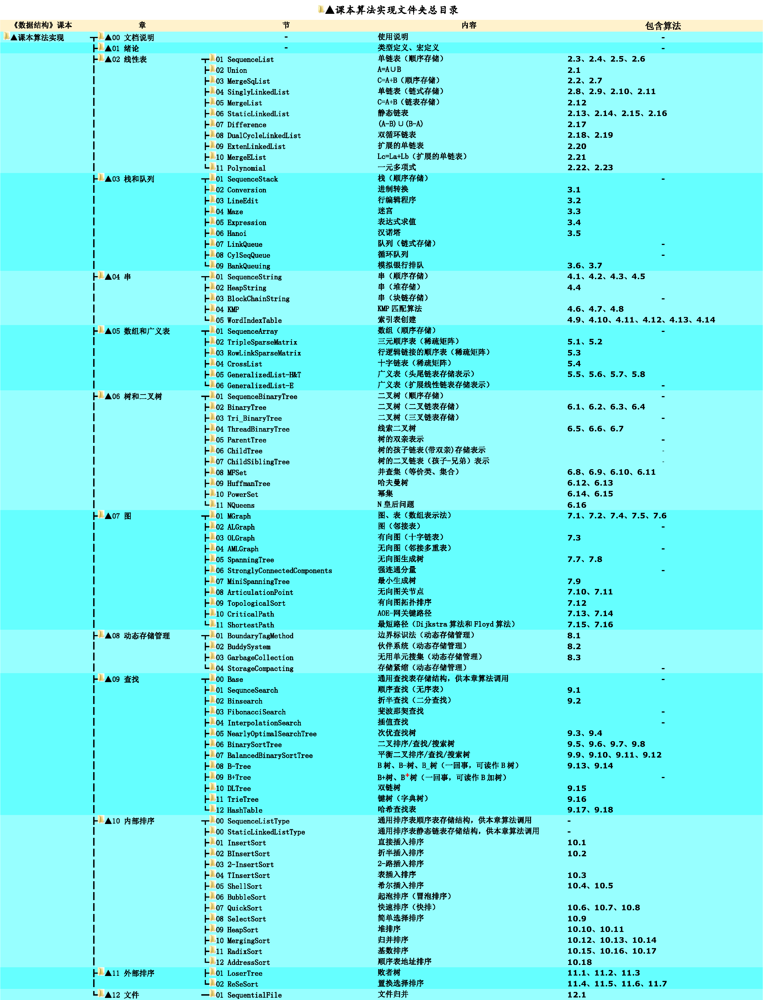

# 《数据结构》课本源码与习题解析

## 项目介绍

本项目与教材《数据结构-C语言版》（严蔚敏,吴伟民版）配套。    

## 使用说明

* 开箱即用。克隆/下载到本地后，使用[C-Free 5](http://www.programarts.com/cfree_ch/)打开即可运行（此处不要创建工程，直接打开main文件编译运行）。    
* 更详细的使用说明参见：[《数据结构-C语言版》（严蔚敏,吴伟民版）课本源码+习题集解析使用说明](https://www.cnblogs.com/kangjianwei101/p/5221816.html) 。    
* 如果CFree在win10上遇到兼容问题，可尝试使用 **Dev-C++**（注意，在此项目上使用Dev-C++时，不要创建工程，而是直接将main文件打开后编译运行）。     

## 附：源码目录

 
