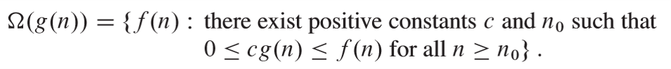
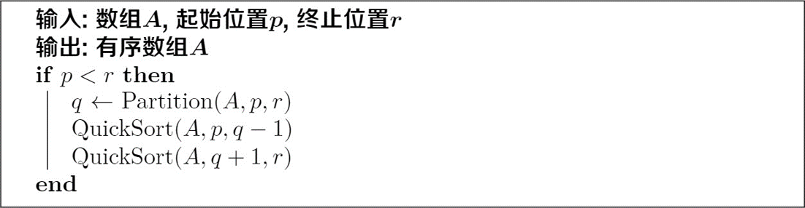
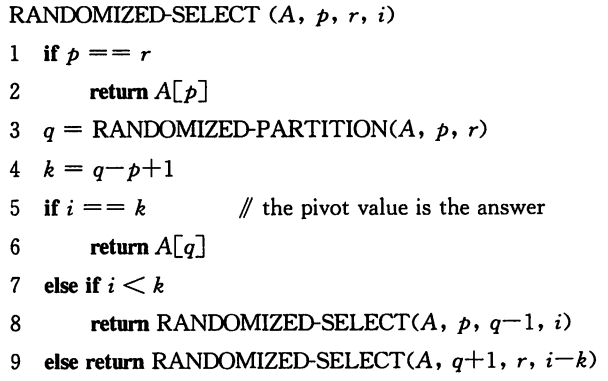

# 算法导论

[TOC]

## 一、算法基础

### 1.循环不变量的证明

- 初始化：证明循环不变量在循环开始前为真；
- 保持：证明每次循环之后循环不变式仍为真；
- 终止：循环可以有限次终止。

### 2.时间复杂度的分析

- 整个算法的执行时间是执行所有语句的时间之和；

- 算法的执行时间可能依赖于给定的输入，即使规模相同；

- 分析执行时间时可以分析算法的最坏执行情况、最好执行情况、平均执行情况。

### 3.算法的五个特性

- 确定性
- 能行性
- 输入
- 输出
- 有穷性
  - 仅仅不满足有穷性规则的算法称为计算过程，如操作系统


## 二、算法渐近

### 1.限界函数

#### (1)上界函数

上界函数描述了**算法最坏情况下的时间复杂度**，记为$f(n)\inΟ(g(n))$或$f(n)=Ο(g(n))$


#### (2)下界函数

下界函数描述了**渐进下界**，记为$f(n)\in\Omega(g(n))$或$f(n)=\Omega(g(n))$



#### (3)渐近紧确界函数

渐近紧确界函数代表**算法在最好和最坏情况下的计算时间就一个常数因子范围内而相同**，**既有$ f(n) = \Omega(g(n))$，又有$f(n) = Ο(g(n))$**


#### (4)记号说明

- 这里的"$=$"不是通常相等的含义，**代表属于**
- $\Theta(1)$表示具有**常量计算时间**的复杂度，即算法的执行时间为一个固定量，与问题的规模$n$无关

#### (5)非渐近紧确的上下界

- **$o$记号**

对任意正常数$c$，存在常数$n_0＞0$，使对所有的$n\geq n_0$，有$\lvert f(n)\rvert\leq c\lvert g(n)\rvert$，则记作：$f(n)=o(g(n))$

- **$\omega$记号**

对任意正常数$c$，存在常数$n_0＞0$，使对所有的$n\geq n_0$，有$\lvert f(n)\rvert\geq c\lvert g(n)\rvert$，则记作：$f(n)=\omega(g(n))$

### 2.估算复杂性定理

- 多项式定理：关于$n$的$m$次多项式与最高阶$n^m$同阶
- $n^x(\log n)^y<n^{x+\varepsilon}$
- $(\log n)^x<n$
- $n^x<2^n$

### 3.上界函数定理

- 正线性性：$d(n)=O(f(n))$，则$ad(n)=O(f(n))$，其中$a>0$
- 加法律：$d(n)=O(f(n))$，$e(n)=O(g(n))$，则$d(n)+e(n)=O(f(n)+g(n))$
- 乘法律：$d(n)=O(f(n))$，$e(n)=O(g(n))$，则$d(n)e(n)=O(f(n)g(n))$
- 指数性质：$n^x=O(a^n)$，其中$x>0$，$a>1$
- 对数性质1：$\log n^x=O(\log n)$，其中$x>0$
- 对数性质2：$(\log n)^x=O(n^y)$，其中$x>0$，$y>0$

## 三、分治思想

### 1.分治原理

**分治原理的基本思想：当问题规模比较大而无法直接求解时，将原始问题分解为几个规模较小、但类似于原始问题的子问题，然后递归地求解这些子问题，最后合并子问题的解以得到原始问题的解。**

- **基本策略：分解原问题，解决子问题，合并问题解**。
- **问题形式：跨越子数组的问题类型、合并子问题解的问题类型。**
- 计算复杂度：[递归式求解](#2.递归式求解)
- 实例：[归并排序](#3.归并排序)——$T(n)=2T(n/2)+cn$
- 实例：[最大子数组问题](#4.最大子数组问题)——$T(n)=2T(n/2)+\Theta(n)$
- 实例：[最近点对问题](#6.最近点对问题)——$T(n)=2T(n/2)+O(n)$
- 实例：[逆序对计数问题](#7.逆序对计数问题)——$T(n)=2T(n/2)+O(n)$
- 实例：[随机化快速排序的期望](#8.快速排序)——$T(n)=O(n\log n)$

### 2.递归式求解

#### (1)基本形式

- 求解递归式的目的是**将递归式转换为渐近限界函数表示‌**；

- 一般关系为$T(n) =T(n_1)+T(n_2)+f(n)$，其中$f(n)$表示**除递归以外的代价**。

#### (2)预处理

- **减去一个低阶项**以便于代换法中的归纳证明，如$cn-d$

  > 减去低阶项往往能够使数学证明顺利进行：
  >
  > 

- 对**取整符号**进行简化

  > 如$T(n)=T(\lfloor n/2\rfloor)+T(\lceil n/2\rceil)+f(n)$，往往忽略上下取整函数，写作以下简单形式：$T(n)=2T(n/2)+f(n)$

- 对**对数或指数**做代数转换

  > 改变变量来简化递归式：
  >
  > 

- 对**限界函数项**进行展开，便于化简

  > 对于$T(n)=3T(\lfloor n/4\rfloor)+\Theta(n^2)$，简化为$T(n)=3T(n/4)+cn^2$。

#### (3)求解方法

##### ①代入法

- 利用熟悉或类似的递归式**猜测解的形式**

- 用**数学归纳法**证明猜测的正确性，得出合适的$c$值以满足条件

- 讨论**边界条件的正确性**

  > 代入法实例如下：
  >
  > 

##### ②递归树

- 在内部节点中表达除递归以外的代价

  > 对于$T(n)=aT(n/b)+f(n)$，一般假设$n=b^k$，$k=\log_bn$简化计算

- 列出递归树直至叶子节点，得到递归树高度

  > 递归至叶子节点后，递归树的层数一般为$\log_bn+1$
  >
  > 举例如下：
  >
  > 

- 计算内部某层节点的总代价、叶子节点总代价、树的总代价

  > 通过计算前几层节点的总代价，得到内部某层节点的总代价的**通式**；
  >
  > 计算叶子节点的数目，假设为$num$，则叶子节点的总代价为$\Theta(num)$；
  >
  > 根据等比数列求和公式得到总代价。
  >
  > 计算如下：
  >
  > 

- 根据树的总代价猜测渐近限界函数

  > 猜测如下：
  >
  > 

- **利用代换法证明**猜测

  > 证明如下：
  >
  > 

##### ③主方法

设$a≥1$，$b>1$，设$f(n)$为渐近正的函数，$T(n)$是定义在非负整数上的递归式：$T(n)=aT(n/b)+f(n)$，其中$n/b$指$\lfloor n/b \rfloor$或$\lceil n/b \rceil$，则可使用以下定理求解递归式：

- 若对于某常数$\varepsilon>0$，有$f(n)=O(n^{\log_ba-\varepsilon})$，则$T(n)=\Theta(n^{\log_ba})$

  > 该情况中$n^{\log_ba}$比较大，$f(n)$需**多项式地小于**$n^{\log_ba}$，即对某个常量$\varepsilon>0$，$f(n)$必须渐近地小于$n^{\log_ba}$，两者相差了一个$n^\varepsilon$因子，如$T(n)=2T(n/2)+n\log n$和$T(n)=4T(n/2)+n^2\log n$不满足条件

- 若$f(n)=\Theta(n^{\log_ba})$，则$T(n)=\Theta(n^{\log_ba}\log n)$

  > 该情况中两个函数一样大，乘以对数因子$\log n$

- 若对于某常数$\varepsilon>0$，有$f(n)=\Omega(n^{\log_ba+\varepsilon})$，且对常数**$c<1$**与足够大的$n$，有$af(n/b)\leq cf(n)$，则$T(n)=\Theta(f(n))$

  > 该情况中$f(n)$比较大，$f(n)$需**多项式地大于**$n^{\log_ba}$，并需要满足一个规则性条件$af(n/b)\leq cf(n)$，注意其中$c< 1$

### 3.归并排序

#### (1)问题描述

已知包含$n$个数字的序列$A[1,\dots,n]$，对其进行升序排序。

#### (2)问题分析

- 将数组$A$排序问题分解为$A[1,\dots,\lfloor\frac{n}{2}\rfloor]$和$A[\lfloor\frac{n}{2}\rfloor+1,\dots,n]$排序问题；
- 递归解决子问题得到两个有序的子数组；
- 然后再将两个子数组合并，合并的代价即为**除递归以外的代价**；
- 当数组被分解为长度为1时天然有序，从而产生局部有序性，进而进行两两合并操作。

#### (3)分治策略

- 算法伪代码：

  > $MERGE-SORT(A,left,right)$
  >
  > 
  >
  > $MERGE(A,left,mid,right)$
  >
  > 

- 时间复杂度

  - 递归式为$T(n)=2T(n/2)+O(n)$，其中$O(n)$为$MERGE$操作的时间代价；
  - 时间复杂度为$O(n\log n)$。

### 4.最大子数组问题

#### (1)问题描述

- 寻找和最大的非空连续子数组
- 给定一个数组$X[1..n]$，对于任意一对数组下标为$l,r(l\leq r)$的非空子数组，其和记为$S(l,r)=\sum\limits_{i=l}^{r}X[i]$，求$S(l,r)$的最大值，记为$S_{max}$。

#### (2)暴力求解

- 枚举$n+C_n^2$种下标$l,r$组合，求出最大子数组之和；
- 处理每对下标组合最少的时间代价为常量；
- 时间复杂度为$\Omega(n^2)$。

#### (3)分治策略

- 将子数组$A[low…high]$划分为两个规模尽量相等的子子数组；

- 分别求解$A[low…mid]$和$A[mid+1…high]$的最大子数组；

- 基于上述划分，存在三种连续子数组情况：$mid$左侧、跨越$mid$、$mid$右侧；

- 对于跨越$mid$的情况，从$mid$出发，分别向左和向右找出最大子区间并合并，这个步骤的代价即为**除递归以外的代价**，其时间复杂度为$\Theta(n^2)$；

  >  算法$FIND-MAX-CROSSING-SUBARRAY$如下：
  >
  > 

- 对于其他两种情况，递归调用**FIND-MAXIMUM-SUBARRAY**即可；

- 求最大子数组问题的分治算法

  > **FIND-MAXIMUM-SUBARRAY**如下图：
  >
  > 

- 时间复杂度

  - 当$n=1$时，$T(n)=\Theta(1)$；
  - 当$n>1$时，$T(n)=2T(n/2)+\Theta(n)$；
  - 时间复杂度为$T(n)=\Theta(n\lg n)$。

#### ※(4)非递归的线性算法

### ※5.$Strassen$矩阵乘法

### 6.最近点对问题

#### (1)问题描述

- 已知平面上分布着点集$P$中的$n$个点$p_1,p_2,\dots,p_n$，点$i$的坐标记为$(x_i,y_i)$，$1\leq i\leq n$。
- 找出一对距离最近的点(允许两个点处于同一个位置)

#### (2)暴力搜索

- 对每对点都计算距离，然后比较大小，找出其中的最小者
- 计算点之间的距离的时间复杂度为$O(n^2)$
- 比较得到最小距离的时间复杂度为$O(n^2)$

#### (3)分治策略

- 排序：将所有点按照$x$坐标排序——$O(n\log n)$

- 划分：将点集分成左、右两半$P_L$和$P_R$

  > 定义$d_L$为$P_L$中最近点对距离，$d_R$为$P_R$中最近点对距离，$d_C$为跨越分割线的最近点对距离，这与最大子数组问题类似。

- 改进：令$\delta=min(d_L,d_R)$，则有$d_C<\delta$，即$d_C$对应点对必然落在分割线两侧的$\delta$距离内，称之为$strip$，同时易得，$d_C$的两个点的$y$坐标相差也不会大于$\delta$，因此应该对点的$y$坐标也进行排序。

- 实现：假设搜索到$p_j$时，$p_j$与$p_i$的$y$坐标相差大于$\delta$，那么对于$p_i$而言更远的$p_j$就可以终止搜索，转而处理$p_i$后面的点$p_{i+1}$。

  > 改进后的算法伪代码：
  > 
  >  ```pseudocode
  for i=1 to numPointsInStrip do
  	for j=i+1 to numPointsInStrip do
  		if y-coordinates of p[i] and p[j] differ by more than δ
  			break;
  		else if dist(p[i],p[j])<δ
              δ=dist(p[i],p[j]);
  >  ```

- 时间复杂度

  - 在最坏的情况下，计算$d_C$的时间复杂度为$O(n)$，则最终递归式为$T(n)=2T(n/2)+O(n)$
  - ※预排序
  - 综上得到所有附加工作的总时间复杂度为$O(n)$，则$T(n)=2T(n/2)+cn=O(n\log n)$

### 7.逆序对计数问题

#### (1)问题描述

- 在一个数组$A$中，称满足$i<j$且$A[i]>A[j]$的二元组$(A[i],A[j])$为逆序对

  > 在数组$A={4,6,8,3,5}$中，$(A[1],A[4])$即为一个逆序对

- 现已知长度为$n$的数组$A[1..n]$，求其**逆序对的总数**$\sum\limits_{1\leq i\leq j\leq n}X_{i,j}$，其中当$A[i]>A[j]$时$X_{i,j}$为1，否则为0。

#### (2)暴力枚举

- 对于每个元素$A[i]$，枚举$j(j>i)$，并统计逆序对数目；
- 时间复杂度为$O(n^2)$。

#### (3)分治策略

- 将子数组$A[low\dots high]$划分为两个规模尽量相等的子子数组；

- 分别递归求解仅在$A[low\dots mid]$和$A[mid+1\dots high]$中的逆序对数目；

- 合并子问题的解时，求解**跨越子数组**的逆序对数目；

- 求解跨越子数组的逆序对数目

  - 直接求解：对于每个$A[j]\in A[mid+1\dots high]$，枚举$A[i]\in A[low\dots mid]$并统计逆序对数目——算法运行时间为$O(n^2)$，得到分治策略运行时间为$O(n^2)$；

    > 运行时间受制于跨越子数组的逆序对计数方法，数组的**有序性**通常有助于提高算法的运行时间。

  - 排序求解：分别对数组$A[low\dots mid]和$$A[mid+1\dots high]$进行排序，对于每个$A[j]\in A[mid+1\dots high]$，采用二分查找为其在$A[low\dots mid]$中定位，则$A[j]$在$A[low\dots mid]$定位点右侧的元素均可与$A[j]$构成逆序对——算法运行时间为$O(n\log n)$，得到分治策略运行时间为$O(n(\log n)^2)$；

    > 排序和二分查找均无再优化空间，但未将排序过程融入整个算法框架；
    >
    > **排序未利用子数组有序性质**——使用归并排序；
    >
    > 合并问题解的同时对数组进行排序，归并过程中可同时计算逆序对数目。

  - 归并求解：从左到右扫描$A[low\dots mid]和$$A[mid+1\dots high]$，如果$A[i]>A[j]$，统计逆序对，$j$向右移；否则$i$向右移——算法运行时间为$O(n)$，得到分治策略运行时间为$O(n\log n)$。

- **分而治之+归并求解**

  > MergeCount：
  >
  > 
  >
  > CountInver：
  >
  > 

- 时间复杂度
  - 归并求解的算法运行时间为$o(n)$；
  - $T(n)=2T(n/2)+O(n)$；
  - 时间复杂度为$T(n)=O(n\lg n)$。

### 8.快速排序

#### (1)问题描述

- 选择排序和插入排序的时间复杂度均为$O(n^2)$；
- 归并排序简化分解，**侧重合并**，快速排序**侧重分解**，简化合并。

#### (2)分治策略

- 选取固定位置主元$x$，如尾元素；

- 维护两个部分的右端点下标变量$x,y$；

  

- 考察数组元素$A[j]$，并**只和主元比较**：若$A[j]\leq x$，则交换$A[j]$和$A[i+1]$，$i$和$j$右移，否则$j$右移；

- 到达末尾后，把主元放在中间$(i+1)$处作为分界线；

- 以主元作为数组的划分，得到子数组分别进行PARTITION排序，排序后进行合并

- 伪代码如下：

  > Partition：对每个子数组进行排序操作，返回主元位置$p$
  >
  > 
  >
  > QuickSort：利用Partition和分治策略进行快速排序
  >
  > 

- 时间复杂度

  - 选取固定位置主元时最好情况下为$O(n\log n)$，最坏情况下为$O(n^2)$

  - 选取随机位置主元，可以避免最坏情况的发生

    > Randomized-Partition：
    >
    > 
    >
    > Randomized-QuickSort：
    >
    > 

  - 随机化的快速排序的期望复杂度为$O(n\log n)$

  - **基于比较的排序，其时间复杂度的下界为$\Omega(n\log n)$。**

### 9.次序选择问题

#### (1)基本概念

- 顺序统计量：在一个由$n$个元素组成的集合中，第$i$个顺序统计量$(order statistic)$是该集合中的**第$i$小**的元素
- 中位数（**一般指下中位数**）
  - 下中位数：$i=n/2$或$i=\lfloor(n+1)/2\rfloor$
  - 上中位数：$i=n/2+1$或$i=\lceil(n+1)/2\rceil$

- 选择问题：从$n$个元素的集合中选择第$i$个顺序统计量的问题形式化地归结为**“选择问题”**
  - 输入：一个包含$n$个（互异的）数的集合$A$和一个整数$i$，$1\leq i\leq n$
  - 输出：元素$x\in A$,且$A$中恰好有$i-1$个其他元素小于它
- 采用排序求解的方式解决选择问题时，其时间复杂度为$O(n\log n)$，可以求得所有元素的次序，选择元素的时间复杂度为$O(1)$。

#### (2)期望为线性时间的选择算法

- 受启发于快速排序的Partition过程：

  > 

- 选择算法：

  

  > 第1行检查$A[p..r]$中只包括一个元素的情况；
  >
  > 其余情况调用第3行的RANDOMIZED-PARTITION，将数组$A[p..r]$划分为两个子数组$A[p..q-1]$和$A[q+1..r]$**（可能为空）**，使前者的每个元素都小于$A[q]$，后者的每个元素都大于$A[q]$，称$A[q]$为主元；
  >
  > 第4行计算处于划分的低区的元素个数加1；
  >
  > 第5行检查$A[q]$是否为第$i$小的元素；
  >
  > 如果不是，则确定第$i$小的元素是在哪个子数组并在其中递归查找，当$i>k$时，要找的元素必定为$A[q+1..r]$中第$i-k$小的元素。

- 最坏情况运行时间为$\Theta(n^2)$，期望运行时间为$\Theta(n)$

#### ※(3)最坏情况为线性时间的选择算法

## 四、动态规划

### 1.基本原理

#### (1)基本概念

- 最优化问题：这一类问题的可行解可能有很多个。每个解都有一个值，我们希望寻找具有最优值的解（最小值或最大值）；
- 最优解可能有多个；
- 根据描述约束条件和目标函数的数学模型的特性和问题的求解方法的不同，可分为：线性规划、整数规划、非线性规划、 动态规划等问题。

#### (2)动态规划的步骤

1. **问题结构分析**：刻画结构特征，**给出问题的表示**，并**明确原始问题**；

2. **递推关系建立**：分析最优(子)结构特征，构造递推公式；

   > 问题的最优解由相关子问题最优解组合而成，子问题可以独立求解；
   >
   > 递推公式又称状态转移方程。

3. **自底向上计算**：确定计算顺序，计算最优解的值；

   > 子问题的无关性和重叠性
   >
   > - 两个子问题如果不共享资源，它们就是独立的，比如在分治算法中子问题相互独立；
   > - 重叠是指两个子问题实际上是同一个子问题，只是作为不同问题的子问题出现而已，如果暴力枚举，则会导致大量重叠子问题重复计算。
   >
   > 重叠子问题的解决：动态规划**付出额外空间保存结果**，对每个子问题只求解一次。

4. **最优方案追踪**：利用辅助数组等记录决策过程，输出最优方案。

#### (3)证明最优子结构性

- 证明问题满足最优性原理是实施动态规划的必要条件。
- 证明的通用模式
  1. 证明问题最优解的第一个组成部分是做出一个选择，例如，选择钢条第一次切割位置，选择矩阵链的划分位置等。
  2. 利用**“剪切一粘贴”**技术证明
     - 作为原问题最优解的组成部分，每个子问题的解就是它本身的最优解。
     - 利用反证法：假定子问题的解不是其自身的最优解，那么我们就可以从原问题的解中**“剪切”**掉这些非最优解，将最优解**“粘贴”**进去，从而得到原问题一个更优的解，**这与最初的解是原问题最优解的前提假设矛盾**。

#### (4)备忘机制

为了避免对重叠子问题的重复计算，在递归过程中加入**备忘**机制。当第一次遇到子问题时，计算其解，并将结果存储在备忘表中；而其后遇到同一个子问题时，通过简单的查表即可返回其解，无需重复计算，节省了时间。

#### (5)重构最优解

通常定义一个表，**记录每个子问题所做的决策**。当求出最优解的值后，利用该表**回溯**即可得到最优方案。

#### (6)子问题图

- **子问题图用于描述子问题与子问题之间的依赖关系**。
- 子问题图是一个有向图，每个顶点唯一地对应一个子问题。
- 若求子问题$x$的最优解时直接用到子问题$y$的最优解，则在子问题图中就会有一条从子问题$x$的顶点到子问题$y$的顶点的有向边。
- 子问题图是**自顶向下递归调用树的“简化版”**。
- 在自底向上方法中，对于任何子问题，仅当它依赖的所有子问题都求解完成，才会求解它。
- 子问题的数目等于顶点数；
- 一个子问题的求解时间与子问题图中对应顶点的“出度”成正比；
- 一般情况下，**动态规划算法的运行时间与顶点和边的数量至少呈线性关系**。

### 2.01背包问题

#### (1)问题描述

$n$个商品组成集合$O$，每个商品有两个属性$v_i$和$p_i$，分别表示体积和价格，背包容量为$C$

试求解一个商品子集$S\subseteq O$，使得$max\sum\limits_{i\in S}p_i$且$\sum\limits_{i\in S}v_i\leq C$。

#### (2)问题分析

- 可以选取以下策略：
  - 策略1：按商品价格由高到低排序，优先挑选价格高的商品
  - 策略2：按商品体积由小到大排序，优先挑选体积小的商品
  - 策略3：按商品价值与体积的比由高到低排序，优先挑选比值高的商品
- 以上三种策略**都不能达到最优解**

#### (3)暴力枚举

- 枚举所有组合共$2^n-1$种情况，并检查体积约束

- 伪代码如下：

  > $KnapsackSR(i,c)$：前$i$个商品中，容量为$c$时为最优解
  >
  > 

- 时间复杂度为$O(2^n)$

#### (4)带备忘递归(自顶向下)

- 记录子问题解，避免重复计算

- 伪代码如下：

  > $KnapsackMR(i,c)$：带备忘的递归求解
  >
  > 
  >
  > 构造备忘录$P[i,c]$，表示在前$i$个商品中选择，背包容量为$c$时的最优解

#### (5)递推计算(自底向上)

- 递推公式：$P[i,c]=max\{P[i-1,c-v[i]]+p[i],P[i-1,c]\}$；

- 使用$Rec[i,c]$记录决策过程，选择时为1，否则为0；

- 回溯解决方案时，倒序判断是否选择商品，根据选择结果，确定最优子问题；

- 伪代码如下：

  > $KnapsackDP(n,p,v,C)$
  >
  > 
  >
  > 对数组进行初始化，默认每个商品都不选择；
  >
  > 
  >
  > 在$for$循环中依次计算子问题，对于每个子问题，如果商品体积$v[i]\leq c$且选择该商品后得到的总价格$(P[i-1,c-v[i]]+p[i])$高，则选择该商品并更新$P[i,c]$，否则不选择该商品；
  >
  > 
  >
  > 倒序判断是否选择了该商品，如果选择了该商品，则回溯子问题。
- 求解表格的算法复杂度为$O(n\cdot C)$。

### ※3.最大子数组问题

使用分治算法解决最大子数组问题的时间复杂度为$O(n\log n)$，使用动态规划方法能达到时间复杂度仅为$O(n)$的算法。

### 4.钢条切割问题

#### (1)问题描述

- 给定一段长度为$n$英寸的钢条和一个价格表$P$，切割工序本身没有成本支出，求切割钢条方案，使得销售收益 $r_n$ 最大。

- 假定出售一段长度为i英寸的钢条的价格为$p_i(i=1,2,\dots)$，下面是价格表$P$：

  

#### (2)问题分析

- 每一英寸都可切割，共有$n-1$个切割点，因此长度为$n$英寸的钢条共有$2^{n-1}$中不同的切割方案。
- 如果一个最优解将总长度为$n$的钢条切割为$k$段，每段的长度为$i_j(1\leq j\leq k)$，则有$n=i_1+i_2+\dots+i_k$，得到的最大收益为$r_n=p_{i_1}+p_{i_2}+\dots+p_{i_k}$
- 首次切割后，将两段钢条看成**两个独立的钢条切割问题**实例。若分别获得两段钢条的最优切割收益$r_j$和$r_{n-j}$，则原问题的解就可以通过**组合这两个相关子问题的最优子解**获得。
- 也即**最优子结构性**——如果$r_n=r_i+r_{n-i}$是最优切割收益，则$r_i$、$r_{n-i}$是相应子问题的最优切割收益。

#### (3)朴素递归

- $r_n=\max\limits_{1\leq i\leq n}{(p_i+r_{n-i})}$

  

- 运行效率很差，存在一些相同的子问题重复调用解决

- $T(n)=1+\sum\limits_{j=0}^{n-1}T(j)$，也即$T(n)=2^n$

#### (4)带备忘递归(自顶向下)

- 依旧按照**递归**的形式编写过程，但处理过程中会**保存每个子问题的解**。

- 具体实现如下：

  > 

  > 

  > 其中辅助数组$r[0\dots n]$用于保存子问题的结果。
  >
  > ​	初始化为$-\infty$；
  >
  > ​	当有新的结果时，$r[n]$保存结果$q$；
  >
  > ​	当$r[n]\geq 0$时，直接引用其中已保存的值。

- 运行时间为$\Theta(n^2)$

#### (5)自底向上

- 将子问题按规模排序，按**由小到大的顺序顺次求解**，当求解某个子问题时，它所依赖的**更小子问题都已求解完毕**，结果已经保存，故可以直接引用并组合出它自身的解

  

- 运行时间为$\Theta(n^2)$，相比自顶向下的方法具有更小的系数

#### (6)自底向上(给出切割方案)


### 5.矩阵链乘法问题

#### (1)基本背景

- 已知$A$为$p\times r$的矩阵，$B$为$r\times q$的矩阵，则$A$与$B$的乘积是一个$p\times q$的矩阵，矩阵相乘需要进行**$pqr$**次标量乘法运算。
- $n$个要连续相乘的矩阵构成一个矩阵链$<A_1,A_2,\dots,A_n>$，要计算这$n$个矩阵的连乘乘积：$A_1A_2\dots A_n$，称为矩阵链乘问题。
  - 矩阵链乘满足结合律，不满足交换律。
  - 不同的加括号方式代表不同的**计算模式**，而不同的计算模式计算矩阵链乘积的**代价不同**。

#### (2)问题描述

- 给定$n$个矩阵的链，记为$<A_1,A_2,\dots,A_n>$，其中$i=1,\dots,n$，矩阵$A_i$的维数为$p_{i-1}\times P_i$。
- 求**“完全括号化方案”**，使得计算乘积$A_1A_2\dots A_n$所需的标量乘法次数最小。
- 穷举所有方案的数量：当$n=1$时，$P(n)=1$，当$n\geq 2$时，$P(n)=\sum\limits_{k=1}^{n-1}P(k)P(n-k)$，证明得到时间复杂度为$P(n)=\Omega(2^n)$

#### (3)动态规划

- 最优括号化方案的结构特征——寻找最优子结构

  - 整体的最优括号化方案可以通过寻找使最终标量乘法次数最小的两个最优括号化子方案得到，形如：$(A_1A_{i+1}\dots A_k)(A_{k+1}\dots A_n)$

- 递推求解方案

  - 递推求解公式

  

  - 使用$s[i,j]$保存$A_iA_{i+1}\dots A_j$最优括号化方案的分割点位置$k$

- 计算最优代价

  - 对应子问题为$\Theta(n^2)$个，存在**子问题重叠**现象，同最优子结构性一样，这也是应用动态规划的标识。

  - 采用自底向上法替代该递推求解公式
    - 算法的输入为序列$p=\langle p_0,p_1,\dots,p_n\rangle$，长度为$p.length=n+1$

    - 算法伪代码如下：

      
    
      > 第$3\thicksim 4$行计算$m[i,i]=0$
      >
      > 第$5\thicksim 13$行计算不同矩阵链长度下$m[i,i+l-1]$的最小计算代价，长度依次递增计算。
      >
      > 可以使用一个上三角矩阵表表示$m[i,j]$和$s[i,j]$
      >
      > 具体实例如下：
      >
      > 
    
    - 算法运行时间为$\Omega(n^3)$，空间复杂度为$\Theta(n^2)$

- 构造最优解

  - $s[i,j]$记录了$A_iA_{i+1}\dots A_j$的最优括号化方案的“首个”分割点$k$。基于$s[i,j]$，对$A_iA_{i+1}\dots A_j$的括号化方案是：

    ​       $(A_iA_{i+1}\dots A_{s[i,j]})(A_{s[i,j]+1}\dots A_j)$

  - 打印结果的伪代码如下：
  
    

### 6.最长公共子序列

#### (1)基本背景

- 子序列

  给定两个序列$X=<X_1,X_2,\dots,X_n>$和序列$Z=<z_1,z_2,\dots,z_k>$，若存在$X$的一个严格递增下标序列$<i_1,i_2,\dots,i_k>$,使得对所有$j=1,2,\dots,k$，有$x_{i_j}=z_j$，则称$Z$是$X$的子序列。

  > $Z=<B,C,D,B>$是$X=<A,B,C,B,D,A,B>$的一个子序列，对应下标序列为$<2,3,5,7>$。

- 公共子序列

  对给定的两个序列$X$和$Y$，若序列$Z$既是$X$的的子序列，也是$Y$的子序列，则称$Z$是$X$和$Y$的公共子序列。

  > $X=<A,B,C,B,D,A,B>$，$Y=<B,D,C,A,B,A>$，则序列$<B,C,A>$是$X$和$Y$的一个公共子序列。

- 最长公共子序列(LCS)

  两个序列的长度最大的公共子序列称为它们的最长公共子序列。

  > $<B,C,A>$是上面$X$和$Y$的一个公共子序列，但不是$X$和$Y$的最长公共子
  > 序列。最长公共子序列是$<B,C,B,A>$。

- 前缀

  给定一个序列$X=<x_1,x_2,\dots,x_m>$，对于$i=0,1,\dots,m$，定义$X$的第$i$个前缀为$X_i=<x_1,x_2,\dots,x_i>$，即前$i$个元素构成的子序列。

  > $X=<A,B,C,B,D,A,B>$，则$X_4=<A,B,C,B>$，$X_0=\Phi$。

#### (2)最优子结构性

两个序列的一个$LCS$也包含了两个序列的前缀的$LCS$，即$LCS$问题具有最优子结构性质。
> 定理：设有序列$X=<x_1,x_2,\dots,x_m>$和$Y=<y_1,y_2,\dots,y_n>$，并设序列$Z=<z_1,z_2,\dots,z_k>$为$X$和$Y$的任意一个**$LCS$**。
>
> （1）若$x_m＝y_n$，则$z_k=x_m=y_n$，且$Z_{k-1}$是$X_{m-1}$和$Y_{n-1}$的一个$LCS$。
>
> （2）若$x_m\ne y_n$，则$z_k\ne x_m$蕴含$Z$是$X_{m-1}$和Y的一个$LCS$。
>
> （3）若$x_m\ne y_n$，则$z_k\ne y_n$蕴含$Z$是$X$和$Y_{n-1}$的一个$LCS$。

#### (3)递推关系式

记$c[i,j]$为前缀序列$X_i$和$Y_j$的一个$LCS$的长度，则有


> 1）若$i=0$或$j=0$，即其中一个序列的长度为零，则$LCS$的长度为0，$LCS=\Phi$；
>
> 2）若$x_i=y_j$，则$X_i$和$Y_j$的$LCS$是在$X_{i-1}$和$Y_{j-1}$的$LCS$之后附加将$x_i$得到的，所以                
>
> $c[i,j]=c[i-1,j-1]+1$；
>
> 3）若$x_i\ne y_j$，则$X_i$和$Y_j$的$LCS$的最后一个字符不会是$x_i$或$y_j$(不可能同时等于两者，或与两者都不同)，此时该$LCS$应等于$X_{i-1}$和$Y_j$的$LCS$与$X_i$和$Y_{j-1}$的$LCS$之中的较长者。所以
>
> $c[i,j]=max(c[i-1,j],c[i,j-1])$。

#### (4)自底向上

- 过程$LCS-LENGTH(X,Y)$用来求序列$X=<x_1,x_2,\dots,x_m>$和$Y=<y_1,y_2,\dots,y_n>$的$LCS$的长度，其时间复杂度为$O(mn)$。

  

  > 表$c[1..m,1..n]$中包含每一阶段的$LCS$长度，$c[m,n]$等于$X$和$Y$的$LCS$的长度。
  >
  > 表$b[1..m,1..n]$记录当前$c[i,j]$的计值情况，以此来构造该$LCS$。
  >
  > 下图给出了在$X=<A,B,C,B,D,A,B>$和$Y=<B,D,C,A,B,A>$上运行$LCS-LENGTH$计算出的表：
  >
  > 
  >
  > > 1）第$i$行和第$j$列中的方块包含了$c[i,j]$的值以及$b[i,j]$记录的箭头。
  > >
  > > 2）对于$i,j＞0$，项$c[i,j]$仅依赖于是否有$x_i=y_j$及项$c[i-1,j]$、$c[i,j-1]$、$c[i-1,j-1]$的值。
  > >
  > > 3）为了重构一个$LCS$，从右下角开始跟踪$b[i,j]$箭头即可
  > >
  > > 4）图中，$c[7,6]=4$，$LCS(X,Y)=<B,C,B,A>$。

#### (5)构建最优解

- 借助$b[i,j]$反序输出$LCS$，由于每一次循环使$i$或$j$减1，最终$m=0$，$n=0$，算法结束，所以$PRINT-LCS$的时间复杂度为$O(m+n)$。

  

- 改进：去掉表$b$，直接基于$c$求$LCS$

  ```pseudocode
  PRINT-LCS-WITHOUTAUXI(c, X, Y, i, j)
      if c[i, j] == 0
          return
      if X[i] == Y[j]
          PRINT-LCS-WITHOUTAUXI(c, X, Y, i - 1, j - 1)
          print X[i]
      else if c[i - 1, j] >= c[i, j - 1]
          PRINT-LCS-WITHOUTAUXI(c, X, Y, i - 1, j)
      else
          PRINT-LCS-WITHOUTAUXI(c, X, Y, i, j - 1)
  ```

- 改进：算法中，每个$c[i,j]$的计算仅需$c$的两行的数据：正在被计算的一行和前面的一行。

### ※7.最长公共子串

### 8.最优二叉搜索树

#### (1)基本背景

- 二叉搜索树$T$是一棵二元树，它或者为空，或者其每个结点含有一个可以比较大小的数据元素，且有：

  - $T$的左子树的所有元素比根结点中的元素小；
  - $T$的右子树的所有元素比根结点中的元素大；
  - $T$的左子树和右子树也是二叉搜索树。

- 给定一个$n$个关键字的升序序列$K=<k_1,k_2,\dots,k_n>$，对每个关键字$k_i$，都有一个概率$p_i$表示其被搜索的频率。根据$k_i$和$p_i$构建一个二叉搜索树$T$，每个$k_i$对应树中的一个结点。

- 引入外部结点$d_0,d_1,\dots,d_n$，用来表示不在$K$中的值,称为伪关键字。

  - 伪关键字在$T$中对应外部结点，共有$n+1$个。

    > ​	**扩展二叉树**：内结点表示关键字$k_i$，外结点(叶子结点)表示$d_i$。

  - 每个$d_i$代表一个区间，$d_0$表示所有小于$k_1$的值，$d_n$表示所有大于$k_n$的值，对于$i=1,\dots,n-1$，$d_i$表示所有在$k_i$和$k_{i+1}$之间的值。

  - 每个$d_i$也有一个概率$q_i$**，**表示搜索对象$x$恰好落入区间$d_i$的频率。

- 一次搜索的代价等于从根结点开始访问结点的数量(**包括外部结点**)

  > 从根结点开始访问结点的数量等于**“结点在$T$中的深度+1”**；
  >
  > 记$depth_{T(i)}$为结点$i$在$T$中的深度

- 二叉搜索树$T$的期望代价为

  

- **最优二叉搜索树**：对于给定的关键字及其概率集合，期望搜索代价最小的二叉搜索树。

#### (2)动态规划

- 最优二叉搜索树的最优子结构

  > 如果$T$是一棵相对于关键字$k_1,\dots,k_n$和伪关键字$d_0,\dots,d_n$的最优二叉搜索树，则$T$中一棵包含关键字$k_i,\dots,k_j$的子树$T’$必然是相对于关键字$k_i,\dots,k_j$（和伪关键字$d_{i-1},\dots,d_j$）的最优二叉搜索子树。

- 构造最优二叉搜索树

  - 求解包含关键字$k_i,\dots,k_j$的最优二叉搜索树，其中$i\geq 1$，$j\leq n$且 $j\geq i-1$

  - 定义$e[i,j]$：为包含关键字$k_i,\dots,k_j$的最优二叉搜索树的期望搜索代价。

  - 当$j=i-1$时，由于子树只包含伪关键字$d_{i-1}$,期望搜索代价为$e[i,i-1]=q_{i-1}$

  - 当$j\geq i$时，从$k_i,\dots,k_j$中选择出根结点$k_r$，以此构建两个最优左右二叉搜索子树。

    

- 计算期望搜索代价

  - 定义$root[i,j]$，保存计算$e[i, j]$时，使$e[i, j]$取得最小值的$r$，$k_r$即为关键字$k_i,\dots,k_j$的最优二叉搜索（子）树的树根。在求出$e[1,n]$后，利用$root$即可构造出最终的最优二叉搜索树。

  - $w[1..n+1,0..n]$用于保存子树的结点概率之和，每个$w[i,j]$的计算时间仅为$\Theta(1)$

    > 满足

  - 自底向上的迭代计算，时间复杂度为$\Theta(n^3)$
  
    

## 五、贪心算法

### 1.基本原理

#### (1)基本概念

- 分步骤实施，它在每一步仅作出当时看起来最佳的选择，即**局部最优的选择**，并寄希望这样的选择最终能导致**全局最优解**。
- 实例：最小生成树问题的$Prim$算法、$Kruskal$算法，单源最短路径$Dijkstra$算法，**分数背包**。
- 贪心算法**不总能对所有问题能求解**，只是对一些问题确实有效，可以求出最优解或近似最优解。

#### (2)贪心算法的步骤

- 提出贪心策略：观察问题特征，构造贪心选择；

- 证明策略正确：假设最优方案，通过替换证明。

  > 对应每个贪心算法，都有一个动态规划算法，但动态规划算法要繁琐的多。

#### (3)贪心选择性质

可以通过做出局部最优（贪心）选择来构造全局最优解的性质。

贪心选择性使得我们进行选择时， 只需做出当前看起来最优的选择，而不用考虑子问题的解。  

### 2.活动选择问题

#### (1)问题描述

- 假定有一个活动的集合$S$​含有$n$​个活动${a_1,a_2,\dots,a_n}$​，每个活动$a_i$​都有一个开始时间$s_i$​和结束时间$f_i$​，$0\leq s_i<f_i<\infty$。同时，这些活动都要使用同一资源(如演讲会场)，而这个资源在任何时刻只能供一个活动使用。

- 活动的兼容性：如果选择了活动$a_i$，则它在半开时间区间 $[s_i, f_i)$内占用资源。若两个活动$a_i$和$a_j$满足$[s_i, f_i)$与区间$[s_j, f_j)$不重叠，则称它们是**兼容**的。

- **活动选择问题**：假设活动按照结束时间单调递增排序，对给定的包含$n$个活动的集合$S$，在已知每个活动开始时间和结束时间的条件下，从中选出最多可兼容活动的子集合，称为**最大兼容活动集合**。

  > 考虑下列活动集合$S$：
  >
  > 

#### (2)问题分析

- 设$S_{ij}$表示在$a_i$结束之后开始且在$a_j$开始之前结束的活动集合，$A_{ij}$表示$S_{ij}$的一个最大兼容活动子集，设$A_{ij}$包括活动$a_k$，则得到两个子问题——寻找$S_{ik}$和$S_{kj}$的最大兼容活动集合。

  > 图解如下：
  >
  > 

- 必有：$A_{ik}$是$S_{ik}$一个最大兼容活动子集，$A_{kj}$是$S_{kj}$一个最大兼容活动子集。

  > $A_{ij}=A_{ik}∪{a_k}∪A_{kj}$
- 令$c[i,j]$表示集合$S_{ij}$的最优解大小，可使用动态规划方法解决

#### (3)贪心算法

- 每次总选择具有最早结束时间的兼容活动加入到集合$A$中——使剩余的可安排时间段最大化，以便安排尽可能多的兼容活动。

- 当输入的活动已按结束时间的递增顺序排列，贪心算法只需$O(n)$的时间即可选择出来$n$个活动的最大兼容活动集合。

  > 考虑任意非空子问题$S_k$，令$a_m$是$S_k$中结束时间最早的活动，则$a_m$必在$S_k$的某个最大兼容活动子集中。

- 自顶向下的递归方法

  > 首先做出一个选择，然后求解剩下的子问题。每次选择将问题转化成一个规模更小的问题。
  >
  > 伪代码如下：
  >
  > 
  >
  > > 第$2\thicksim 3$行查找$S_k$中最早结束的活动，循环检查$a_{k+1},a_{k+2},\dots,a_n$，直至找到第一个与$a_k$兼容的活动$a_m$，也即满足$s_m\geq f_k$。
  > >
  > > 如果成功找到$m$（也即$m\leq n$），则返回${a_m}$与$RECURSIVE-ACTIVITY-SELECTOR(s,f,m,n)$返回的$S_m$的最大子集的并集。
  > >
  > > 如果未成功找到$m$，则说明未找到与$a_k$兼容的活动，则返回$\Phi$。

- 迭代实现的贪心算法

  > 伪代码如下：
  >
  > 
  >
  > > $k$对应最后一个加入$A$的活动，$f_k$是$A$中活动的最大结束时间，若$m$的开始时间大于$f_k$，则$m$就是下一个被选中的活动。
  > >
  > > 算法的运行时间是$O(n)$。

### 3.带权活动选择问题

#### (1)问题描述

- 在活动选择问题中，如果每个活动都具有权重$w$，现寻找活动子集$S'$，使得权重和最大

#### (2)问题分析

- 存在重叠子问题，可以使用动态规划求解
- 设$p[i]$表示在$a_i$开始前最后结束的活动编号
- 设$Rec[i]$表示是否选择问题$i$
- 设$D[i]$表示集合$\{a_1,a_2,a_3,\dots,a_i\}$中兼容活动最大权重和
- 将活动按照结束时间升序进行排序，则可得到$D[i]=max\{D[p[i]]+w_i,D[i-1]\}$；其中不选择$a_i$时，其最大权重和即为$D[i-1]$，选择$a[i]$时，其最大权重和应为在$a_i$开始前最后结束的活动编号对应的最大权重和加上$w_i$，即$D[p[i]]+w_i$。

#### (3)动态规划

- 伪代码如下

  > 

- 时间复杂度为$O(n\log n)$

### 4.$Huffman$编码

#### (1)基本概念

- 码字：每个字符用唯一的二进制串表示，称为码字。

- 定长编码：每个字符的编码长度一样。

  > 对于$a\thicksim f$六个字符，应采用3位码字编码，则10万个字符需用30万个二进制位编码。

- 变长编码：每个字符赋予不同长度的码字。

  > 赋予高频字符短码字，低频字符长码字，字符的码字互不为前缀，这样才能唯一解码，同时能够提高编码效率。如$a$用1位的串0表示，$b$用3位的串101表示，$f$用4位的串1100表示等。

- 前缀码$(Prefix code)$：任何码字都不是其它码字的前缀。

  > 前缀码可以简化解码过程，由于没有码字是其它码字的前缀，所以编码文件的开始部分是没有歧义的，可以唯一地转换回原字符。

- 编码树：一种为表示字符二进制编码而构造的二叉树。

  > 
  >
  > 叶子结点：对应给定的字符，每个字符对应一个叶子结点。
  >
  > 编码构造：字符的二进制码字由根结点到该字符叶子结点的简单路径
  >
  > 路径表示：0代表转向左孩子，1代表转向右孩子

- 最优字符编码方案总对应一棵**满二叉树**， 即每个非叶子结点都有两个孩子结点。

#### (2)最优字符编码方案

- 符号表示

  - 设$C$为字母表

    > 对字母表$C$中的任意字符$c$，令属性$c.freq$表示字符$c$在文件中出现的频率
    >
    > 最优前缀码对应的树中恰好有$|C|$个叶子结点，每个叶子结点对应字母表中的一个字符，且恰有$|C|-1$个内部结点。

  - 设$T$表示一棵前缀编码树

  - 设$d_T(c)$表示c的叶子结点在树T中的深度（根到叶子结点的路径长度）

    > $d_T(c)$也表示字符$c$的码字长度

  - 设$B(T)$表示采用$T$编码时的文件编码长度，即$B(T)=\sum\limits_{c\in C}c.freq\cdot d_T(c)$，称$B(T)$为T的代价。

    > 使得$B(T)$最小的编码称为最优编码。
    >
    > 对给定的字符集和文件，$Huffman$编码是一种最优编码。

#### (3)$Huffman$编码

- 算法$HUFFMAN$从$|C|$个叶子结点开始，每次选择频率最低的两个结点合并，将得到的新结点加入集合继续合并，这样执行$|C|-1$次**“合并”**后即可构造出一棵编码树——$Huffman$树。

  > 伪代码如下：
  >
  > 
  >
  > 第2行用$C$中字符初始化最小优先队列$Q$；
  >
  > 第$3\thicksim 8$行的循环反复从队列中合并频率最低的结点$x$和$y$，合并为新结点$z$并替代之；
  >
  > 经过$n-1$次合并后，最后返回剩下的唯一结点——编码树的根结点
  >
  > 示例如下：
  >
  > > 

- 时间复杂度的分析

  - 假设$Q$使用最小二叉堆实现，则其初始化花费$O(n)$的时间

  - 循环的总代价是$O(n\lg n)$

    > $for$循环共执行了$n-1$次，每次从堆中找出当前频率最小的两个结 点及把合并得到的新结点插入到堆中均花费$O(\lg n)$，所以循环的总代价是$O(n\lg n)$。

  - 因此，$HUFFMAN$的总运行时间$O(n\lg n)$

- ※$Huffman$算法的正确性

  - 证明贪心选择性
  - 证明最优子结构性

### 5.分数背包问题

#### (1)问题描述

- 已知$n$个物品组成的集合O，每个物品有两个属性$v_i$和$p_i$，分别表示体积和价格；
- 背包容量为$C$；
- 试求解$S=\{x_i|1\leq i\leq n,0\leq x_i\leq 1\}$，使得$max\sum\limits_{x_i\in S}x_ip_i$且$\sum\limits_{x_i\in S}x_iv_i\leq C$。

#### (2)问题分析

- 采用贪心算法，每次选择**最高性价比($p_i/v_i$)**的物品，证明可得贪心解不劣于最优解

- 伪代码如下

  > $FractionalKnapsack(n,p,v,C)$
  >
  > 
  >
  > 当背包未装满且商品未装完时填入商品，商品体积不大于容量则全部装入，否则装入部分商品填满背包

- 算法复杂度为$O(n\log n)$

## 六、基本图算法

### 1.基本概念

- 图的定义

  图可以表示为一个二元组$G=<V,E>$

  > 相关术语：
  >
  > $V$表示非空顶点集，其元素称为顶点(Vertex) ，$|V|$表示顶点数；
  >
  > $E$表示边集，其元素称为边(Edge)，$|E$表示顶点数 ；
  >
  > $e=(u,v)$表示一条边，其中$u\in V,v\in V,e\in E$；
  >
  > 相邻$(Adjacent)$：边$(u,v)$连接的顶点$u$和$v$相邻；
  >
  > 关联$(Incident)$：边$(u,v)$和其连接的顶点$u(或v)$相互关联。

- 相关数据结构
  
  - 子图：如果$V'\subseteq V,E'\subseteq E$，则称图$G'=<V',E'>$为G的一个子图
  - 生成子图：如果$V'=V,E'\subseteq E$，则称图$G'=<V',E'>$为G的一个生成子图
  - 树：连通、无环图$T=<V_T,E_T>$，树有$|V_T|-1$条边
  - 森林：一至多棵树组成的无环图
  
- 图的表示

  - 邻接表
    - 邻接表是一个包含$|V|$条链表的数组$Adj$；
    - 在$Adj$中，每个结点$u\in V$有一条链表$Adj[u]$，包含所有与结点$u$之间有边相连的结点$v$；
    - 用$G.Adj[u]$表示结点$u$在邻接表$Adj$中的邻接链表；
    - 稀疏图一般用邻接表表示；
    - 可用于表示有向图也可用于表示无向图，空间需求均为$O(V+E)$。
  - 邻接矩阵
    - 将图$G$中的结点编号为$1,2,\dots,|V|$，则图$G$的邻接矩阵是一个$|V|\times|V|$的矩阵$A=(a_{ij})$；
    - 当$(i,j)\in E$，$a_{ij}=1$；否则$a_{ij}=0$；
    - 稠密图更倾向于用邻接矩阵表示；
    - 可以快速判断任意两个结点之间是否有边相连，空间需求为$O(V^2)$。
  - 权重图
    - 权重值通常以权重函数$\omega:E\to R$给出；
    - 用邻接表表示权重图：
      - 将边$(u,v)\in E$的权重值$ω(u,v)$存放在$u$的邻接链表结点中, 作为其属性。
    - 用邻接矩阵表示权重图：
      - 对于边$(u,v)\in E$，令邻接矩阵$A[u][v]=ω(u,v)$；
      - 若$(u,v)$不是$E$中的边，则令$A[u][v]=NIL$，或$\infty$、0。

### 2.图的搜索与周游

#### (1)宽度优先搜索与周游

##### ①宽度优先搜索

- 算法过程描述

  - 从结点$v$开始，首先访问结点$v$，给$v$标上已访问标记；
  - 访问邻接于$v$且目前尚未被访问的所有结点，此时结点$v$被检测，而$v$的邻接结点是新的未被检测结点。将这些结点依次放置到一个称为**未检测结点表的队列(Q)**中；
  - 若未检测结点表为空，则算法终止；
  - 否则**取Q的表头**作为下一个检测结点，重复上述过程。直到$Q$为空，算法终止。

- 算法伪代码

  > 
  >
  > 

- 复杂度分析

  - 空间复杂度：$s(V,E)=\Theta(n)$
  - 采用邻接表的时间复杂度：$t(V,E)=O(n+e)$
  - 采用邻接矩阵的时间复杂度：$t(V,E)=O(n^2)$

##### ②宽度优先周游

- 若$G$是无向连通图或强连通有向图，则一次调用$BFS$即可完成对$G$的周游。否则，需要多次调用$BFS$

- 算法伪代码

  > 

##### ③宽度优先生成树

- 向前边：$BFS$中由$u$到达未访问结点$w$的边$(u,w)$称为向前边。 

- 宽度优先生成树： 记$T$是$BFS$中处理的所有向前边集合。若$G$是**连通图**，则$BFS$终止时，$T$构成一棵生成树，称为图$G$的宽度优先生成树。

- 对于图$G=(V,E)$和源结点$s$，定义图$G$的**前驱子图**为$G_\pi=(V_\pi,E_\pi)$，其中$V_\pi=\{v\in V:v.\pi\ne NIL\}\cup\{s\}$，$E_\pi=\{(v.\pi,v):v\in V_\pi-\{s\}\}$。该前驱子图构成一棵广度优先树。

  > 

#### (2)深度优先搜索与周游

##### ①深度优先搜索

- 算法过程描述

  - 从结点$v$开始，首先访问$v$， 给$v$标上已访问标记；
  - 然后中止对$v$的检测，并从邻接于$v$且尚未被访问的结点的中找出一个结点$w$开始新的检测；
  - 在$w$被检测后，再恢复对$v$的检测。当所有可到达的结点全部被检测完毕后，算法终止

- 算法伪代码

  > 

- 复杂度分析

  - 运行时间为$\Theta(V+E)$

##### ②深度优先周游

- 算法伪代码

  > 

#### (3)深度检索

- 改造$BFS$算法，用**栈**来保存未被检测的结点

### 3.回溯法

#### (1)$n$-皇后问题

#### (2)子集和问题

### 4.分支-限界法

#### (1)$n$-皇后问题

#### (2)子集和问题

## 七、最小生成树

### 1.问题背景

- 生成树**(Spanning Tree)** 
  - 图$T’=<V’,E’>$是无向图$G<V,E,W>$的一个生成子图，并且是连通、无环路的(树)
  - 权重最小的生成树可能不唯一

### 2.通用框架

- 新建一个空边集$A$，边集$A$可逐步扩展为最小生成树

- 每次向边集$A$中新增加一条边，需保证边集$A$仍是一个无环图，且仍是最小生成树的子集

  > $A$是某棵最小生成树$T$边的子集，$A\subseteq T$；
  >
  > $A\cup\{(u,v\}$仍是$T$边的一个子集，则称$(u,v)$是$A$的安全边。
  >
  > 若每次向边集$A$中新增安全边，可保证边集$A$是最小生成树的子集

- $Generic-MST(G)$

  > 

- 为了有效辨识安全边，给出以下定义

  > 割：对于连通无向图$G=<V,E>$，**割**$(S,V-S)$将顶点集$V$划分为两部分
  >
  > 给定割$(S,V-S)$和边$(u,v)$，$u\in S,v\in V-S$，称边$(u,v)$**横跨**割$(S,V-S)$
  >
  > 轻边：横跨割的所有边中，**权重最小**的称为横跨这个割的一条轻边
  >
  > 如果一个边集$A$中**没有边横跨某割**，则称该割不妨害边集$A$

- 安全边辨识定理

  > 给定图$G=<V,E>$是一个带权的连通无向图，令$A$为边集$E$的一个子集，且$A$包含在图$G$的某棵最小生成树中。若割$(S,V-S)$是图$G$中不妨害边集$A$的任意割，且$(u,v)$是横跨该割的轻边，则对于边集$A$，边$(u,v)$是其安全边。
  >
  > 
  >
  > 

- 在算法推进的过程中，集合$A$始终保持无环状态；算法执行的任意时刻，图$G_A=(V,A)$是一个森林。对于安全边$(u,v)$，由于$A\cup\{(u,v)\}$必须无环，所以 $(u,v) $连接的是$G_A$中的两个不同连通分量。

### 3.$Prim$算法

贪心策略：集合$A$始终是**一棵树**，每次加入到$A$中的安全边是连接$A$和$A$之外某个结点的边中权重最小的边。

- **采用的数据结构：最小优先队列**。

- 步骤1：选择任意一个顶点，作为生成树的起始顶点

- 步骤2：保持边集$A$始终为一棵树，选择割$(V_A,V-V_A)$

- 步骤3：选择横跨割$(V_A,V-V_A)$的轻边，添加到边集$A$中

- 步骤4：重复步骤2和步骤3，直至覆盖所有顶点

- 伪代码：

  > 
  >
  > 第$1\thicksim 5$行将每个结点的$key$值设为$\infty$（除了根节点$r$的$key$值为0，以便其为第一个被处理的结点），将每个结点的父节点设为$NIL$，并对最小优先队列$Q$进行初始化；
  >
  > 在每遍$while$循环前，有
  >
  > - $A=\{(v,v.\pi):v\in V-\{r\}-Q\}$
  > - 已经加入到最小生成树的结点为集合$V-Q$
  > - 对于所有结点$v\in Q$，如果$v.\pi\ne NIL$，则$v.key<\infty$且$v.key$是连接结点$v$和最小生成树中某个结点的轻边$(v,v.\pi)$的权重。
  >
  > 第7行找出结点$u\in Q$，该结点是某条横跨割$(V-Q,Q)$的轻边的一个端点，将$u$从$Q$中删除并将$(u,u.\pi)$加入集合$A$中；
  >
  > $for$循环对与$u$相邻却不在树中的结点$v$的属性进行更新。

- 优先队列

  - 采用二叉堆实现
  
  - **队列中每个元素有一个关键字，依据关键字大小离开队列**
  
|         算法          |            说明            | 时间复杂度  |
| :-------------------: | :------------------------: | :---------: |
|      $INSERT()$       |    向优先队列中插入元素    | $O(\log n)$ |
|   $EXTRACT-MIN(Q)$    |  移除优先队列中的最小元素  | $O(\log n)$ |
| $DECREASE-KEY(u,u.d)$ | 更新距离数组，调整优先队列 | $O(\log n)$ |
- 算法复杂度

  - 算法运行时间取决于$Q$的实现方式，如果实现为二叉最小优先队列，则可以使用$BUILD-MIN-HEAP$执行第$1\thicksim 5$行，时间成本为$O(V)$；
  - $while$循环一共执行$|V|$次，$EXTRACT-MIN$需要时间成本为$O(\lg V)$，$for$循环执行次数为$O(E)$，第11行隐藏$DECREASE-KEY$操作，在二叉最小堆上执行时间成本为$O(\lg V)$；
  - 总成本为$O(E\lg V)$。

### 4.$Kruskal$算法

贪心策略：集合$A$始终是**一个森林**，开始时，其结点集就是$G$的结点集，并且$A$是所有单节点树构成的森林。之后每次加入到集合$A$中的安全边是$G$中连接$A$的两个不同分量的权重最小的边。

- **采用的数据结构：不相交集合**。

- 伪代码：

  > 
  >
  > 第$1\thicksim 3$行将$A$初始化为空集，并创建$|V|$棵树，每棵树只包含一个结点；
  >
  > 第$5\thicksim 8$行的$for$循环按照权重从低到高的次序对每条边进行检查，如果不在同一棵树中，则加入到集合$A$中，并将两棵树的结点进行合并。
  >
  > 证明算法保证选择的边为安全边：
  >
  > 

- 不相交集合

  - $MAKE-SET(v)$

    - 初始化集合：创建根结点，并设置一条指向自身的边

    - 时间复杂度为$O(1)$

    - ```pseudocode
      x.parent=x
      return x
      ```

  - $FIND-SET(v)$

    - 判定顶点是否在同一集合：回溯查找树根，检查树根是否相同

    - 时间复杂度为$O(h)$，且$|V|\geq 2^h$，则为$O(\log |V|)$

    - ```pseudocode
      while x.parent ≠ x do
      	x=x.parent
      end
      return x
      ```

  - $UNION(u,v)$
    - 合并两棵树
    
    - 时间复杂度为$O(h)$，且$|V|\geq 2^h$，则为$O(\log |V|)$
    
    - ```pseudocode
      a=FIND-SET(x)
      b=FIND-SET(y)
      if a.height ≤ b.height then
      	if a.height = b.height then
      		b.height=b.height+1
      	end
      	a.parent=b
      end
      else
      	b.parent=a
      end
      ```
    
  
- 算法复杂度

  - 将边按照权重升序排序的时间成本为$O(E\log E)$；
  - 建立不相交集合的时间成本为$O(V)$；
  - $while$循环进行了$|E|$次，内部时间复杂度为$O(\log V)$，也即$while$循环总时间复杂度为$O(E\log V)$；
  - 假设$E=O(V^2)$，则总成本为$O(E\lg V)$。

### 5.算法对比

|          |         Prim算法         |        Kruskal算法         |
| :------: | :----------------------: | :------------------------: |
| 核心思想 |   保持一颗树，不断扩展   |   子树森林，合并为一棵树   |
| 数据结构 |         优先队列         |         不相交集合         |
| 求解视角 | 微观视角，基于当前点选边 | 宏观视角，基于全局顺序选边 |
| 算法策略 |   采用贪心策略的图算法   |    采用贪心策略的图算法    |

## 八、单源点最短路问题

### 1.问题背景

给定一个带权重的有向图$G=(V,E)$和权重函数$\omega:E\rightarrow R$。图中一条路径$p$的权重$\omega(p)$是构成该路径的所有边的权重之和。从结点$u$到结点$v$的最短路径权重定义为$\delta(u,v)$，当没有从$u$到$v$的路径时，$\delta(u,v)=\infty$。

试找出从给定的源点$s\in V$到其他每个结点$v\in V$的最短路径及其最短路径。

- 单源点最短路问题(单目的地最短路径问题，单节点对最短路径问题)，所有结点对最短路径问题

- 最优子结构性质：两个结点之间的最短路径的任何子路径都是最短的。

- **松弛操作**

  > 对于每个结点$v$，维持一个属性$v.d$，记录从源点$s$到结点$v$的最短路径权重的上界。称$v.d$为$s$到$v$的最短路径估计。$INITIALIZE-SINGLE-SOURCE$过程中，对所有$v\in V-\{s\}$有，$v.d=\infty$，$s.d=0$。
  >
  > 松弛操作中，首先进行测试(对$s$到$v$所经过的最后一个中间结点$u$，比较$v.d$和$u.d+w(u,v)$的值)，如果可以**改善**，则更新$v.d$和$v.\pi$。
  >
  > 
  >
  > 时间复杂度为$O(1)$

- **松弛操作的性质**

  > 三角不等式性质：$\delta(s,v)\leq\delta(s,u)+\omega(u,v)$
  >
  > 上界性质：$v.d$是$s$到$v$的最短路径权重$\delta(s,v)$的上界
  >
  > 非路径性质：假定从源结点$s$到给定点$v$之间不存在路径，则该图在由算法$INITIALIZE-SINGLE-SOURCE(G,s)$进行初始化后，有$v.d\geq \delta(s,v)=\infty$， 并且该等式作为不变式一直维持到图$G$的所有松弛操作结束。

- 若源点$s$无可达负环，则存在源点$s$的单源最短路径(如果有可达负环，则总有更小距离，最终可以松弛到$-\infty$)

### 2.$Bellman-Ford$算法

- 给定带权图$G=<V,E,W>$和源点编号$s$，找到源点$s$到所有其他顶点$t$的最短距离$\delta(s,t)$和最短路径$<s,\dots,t>$或存在源点$s$可达的负环。

- 解决挑战1：图中存在负权边时，如何求解单源最短路径? 

  - 每轮对所有边进行松弛，持续迭代$|V|-1$轮。

- 解决挑战2：图中存在负权边时，如何发现源点可达负环?

  - 若第$|V|$轮仍松弛成功，存在源点$s$可达的负环。

- 伪代码如下

  > 
  >
  > 第1行对所有结点的值进行初始化——$\Theta(V)$；
  >
  > 第$2\thicksim 4$行对每条边进行$|V|-1$次松弛处理，每次循环中都对每条边进行一次松弛操作——$\Theta(E)$，共进行$|V|-1$次循环，总的时间复杂度为$\Theta(VE)$；
  >
  > 第$5\thicksim 8$行检查图中是否存在权重为负值的环路并返回检查结果——$\O(E)$；
  >
  > **总的运行时间为$O(VE)$。**

- 证明在**无可达负环**的情况下可以正确计算最短路径权重

  > 设$G=(V,E)$为一个带权重的源点为$s$的有向图，其权重函数为$\omega:E\rightarrow R$，并假定图$G$中**不包含**从源结点$s$可以到达的权重为负值的环路。则$Bellman-ford$算法的第$2\thicksim 4$行的$for$循环在执行$|V|-1$次 之后，对于所有从源结点$s$可以到达的结点$v$有$v.d=\delta(s,v)$。
  >
  > 证明：**利用路径松弛性质**。
  >
  > 设$G=(V,E)$为一个带权重的源点为$s$的有向图，其权重函数为$\omega:E\rightarrow R$，并假定图$G$中**不包含**从源结点$s$可以到达的权重为负值的环路。则对于所有结点$v\in V$，存在一条从源结点$s$到结点$v$的路径当且仅当$BELLMAN-FORD$算法终止时有$v.d<\infty$。

- 证明在**有可达负环**的情况下可以返回FALSE值，否则返回TRUE值

  > 假设不包含可达负环时，可以得到$G_\pi$为一棵最短路径树，则当算法终止时，对于所有边$(u,v)\in E$，有$v.d=\delta(s,v)\leq \delta(s,u)+\omega(u,v)=u.d+\omega(u,v)$，因此返回TRUE；
  >
  > 假设包含可达负环时，设该环路为$c=<v_0,v_1,\dots,v_k>$，其中$v_0=v_k$，则有$\sum\limits_{i=1}^{k}\omega(v_{i-1},v_i)<0$，假设返回TRUE值，则有$v_i.d\leq v_{i-1}.d+\omega(v_{i-1},v_i)$，这里$i=1,2,\dots,k$。将所有不等式相加得到$\sum\limits_{i=1}^{k}v_i.d\leq \sum\limits_{i=1}^{k}(v_{i-1}.d+\omega(v_{i-1},v_i))=\sum\limits_{i=1}^{k}v_{i-1}.d+\sum\limits_{i=1}^{k}\omega(v_{i-1},v_i)$，而$v_0=v_k$，则得到$\sum\limits_{i=1}^{k}v_i.d=\sum\limits_{i=1}^{k}v_{i-1}.d$，又有$\sum\limits_{i=1}^{k}\omega(v_{i-1},v_i)\geq 0$，二者矛盾，得证。

### 3.$Dijkstra$算法

- 给定带权图$G=<V,E,W>$（所有边的权重为正值）和源点编号$s$，找到源点$s$到所有其他顶点$t$的最短距离$\delta(s,t)$和最短路径$<s,\dots,t>$。
- 算法从结点集$V-S$中选择当前最短路径估计最小的结点$u$，将$u$从$Q$中删除，并加入到$S$中，$u.d$就是源结点$s$到$u$的最短路径的 长度。这里$Q$是一个最小优先队列，保存结点集$V-S$。

- 伪代码如下：

  > 
  >
  > $while$循环执行次数为$|V|$次，$for$循环执行$|E|$次（也即松弛操作次数）。

- 证明算法的正确性

  > 采用反证法，假设顶点$u$被添加到$V_A$时，$u.d\ne \delta(s,u)$，而由上界性质有$u.d> \delta(s,u)$。
  >
  > 应存在一条长度为$\delta(s,u)$的最短路径，设最短路径为$<s,\dots,x,y,\dots,u>$，其中$(x,y)$横跨割$<S,V-S>$，$x\in S$，$y\in V-S$；将$x$加入$S$时，有$x.d=\delta(s,x)$，因此$(x,y)$将被松弛，由于$y$是最短路径$p$上的结点，因此有$\delta(s,y)=\delta(s,x)+\omega(x,y)=x.d+\omega(x,y)$，$y.d\leq x.d+\omega(x,y)$，得到$y.d=\delta(s,y)$，因此有$u.d>\delta(s,u)\geq \delta(s,y)=y.d$，显然$u$不是下一个被添加结点，矛盾，得证。

- 时间复杂度分析

  - 总运行时间依赖于$Q$的实现，采用二叉堆实现时，每次找到结点$u$需要$O(\lg V)$的时间，总运行时间为$O((V+E)\lg V)$。

### 4.算法对比

|          | 广度优先搜索 |       Dijkstra算法       | Bellman-Ford算法 |
| :------: | :----------: | :----------------------: | :--------------: |
| 适用范围 |    无权图    | 带权图（所有边权重为正） |      带权图      |
| 松弛次数 |      ——      |         $|E|$次          | $|V|\cdot|E|$次  |
| 数据结构 |     队列     |         优先队列         |        ——        |
| 运行时间 | $O(|V|+|E|)$ |   $O(|E|\cdot\log|V|)$   | $O(|E|\cdot|V|)$ |

### 5.差分约束系统

- 线性规划：给定一个$m\times m$的矩阵$A$、一个$m$维的向量$b$和一个$n$维的向量$c$。试找一$n$维向量$x$，使得在$Ax\leq b$的约束下，目标函数$\sum\limits_{i=1}^{n}{c_ix_i}$最大。

- 差分约束系统：矩阵$A$的每一行包括一个1和一个-1，其他所有项均为0。则上述问题转化为$m$个涉及$n$个变量的差额限制条件，每个约束条件均为简单的线性不等关系：$x_j-x_i\leq b_k$，这里$1\leq i,j\leq n,i\ne j,1\leq k\leq m$。

- 解的线性性

  > $x=(x_1,x_2,\dots,x_n)$为解，则$x+d=(x_1+d,x_2+d,\dots,x_n+d)$也为解；

- 约束图

  > 
  >
  > 引入额外结点$v_0$，从其出发可到达任何结点，因此节点集合$V$为${v_0,v_1,\dots,v_n}$
  >
  > 边集合$E$包含代表每个差分约束的边，同时包含$v_0$到其他所有结点的边$(v_0,v_i)$
  >
  > 如果$x_j-x_i\leq b_k$是一个差分约束条件，则边$(v_i,v_j)$的权重记为$\omega(v_i,v_j)=b_k$，而从$v_0$出发到其他结点的边的权重$\omega(v_0,v_j)=0$。
  >
  > 

- 问题的转换 

给定差分约束系统$Ax\leq b$，设$G=(V,E)$是该差分约束系统所对应的约束图。如果图$G$不包含权重为负值的回路，则$x=(\delta(v_0,v_1),\delta(v_0,v_2),\delta(v_0,v_3),\dots,\delta(v_0,v_n))$是该系统的一个可行解。如果图$G$包含权重为负值的回路，则该系统没有可行解。


设未知变量的个数$n=|x_i|$，不等式个数为m。则使用$Bellman-Ford$算法时，顶点数为$n+1$，边数为$m+n$，因此可以在$O(n^2+mn)$的时间内完成求解。

## 九、所有结点对的最短路径问题

### 1.问题背景

给定一个带权重的有向图$G=(V,E)$和权重函数$\omega:E\rightarrow R$。图中一条路径$p$的权重$\omega(p)$是构成该路径的所有边的权重之和。从结点$u$到结点$v$的最短路径权重定义为$\delta(u,v)$，当没有从$u$到$v$的路径时，$\delta(u,v)=\infty$。

求$\forall u,v\in V$，从$u$到$v$的最短路径。

### 2.问题分析

- 直观上，可以使用$Dijkstra$算法依次求解所有点，此时存在重叠子问题；
- 使用$Dijkstra$算法依次求解所有点的算法复杂度为$O(|V||E|\log|V|)$，对于稠密图有$|E|=O(|V|^2)$，因此算法复杂度为$O(|V|^3\log|V|)$；

- 而观察松弛过程发现，具有最优子结构性：


- 设$D[k,i,j]$表示：可从前$k$个点选点经过时，$i$到$j$的最短距离，则原始问题为$D[|V|,i,j]$

  > 如果不选第$k$个点经过，则$D[k,i,j]=D[k-1,i,j]$；
  >
  > 如果选则第$k$个点经过，则$D[k,i,j]=D[k-1,i,k]+D[k-1,k,j]$；
  >
  > 因此，$D[k,i,j]=min\{D[k-1,i,k]+D[k-1,k,j],D[k-1,i,j]\}$

### 3.自底向上的$Floyd-Warshall$算法

- 初始化数组

  - $D[0,i,i]=0$：起点和终点重合，路径长度为0
  - $D[0,i,j]=e[i,j]$：任意两点直达距离为边权

- 自底向上计算

  - 按$k$增加的顺序计算，求解时当前层只依赖上一层
  - 只需要两层表格——待计算和上一次结果
  - 当**$k=i或k=j$**时，$D[k,i,j]=D[k-1,i,j]$，可以直接覆盖；
  - 当**$k\ne i且k\ne j$**时，$D[k-1,i,k]+D[k-1,k,j]$和$D[k-1,i,j]$不是相同子问题，当求出$D[k,i,j]$后，$D[k-1,i,j]$不再被使用，可直接覆盖——**求出新值可直接在原位置覆盖，只需存储一层表格**；

- 构建最优解

  - 使用前驱结点矩阵记录经过的中间点，此处使用追踪数组$Rec$记录经过的中间点

    > $D_k[i,j]=D_{k-1}[i,j]$时$Rec$记录为0，表示没有中间点
    >
    > $D[k,i,j]=D[k-1,i,k]+D[k-1,k,j]$时$Rec$记录为$k$，表示经过中间点$k$

- 伪代码如下：

  > $All-Pairs-Shortest-Paths$：
  >
  > 
  >
  > 初始化数组$D$和$Rec$；
  >
  > 
  >
  > 按照$k$增大的顺序，对于任意一对$i,j$，进行松弛操作，并更新相关数组。
  >
  > $Find-Path$：
  >
  > 

- 算法复杂度为$O(|V|^3)$

### 4.最短路径算法小结


## 十、最大流

### 1.最大二分匹配

#### (1)问题描述

- 给定一个无向图$G=<V,E>$，其中$V=L\cup R,L\cap R=\Phi$，并且每条边$e\in E$有一个端点在$L$中而另一个端点在$R$中，可记为二分图$G=<L,R,E>$。

- 图$G=<V,E>$中的一个匹配$M$是图$G$边集$E$的子集$(M\subseteq E)$，其中每个顶点至多关联$M$的一条边。

- 现给定二分图$G=<L,R,E>$，求出匹配$M=\{e_1,e_2,\dots,e_k\}$，使得$max|M|$，满足$\forall i,j(i\ne j),e_i=(l_i,r_i),e_j=(l_j,r_j)$，有$l_i\ne l_j$且$r_i\ne r_j$。

  > 即使得匹配数最大且每个顶点至多关联一条边。

#### (2)问题分析

- 直观上，可以遍历$L$中的顶点，依次检查之并与$R$中顶点进行匹配，这种策略可能达不到最大匹配，需要通过撤销边和连接边来增广原匹配。

- 定义**交替路径**：从未匹配顶点出发，依次经过**“非匹配边、匹配边...非匹配边”**形成的路径

  > 

- 不断寻找交替路径进行增广

  - 依次检测左侧顶点，若相邻顶点**未匹配**，则构成交替路径，**直接进行匹配**；若相邻顶点**已经匹配**，则尝试寻找交替路径，**增广成新匹配**；
  - 直至所有左侧顶点检测完后结束。

- 辅助数组

  - $matched$表示$L$与$R$中顶点的匹配关系

    > 以$R$中顶点作为下标，如$match[R_2]\leftarrow L_1$

  - $color$表示深度优先搜索辅助数组

    - white表示未被搜索过，black已被搜索过
    - 每次搜索前初始化$color$数组

#### (3)匈牙利算法

- 伪代码如下：

  > $Hungarian(G)$
  >
  > 
  >
  > $DFS-Find(v)$
  >
  > 

- 正确性证明：

  - 命题1：匈牙利算法得到的匹配$M$无交替路径
  - 命题2：匹配$M$无交替路径$\Leftrightarrow$匹配$M$是最大匹配

### 2.最大流算法

#### (1)问题描述

- 给定有向图$G=<V,E,C>$，称之为流网络，$C$代表边权。

  - 源点为$s$，汇点为$t$

  - 容量：每条边的边权$c(e)\geq 0$

  - 流量：每条边的被占有容量$f(e)\geq 0$

  - 剩余容量：对于每条边，剩余容量为$c(e)-f(e)$

  - 总流量=源点流出量=汇点流入量：$|f|=\sum_{e\ out\ of\ s}f(e)=\sum_{e\ in\ to\ t}f(e)$

  - 容量限制：对于边$e\in E$，有$0\leq f(e)\leq c(e)$

    > 边上的流量不应超过边上的容量

  - 流量守恒：对顶点$v\in V-\{s,t\}$，$\sum_{e\ out\ of\ s}f(e)=\sum_{e\ in\ to\ t}f(e)$

    > 进入某顶点$v$流量和等于流出此顶点流量和

- 现根据有向图$G=<V,E,C>$，源点$s$，汇点$t$，在满足容量限制和流量守恒的约束条件下，求出最大流量。

#### (2)直观策略

- 算法思想

  - 对于所有边$e\in E$，初始化流量为$f(e)=0$
  - 寻找一条$s$到$t$的路径$P$，此路径上每条边$e$均满足$f(e)<c(e)$
  - 按路径$P$上的最小剩余容量增加路径流量
  - 迭代寻找路径$P$直至无法增加路径流量

- **此方法可能无法达到最大流量**

- **不足之处：只能扩充边的流量，不能缩减边的流量**

- 如果允许缩减边上的容量 ，则可以进一步增大总流量$\rightarrow$如果寻找路径时允许逆向搜索，可以增大总流量$\rightarrow$引入反向边，实现逆向搜索

- 残存网络

  - 定义反向边权重：可缩减流量的上限，也即原始边上的流量$f(e)$

  - 定义正向边权重：可扩充流量的上限，也即原始边上的剩余容量$c(e)-f(e)$

  - 则根据流网络$G=<V,E,C>$和流量$f$，可得残存网络$G_f=<V,E_f>$，其中每条边的残存容量满足上述规则

  - 定义增广路径：增广路径$p$是残存网络$G_f$中一条从源点$s$到汇点$t$的简单路径(路径上的各顶点均不互相重复)

  - 定义增广路径的残存容量：路径上各边残存容量的最小值

    > 流量扩充的最大值为增广路径的残存容量

#### (3)$Ford-Fulkerson$算法

- 算法思想
  - 对于所有边$e\in E$，初始化流量为$f(e)=0$
  - **构造残存网络$G_f$，寻找$s$到$t$的增广路径$P$**
  - 按路径$P$的**残存容量**增加路径流量
  - 迭代寻找路径$P$直至无法增加路径流量
- 伪代码如下
- 算法复杂度
- 正确性证明
  - 充分性：$f$是最大流$\Rightarrow$残存网络$G_f$中无增广路径
  - 必要性：$f$是最大流$\Leftarrow$残存网络$G_f$中无增广路径