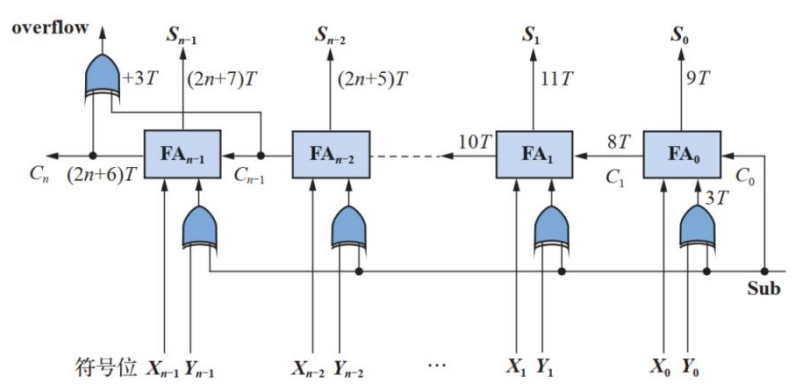
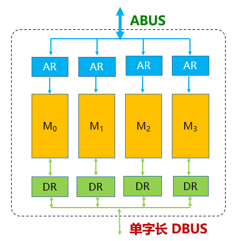
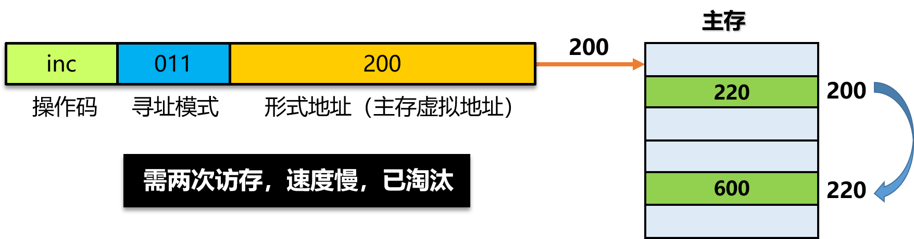
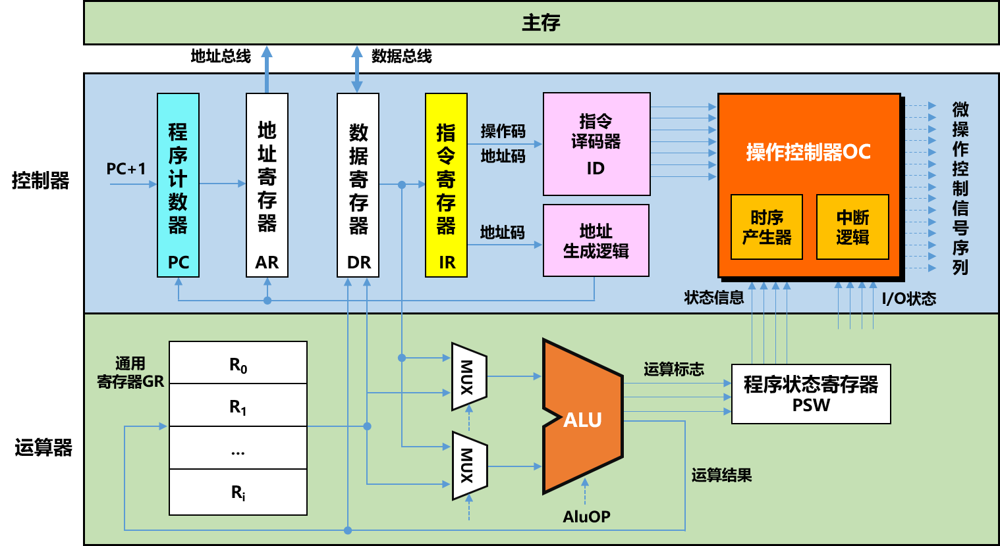
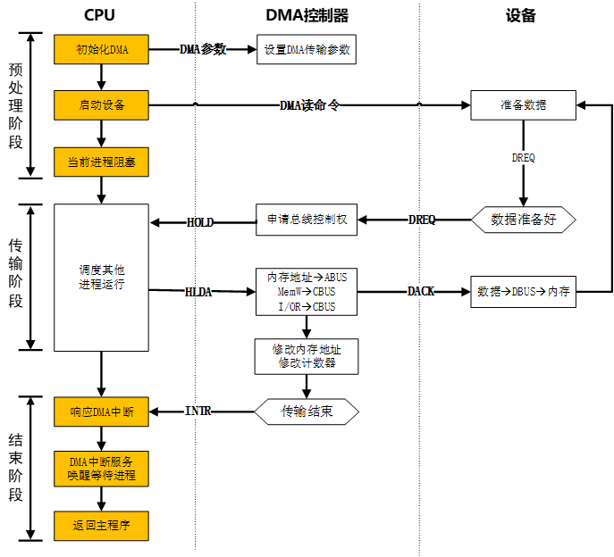

# 计算机组成原理

[TOC]

## 一、计算机系统概述

### 1.冯诺依曼体系结构

- 由运算器、控制器、存储器、输入设备和输出设备五部分组成

- 图解如下：

  

### 2. 计算机系统的组成

- 硬件系统组成
  - **存储器**：存放程序和数据(以二进制形式存放)，按地址访问；
  - **运算器**：执行算术运算和逻辑运算；
  - **控制器**：根据**指令的操作码、指令执行过程中的条件状态、时序系统**等三方面的因素来产生指令执行过程中所需要的控制信号，控制数据的存取和程序的执行；
  - **输入设备**：将信息输入到计算机的外部设备，如键盘、鼠标等；
  - **输出设备**：输出计算机处理结果的外部设备。如显示器、打印机等。
- 软件系统组成
  - 应用软件：解决应用问题的程序集合，如数据处理程序、情报检索程序等；
  - 系统软件：管理和调度计算机，以方便用户使用计算机并提高计算机使用效率的程序的集合，包括：
    - 操作系统
    - 程序设计语言处理程序：编译器，汇编器，解释器
    - 数据库管理系统

### 3.计算机的性能指标

#### (1)基本性能指标

- 字长：$CPU$一次处理的数据位数，一般**与计算机内部寄存器、运算器、数据总线的位宽相等**，影响计算精确度和数据的表示范围与精度；
- 主存容量：主存能存储的最大信息量，由$\underline{M\times N}$表示，其中$M$表示字容量（**存储单元数**），$N$表示位容量（**每个存储单元的二进制位数**）。

#### (2)与时间有关的性能指标

- 时钟周期：时钟频率（<u>**主频**</u>）的导数，是计算机处理操作最基本的时间单位；

- $CPI$：执行每条指令所需的平均时钟周期数；

  > 约定$IC$表示所有指令的总条数，$m$表示程序执行所需时钟周期数，$P_{i}$表示某类指令的使用频率，$IC_{i}$表示某类指令的条数，则满足$CPI=\frac{m}{IC}=\sum\limits_{i=1}^{n}(CPI_{i}\times P_{i})=\sum\limits_{i=1}^{n}(CPI_{i}\times \frac{IC_{i}}{IC}).$

- $IPC$：每个时钟周期$CPU$能执行的指令条数；

  > $IPC$满足：$IPC=\frac{1}{CPI}.$ 

- $CPU$时间：程序执行期间真正消耗$CPU$的时间（包括用户$CPU$时间和系统$CPU$时间）；

  > 约定$T$表示时钟周期时长，$f$表示$CPU$主频，则某段程序$CPU$时间可表示为$T_{cpu}=m\times T=\frac{m}{f}=CPI\times IC\times T=\frac{CPI\times IC}{f}.$

- $MIPS$：每秒钟执行的百万条指令数；

  > 约定$f^{'}=f\times 10^{6}$，则$MIPS=\frac{IC}{T_{cpu}\times 10^{6}}=\frac{f}{CPI\times 10^{6}}=IPC\times f^{'}.$

- $MFLOPS$：每秒钟执行的浮点运算次数。

### 4.计算机系统的层次结构

## 二、数据信息的表示

### 1.数值数据的表示

#### (1)数值与机器码

- 数据格式是指**使用二进制编码表示实际数据**的结构形式，分类如下：

  |   分类依据   |      具体分类      |
  | :----------: | :----------------: |
  | 是否有符号位 | 无符号数和有符号数 |
  |  小数点位置  |   定点数和浮点数   |

- 定点数和浮点数比较如下：

  - 定点数：包括定点整数和定点小数
    - 定点小数：小数点位置在最高数位之前（符号位之后）
    - 定点小数：小数点位置在最低数位之后
    - 定点整数存在**上溢**问题（超出表示范围）
    - 定点小数存在**精度溢出**问题（超出表示精度）
  - 浮点数
    - 表示方法：两个<u>**定点数**</u>分别表示**阶码和尾数**
    - 溢出问题：存在上溢和下溢问题，也存在精度溢出问题
    - 数据分布：浮点数在数轴上的分布并不均匀，**越远离原点，浮点数越稀疏**
    - 浮点运算<u>不满足结合律</u>，小数+大数=大数

- 真值与机器码比较如下：

  |      |                 表示形式                 |      机器零      |                 用途                 |
  | :--: | :--------------------------------------: | :--------------: | :----------------------------------: |
  | 真值 |          用"$+$"和“$-$”表示符号          |        无        |                  无                  |
  | 原码 |       将符号位加上二进制数的绝对值       | $+0=000$$-0=100$ |           表示浮点数的尾码           |
  | 反码 | 符号位同原码，真值为负数时数值位逐位取反 | $+0=000$$-0=111$ |                  无                  |
  | 补码 |      真值为负时反码末位加一得到补码      |     $0=000$      | 计算机中采用补码进行存储、表示和运算 |
  | 移码 |      与补码的符号位相反，数值位相同      |     $0=100$      |           表示浮点数的阶码           |

- 有关补码：
  - 补码又称为**模2的补码**，定点小数的模值为$2$，定点整数的模值为$2^{n+1}$；
  - 补码的机器零唯一，**多表示一个绝对值最大的负数**，小数为$-1$，整数为$-2^n$；
  - 反码法
    - **真值为负数**时将原码数据位逐位取反后末位加一得到补码；
    - **补码符号位为1**时将补码数据位逐位取反后末位加一得到原码；
  - 扫描法
    - **真值为负数**时对原码数据位从右向左扫描，右起第一个1及其右边的数据位不变，其余各位取反。
    - **补码符号位为1**时对原码数据位从右向左扫描，右起第一个1及其右边的数据位不变，其余各位取反。

- 有关变形补码：

  - 又称为双符号补码，指采用**<u>两个符号位</u>**表示数据的符号，其余位与补码相同；
  - 当符号位为$00$时表示正数，为$11$时表示负数；
  - 在运算时，即使产生溢出，变形补码的**<u>最高位</u>**也**<u>永远</u>**表示正确的符号位；
  - 符号位为$01$表示运算出现正溢出，为$10$时表示出现负溢出。

#### (2)定点数表示

- 数据表示范围

  |          | 最大正数   | 最小正数 | 最大负数       | 最小负数      |
  | -------- | ---------- | -------- | -------------- | ------------- |
  | 定点小数 | $1-2^{-n}$ | $2^{-n}$ | $-2^{-n}$      | $-(1-2^{-n})$，补码表示时为$-1$ |
  | 定点整数 | $2^n-1$    |  $1$        | $-1$ |    $-(2^n-1)$，补码表示时为$-2^n$    |

- 机器码计算公式

| 机器码 | $-2^n<x\leq0$（定点整数） | $-1<x\leq0$（定点小数） | $0\leq x\leq 2^n-1$或$0\leq x\leq 1-2^{-n}$ |
| :----: | :-----------------------: | :---------------------: | :-----------------------------------------: |
|  原码  |         $2^n+|x|$         |         $2+|x|$         |                     $x$                     |
|  反码  |       $2^{n+1}+x-1$       |      $2+x-2^{-n}$       |                     $x$                     |
|  补码  |        $2^{n+1}+x$        |          $2+x$          |                     $x$                     |
|  移码  |          $2^n+x$          |           无            |               $2^n+x$（整数）               |

#### (3)浮点数表示

- 表示规则
  - $N=2^{E}\times M=2^E\times\pm(1.m)$
  - $IEEE754$规则下，浮点数由数符$S$、阶码$E$、尾数$M$三部分组成，阶码采用<u>移码</u>表示，尾数采用<u>原码</u>表示；
  - 尾数为定点小数，小数点固定在最左侧，且隐藏小数点左边的$1$，运算时还原为$1.M$形式；
  - 对于$32$位浮点数($float$)而言：$S$为$1$位，$E$为$8$位，移码偏移为$2^7-1$，$M$为$23$位；
  - 对于$64$位浮点数($double$)而言：$S$为$1$位，$E$为$11$位，移码偏移为$2^{10}-1$，$M$为$52$位。

- 转换方法（以$32$位浮点数$float$为例）
  - 将十进制数$N$转换为$(-1)^s\times 2^e\times 1.M$，令$E=e+01111111$，保存$S$、$E$、$M$；
  - 从$32$位二进制串分离出$S$、$E$、$M$，令$e=E-01111111$，代入$(-1)^s\times 2^e\times 1.M$，按权展开。
- 具体形式说明
  - 当阶码为$1\sim 254$时，表示规格化数据；
  - 当阶码为$255$时，表示非数或者$\infty$；
  - 当阶码为$0$时，表示机器零或者非规格化数。

| 符号位$S$ |   阶码$E$   |  尾数$M$  |                     表示                      |
| :-------: | :---------: | :-------: | :-------------------------------------------: |
|   $0/1$   |    $255$    |   非零    |                     $NaN$                     |
|    $0$    |    $255$    |    $0$    |                   $+\infty$                   |
|    $1$    |    $255$    |    $0$    |                   $-\infty$                   |
|   $0/1$   | $1\sim 254$ |    $M$    |      $(-1)^s\times 2^{E-127}\times 1.M$       |
|   $0/1$   |      0      | $M$(非零) | $(-1)^s\times 2^{-127}\times 0.M$(非规格化数) |
|   $0/1$   |     $0$     |    $0$    |                    $+0/-0$                    |

### 2.非数值数据的表示

#### (1)字符表示

$ASCII$码是国际通用的字符码，包含$128$个字符，用**一个字节**表示，最高位为<u>零</u>。

#### (2)汉字编码

- 汉字编码包含**输入码、机内码和字形码**，分别用于汉字的输入、汉字在计算机内的存储与处理、汉字的显示和打印；
- 汉字<u>机内码</u>主要包括$GB2312$、$GBK$、$GB18030$、$Unicode$、$B1G5$等标准。

- $GB2312$编码

  - 以**$2$个字节**编码，最高位$MSB$为$1$；
  - 实际用$14$位表示汉字，采用$94\times94$矩阵表示，每一行为区号，每一列为位号，采用<u>**区号+位号**</u>的方式得到区位码。

  - **$GB2312$机内码$=$区位码$+A0A0H$**

### 3.数据信息的校验

#### (1)码距

- 码距：两个编码对应位二进制位不同的个数。

  - 编码体系的码距：一个编码体系中所有合法编码的最小码距；
  - 码距越大，抗干扰能力、纠错能力越强，数据冗余越大，编码效率越低。

- 校验码：原始数据$+$校验数据

  

#### (2)奇偶校验

- 编码规则：增加一位校验位，使得数据中的$1$的个数保持奇偶性，利用编码中$1$的个数的奇偶性进行校验；
- 检错性能：奇偶校验码距为$2$，只能检测**奇数位**错误；
- 可采用交叉奇偶校验提高奇偶校验码的检错与纠错能力，交叉奇偶校验可以检测出所有的$3$位以下错误以及大多数$4$位错误。
- 简单奇偶校验公式：
  - 偶校验位：$P=D_{1}\oplus D_{2}\cdots\oplus D_{n}$
  - 偶校验检错位：$G=D_{1}^{'}\oplus D_{2}^{'}\cdots\oplus D_{n}^{'}\oplus P^{'}$
  - 奇校验位：$P=\overline{D_{1}\oplus D_{2}\cdots\oplus D_{n}}$
  - 奇校验检错位：$G=\overline{D_{1}^{'}\oplus D_{2}^{'}\cdots\oplus D_{n}^{'}\oplus P^{'}}$
- 交叉奇偶校验
  - 交叉奇偶校验将待编码的原始数据构造成行列矩阵式结构，同时进行行和列两个方向上的奇偶校验；
  - 使**每个数据至少位于两个以上的校验组**，当校验码中的某一位发生错误时，能在多个检错位中被指出，使得**偶数位错误也可以被检查出**。

#### (3)海明校验

##### ①海明编码概述

- 海明编码又称为$SEC$码；
- $SEC$码的码距为$3$，只能纠一位错；
- 扩展海明码的码距为$4$，可以检测两位错同时纠正一位错；
- 海明校验是本质上是一种**多重奇偶校验**，**既可以检错也可以纠错**。
- 将原始数据信息分成若干偶奇偶校验组，所有数据信息位都会参与两个以上的校验组，每组设置一位偶校验位，所有校验组检错位的值构成检错码；
- 检错码为零，表示数据<u>高概率</u>正确，检错码不为零，则检错码值就是一位错的位置，通过检错码的值就可以实现编码的纠错。

##### ②校验位的位数

- 设海明码$N$位，其中数据位$k$位，校验位$r$位，有$N=k+r$，称为$(n,k)$码；

- 海明码包含$r$个偶校验组，$r$个偶校验组的$r$检错信息构成一个检错码$G_r\cdots G_2G_1$；

- 为了使其能指出所有一位错，应有$N=k+r\leq 2^r-1$，这便是常见的$ECC$纠错码。

##### ③编码分组规则

- 设有海明码$H_n\cdots H_2H_1$，原始数据$D_k\cdots D_2D_1$，校验位$P_r\cdots P_2P_1$；

- 为满足编码分组要求，校验位$P_i$放在$H_{2^{i-1}}$位置上，剩余位置由数据位依次填充；

- $H_i$的数据被编号小于$i$的若干个海明码位号之和等于$i$的校验位所校验；

  如对于$(11,7)$码，其编码分组如下：

  | $H_i$ |   1   |   2   |   3   |   4   |   5   |   6   |    7    |   8   |   9   |  10   |   11    |
  | :---: | :---: | :---: | :---: | :---: | :---: | :---: | :-----: | :---: | :---: | :---: | :-----: |
  | 映射  | $P_1$ | $P_2$ | $D_1$ | $P_3$ | $D_2$ | $D_3$ |  $D_4$  | $P_4$ | $D_5$ | $D_6$ |  $D_7$  |
  | 分组  |  $1$  |  $2$  | $1,2$ |  $4$  | $1,4$ | $2,4$ | $1,2,4$ |  $8$  | $1,8$ | $2,8$ | $1,2,8$ |

- 由此根据偶校验规则和各个校验位所校验的数据位，可以得到校验位计算公式：

  $P_1=D_1\oplus D_2\oplus D_4\oplus D_5\oplus D_7$

  $P_2=D_1\oplus D_3\oplus D_4\oplus D_6\oplus D_7$

  $P_3=D_2\oplus D_3\oplus D_4$

  $P_4=D_5\oplus D_6\oplus D_7$

- 同样可以得到检错位：

  $G_1=D_1^{'}\oplus D_2^{'}\oplus D_4^{'}\oplus D_5^{'}\oplus D_7^{'}\oplus P_1^{'}$

  $G_2=D_1^{'}\oplus D_3^{'}\oplus D_4^{'}\oplus D_6^{'}\oplus D_7^{'}\oplus P_2^{'}$

  $G_3=D_2^{'}\oplus D_3^{'}\oplus D_4^{'}\oplus P_3^{'}$

  $G_4=D_5^{'}\oplus D_6^{'}\oplus D_7^{'}\oplus P_4^{'}$

##### ⑤检错与纠错

- 当检错码$G_r\cdots G_2G_1=0$时，表示海明码大概率正确（当出错位数大于等于最小码距时，检错码也可以为$0$）；
- $SEC$码无法区分一位错和两位错；
- 当出现一位错时，检错码的值对应出错的海明码位号，直接取反即可纠错。

##### ⑥扩展海明码

- 又称为$SECDED$码，最小码距为4，可以区分一位错和两位错，并能纠一位错；
- 在$SEC$码的基础上添加总偶校验位$P_{all}=(D_1\oplus D_2\cdots\oplus D_k)\oplus(P_1\oplus P_2\cdots\oplus P_k)$；
- 总偶校验检错码$G_{all}=P_{all}^{'}\oplus(D_1^{'}\oplus D_2^{'}\cdots\oplus D_k^{'})\oplus(P_1^{'}\oplus P_2^{'}\cdots\oplus P_k^{'})$；
- 检错方法：
  - $G_{all}=0$且$G=0$时，无错误发生；
  - $G_{all}=1$时，出现一位错，此时如果$G=0$，说明$P_{all}$发生错误，数据部分正确，如果$G\ne 0$，说明数据部分发生一位错，可以根据检错码进行纠错；
  - $G_{all}=0$且$G\ne 0$时，出现两位错。

#### (4)CRC校验

##### ①编码规则

- 利用模$2$运算增加若干位校验位，使得该编码能够被指定的多项式整除；

  | 模$2$运算 | 运算法则                                            |
  | :-------: | :-------------------------------------------------- |
  |  加减法   | 没有进位和借位的二进制加法和减法运算                |
  |   乘法    | 根据模$2$加法运算求部分积之和，运算过程中不考虑进位 |
  |   除法    | 根据模$2$减法求部分余数                             |

  >  除法运算法则：
  >
  > - 部分余数首位为$1$时，商上$1$，按模$2$运算减除数；
  > - 部分余数首位为$0$时，商上$0$，减$0$；
  > - 部分余数小于除数的位数时，该余数即为最后余数；

##### ②$CRC$校验流程

设有$CRC$码$N$位，原始数据$C_{k-1}\cdots C_1C_0$共$k$位，校验位$P_{r-1}\cdots P_1P_0$共$r$位，则$CRC$码为$C_{k-1}\cdots C_1C_0P_{r-1}\cdots P_1P_0$，称为$(n,k)$码，满足$N=k+r\leq 2^r-1$。

##### ③生成$CRC$编码

- 假设待发送的$k$位二进制数据用信息多项式$M(x)$表示：$M(x)=C_{k-1}x^{k-1}+C_{k-2}x^{k-2}+\cdots+C_{1}x+C_{0}$；

- 将$M(x)$左移$r$位，得到$M(x)\cdot 2^r$，右侧空置的$r$位用来放置校验位；

- 选择一个$r+1$位的生成多项式$G(x)$，其最高次幂为$r$，最低次幂为$0$；

- 用$M(x)\cdot 2^r$按照模$2$的规则除以$G(x)$，得到的余数$R(x)$即为校验码；

  > 设商为$Q(x)$，则有$M(x)\cdot 2^r+R(x)=Q(x)G(x)+R(x)+R(X)$，根据模$2$运算有$R(x)+R(x)=0$，因此$M(x)\cdot 2^r+R(x)=Q(x)G(x)$，表明**$CRC$码一定能被$G(x)$整除**，这也是$CRC$码的编码规则。

- 生成多项式的规则

  - 最高位和最低位均为$1$；
  - 当$CRC$码任何一位发生错误时，都不能被生成多项式整除；
  - 不同位发生错误时，余数不同；
  - 对余数继续做模$2$运算，应使余数循环。

##### ④$CRC$编码的循环特性

- $CRC$编码的非$0$余数具有循环特性，即**将余数左移一位除以生成多项式，将得到下一个余数**，继续重复在新余数基础上左移一位除以生成多项式，多次循环后余数最终能循环为最开始的余数；

- 例如对于$(7,3)$码，设生成多项式为$11101$，数据位为$3$位，校验码为$4$位，则余数表如下所示：

  | 序号 |            编码             |  余数  |        余数值         | 出错位 |
  | :--: | :-------------------------: | :----: | :-------------------: | :----: |
  |  1   |          $0000000$          | $0000$ |          $0$          |   无   |
  |  2   | $000000\pmb{\underline{1}}$ | $0001$ |          $1$          |  $1$   |
  |  3   | $00000\pmb{\underline{1}}0$ | $0010$ |          $2$          |  $2$   |
  |  4   | $0000\pmb{\underline{1}}00$ | $0100$ | $\pmb{\underline{4}}$ |  $3$   |
  |  5   | $000\pmb{\underline{1}}000$ | $1000$ |          $8$          |  $4$   |
  |  6   | $00\pmb{\underline{1}}0000$ | $1101$ |         $13$          |  $5$   |
  |  7   | $0\pmb{\underline{1}}00000$ | $0111$ |          $7$          |  $6$   |
  |  8   | $\pmb{\underline{1}}000000$ | $1110$ |         $14$          |  $7$   |
  |  9   | $00000\pmb{\underline{11}}$ | $0011$ |          $3$          |  $1+2$   |
  |  10  | $\pmb{\underline{111}}0000$ | $0100$ | $\pmb{\underline{4}}$ |  $5+6+7$   |

##### ⑤$CRC$串行编解码

- 触发器的初始状态均为$0$；
- 有异或门的位置为生成多项式为$1$的位置，如图例得到$G(x)=x^4+x+1$，对应编码为$10011$；
- 当$Q_4=0$时，不够除，异或门相当于直通，下一个时钟时，数据左移一位；
- 当$Q_4=1$时，够除，商上$1$，进行$Q_4Q_3Q_2Q_1Serial\_in\oplus G(x)$，结果左移。

##### ⑥$CRC$并行编解码

- 模$2$除法余数运算满足结合律：**两数的余数异或等于两数异或后的余数**

  $(M(x)\%G(x))\oplus(N(x)\%G(x))=(M(x)\oplus N(x))\%G(x)$

- 例如：设生成多项式$G(x)=1011$，原始数据为$M(x)=1101$，传输后的编码为$1101\underline{011}$，试求$CRC$编码和传输后的余数：

  - **发送方编码**：$1101\underline{000}=\pmb{1}000\underline{000}\oplus0\pmb{1}00\underline{000}\oplus000\pmb{1}\underline{000}$，则余数可以由三个数分别对$G(x)$进行模$2$运算后的余数异或得到；
  - **接收方解码**：$1101\underline{011}=\pmb{1}000\underline{000}\oplus0\pmb{1}00\underline{000}\oplus000\pmb{1}\underline{000}\oplus0000\underline{011}$，同样可以得到对应的余数，其中$0000\underline{011}$对$G(x)$进行模$2$运算后的余数即为$\underline{011}$；

- 计算流程

  - 先计算$2^6$、$2^5$、$2^4$、$2^3$四个特殊常量的余数，再用余数的组合求解任意编码的余数。
  - 在解码时，将计算得到的余数与各个特殊常量的余数比较，若相等，则该特殊常量对应的位出错，纠错即可。

## 三、运算器

### 1.定点加减法运算

##### ①运算原理

- 运算公式

  - 补码加法：$[x]_补+[y]_补=[x+y]_补\quad(mod\enspace M)$
  - 补码减法：$[x-y]_补=[x]_补+[-y]_补=[x]_补-[y]_补\quad(mod\enspace M)$
  - 对于定点小数，$M=2$；
  - 对于定点整数，$M=2^{n+1}$，其中$n$为不包含符号位的位数。

- 运算规则

  - 操作数采用<u>补码</u>表示，符号位参加运算；
  - 运算结果为<u>补码</u>，符号位的进位位（模）直接丢弃。

- 溢出判断

  - 单符号判断法：利用操作数和运算结果的符号位进行判断

    - 设$X_f$，$Y_f$为运算操作数的符号位，$S_f$为运算结果的符号位，$V$为溢出标志位，当$V=1$时表示发生溢出

    - 加法溢出规则：“正正得负，负负得正”

      $V=X_fY_f\overline{S_f}+\overline{X_f}\,\overline{Y_f}S_f$

    - 减法溢出规则：“正负得负，负正得正”

      $V=X_f\overline{Y_f}\,\overline{S_f}+\overline{X_f}Y_fS_f$

  - 进位位判断法：符号位进位和最高数据位进位进行异或操作

    - 设运算时最高有效数据位产生的进位信号为$C_d$，符号位产生的进位信号为$C_f$，溢出检测逻辑表达式为$V=C_f\oplus C_d$
    - **对于加减法均适用**

  - 双符号判断法

    - 根据变形补码中双符号位的定义，可以得到，当符号位为$01$或$10$时发生溢出；
    - 溢出检测逻辑表达式公式为$V=S_{f_1}\oplus S_{f_2}$
    - 将双符号运算结果的两个符号位进行异或操作

##### ②一位全加器$FA$（$Full\enspace Adder$，一个带进位的一位加法器）

- 计算原理

  $S_i=X_i\oplus Y_i\oplus C_i$

  $$\left\{\begin{aligned}C_{i+1}=X_iY_i+(X_i+Y_i)C_i\quad 时延2T,硬件开销较高\\C_{i+1}=X_iY_i+(X_i\oplus Y_i)C_i\quad 时延5T,硬件开销略低\end{aligned}\right.$$

- 逻辑实现

##### ③多位串行加法器（$Ripple\enspace Carry\enspace Adder$，行波进位加法器）

- 对$n$位串行进位加法器进行简单的改造即可得到$n$位的加法电路；

- 无符号溢出为$C_n$，有符号溢出为$overflow=C_n\oplus C_{n-1}$；

- 计算原理

  $$\left\{\begin{aligned}C_n\quad 时延(2n+3)T\\S_{n-1}\quad 时延(2n+4)T\\overflow\quad 时延(2n+6)T\end{aligned}\right.$$

- 逻辑实现

  

- 当采用多位串行加法器进行减法运算时，**需要将减数的补码送入加法器**。

##### ④可控加减法电路（$Controlled\enspace Adder/Subtractor$）

- 在$n$位串行加法器的基础上引入$sub$信号；

- $sub$信号为$1$时表示进行减法，$sub$信号为$0$时表示进行加法；

- 计算原理

  $$\left\{\begin{aligned}数据位为Y_i^{'}=Y_i\oplus sub\\最低位的进位输入为sub\end{aligned}\right.$$

- 逻辑实现

  

##### ⑤先行进位加法器（$Carry\enspace Look-Ahead\enspace Adder$）

- 计算原理

  - 设进位生成函数：$G_i=X_iY_i$，进位传递函数：$P_i=X_i\oplus Y_i$

  - 由$S_i=X_i\oplus Y_i\oplus C_i$，$C_{i+1}=X_iY_i+(X_i\oplus Y_i)C_i$可得

    $S_i=P_i\oplus C_i$，$C_{i+1}=G_i+P_iC_i$

  - 进位信号仅与$G$，$P$，$C_0$有关：

    $C_n=G_{n-1}+P_{n-1}G_{n-2}+P_{n-1}P_{n-2}G_{n-3}+\cdots+P_{n-1}P_{n-2}\cdots P_1P_0C_0$

  - 成组进位生成函数：$G^*=G_{n-1}+P_{n-1}G_{n-2}+P_{n-1}P_{n-2}G_{n-3}+\cdots+P_{n-1}P_{n-2}\cdots G_0$

  - 成组进位传递函数：$P^*=P_{n-1}P_{n-2}\cdots P_0$

  - $C_n=G^*+P^*C_0$与$C_1=G_0+P_0C_0$拥有相同的形式，即$4$位一组的进位信号可以采用相似的原理组成成组的先行进位，便于级联操作。

- 逻辑实现（$4$位先行进位电路，$CLA$）

  - $4$位先行进位电路的总延迟为$2T$

  

- 逻辑实现（四位快速加法器）

  - 利用$CLA$实现的四位快速加法器总延迟为$8T$；
  - 而串行加法器的时间延迟$(2n+4)T=12T$，相比之下性能提升$1.5$倍。

  

- 逻辑实现（$16$位组内并行、组间串行加法器）

  关键延迟为$14T$，相比串行的$(2n+4)T=36T$，性能提升$2.6$倍。

- 逻辑实现（$16$位组内、组间并行加法器）

  - 将$G^*$和$P^*$送至可级联先行进位电路$(2T)$，实现组间并行；
  - 延迟为$12T$，相比串行加法器的时间延迟$(2n+4)T=36T$，性能提升$3$倍。

  

### 2.定点乘法运算

#### (1)原码一位乘法

- 符号位运算规则：**符号位单独运算，乘积符号位等于乘数和被乘数符号的异或**；

- 数值位运算规则：采用绝对值进行运算，设<u>数值位长度</u>为$n$，如下图所示：

  

  - 可见，乘法可由加法实现，存在的问题：

    - 需要**多输入的全加器**

    - 需要长度为$2n$的积寄存器

    - 对应乘数的不同位，部分积左移次数不同，且乘法过程中总移位次数多

- 运算改进方法：

  

  - 采用基于一位全加器$FA$的循环累加$0$或者被乘数

  - 从部分积和乘数寄存器取结果

  - 每次进行累加时，右移部分积，同时右移乘数寄存器，将部分积移出位送入乘数寄存器高位，即将$\{部分积,乘数寄存器\}$组合后一起算数右移

    > 由于原码一位乘法中，<u>**符号位不参与运算**</u>，因此这里的算术右移操作是指将<u>**进位位**</u>作为算术右移后的最高位

- 改进后的运算公式：

  - $\{P,y\}=\{(P+y_n|x|),y\}/2$

  - 部分积$P$的初值为零，每次将部分积$P$累加上$y_n|x|$后连同数据$y$一起同步算术右移得到新的部分积，一共要进行$n$次运算和移位操作，最终的$2n$位乘积存放在$P$和$y$两个寄存器中。

    > 逻辑左移：数据整体左移一位，最高位$D_{15}$被移出至$CF$,最低位$D_1$补$0$；
    >
    > 算术左移：数据整体左移一位，最高位$D_{15}$被移动，最低位$D_1$补$0$；
    >
    > 逻辑右移：数据整体右移一位，最高位$D_{15}$补$0$，最低位$D_1$被移出；
    >
    > 算术右移：数据整体右移一位，最高位$D_{15}$填补符号位，最低位$D_1$被移出。

- 逻辑表示：

  

#### (2)补码一位乘法

- 运算规则：

  - 补码一位乘法中**符号位参加运算**，乘数取单符号位；

  - <u>具体运算公式</u>：$\{P,y\}=\{(P+(y_{n+1}-y_n)[x]_补,y\}/2$；

  - 在数据末位增加一位附加位$y_{n+1}=0$，部分积$P$初值为$0$

  - 当$Y_nY_{n+1}=00$或$11$时，部分积加$0$

  - 当$Y_nY_{n+1}=01$时，部分积加$[x]_补$

  - 当$Y_nY_{n+1}=10$时，部分积加$[-x]_补$

  - 每次部分积计算完毕后连同乘数$y$一起同步算术右移一位

    > 由于补码一位乘法中，<u>**符号位参与运算**</u>，因此这里的算术右移操作是指将<u>**符号位**</u>作为算术右移后的最高位

  - 由于符号位参与了运算，累加运算需要进行$n+1$次，但移位次数只需要进行$n$次

- 逻辑表示：

  

#### (3)阵列乘法器

##### ①横向进位原码阵列乘法电路

$n$位的阵列乘法器需要$n(n-1)$个全加器，时间延迟为$[n+2(n-2)]*3T+T=(3n-4)*3T+T.$

##### ②斜向进位原码阵列乘法电路

$n$位的阵列乘法器需要$n(n-1)$个全加器，时间延迟为$2*(n-1)*3T+T=(2n-2)*3T+T.$

##### ③原码阵列乘法器

##### ④补码阵列乘法器

##### ⑤阵列乘法器流水线

### 3.浮点运算

- 阶码和尾数采用补码表示的浮点数加减运算

  - 运算概述

    - 设有两个浮点数$X=2^m\times M_x$，$Y=2^n\times M_y$

    - 当$m=n$时，尾数部分直接运算即可得到浮点形式的运算结果；

    - 当$m\ne n$时，需要使二者阶码相等后再行尾数部分的运算，称为**<u>对阶</u>**；
    - 尾数的计算结果可能不满足规格化，需要进行规格化处理。

  - 运算过程

    - 对阶（小阶向大阶看齐）
      - 求阶差：对阶码进行减法运算，得到阶码的差值
      - 阶码的调整与尾数的移位：将阶码较小的浮点数的尾数**右移$m-n$位**

    - 尾数运算（进行定点运算）
      - 按照定点数的补码加减法运算执行尾数加减操作

    - 规格化运算结果，需要规格化时进行左规或右规操作
      - 为了处理方便，让尾数的符号位扩展成**双符号位**
      - 当运算结果为$11.0\cdots\cdots$或者$00.1\cdots\cdots$的形式时为<u>**规格化**</u>数
      - 非规格化处理
        - 当运算结果为$10.\cdots\cdots$或者$01.\cdots\cdots$的形式时发生上溢，将尾数**<u>右移一位</u>**，并将结果的**阶码加$1$**；
        - 当运算结果为$11.1\cdots\cdots$或者$00.0\cdots\cdots$的形式时，需要左规格化，尾数连同符号位一起左移，直到出现$11.0\cdots\cdots$或者$00.1\cdots\cdots$的形式时结束，**左移多少位阶码就减多少**。

    - 舍入处理
      - <u>**末位恒置$1$法**</u>：只要因为移位丢失的位中有一位为$1$，便在运算结果最低位加$1$；
      - <u>**$0$舍$1$入法**</u>：当丢失位数的最高位为$1$时在运算结果最低位加$1$；
      - 舍入后可能还需要进行**二次规格化**
    - 溢出判断
      - **阶码溢出时浮点数才会发生溢出**

- $IEEE754$浮点数加减运算

  - 对阶和规格化过程中，阶码运算采用**<u>移码加减法</u>**运算规则；
  - 尾数的运算采用原码运算规则，且隐藏位要参与运算；
  - 规格化过程
    - 若尾数形式为$1.\cdots\cdots$，则为规格化尾数；
    - 若尾数形式为$1X.\cdots\cdots$，则向右规格化一次，阶码加$1$；
    - 若尾数形式为$0.\cdots\cdots$，则向左规格化直至变为$1.\cdots\cdots$，**左移多少位阶码就减多少**

  - 溢出判断
    - 向右规格化使阶码为全$1$时，发生规格化上溢；
    - 向左规格化使阶码为全$0$时，发生规格化下溢；

### 4.运算器

- 定点运算器
  - 算术逻辑运算单元$ALU$
    - $n$位$ALU$包括两个$n$位的输入操作数$a$、$b$，一位进位输入$C_{in}$，$AluOp$为运算功能选择操作码，用于选择$ALU$内部的运算电路；
    - 在$ALU$内部，所有逻辑、算术运算电路并发运行，多个运算结果分别送入多路选择器输入端，由$AluOp$选择其中一路结果输出；
    - 输出除了$result$外，还包括若干状态标志位：$CF$、$ZF$、$OF$、$SF$。
  - 通用寄存器组
    - 作用：暂存参加运算的数据、运算的中间结果或最后结果。
  - 输人、输出选择电路
    - 作用：对若干个数据的输入、输出进行选择或控制。

- 运算器结构

  - 单总线结构：$2$个缓冲器，$3$个时钟周期完成运算
  - 双总线结构：$1$个缓冲器，$2$个时钟周期完成运算
  - 三总线结构：$0$个缓冲器，$1$个时钟周期完成运算

- 浮点运算器

  - 浮点流水线，将浮点运算的步骤进行细分，优化密集型浮点运算性能

    

## 四、存储系统

### 1.存储器概述

- 存储器分类

  | 划分依据 |                           具体分类                           |
  | :------: | :----------------------------------------------------------: |
  | 存取方式 | 随机存储器（半导体存储器）、顺序存储器（磁带）、直接存储器（磁盘） |
  | 读写功能 |           只读存储器（$ROM$）、读写存储器（$RAM$）           |
  |   作用   | 控制存储器、高速缓冲存储器$Cache$、主存储器、辅助存储器（磁盘） |

- 存储系统技术指标

  - **存储时间**：从$接受到读写命令$到$从存储器中读出或写入信息$所经历的时间

  - **存储周期**：连续两次访问存储器所需要的<u>最小</u>时间间隔 （存储时间+恢复时间）

  - **存储器带宽**：单位时间内存储器存取的信息量，单位为$Byte/s$

- 基本存储体系

  - 基本存储体系运作流程
    1. 输入设备将程序与数据写入主存；
    2. $CPU$取指令；
    3. $CPU$执行指令期间读数据；
    4. $CPU$写回运算结果；
    5. 输出设备输出结果。
  - 基本存储体系的问题
    - **主存速度慢**：主存增速与$CPU$增速不同步，指令执行期间多次访问主存
    - **主存容量不足**：存在制约主存容量的技术因素（由$CPU$、主板等相关技术指标确定），应用对主存的需求不断扩大，存在价格约束

- 存储体系的层次化结构

  

  - 使用高速缓冲存储器（$Cache$）：解决$CPU$与主存速度不匹配的矛盾

    - $L1\enspace Cache$集成在$CPU$中，分数据$Cache(D-Cache)$和指令$Cache(I-Cache)$ 

    - 早期$L2\enspace Cache$在主板上或与$CPU$集成在同一电路板上。随着工艺的提高，$L2\enspace Cache$被集成在$CPU$内核中，不分$D-Cache$和$I-Cache$

  - 使用辅存（磁盘、磁带、网络存储）：解决主存容量和价格限制

  - **$CPU$访问到的存储系统具有$Cache$的速度，辅存的容量和价格**

- 存储单元、存储地址与边界对齐

  

  - 主存由半导体$MOS$存储器组成，给出一个地址，经过一个存储周期，可以访问一个存储单元；

  - <u>存储单元比特位数</u>和机器字长有关，$32$位计算机中主存单元是$32$位，$64$位计算机主存单元是$64$位；

  - 以$32$位计算机为例，$32$位字长的主存单元可以按照不同大小访问，既可以按照<u>字节</u>访问，也可以按照<u>半字</u>$16$位或者<u>字存储单元</u>$32$位进行访问；

  - **不同访问模式的访问时间都是一个存储周期**，访问地址分别对应字节地址、半字地址和字地址；

  - 例如对于以下指令：

    $mov\enspace ah, [8]$  #按字节访存 $ah=0x12$
    $mov\enspace ax, [8]$  #按半字访存 $ax=0x3412$
    $mov\enspace eax,[8]$  #按字访存 $eax=0x78563412$
    $mov\enspace eax,[9]$  #**未对齐，产生异常**

  - 强制边界对齐

    - 计算机中<u>只有字节地址</u>；
    - 按半字访问时<u>屏蔽字节地址最低位</u>，也即半字地址必须按$2$对齐；
    - 按字访问是<u>屏蔽字节地址最低$2$位</u>，也即字地址必须按$4$对齐；
    - 如果不对齐，将导致访问数据不在一个存储单元中，需要两个以上的存储周期才能得到，计算机中不允许出现这种情况，因为这样的指令执行会产生数据未对齐异常。

### 2.主存的组织及与$CPU$的连接

- 字长扩展（数据总线扩展）

  - 各芯片并行工作，数据由多个芯片的输出组合得到

  - 设存储系统位宽$N$位，若使用$k$位芯片，$k<N$，需$(N/k)$个芯片

  

- 字数扩展（地址总线扩展）

  - 同一时刻仅一个芯片工作，数据由一个芯片的输出得到

  - 设存储系统容量为$M$，若使用容量为$l$的芯片，$l<M$，需$(M/l)$个芯片

  

- 综合扩展

  存储系统$M*N$位，若使用$l*k$位的芯片，$l<M,k<N$，需$(M/l)*(N/k)$个芯片

  

### 3.并行主存系统

- 双端口存储器

  - 具有两组相互独立的读写控制线路
  - 两组读写控制线路可以并行操作
  - 端口地址不相同，无冲突，并行存取
  - 端口地址相同，读写冲突，无法并行存取

- 多体交叉存储器

  - 高位多体交叉

    

    - 一个地址寄存器
    - 高位片选，多模块串行
    - 扩容方便

  - 低位多体交叉

    

    - 每个存储体均需地址寄存器
    - 低位片选，模块并行工作
    - $CPU$比存储器要快，能同时取出多条指令或者数据
    - 扩容方便

  - 低位多体交叉下的流水线访问

    

    - 设模块存取周期为$T$，总线传输周期为$t$，存储器交叉模块数为$m$；

    - 流水线方式存取的条件：$T=m\cdot t$；

      

    - 即每个模块启动后经过$t$时间的延时，就可以启动下一个模块；

    - 连续并行读$m$个字的时间：$t_1=T+(m-1)t$

    - 顺序读$m$个字的时间：$t_2=mT$

### 4.高速缓冲存储器

#### (1)缓冲工作原理

- 早期$U$盘

  - 早期计算机中，如果要拔出$USB$设备，计算机会提示进行安全拔出

    

  - 早期$U$盘<u>写速度慢</u>，计算机会将部分**内存空间**为$U$盘作**写缓冲**；

  - **当数据写入内存时，计算机即报告传输完成**，这样可以改善用户等待体验；

  - 但同时会导致数据不一致性，产生**脏数据**——在内存中还未写入$U$盘的数据；

  - 系统将**定时**或**被迫**将脏数据迁移到U盘，不安全的拔盘可能丢失脏数据。

- 缓冲机制

  - 缓冲的前提
    - 有较大性能差异（如$CPU$和主存）
    - 缓冲空间足够
  - 快存为慢存作写缓冲，**优化写性能**

#### (2)程序局部性原理

- 程序局部性：程序仅需访问内存很小一部分空间

  - 空间局部性: 某内存区域刚被访问，很快其相邻区域有可能被访问

    - 数据——连续数组元素访问

    - 数据——结构体、数据库记录访问
    - 指令——顺序访问的指令

  - 时间局部性: 某内存区域刚被访问，很快该区域可能会被重复访问

    - 数据——局部变量，计数器，指针等被重复使用
    - 指令——重复使用的循环体中的指令
    - 指令——子函数的调用

- 读性能的优化

  - 利用**数据访问的<u>空间</u>局部性**进行读优化
  - 将**热数据或即将访问数据的副本**调度到存储系统上层
  - 仅访问上层快存即可获得数据

- $cache$的基本思想

  - 在处理器附近增加一个**隐藏的小容量快速存储器**

    - 采用<u>硬件</u>实现，程序员无法操纵
    - 高命中率优化读性能
      - 预读处理——空间局部性（预读相邻的数据）
      - 淘汰算法——时间局部性（淘汰掉最近最不常访问的数据）
      - 将<u>热数据</u>副本存放在$cache$中

  - 读操作流程

    - 命中($HIT$)

      $CPU$发出读请求，要访问的数据可以在$cache$中找到，直接返回数据

    - 缺失($MISS$)

      $CPU$发出读请求，要访问的数据在$cache$中无法找到，需要在主存中找到后拷贝到$cache$中，再返回数据，这将导致访问速度急剧下降

  - 写操作流程

    - 写穿策略($WriteThrough$)

      CPU发出写请求，将要写入的数据写入**$cache$和主存**中，写入完成后响应，无脏数据，无丢失数据的风险，写速度慢

    - 写回策略($WriteBack$)

      CPU发出写请求，将要写入的数据写入**$cache$**中即返回写响应，存在脏数据，有丢失数据的风险，突发写速度快；持续写时，$cache$很快就会存满数据，需要先将$cache$中数据移到主存，然后再写入$cache$

#### (3)cache基本概念
- 命中$(hit)$：$CPU$访问数据在$cache$中（上层存储器）
- 缺失$(miss)$：$CPU$访问数据不在$cache$中
- 块$(block)$：$cache$与主存交换最小单位
  - 块越小，时间局部性越好，过小会导致频繁交换；
  - 块越大，空间局部性越好，过大导致$cache$很快会被装满，对热数据的调度差

- 行/槽$(Line/Slot)$：包括有效位、查找标记、脏标志位、置换标志、数据块副本的容器
- 命中率$(hit\enspace rate)$：主存访问中$cache$命中比例
- 缺失率$(miss\enspace rate)$：$1-命中率$
- 命中访问时间$(hit\enspace time)$：包括数据查找时间、$cache$访问时间、总线传输时间
- 缺失损失$(miss\enspace penalty)$：主存块调入$cache$，数据传输到$CPU$的时间，远大于命中时间

#### (4)cache读流程

- $CPU$给出主存地址
- 以<u>主存块地址</u>为关键字在$cache$中查找，**需要维护查找表**
  - 如相符表示副本在$cache$中，命中，访问$cache$
  - 否则数据缺失，访问主存
    - 将数据所在块的副本调入$cache$
    - **更新查找表**，记录当前数据块地址
    - 载入副本过程**可能引起替换**
    - $cache$缺失时，**CPU需要等待数据调入**

#### (5)cache写流程

- $CPU$给出主存地址
- 以<u>主存块地址</u>为关键字进行查找
  - 相符：表示命中，数据副本在$cache$中
  - 缺失：根据写分配策略决定是否将该主存地址对应数据块调入
    - 写分配：为主存块分配$cache$行
    - 写不分配：静默地将数据写入主存，而不分配$cache$行
- 写入数据到$cache$，并根据写策略决定是否写入主存

#### (6)cache查找机制

- 解决**判断数据是否在$cache$中**的问题，查找时间应快速且一致，不随着数据增长而增长

- 相联存储器：按内容进行访问的存储器

  | 主存块号 | $cache$块号 |
  | :------: | :---------: |
  |   001    |      1      |
  |   021    |      2      |
  |   023    |      6      |
  | $\dots$  |   $\dots$   |
  
- 读逻辑实现

  - 查找表中有内容的$key-value$对的$valid$位置为$1$，否则$valid$位为$0$；
- 采用多个比较器进行**并发比较**，每次比较时$L_0-L_7$至多有一个为$1$；
  - 根据$valid$位和比较结果使用三态门输出$key$对应的$value.$

  

- 相联存储器的特点

  - 按内容进行访问$(Key,Value)$

    - 以关键字进行<u>全局并发</u>比较
    - 硬件成本较高（比较器多），通常用于存放查找表或全相联$cache$

  - $存储容量=查找表容量=表项数*表项大小$

    - $cache$中用于存放块表，虚拟存储器中用于存放段表、页表

      |    模式    | 有效位 |   $Key$    |    $Value$    |
      | :--------: | :----: | :--------: | :-----------: |
      |  $cache$   | 有效位 | 主存块地址 | $cache$块地址 |
      | 虚拟存储器 | 有效位 |   $VPN$    |     $PPN$     |

- $CPU\enspace cache$的基本组织方式

  - $CPU\enspace cache$由较快的$SRAM$构成
  - $cache$与主存均分为固定大小的数据块，以**<u>块</u>**为单位交换数据
  - 相联存储器存放查找表/$cache$
    - 表项：(有效位，调入$cache$的主存块地址，$cache$块地址/$block\enspace data$)
    - 容量 = $cache$块数 * 表项大小
  - 块地址与块内地址
    - 由于主存被分为若干主存块，每个主存块包含多个存储单元，因此主存地址可以分为<u>块地址</u>和<u>块内偏移</u>；
    - 查找表表项内容为$(valid,主存块地址,cache块地址)$
    - 查找表表项数目$=cache$块数目，总容量$=(1+11+8)*2^8$

  

#### (7)cache映射机制

- 解决**如何将主存数据放置在$cache$行中**的问题，有规律的映射有助于查找
- 利用某种方法或规则将主存块定位到$cache$称为**地址映射**
  - 全相联$(fully-associated)$
  - 直接相联$(direct\enspace mapped)$
  - 组相联$(set-associated)$

##### ①全相联

- 主存块可以放置在任意$cache$行；

- 主存地址为：$(主存块地址,块内偏移)$

- $cache$行内容为：$(有效位,主存块地址,数据块副本)$

- 实现时可以直接将数据块副本存放在$cache$行中，而不需要$cache$块地址；

- 关系图

  

- 逻辑实现

  

- 相联存储器容量

  - 查找表和缓存副本一体$(CPU片内缓存)$
    - 存放$cache$行
    - 有效位、主存块地址、**数据块副本**、标志位$(Dirty\enspace bit)$、置换标记
    - 存储容量$=cache$行大小$\times$行数
  - 查找表和缓存副本分离$(片内查找表，片外缓存)$
    - 查找表在$CPU$内部，存放查找信息，而缓存在主存上
    - **先将主存块地址翻译为$cache$块地址，再通过$cache$块地址访问片外缓存**
    - 有效位、主存块地址、$cache$块地址、标志位$(Dirty\enspace  bit)$、置换标记
    - 存储容量$=$查找表表项大小$\times$行数

- 应用场合

  - 块映射灵活，一对多映射
  - 块冲突概率低，$cache$装满后才会出现块冲突，$cache$利用率高
  - 命中率高
  - 淘汰算法复杂

##### ②直接相联
- 将主存块分为若干个区，每个区内的主存块只能放在区内索引相同的$cache$行内；

- 主存地址为：$(区地址,行索引,块内偏移)$

- $cache$行内容为：$(有效位,主存块地址,数据块副本)$

- 关系图

  

- 逻辑实现

  

- $cache$容量

  - 使用一个比较器，比较标记——<u>区地址</u>
  - $cache容量=行大小\times行数=(valid+脏数据标志+比较标记+数据块)\times行数$

- 应用场合

  - 映射速度快（但是<u>存在译码逻辑</u>），一对一映射，无须查表
    - 利用索引字段直接对比相应标记位即可
    - 查找表可以和副本一起存放，无需相联存储器
  - 容易冲突，$cache$利用率低
  - 命中率低，适合大容量$cache$
  - 无需替换算法，按行索引替换

##### ③组相联
- **组内全相联，组间直接相联**；

- 将$cache$分为若干个组，每组有若干个$cache$行，在进行映射时，第$i$个主存块只能放在第$i$组，组内可以任意放置；

- 主存地址为：$(标记tag,组索引,块内偏移)$

- $cache$行内容为：$(有效位,标记tag,数据块副本)$

- 关系图

  

- 逻辑实现

  

- 存储容量

  - 多个相联存储器<u>共享</u>一个多路比较器（一组内的行数）
    - **多路比较器复杂度比简单的全相联模式低**
  - 查找表表项内容：$(valid,dirty,查找标记,置换标记位)$
  - 相联存储器总容量：$cache行数*(1+1+查找标记宽度+置换标记位)$

##### ④不同映射机制对比

- 不同映射机制的主存地址划分

  

- 不同映射机制的应用场合

  - 小容量$cache$可采用<u>全相联</u>映射或<u>组相联</u>映射
    - $Pentium\enspace CPU:L_1\enspace L_2\enspace cache$
  - 大容量$cache$可采用<u>直接映射</u>方式
    - 查找速度快，命中率相对低，但$cache$容量大可提高命中率块，设备缓存

#### (8)cache替换策略

- 解决**$cache$满或者冲突时如何进行替换**的问题，需要考虑时间局部性
- 先进先出法——$FIFO$
- 最近最不经常使用方法——$LFU$
- 近期最少使用法——$LRU$
- 随机替换法

#### (9)cache写入策略

- 解决**如何保证$cache$与$memory$的一致性**的问题
- 写回法（$cache$中**<u>需要</u>维护脏数据标志位**）
- 写穿法（$cache$中**<u>不需要</u>维护脏数据标志位**）
- 写分配
- 写不分配

#### (10)总结

##### ①cache对存储系统性能的影响
- 读优化
  - 时间局部性：将<u>刚访问的数据</u>调度到$cache$中、利用<u>淘汰算法</u>将不经常使用的数据淘汰
  - 空间局部性：大块<u>预读</u>，相邻的数据被调度到$cache$中
- 写优化
  - 写回策略提升突发写性能
- 负面影响
  - 写回策略引起数据的不一致性
  - $cache$装满后，写性能降低

##### ②cache命中率的影响因素

- 命中率：设$N_c$表示$cache$完成存取访问的总次数，$N_m$表示主存完成存取访问的总次数，则命中率$h=\frac{N_c}{N_c+N_m}$

- 平均访问时间$t_a$：设$t_c$表示命中$cache$时的访问时间，$t_m$表示命中主存时的访问时间，则平均访问时间$t_a=ht_c+(1-h)t_m$

- 访问效率：$t_c/t_a$

- $cache$容量越大，命中率越高

- 块的大小与命中率

  - 块大小越大，块数量越少，空间局部性越好，时间局部性不佳，缺失率提升，具体关系如下图

    

  - 极端情况下，当一个$cache$仅有一块时，命中率急剧下降

- 地址映射与命中率：全相联$>$组相联$>$直接相联

### 5.虚拟存储器

#### (1)工作原理

- 如左图所示，在实地址计算机系统中，程序直接访问和操作的都是<u>物理内存</u>
  - 用户程序可以访问任意内存，寻址内存的每个字节，很容易破坏操作系统，造成操作系统崩溃；
  - 同时运行多个程序特别困难，多个程序可能会对同一个物理地址对应的存储单元进行操作，使得程序崩溃。

- 而如右图所示，现代处理器使用**虚拟寻址($Virtual\enspace Addressing$)**方式
  - 使用虚拟寻址方式，$CPU$需要将虚拟地址翻译成物理地址，才能访问到真实的物理内存；
  - 当在查找表中找到虚拟地址对应的表项时，即可得到物理地址；
  - 当未找到虚拟地址对应的表项时，需要从外存中调入相应数据到内存中。
- 基于局部性原理的虚拟存储器
  - 基于局部性原理，在程序装入时，可以将程序的一部分装入内存，而将其他部分留在外存，就可以启动程序执行；
  - 由于外存往往比内存大很多，所以待运行程序所需的内存大小可以比物理内存容量大；
  - 在程序执行过程中，当所访问的信息不在内存时，由<u>操作系统</u>将所需要的部分调入内存，然后继续执行程序；
  - 另一方面，<u>操作系统</u>将内存中暂时不使用的内容换到外存上，从而腾出空间存放将要调入内存的信息。
  - 这样，计算机好像为用户提供了一个比物理内存大得多的存储器，这也就是**虚拟存储器**。

- 虚拟内存的好处
  - 通过虚拟内存可以让程序拥有<u>超过系统物理内存大小的可用内存空间</u>；
  - 虚拟内存为每个进程提供了一个一致的、私有的地址空间，使得**在进程端看来，其拥有一片连续完整的内存空间**，以更加有效地管理内存并减少出错；
  - 实际上，应用程序使用的内存空间通常是**被分隔成多个物理内存碎片**，还有部分暂时存储在外部磁盘存储器上，在需要时进行数据交换。

- 虚拟存储器的特点
  - 虚存处于**主存-辅存存储层次**；
  - 作用：解决主存容量不足的问题，为程序员提供比主存空间大的编程空间；
  - 分类：<u>页式虚拟存储器</u>、段式虚拟存储器、段页式虚拟存储器；
  - 需要解决的问题
    - $CPU$访问存储系统的地址属性
      - 使用虚存后，辅存的访问方式是逻辑地址空间，而主存的访问方式是物理地址空间
      - 采用$MMU(Memory\enspace Management\enspace Unit)$管理虚拟地址和物理地址

    - 判断$CPU$访问的信息是否在主存中
      - 当不在主存上时，需要将逻辑地址空间中的数据调入到主存中
      - 采用**<u>页表</u>**判断$CPU$将访问的信息是否在主存，并与$MMU$配合实现逻辑地址与物理地址之间的转换
      - 页表存放在**主存**中
- 虚拟存储器的地址划分
  - 虚拟地址由虚页号和页偏移量组成；
  - 虚页号与页表项数有关，页偏移量与物理页大小有关；
  - 如果主存页大小为$4K$，虚存大小为$4GB$，则页内偏移量为$12$位，虚拟页号为$32-12=20$位，对应的页表有$1024*1024$项。

#### (2)地址映射与变换

##### ①虚拟存储系统的层次结构

**$CPU$不能用虚拟地址访问$cache$，因为虚拟地址不具有唯一性。**

##### ②虚拟存储器的实现

- 程序执行时，按需载入代码和数据（节省空间）
- 虚存机制由硬件与操作系统协作实现
  - <u>**硬件**</u>$(MMU)$将虚拟地址转化为物理地址
  - 缺页时，由<u>**操作系统**</u>进行主存和磁盘之间的信息交换

##### ③虚拟存储器与$cache$的相似之处

- 将程序中常用的部分驻留在高速存储器
  - 程序载入都是**按需载入**（不是全部载入）
  - $cache$**分块**，虚拟存储器**分页**
  - $cache$空间满，需要将不常用的数据**淘汰**到主存中
  - 主存空间满，需要将不常用程序或数据**淘汰**或**交换**到辅存中
- 数据调度由硬件（对于$cache$）或操作系统（对于悉尼存储器）完成，对用户透明

##### ④虚拟存储器与$cache$的不同之处

- 设计初衷
  - $cache$使存储系统的<u>性能</u>接近于高速存储器
  - 虚拟存储器扩充主存<u>容量</u>，降低价格成本
- 虚存中未命中性能损失远大于$cache$系统
  - **这是因为缺页处理需要访问磁盘，而$cache$缺失只需要访问主存，带来的开销远小于缺页。**
  - 使用全相联提升命中率
  - 使用更大的交换单位页
  - 使用近似$LRU$算法  ($CLOCK$算法)

- 虚存由硬件和$OS$联合管理，$cache$由硬件管理

#### (3)页式虚拟存储器

##### ①页式虚拟存储器的结构

- 虚拟地址不具有唯一性，对于不同的进程，存在不同的页表；
- 对于相同的虚拟地址，不同的进程访问到的物理地址不同；
- 将虚拟地址转换为物理地址时，需要根据$MMU$中的**页表基地址寄存器**获取当前进程对应的**页表基地址**；
- 再根据$VPN$获取页表项地址$PTEA$，由此访问主存中的页表得到页表项；
- 当页表项的$Valid$为$1$时，表明要访问的页<u>**在**</u>内存中，则可得到主存中的物理页号$PPN$，与页内偏移组合后得到物理地址$PA$；
- 当页表项的$Valid$为$0$时，表明要访问的页<u>**不在**</u>内存中，则需要调用缺页中断处理程序，将外存中的页调入到主存中，并更新页表。

##### ②虚拟地址$\rightarrow$物理地址（页命中）

- $CPU$给出虚拟地址$VA$
- $MMU$根据页表基地址寄存器和虚拟页号$VPN$，得到页表项地址$PTEA$；
- 根据页表项地址在<u>**内存**</u>中找到页表项$PTA$返回给$MMU$；
- $MMU$根据$PTA$中给出的$PPN$和页内偏移$VPO$，得到物理地址$PA$；
- 根据$PA$访问存储器返回数据给$CPU$；
- 其中操作$2)$和$3)$均进行访存操作。

##### ③虚拟地址$\rightarrow$物理地址（缺页）

- $CPU$给出虚拟地址$VA$
- $MMU$根据页表基地址寄存器和虚拟页号$VPN$，得到页表项地址$PTEA$；
- 根据页表项地址在<u>**内存**</u>中找到页表项$PTA$返回给$MMU$；
- $MMU$根据$PTA$中的$Valid$位发现缺页，抛出异常，执行缺页异常处理程序；
- 如果页表已满，需要调出页后再从磁盘调入页到主存中，并更新页表；
- **$cache$可以采用写穿策略，而页表总是采用写回策略，这是因为写穿策略需要同时写快存与慢存，而写磁盘比写主存慢得多。**
- 返回到第一步重新进行操作。

##### ④包含$cache$的虚存-主存层次结构

- 将主存与$cache$拆分开来，由于$cache$会缓存主存中经常访问的数据，因此**部分页表块会被作为热数据调度到$cache$中**
- 首先根据$MMU$生成的$PTEA$访问$cache$，如果页表项$PTE$命中，则直接返回$PTE$生成物理地址访问数据
- 如果访问$cache$时，页表项缺失，需要**将$PTE$所在页表块从主存调度到$cache$中**
- 使用$PA$访问$cache$时，也可能存在**$cache$缺失问题**，这时需要根据$cache$工作原理**调度数据块到$cache$中**

##### ⑤快表$TLB$

- 普通情况下，地址转换速度慢
  - 访问页表，访问数据，需$2$次访存，速度慢
  - 为缩小页表大小，$OS$普遍采用多级页表结构，速度更慢
- $cache$虽然可以缓存部分页表块，但这种数据块的粒度较大，不能充分利用局部性
- 引入一个体积小的快表$TLB$
  - 本质上是容量较小的$cache$
  - 引入相联存储器机制，提高查找速度
  - 采用随机替换算法
  - 缓存页表中经常被访问的表项——$(Valid,VPN,PPN)$

##### ⑥包含$TLB$表时的虚-实转换流程

##### ⑦详细的虚-实转换流程

如图所示，最快的访问流程为**最左侧直线型访问流程**，此时访问性能最优

1. $CPU$给出虚拟地址$VA$
2. 使用$VA$访问$TLB$，如果**$TLB$命中**，得到$PPN$，进而得到物理地址访问数据
   - 首先使用物理地址访问$cache$，如果命中返回数据
   - 如果缺失，则进行$cache$缺失处理
3. 如果**$TLB$缺失**，则使用$MMU$根据$VA$生成的$PTEA$访问$cache$中的页表块
   - 如果**$cache$页表块命中**，则得到$PTE$
   - 如果**$cache$页表块缺失**，则使用$PTEA$访问主存页表得到$PTE$
4. 得到$PTE$后，由有效位判断是否**页命中**
   - 如果**页命中**，根据$PPN$更新$TLB$表项，使用物理地址访问$cache$
   - 如果**页缺失**，调用缺页异常处理程序，载入页到主存中，更新$TLB$，**重启缺页命令**

5. 具体的$TLB$命中、**$cache$数据块**命中、页命中组合如下表

   | 序号 | $TLB$ | $cache$数据块 |  页  | 可能性 | 说明                                                         |
   | :--: | :---: | :-----------: | :--: | :----: | ------------------------------------------------------------ |
   |  1   | 命中  |     命中      | 命中 |  可能  | $TLB$命中，则页一定命中，此时$cache$可能缺失，也可能命中     |
   |  2   | 命中  |     缺失      | 命中 |  可能  | 同情况$1$                                                    |
   |  3   | 缺失  |     命中      | 命中 |  可能  | $TLB$缺失后还可以访问慢速页表，页可能命中，$cache$原因同情况$1$ |
   |  4   | 缺失  |     缺失      | 命中 |  可能  | 同情况$3$                                                    |
   |  5   | 缺失  |     缺失      | 缺失 |  可能  | 最**糟糕**的情况，虚存系统初始化时常见                       |
   |  6   | 命中  |     缺失      | 缺失 | 不可能 | 页不在主存中，$TLB$一定不包含其页表项，$TLB$不可能命中       |
   |  7   | 命中  |     命中      | 缺失 | 不可能 | 同情况$6$                                                    |
   |  8   | 缺失  |     命中      | 缺失 | 不可能 | 页不在主存中，对应数据也不可能在$cache$中，$cache$不可能命中 |

## 五、指令系统

### 1.指令格式

- 指令字：表示一条指令的机器字，简称指令

- 指令格式：用二进制代码表示指令的结构形式

  > 指令需要解决的问题：
  >
  > 操作数——指令要求计算机处理什么数据；
  >
  > 操作码——指令要求计算机对数据做什么处理；
  >
  > 寻址方式——计算机怎样才能得到要处理的数据

- 指令格式的具体构成

  

  - 操作码字段长度决定指令系统规模
    - 每条指令对应一个操作码
    - 定长操作码：$Length_{OP}=\lceil log_2n\rceil$
    - 变长操作码：操作码**向不用的地址码字段扩展**
  - 操作数字段可能有多个
    - 寻址方式字段：长度与寻址方式种类有关，也可能隐含在操作码字段
    - 地址码字段：作用及影响、长度和寻址方式有关

- 指令字长度

  - 指令字长度：指令中包含二进制代码的位数
  - 字长与机器字的长度有关:   单字长，双字长，半字长
    - 指令字越长，地址码长度越长，可直接寻址空间越大
    - 指令字越长，占用空间越大，取指令越慢
  - 定长指令:  结构简单，控制线路简单，如$MIPS$指令
  - 变长指令:  结构灵活，充分利用指令长度，控制复杂，如$X86$指令

- 指令地址码

  

  - $3$种指令操作码部分不得重叠，否则无法区分；
  - 设双操作数地址码长度为$8$，每个操作数的长度为$12$，双地址指令数为$k$,  显然$k<2^8$，则$2^8-k$为多余状态，可用于表示其他类型指令，即可用于单操作数指令的条数为$(2^8-k)*2^{12}$，$2^{12}$是多余$12$位组合；
  - 例：设某指令系统指令字长$16$位，每个地址码为$6$位。若要求设计二地址指令$15$条、一地址指令$34$条，则最多还可设计多少条零地址指令。

### 2.寻址方式

#### (1)指令寻址

##### ①顺序寻址

- 程序计数器$(PC)$对指令序号进行计数
- **<u>程序计数器对程序员可见</u>**
- $PC$存放下条指令地址，初始值为程序首址
- 执行一条指令时，$PC$=$PC$+<u>**当前指令字节长度**</u>
- 综上，也即$Mem[PC++]\rightarrow IR$ 

##### ②跳跃寻址

- 下条指令地址不是$PC++$得到，而是由指令本身给出
- 跳跃的处理方式是重新修改$PC$的内容，然后进入取指令阶段
- 注意偏移量可能为正，也可能为**负**，偏移量应以$PC++$后的值计算

#### (2)操作数寻址

- 立即寻址：地址码字段是操作数本身

  如$MOV\enspace AX,38H$对应指令如下：

  

- 寄存器寻址：操作数在$CPU$的内部寄存器中

  如$PUSH\enspace AX$对应指令如下：

  

- 直接寻址：地址码字段直接给出**操作数在内存的地址**

  如$INC\enspace [200]$对应指令如下：

  

- 间接寻址：$D$单元的内容是操作数地址, $D$是操作数地址的地址

  如下图示意：

  

- 寄存器间接寻址：$D$单元的内容是操作数的地址，$R$是操作数地址的地址

  如$INC\enspace [BX]$对应指令如下：

  

- 相对寻址：指令中的$D$加上$PC$的内容作为操作数的地址

  

- 基址$/$变址寻址：操作数地址为基址$/$变址寄存器$+$偏移量

  如$MOV\enspace AX,32[SI]$对应指令如下：

  

  - 基址寄存器一般不修改
  - $SI,DI$都称为变址寄存器

- 寻址对比

  

- 寻址方式举例

  

### 3.指令格式设计

- 设计步骤

  

  - 根据**指令规模及是否支持操作码扩展**，确定操作码字段长度
  - 根据**对操作数的要求**确定地址码字段的个数
  - 根据**寻址方式的要求**，为各地址码字段确定寻址方式字段长度
  - 确定定长指令还是变长指令

- 设计举例

  - 字长$16$位，主存$64K$，指令单字长单地址，$80$条指令。寻址方式有直接、间接、相对、变址。请设计指令格式。

  - 某机字长$32$位，采用三地址指令，支持$8$种寻址操作，完成$60$种操作，各寻址方式均可在$2K$主存范围内取得操作数，并可在$1K$范围内保存运算结果。问应采用什么样的指令格式？指令字长最少应为多少位？执行一条直接寻址模式指令最多要访问多少次主存？

  - 分析以下指令格式及寻址方式特点？

    

    - 1）二地址指令；
    - 2）操作码可指定$16$条指令；
    - 3）源和目的均有$8$种寻址方式；
    - 4）源地址寄存器和目的地址寄存器均有$8$个；
    - 5）可寻址范围为$1\sim 64K$（与机器字长有关）

### 4.$MIPS$指令系统

#### (1)$CISC$与$RISC$

- $CISC$ $(Complex\enspace Instruction\enspace System\enspace Computer)$
  - 复杂指令系统计算机；
  - 指令数量多，指令功能，复杂的计算机；
  - $Intel\enspace X86$
- $RISC(Reduced\enspace Instruction\enspace System\enspace Computer)$
  - 精简指令系统计算机；
  - 指令数量少，指令功能单一的计算机；
  - $1982$年后的指令系统基本都是$RISC$；
  - $MIPS,RISC-V$
- $RISC$的特点
  - 指令条数少，只保留使用频率最高的简单指令，指令定长
    - 便于硬件实现，用软件实现复杂指令功能
  - $Load/Store$架构
    - 只有存/取数指令才能访问存储器，其余指令的操作都在寄存器之间进行
    - 便于硬件实现
  - 指令长度固定，指令格式简单、寻址方式简单
    - 便于硬件实现
  - $CPU$设置大量寄存器$(32\sim 192)$
    - 便于编译器实现
  - 一个机器周期完成一条机器指令
  - $RISC\enspace CPU$采用硬布线控制，$CISC$采用微程序

#### (2)$MIPS$指令概述

#### (3)$MIPS$寻址方式

- 立即数寻址

- 寄存器直接寻址

- 基址寻址

  

  - 使用基址寻址的指令：$lw ,sw, lh, sh, lb, lbu$等

- 相对寻址

  

  - 使用用相对寻址的指令：$beq, bne$

- 伪直接寻址（页面寻址）

  

  - 使用伪直接寻址的指令：$j,jal$

#### (3)$R$型指令

- 指令格式

- 指令举例

#### (3)$I$型指令

- 指令格式

  

- 指令举例

  

#### (4)$J$型指令

## 六、中央处理器

### 1.$CPU$的组成与功能

#### (1)基本组成

- 运算器：数据加工
- 控制器：程序执行/指令执行
  - 取指令：$Mem[PC++]\rightarrow IR$
  - 执行指令：指令字$\rightarrow$控制信号序列$\rightarrow$数据通路

#### (2)主要寄存器

- 程序计数器：$PC (Program\enspace Counter)$，如$X86:EIP\enspace MIPS:PC$
- 指令寄存器：$IR  (Instruction Register)$，可选
- 地址寄存器：$AR(Address\enspace Register)$，如$MAR$，可选
- 数据缓冲寄存器：$DR(Data\enspace Register)$，如$MDR$，可选

- 累加寄存器：$AC(Accumulate\enspace Count)$，可选

- 程序状态字：$PSW (Program\enspace Status\enspace Word)$，如$X86:\enspace EFLAGS$，而$MIPS$无

#### (3)主要功能

- 取指令并执行指令的部件——$CPU$
  - 运算器功能
    - 数据加工:  算术/逻辑运算
  - 控制器功能
    - 程序控制:  程序中指令执行顺序控制  
    - 操作控制:  将机器指令翻译成执行部件所需操作控制信号
    - 时序控制:  控制操作信号的产生时间、持续时间
    - 异常控制:  异常处理，外设交互

#### (4)操作控制器

- 取指令，将机器指令译码并生成执行部件控制信号序列；

- 建立正确的数据通路，从而完成指令的正确执行；

- 实现方法

  - 硬布线控制器 (时序逻辑型) (硬件实现)

  - 微程序控制器 (存储程序型) (软件实现)

### 2.数据通路

#### (1)概述

- 数据通路——执行部件间传送信息的路径

  - 通路的建立由**控制信号**控制，受**时钟驱动**；
  - 不同指令、同一指令在执行的不同阶段的数据通路不同；
  - 分为共享通路（总线结构）和专用通路

- 数据通路抽象模型

  

- 数据通路与时钟周期

  - 在不同的数据通路抽象模型中组合逻辑产生的延迟不同

  - 在$D$触发器定时模型中，设如下定义：

    - 时钟触发前，输入必须稳定一段时间，称为建立时间$(Setup\enspace Time)$；
    - 时钟触发后输入必须稳定一段时间，称为保持时间$(Hold\enspace Time)$；
    - 时钟触发到输出稳定的时间称为触发器延迟$Clk\_to\_Q$

  - 假设在如下寄存器传输模型中，将最长的传输路径称为**最长关键传输路径**，相应的有**最短关键传输路径**。

    - $数据通路最小时钟周期>Clk\_to\_Q+最长关键路径时延+Setup\enspace Time$

      

    - $Clk\_to\_Q+最短关键传输路径时延>Hold\enspace Time$

      

#### (2)不同总线结构的数据通路

- 共享通路（总线型）

  - 主要部件都连接在公共总线上，各部件间通过总线进行数据传输
  - 结构简单，实现容易，但并发性较差，需**分时使用总线**，效率低

- 专用通路

  - 并发度高，性能佳，设计复杂，成本高
  - 可以看作**多总线**结构

- 不同总线结构的数据通路对比

  尝试使用以下不同总线结构执行$ADD\enspace R_0,R_1$指令

  - 单总线结构：两个锁存器，$3$个时钟周期

    

  - 双总线结构：一个锁存器，$2$个时钟周期

    

  - 三总线结构：无需锁存器，$1$个时钟周期

    

#### (3)单总线结构$CPU$与数据通路

- 单总线$CPU$实例

  

  - 主要部件都连接在总线上

  - 各部件间通过总线进行传输

  - 控制信号说明

    |                控制信号                |                     作用信号                      |
    | :------------------------------------: | :-----------------------------------------------: |
    | $IR_{out}、PC_{out}、\cdots、R1_{out}$ | 控制三态门将寄存器值输出到总线（<u>**互斥**</u>） |
    |  $IR_{in}、PC_{in}、\cdots、R1_{in}$   |    控制寄存器使能端将总线数据锁存（时钟驱动）     |
    |             $+1、ADD、SUB$             |          运算控制信号（<u>**互斥**</u>）          |
    |             $Write、Read$              |           内存读写控制信号（时钟驱动）            |

- 单总线$MIPS\enspace CPU$模型下不同指令的数据通路

  - 使用的$MIPS\enspace CPU$模型

    

  - 使用的$MIPS$指令功能

    | #    | 指令                    | 指令功能                |
    | :--: | :---------------------: | :---------------------: |
    | $1$  | $lw\enspace rt,imm(rs)$     | $Mem[R[rs]+imm]\rightarrow R[rt]$ |
    | $2$  | $sw\enspace rt,imm(rs)$    | $R[rt]\rightarrow Mem[R[rs]+imm]$ |
    | $3$  | $beq\enspace rs,rt,imm$     | $if(R[rs]==R[rt])\quad PC+4+IMM<<2\rightarrow PC$ |
    | $4$  | $add\enspace rd,rs,rt$ | $R[rs]+R[rt]\rightarrow R[rd]$ |
    | $5$  | $addi\enspace rt,rs,imm$      | $R[rs]+imm\rightarrow R[rt]$ |
  
  - 指令周期方框图$(数据流)$
  
    

### 3.指令周期

- 指令执行的流程

  

  - 如图所示，取指令、执行指令反复循环，其中白色圆圈的步骤可选
  - 指令功能、寻址方式不同，数据通路、 执行时间不同，如何安排时序？

- 指令周期、机器周期和时钟周期

  

  - 时钟周期$ = $节拍脉冲$ = $震荡周期——能完成一次微操作
  - 机器周期$ = CPU$周期：从主存读出一条指令的$\underline{最短时间}$——可完成复杂操作
  - 指令周期：从主存取一条指令并执行指令的时间
    - 指令周期包含$0\sim n$个机器周期，机器周期包含$k$个节拍

- 指令控制同步

  不同指令的功能不同，所需的机器周期数不同，因此有不同的时间控制方式

  - 定长指令周期
    - 一条指令执行所需的机器周期数**固定**，每个机器周期的时钟周期数**固定**
    - 按机器周期同步，如$MIPS$单周期，只需一个机器周期即可完成指令
  - 变长指令周期
    - 一条指令执行所需的机器周期数**可变**，每个机器周期的时钟周期数**可变**
    - 按时钟周期同步，如$MIPS$多周期

### 4.时序与控制

#### (1)时序发生器

- **循环**产生周期电位、节拍电位，供控制器对信号进行时间调制

#### (2)早期三级时序系统与现代时序系统

- 早期三级时序系统包括状态周期、节拍电位、节拍脉冲三级时序
- 现代时序系统不再区分各级时序，定时信号就是基本时钟信号

#### (3)定长指令周期三级时序（同步控制）

- 特点

  - 机器周期数、节拍数**固定**，设计简单，效率较低
  - 时序发生器中**不需要输入指令译码和反馈信号**
  - 下跳沿改变状态机，上跳沿改变寄存器锁存

- 指令周期、机器周期与时钟周期的关系

  - 使用状态周期电位（电平信号）表示当前处于什么机器周期
  - 使用节拍电位表示处于机器周期的哪个节拍
  - 使得时钟脉冲$\rightarrow$机器周期电位和节拍脉冲信号
  - 使得硬布线控制器$\rightarrow$组合逻辑电路
  - 如：$MemRead=M_{IF}\cdot(T_2+T_3)+Load\cdot M_{EX}\cdot(T_2+T_3)$
  - 精准控制信号的<u>**产生时间与持续时间**</u>

  

- 设计时序发生器

  - 首先实现状态机

    - 根据现态和次态作出真值表得到$FSM$<u>**状态机组合逻辑**</u>
  - 采用计数器逻辑，循环计数
    
    

  - 根据现态和各周期电位、节拍电位信号输出得到<u>**时序发生器组合逻辑**</u>

  

#### (4)变长指令周期三级时序（同步控制）

- 特点

  - 机器周期数**可变**、节拍数**可变**，无周期浪费，更加灵活
  - **根据指令类型**决定完成取指令周期后跳转到哪个指令的对应周期

- 指令周期、机器周期与时钟周期的关系

  

- 设计时序发生器

  - 首先实现状态机

    

  - 时序发生器

    

### 5.硬布线控制器

#### (1)基本原理

- 基本原理图
  - 控制器：产生<u>**控制信号序列**</u>的逻辑电路——将机器指令字翻译为控制器信号序列
  - 输入信号：指令译码，时钟，反馈信号
  - 输出信号：功能部件控制信号序列

#### (2)三级时序硬布线控制器

- 引入<u>**时序产生器**</u>的三级时序硬布线控制器

  - 将时序发生器从操作控制器中分离（分为定长指令周期和变长指令周期

  - 将时序发生器输出的信号输入至硬布线控制器单元，产生控制信号序列

  - 控制信号序列可以由译码信号、周期电位信号、节拍电平信号、反馈信号进行逻辑组合得到，其表达式为$C_n=\sum\limits_{m,i,k,j}(I_m\cdot M_i\cdot T_k\cdot B_j)$

    

- 设计步骤

  - 分析数据通路，画<u>指令周期流程图</u>，明确<u>各节拍控制信号</u>
  - 设计<u>时序发生器</u>：根据机器周期、节拍划分构建状态图
  - 找出**同一微操作控制信号**产生条件
  - 写出**各微操作控制信号的逻辑表达式**
  - 利用组合逻辑电路实现

#### (3)现代时序硬布线控制器

- 现代时序硬布线控制器

  - 特点

    - 现代时序系统不需要设计时序发生器，将每个节拍都作为一个状态

    - 状态转换图

      

    - $C_n=f(次态)$

    - 直接将状态寄存器的现态作为硬布线控制器组合逻辑电路的输入

  - 逻辑实现

  

- 设计步骤

  - 分析数据通路，画指令周期流程图，明确各节拍控制信号
  - 绘制指令执行**状态转换图**
  - 构建**状态转换表**
  - 实现有限状态机组合逻辑
  - 实现控制器组合逻辑电路

#### (4)硬布线控制器的特点

- 结构复杂，无规则
- 设计和调试困难
- 不可改变指令系统和指令功能
- 速度快

### 6.微程序控制器

#### (1)工作原理

- 微程序是**利用软件思想设计硬件**的技术
  - 控制信号序列可以像程序一样存储起来 
    - 控制信号序列分解为若干节拍
    - 一个节拍的并发信号编成一条微指令
    - 多个节拍对应多条微指令，形成一段微程序
  - 依序执行微程序即可生成控制信号序列
    - 指令取指执行$\rightarrow$微程序执行$\rightarrow$微指令执行$\rightarrow$生成控制信号
    - 软时序：依次执行微指令，时间信号有先后顺序
- 存储技术和程序设计相结合，**回避复杂时序逻辑设计**

#### (2)微指令格式

- 操作控制字段：存储操作控制信号
  - 每一位对应一个控制信号，也称微命令
  - 可同时给出多个操作信号
- 顺序控制字段：用于控制微程序的执行顺序
  - 判别字段为零，下一条微指令地址从下址字段获取
  - 判别字段不为零，按约定规则生成下一条微指令地址
- 格式特点
  - 一条微指令对应一个时钟周期
  - 微指令操作控制字段的信号在当前时钟周期内有效，为$1$有效
  - 指令需要多少时钟周期就包括多少微指令

  

#### (3)微指令执行原理

- 初始化：$μAR=0$ ,  $0$号地址为取指微程序入口
- 顺序执行取指微程序，最后一条微指令判别字段非零，地址跳转

- 地址转移逻辑原理

  - 每个判别测试位对应一个微程序分支地址

  

- 主存与控制存储器

  |            | **存放内容**   | **存储容量** | **存储字长** | **存储速度** | **介质** |
  | ---------- | -------------- | ------------ | ------------ | ------------ | -------- |
  | 主存       | 数据与程序 | 大       | 机器字长 | 慢       | $RAM$ |
  | 控制存储器 | 微程序         | 小           | 微指令长度   | 快           | $ROM/RAM$ |

#### (4)微程序设计

- 设计原则

  - 有利于缩短微指令字长度
  - 有利于减少控制存储器容量
  - 有利于提高微程序执行速度
  - 有利于对微指令进行修改
  - 有利于提高微程序设计的灵活性

- 微指令编码

  - 直接表示法

    - 简单直观，便于输出控制，但是微指令长度太长，控存容量大
    - 直接表示$\rightarrow$编码表示——压缩互斥性微命令（最短为$18$位）
    - 下址字段$\rightarrow$计数器法——$μAR++$，需要增加$P_{end}$判别位
    - 水平型$\rightarrow$垂直型微指令——牺牲并行性

  - 编码表示法

    - 压缩互斥性微命令

      - 思考：如果互斥的输出控制信号$8$个，编码后长度多少？

      

    - 计数器法

      

#### (5)硬布线与微程序对比

- 硬布线：同步逻辑、繁，快，贵，难改
  - 一条指令多个时钟周期、一个时钟周期一个状态、一个状态对应一组并发信号
  - 适合$CISC$等功能较复杂的系列机$X86$、$IBM\enspace S/360$
  - 可写控存方便修复出厂故障——$Intel\enspace Core\enspace 2$、$Intel\enspace Xeon$
- 微程序：存储逻辑、简、慢、廉，易改
  - 控制流存储为微指令微程序，一个状态对应一条微指令
  - 一条指令对应多条微指令、状态字等同与存储器地址
  - 适合$RISC$计算机，如$MIPS，ARM$

### 7.异常与中断处理

- 中断的处理过程

  

  - 关中断

    临时禁止中断请求，是为了保障中断响应周期以及中断服务程序中保护现场操作的完整性；

  - 保存断点

    保存将来返回被中断程序的位置，对于已经执行完毕的指令其断点是下一条指令的位置（**注意有可能不是顺序指令**），对于缺页故障，段错等执行指令引起的故障异常，由于指令并没有执行，所以断点应该是异常指令的 PC 值。

  - 中断识别

    根据当前的中断请求识别出**中断来源**，也即发生了什么中断，并**将对应中断的中断服务程序入口地址送程序计数器$PC$**

- 中断异常处理的数据通路

  

  - 为了支持中断添加的相关支持
    - 开关中断：增加$IE$寄存器
    - 保存断点：增加$EPC$寄存器/堆栈
    - 中断识别：增加中断控制逻辑
    - 软件支持：$eret$指令支持
  - 添加的相关信号
    - $EPC_{in}$，$EPC_{out}$
    - 开中断$STI$，关中断$CLI$
    - $IntA_{out}$：将中断服务程序地址送入地址总线
    - $ClrInt$：清空正在响应的中断请求
  - 中断响应周期的操作与控制信号
    - 节拍$T_1$：$0\rightarrow IE$，$PC\rightarrow EPC$，关中断并保存断点
      - 控制信号：$CLI$，$PC_{out}$，$EPC_{in}$
    - 节拍$T_2$：$中断程序入口\rightarrow PC$，中断服务程序地址送入$PC$
      - 控制信号：$IntA_{out}$，$PC_{in}$
  - $eret$指令执行周期的操作与控制信号
    - 节拍$T_3$：$EPC\rightarrow PC$，$1\rightarrow IE$，恢复断点并开中断
      - 控制信号$EPC_{out}$，$PC_{in}$，$STI$，$ClrInt$

## 七、输出输出系统

### 1.外设与I/O接口

- <u>输入输出设备</u>是计算机与人或者机器系统进行数据交互的装置，用于实现计算机内部二进制信息与外部不同形式信息的转换，简称**外部设备或外设**

- 计算机的输入/输出系统

  - 包括外部设备、接口部件、总线以及相应的<u>管理软件</u>，简称**$I/O$**系统
  - 保证$CPU$能够正确选择$I/O$设备并实现对其控制，与数据传输
  - 利用数据缓冲、合适的数据传送方式，实现主机外设间速度匹配

- $I/O$接口

  - 连接总线与$I/O$设备的物理和逻辑界面

  - 既包括物理连接电路，也包括软件逻辑接口

  - 所有设备均通过$I/O$接口（总线接口）与总线相连

  - $CPU$使用设备地址经总线与$I/O$接口通信访问$I/O$设备

    

- $I/O$接口编址

  - 统一编址
    - 内存映射编址$(Memory-mapped)$
    - 外设地址与内存地址统一编址，**<u>同一个地址空间</u>**
    - <u>**不需要**</u>设置专用的$I/O$指令
    - <u>**采用访存指令访问外设**</u>，具体访问什么设备取决于地址
    - 如$MIPS$指令系统
  - 独立编址
    - 端口映射编址$(Port-mapped)$
    - $I/O$地址空间与主存地址空间<u>**相互独立**</u>
    - $I/O$地址又称为$I/O$端口
    - <u>**不同设备中的不同寄存器和存储器都有唯一的端口地址**</u>
    - **使用$I/O$指令访问外设**
    - 如$X86$指令系统中的$OUT$和$IN$指令

- $I/O$接口软件

  - 现代计算机中用户必须**<u>通过操作系统间接访问设备</u>**，屏蔽设备细节，使用更方便
  - 与$OS$无关的$I/O$库  (用户态)
    - 如$C$语言中的标准$I/O$库$stdio.h$
    - $printf、scanf、getchar、putchar、fopen、fclose$等
    - 用户程序主要通过调用$I/O$库访问设备，**方便程序在不同$OS$间移植**
  - 与设备无关的$OS$调用库（内核态）
    - $open、read、write、seek、ioctl、close$
  - 独立的设备驱动程序（内核态）
    - 设备驱动程序是与设备相关的$I/O$软件部分
    - 不同设备对应不同的驱动程序
    - 遵循具体设备的$I/O$接口约定，包含设备接口细节

### 2.程序查询方式

- 程序查询方式中$CPU$与$I/O$设备的交互完全通过$CPU$执行程序完成；

- 程序查询方式分为独占查询和定时查询；

- 独占查询方式

  

  - 假设$CPU$执行某用户程序时，需要访问$I/O$设备；
  - 这时，$CPU$通过对$I/O$设备发送命令参数以**启动设备**；
  - 设备收到启动命令后，开始相对于$CPU$速度而言很漫长的**数据准备**过程；
  - 从启动设备到设备就绪的时间，$CPU$只能**反复读取设备的状态寄存器**，判断设备是否就绪；
  - 如果没有就绪则继续读取状态字，这种方式称为轮询等待$(busy-waiting)$；
  - 一旦设备就绪，用户程序就可以通过相应的$I/O$指令读取特定端口中的数据，完成**实际的数据传输**；
  - **一次轮询只能完成一个数据单元的传输**；
  - $CPU$浪费了大量的时间进行查询，对于慢速设备，这种方式并不合适；
  - 而对于高速设备或者简单设备，这种方式较为合适。

- 定时查询方式

  

  - 应用**定时中断**技术；
  - 当$CPU$启动设备时，同时启动一个定时器；
  - 设备准备数据的过程中，$CPU$**不再轮询等待**，而是进行**<u>进程调度</u>**，将当前进程加入$I/O$等待队列，并调度新的用户进程$P_2$运行；
  - 定时器时间到时，产生**定时中断**，定时中断会触发$CPU$中断用户进程$P_2$或者其他进程，而去执行定时中断服务程序；
  - 中断服务程序的任务是**查询设备状态**，如果设备没有准备就绪，继续启动**新的定时中断**，如果设备准备就绪，则唤醒进程$P_1$，中断服务完毕，继续执行用户进程$P_2$；随着时间片的轮转，用户进程$P_1$会被进程调度程序重新调度运行，该程序会完成实际数据传输。
  - **<u>需要设定定时中断的计时时长</u>**

### 3.程序中断方式

#### (1)工作原理

- 提高了$CPU$的使用效率
  - 主动告知机制避免了反复查询设备状态
  - 仍需$CPU$占用（中断服务子程序运行时间+中断开销）
- 适合随机出现的服务
- 需要专门的硬件

#### (2)中断实现

##### ①中断原理

- $CPU$暂时中止现行程序的执行，转去执行为某个<u>随机事件</u>服务的中断处理子程序，处理完后自动<u>恢复原程序的执行</u>；
- 中断执行时间：一条指令执行完毕后进入公操作，以检查是否需要响应中断

##### ②中断处理流程

##### ③中断优先级

- 多设备同时产生中断请求时，如何处理？

  - 优先级高的先响应，优先级低的后响应

  - $CPU$优先级随不同中断服务程序而改变

    执行某设备中断服务子程序，$CPU$优先级就与该设备的优先级一样

  - 中断嵌套：优先级高的中断请求**可以**中断优先级低的程序

- 举例：设优先级$A>B>C$

  - 单级中断

    

  - 多重中断

    

- 划分优先级的规律
  - **硬件故障中断属于最高级，其次是程序错误中断**
  - **非屏蔽中断**优先于可屏蔽中断
  - **$DMA$请求**优先于$I/O$设备传送的中断请求
  - **高速设备**优先于低速设备
  - **输入设备**优先于输出设备
  - **实时设备**优先于普通设备

##### ④中断屏蔽

- 响应优先级

  - $CPU$对各设备中断请求进行响应，并准备好处理的先后次序
  - 这种次序在硬件线路上已固定，不便变动

- 处理优先级

  - $CPU$实际对各中断请求处理的先后次序
  - **如果不使用屏蔽技术，响应的优先次序就是处理的优先次序**
  - 中断屏蔽技术可动态改变各设备的处理优先级

- 中断屏蔽方式

  

  - 中断请求寄存器$IRR$
    - 对应位为$1$表示相应外设发出了中断请求
    - 中断字，中断码
  - 中断屏蔽寄存器$INM$
    - 对应位为$1$表示对相应设备设置屏蔽，否则取消屏蔽
    - 每个设备都有自己独立的中断屏蔽字
    - $CPU$执行某设备的中断服务子程序时将其中断屏蔽字载入$INM$
    - **不可屏蔽中断不受中断屏蔽寄存器的控制**
  - 中断允许触发器$IE$
    - 允许中断源中断$CPU$
  - 屏蔽码
    - 控制各设备接口的屏蔽触发器，可改变处理次序
    - 屏蔽码的每一位都表示对某个设备是否进行屏蔽
    - 运行某个设备的中断服务程序时载入对应的屏蔽码
    - 某设备的屏蔽码中的$1$的个数越多，表示处理优先级越高

##### ⑤中断仲裁

- 同一时刻可能有多个设备同时发出中断请求，响应哪个中断源？

  - 链式查询
  - 独立请求
  - 中断控制器方式
  - 分组链式结构

  

- 请求方式

  - 独立请求：向量中断
    - 将服务程序入口(中断向量)组织在中断向量表中；
    - **硬件查询法**：响应时由硬件直接产生中断号（向量地址），查中断向量表取得服务程序入口，转入相应服务程序。
  - 中断共享：非向量中断
    - 将服务程序入口组织在查询程序中；
    - **程序识别法**：响应时执行查询程序查询中断源，查询特定端口$(GPIO)$识别中断源

##### ⑥中断处理实现

- 中断处理中的问题

  - 中断响应条件
    - 中断允许触发器$IE=1$
    - 对应的中断未被屏蔽
    - 无更高优先级的$DMA$请求
    - 中断嵌套必须优先级更高
    - 指令已经执行完最后一个机器周期
      - 保证指令执行的完整性
      - 缺页异常的处理时机与此不同
  - 保存现场，恢复现场
    - 中断程序用到的通用寄存器，$EPC$，屏蔽字
    - 缺页异常的断点和外部中断断点不一致
  - 中断过程由软硬件结合完成

- 中断控制器

  

- 中断控制器处理流程

  

### 4.$DMA$方式

#### (1)基本概念

- $DMA$方式与中断方式
  - 中断方式
    - 传送一个数据执行一次中断服务子程序（几十条指令）
    - 效率低下，不适合于高速传输的系统
  - $DMA$方式
    - 外设与主存间建立一个由硬件管理的数据通路
    - 这个数据通路是虚拟通路，仍通过系统总线进行数据传输
    - $CPU$不介入外设与主存的数据传送操作
    - 减少$CPU$开销，提升效率
  - 二者的区别
    - 中断通过**程序**传送数据，$DMA$靠**硬件**来实现
    - 中断时机为**两指令之间**，$DMA$响应时机为**两存储周期之间**
    - 中断不仅具有数据传送能力，还能**处理异常事件**，$DMA$只能进行数据传送
    - $DMA$仅挪用了一个存储周期，**不改变$CPU$现场**
    - **$DMA$请求的优先权比中断请求高**
      - $CPU$优先响应$DMA$请求，是为了避免$DMA$所连接的高速外设丢失数据
    - **$DMA$利用了中断技术**
- $DMA$方式下的访存冲突
  - 冲突原因
    - $DMA$控制器直接访问内存
    - $CPU$执行主程序，也需要访问内存
  - 处理冲突
    - 停止$CPU$使用主存
      - $DMA$传送数据时，$CPU$停止使用主存
      - 一批数据传送结束后，$DMA$再交还主存使用权
      - $DMA$传送过程中，$CPU$处于**等待**状态
      - $DMA$批量数据传输周期过长，$CPU$长期无法访问内存
      - 由于总线一次只能传输一个机器字，因此批量传输时需要循环传输
      - 由于外设的访问时间较慢，外设传送两个数据之间存在时间间隔
      - 而这个**时间间隔大于存储周期**，总线和内存未充分利用
    - $DMA$与$CPU$交替使用主存
      - 每个存储周期分成两段
        - 一段用于$DMA$访问主存
        - 一段用于$CPU$访问主存
      - **无主存使用权移交过程**
    - 周期挪用法
      - $DMA$要求访问主存时，$CPU$暂停一个或多个存储周期；
      - 一个数据传送结束后，$CPU$继续运行；
      - $CPU$现场没有变动，仅延缓了指令的执行；
      - 如发生访存冲突，则$DMA$优先访问

#### (2)$DMA$传输

- $DMA$控制器

- $DMA$传输流程

  

  - 准备阶段（$CPU$干预）

    主机通过$CPU$指令向$DMA$接口发送必要的传送参数，并启动$DMA$工作。

    - 数据传送的方向
    - 数据块在主存的首地址
    - 数据在外设存储介质上的地址
    - 数据的传送量

  - 传输阶段（$CPU$不干预）

    宏观上，$DMA$是连续传送一批数据；微观上，每传送一个数据，发一次$DMA$请求。

    - 设备准备数据：当设备接收到$ CPU $的$ DMA $命令后就可以开始准备数据；
    - 设备发送$ DMA $请求：数据准备就绪后，通过$ DREQ $控制线向$ DMAC $发出$ DMA $请求；
    - $DMAC $申请总线：$DMAC $收到$ DMA $请求后立即将$ HOLD $信号置$1$，向$ CPU $申请总线控制权；
    - 总线授权：$CPU $**在机器周期结束后响应总线使用申请**，让出总线控制权，并发出总线授权信号$ HLDA $通知 $DMAC$；
    - $DMA $数据传输：收到$ HLDA $信号将内存地址放置在地址总线上，设置控制总线读写命令控制信号，并向设备$DMA $发送应答信号$ DACK$，设备收到$ DACK $信号后会和内存完成一个机器字的数据交换；
    - 传输控制：设备传输完一次数据后会继续重复第$ 1 $步到第$ 5 $步的工作，$DMAC $在每次传输时还需要负责维护内存地址和传输计数器，并撤除$HOLD$信号释放总线；
    - 数据传输结束：$DMAC $会通过$ INTR $信号线发送一个$ EOP(End\enspace Of\enspace Process)$的$ DMA $中断请求信号，告知$ CPU $传输完成

  - 结束阶段（$CPU$干预）

    - $DMA$在两种情况下都进入结束阶段
      - 正常结束，一批数据传送完毕
      - 非正常结束，$DMA$故障
    - 结束阶段$DMA$向主机发出中断请求
    - $CPU$执行中断服务程序
      - 查询$DMA$接口状态，根据状态进行不同处理
