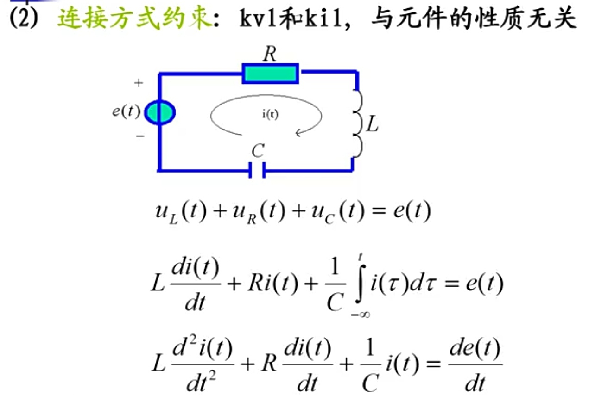
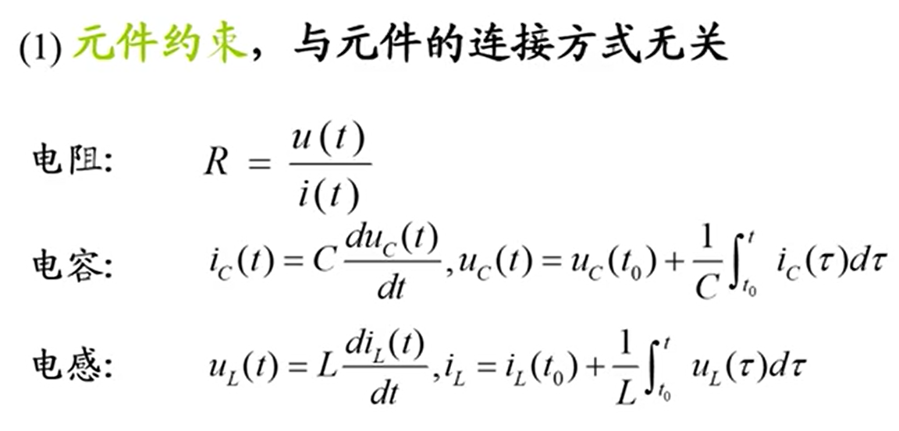
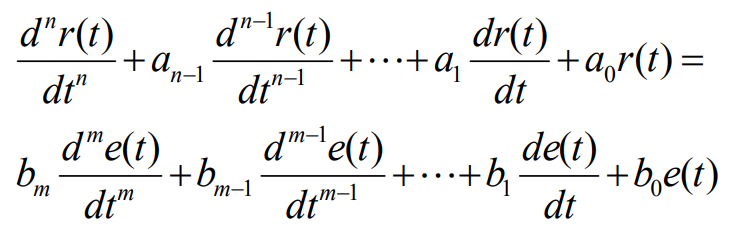
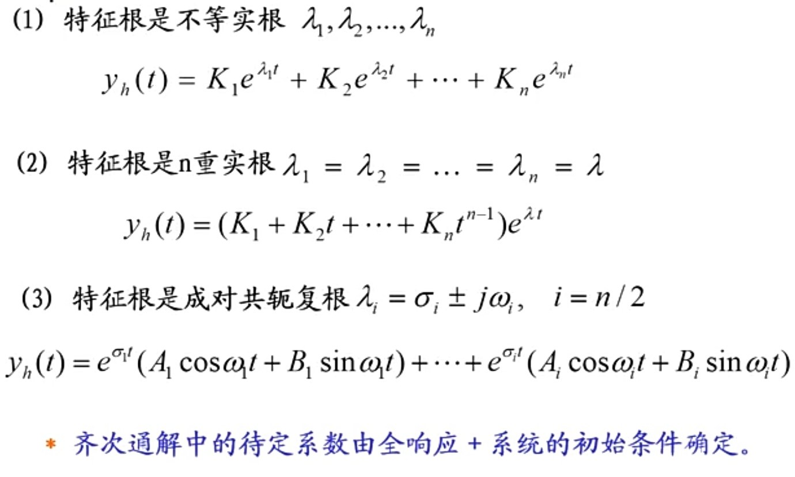
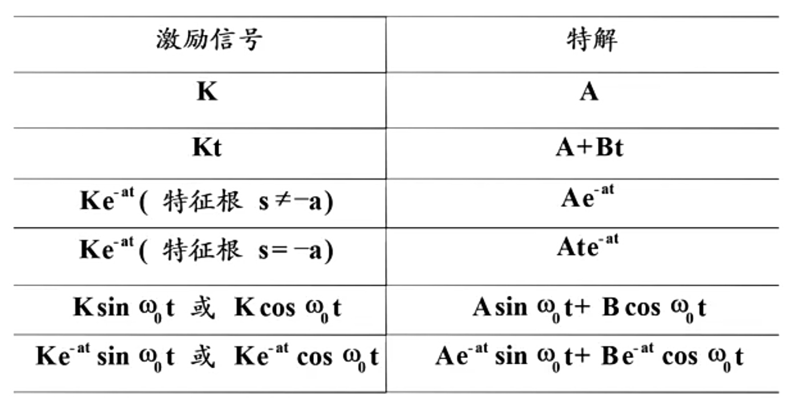
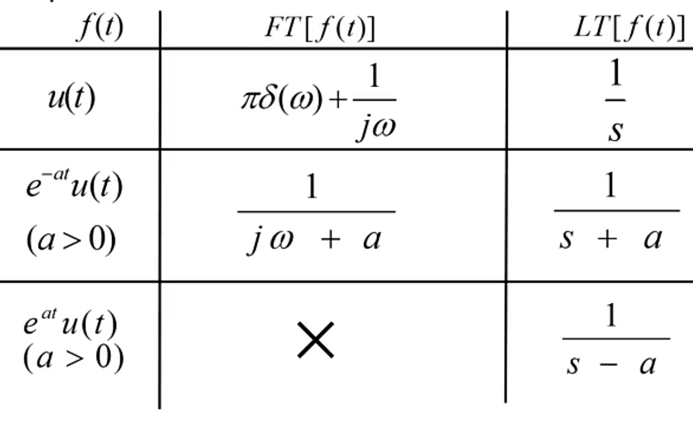

# 信号与线性系统

[TOC]

## 一、奇异信号与系统入门

### 1.斜变信号

- $R(x)=\left\{\begin{aligned}Kt\qquad t>0\\0\qquad t\leq 0\end{aligned} \right.$，当$K=1$时为单位斜变信号
- 切平的斜变信号$R(x)=\left\{\begin{aligned}0\qquad\qquad t\leq 0\\\frac{t}{\tau}\qquad 0<t<\tau\\1\qquad\qquad t\geq\tau\end{aligned} \right.$

### 2.单位阶跃信号

- $u(x)=\left\{\begin{aligned}0\qquad t\leq 0\\1\qquad t>0\\x\qquad t=0\end{aligned} \right.$，其中$t=0$处的值为不连续值，并不重要，这里取$x=\frac{1}{2}$
- 物理含义：突然接入的直流电压，$t=0$即为跳变点

### 3.矩形脉冲信号

- $G(t)=u(t)-u(t-\tau)$，表示从$0$到$\tau$的矩形脉冲信号，幅度为$1$
- 物理含义：突然接通又马上断开的脉冲电压

### 4.单位冲激信号（函数）

- 单位冲激信号的引入

  - 已知单位面积矩形脉冲信号为$\delta_{\tau}(x)=\frac{1}{\tau}[u(t+\frac{\tau}{2})-u(t-\frac{\tau}{2})]=\left\{\begin{aligned}\frac{1}{\tau}\qquad |t|<\frac{\tau}{2}\\0\qquad |t|\geq\frac{\tau}{2}\end{aligned} \right.$
  - 定义单位面积矩形脉冲信号的**矩形宽度趋于$0$时**的极限为**单位冲激信号（函数）**
  - 即$\delta(t)=\lim\limits_{\tau\rightarrow0}\frac{1}{\tau}[u(t+\frac{\tau}{2})-u(t-\frac{\tau}{2})]$
  - 单位面积不变，形状不同，当宽度趋于$0$时的极限**都是单位冲激信号**
  - $A\delta(t)$表示冲激信号的冲激强度为$A$

- 单位冲激信号的$Dirac$定义

  $\left\{\begin{aligned}&\delta(x)=\left\{\begin{aligned}0\qquad t\ne0\\\infty\qquad t=0\end{aligned} \right.\\&\\&\int_{-\infty}^{\infty}\delta(t)dt=1\end{aligned} \right.$

- 冲激信号是阶跃信号的广义导数
  - 对斜变信号$R_{\tau}(t)\left\{\begin{aligned}&0&t\leq 0\\&\frac{t}{\tau}+\frac{1}{2}&-\frac{\tau}{2}<t<\frac{\tau}{2}\\&1&t\geq\frac{\tau}{2}\end{aligned} \right.$求导数，可以得到对应的的单位矩形脉冲信号；
  - 当$\tau\rightarrow 0$时，斜变信号演变为<u>阶跃信号</u>，而对应的矩形脉冲信号将演变为<u>单位冲激信号</u>;
  - 因此称**冲激信号是阶跃信号的广义导数**，即$\delta(t)=\frac{du(t)}{dt}$；
  - 同理，$\delta(t)$积分得到$u(t)$，即$\int_{-\infty}^{t}\delta(\tau)d\tau=u(t)$；
  - $\delta(t)$表示信号在跳变量为$1$的跳变（不连续）点处的变化率。

- 冲激信号的特性

  - 微分积分

    $\delta(t)=\frac{du(t)}{dt}$

    $\int_{-\infty}^{t}\delta(\tau)d\tau=u(t)$

  - 平移性质

    $\delta(t)$经过平移后得到$\delta(t-t_0)$，其跳变点也变为$t=t_0$

  - 相乘性质

    $f(t)\delta(t-t_0)=f(t_0)\delta(t-t_0)$

  - 偶函数

    $\delta(t)=\delta(-t)$

  - 筛选性质

    $\int_{-\infty}^{+\infty}\delta(t-t_0)f(t)dt=\int_{-\infty}^{+\infty}\delta(t-t_0)f(t_0)dt=f(t_0)\int_{-\infty}^{+\infty}\delta(t-t_0)dt=f(t_0)$

  - 尺度变换性质

    $\delta(at)=\frac{1}{|a|}\delta(t)$

- 冲击偶信号(冲激函数的导数)

  - 设$\delta^{'}(t)=\frac{d}{dt}\delta(t)$，$\int_{-\infty}^{t}\delta^{'}(t)dt=\delta(t)$，则对矩形脉冲信号求导后，取极限$\tau\rightarrow0$，得到$\delta^{'}(t)$既是奇函数，又是偶函数，则$\int_{-\infty}^{+\infty}\delta^{'}(t)dt=0$

### 5.系统入门

- 由激励$e(t)$经过系统$h(t)$可得到响应$r(t)$
- 线性系统
  - 同时具有均匀性和叠加性
  - 均匀性：$ke(t)\rightarrow h(t)\rightarrow kr(t)$
  - 叠加性：$e_1(t)+e_2(t)\rightarrow h(t)\rightarrow r_1(t)+r_2(t)$
  - 线性性：$ae_1(t)+be_2(t)\rightarrow h(t)\rightarrow ar_1(t)+br_2(t)$
- 时不变性
  - 输出仅与输入有关，而与输入施加的时刻无关
  - 如果$e(t)\rightarrow r(t)$，则$e(t-t_0)\rightarrow r(t-t_0)$
- 增量线性
  - 增量线性系统：激励和响应的增量$\Delta r(t)$与$\Delta e(t)$之间满足线性关系
  - 如$r(t)=3+4e(t)$
- 系统响应的可分解性
  - 零输入响应$r_{zi}$：输入$e(t)=0$，仅由系统储能引起的响应
  - 零状态响应$r_{zs}$：$r(0)=0$，仅由输入$e(t)$引起的响应
  - 全响应：$r(t)=r_{zi}(t)+r_{zs}(t)$
  - **当系统具有<u>可分解性</u>，且同时具有<u>零状态线性</u>时即为线性系统**
- $LTI$系统：**线性时不变**系统
- 有始函数：在$t<0$时其值为$0$的函数

## 二、连续$LTI$系统的时域分析

> 分析$LTI$系统时，如果所涉及的函数变量均为时间$t$，则称为**时域分析**方法；
>
> 如果变换为其他变量，称为**变换域分析**方法。

### 1.经典解法

- 一般步骤

  - 根据系统，建立系统的微分方程
  - 求特征根得到齐次通解$y_h(t)$
  - 根据激励函数得到特解$y_p(t)$
  - 得到全响应表达式$y(t)=y_h(t)+y_p(t)$
  - 代入初始条件求齐次通解中的待定系统，最后求得全响应

- 建立微分方程

  - 根据连接方式约束，得到系统抽象表达式

    

  - 代入元件电气约束，得到微分方程

    

  - 微分方程的一般形式

    

    - 其中，$e(t)$为激励，$r(t)$为响应，$n$为系统方程的阶数

- 由齐次方程的特征根（自由频率）得到齐次解——自然响应

  

- 由激励信号的形式确定特解——受迫响应

  

- 得到全响应的表达式，代入初始条件，得到齐次通解中的待定系数，最后得到全响应

- 经典解法的不足之处

  - 微分方程右边的激励较复杂时，难以处理
  - 激励信号或初始条件发生变化时，需要重新求解
  - 无法突出系统响应的物理概念
  - 解决方法一：从响应的物理含义入手——卷积法
  - 解决方法二：使用变换域分析方法

### 2.卷积法

- 一般步骤

  - 根据系统，建立系统的微分方程
  - 求转移算子$H(p)$
  - 求特征根得到零输入响应$y_{zi}(t)$
  - 根据冲激响应$h(t)$得到零状态响应$y_{zs}(t)=e(t)*h(t)$
  - 得到全响应$y(t)=y_{zi}(t)+y_{zs}(t)$

- 转移算子

  - 设$p=\frac{d}{dt}$，$p^i=\frac{d^i}{dt^i}$，则微分方程可以写成$(p^n+a_{n-1}p^{n-1}+\cdots+a_1p+a_0)r(t)=(b_mp^m+b_{m-1}p^{m-1}+\cdots+b_1p+b_0)e(t)$
  - 记该微分方程为$D(p)r(t)=N(p)e(t)$，则$r(t)=\frac{N(p)}{D(p)}e(t)$
  - 称转移算子为$H(p)=\frac{N(p)}{D(p)}=\frac{b_mp^m+b_{m-1}p^{m-1}+\cdots+b_1p+b_0}{p^n+a_{n-1}p^{n-1}+\cdots+a_1p+a_0}$
  - 最终得到表达式$r(t)=H(p)e(t)$
  - 同样地，有积分算子$\frac{1}{p}()=\int_{-\infty}^{t}()d\tau$
  - 在分子分母中或在等式两边相同的算子符号不能随便消去

- 零输入响应

  - 由齐次方程$D(p)r(t)=(p^n+a_{n-1}p^{n-1}+\cdots+a_1p+a_0)r(t)=0$的特征根得到零输入响应的表达式
  - 代入初始条件，得到待定系数，从而求得零输入响应

- 零状态响应——叠加积分法

  1. 将任意输入转化为**冲激函数**的组合
    - 将任意一个信号分解为若干个脉冲分量之和
    - 当脉冲分量的$\Delta t\rightarrow 0$时，则可将该信号演化为冲激分量之和
    - 最后得到$e(t)=\int_{-\infty}^{\infty}e(\tau)\delta(t-\tau)d\tau$，这实际上是冲激信号的筛选性质
  2. 求单位冲激信号的响应
    - 对于$LTI$系统，**初始状态为零**，输入为**单位冲激信号**$\delta(t)$所引起的响应称为单位冲激响应；
    - 单位冲激响应简称<u>冲激响应</u>，用$h(t)$表示；
    - 相应地，由单位阶跃响应引起的零状态响应为单位阶跃响应；
    - 单位阶跃响应简称<u>阶跃响应</u>，用$r_{\varepsilon}(t)$表示，则有$r_{\varepsilon}(t)=\int_{-\infty}^{t}h(\tau)d\tau$，即可以通过冲激响应求得阶跃响应
    - 部分分式分解法
      - 在电气关系中，可根据积分算子将电容、电感等元件等效为**电阻**
        - 由$\frac{1}{C}\int_{-\infty}^{t}i(\tau)d\tau=e(t)$，得到$e(t)=\frac{1}{Cp}i(t)$，即电容等效为$\frac{1}{Cp}$
      - 将转移算子$H(p)$分解为部分分式
      - 代入激励为$\delta(t)$，响应为$h(t)$，求$H(p)$的各个分式的响应
      - 部分分式的响应的计算公式
        - $H(p)=\frac{k}{p-\lambda}\rightarrow h(t)=ke^{\lambda t}u(t)$
        - $H(p)=\frac{k}{(p-\lambda)^2}\rightarrow h(t)=kte^{\lambda t}u(t)$
        - $H(p)=\frac{k}{(p-\lambda)^n}\rightarrow h(t)=\frac{k}{(n-1)!}t^{n-1}e^{\lambda t}u(t)$
        - $H(p)=k\rightarrow h(t)=k\delta(t)$
        - $H(p)=kp^n\rightarrow h(t)=k\delta^{(n)}(t)$
  3. 由$e(t)=\int_{-\infty}^{\infty}e(\tau)\delta(t-\tau)d\tau$，得到$r_{zs}(t)=\int_{-\infty}^{\infty}e(\tau)h(t-\tau)d\tau$

- 卷积的定义

  - 称$r(t)=e(t)*h(t)=\int_{-\infty}^{\infty}e(\tau)h(t-\tau)d\tau$为$e(t)$和$h(t)$的卷积
  - 图解说明
    - 将自变量由$t$改为$\tau$
    - 将其中一个信号反转、向右平移$t$：$h(\tau)\rightarrow h(-\tau)\rightarrow h(t-\tau)$
    - 将二者相乘后积分

- 卷积的性质

  - 代数性质

    - 交换律：$f_1(t)*f_2(t)=f_2(t)*f_1(t)$
    - 分配律：$f_1(t)*[f_2(t)+f_3(t)]=f_1(t)*f_2(t)+f_1(t)*f_3(t)$
    - 结合律：$f_1(t)*[f_2(t)*f_3(t)]=[f_1(t)*f_2(t)]*f_3(t)$

  - 延时性质

    - 若$e(t)*h(t)=r(t)$，则$e(t-t_0)*h(t)=r(t-t_0)$
    - 若$e(t)*h(t)=r(t)$，则$e(t-t_1)*h(t-t_2)=r(t-t_1-t_2)$

  - 单位冲激信号的卷积特性

    - $f(t)*\delta(t)=f(t)$
    - $\delta(t)*\delta(t)=\delta(t)$
    - $f(t)*\delta(t-t_1)=f(t-t_1)$
    - $f(t-t_1)*\delta(t-t_2)=f(t-t_1-t_2)$
    - $e(t)*\delta^{'}(t)=e^{'}(t)$
  
  - 单位阶跃信号的卷积特性
  
    - $e(t)*u(t)=\int_{-\infty}^{t}e(\tau)d\tau$
    - $u(t)*u(t)=tu(t)$

  - 微积分性质

    - 两函数卷积的导数等于两函数之一的导数与另一函数相卷积

      $\frac{d}{dt}[f_1(t)*f_2(t)]=\frac{df_1(t)}{dt}*f_2(t)=f_1(t)*\frac{df_2(t)}{dt}$

    - 两函数卷积的积分等于两函数之一的积分与另一函数相卷积
  
      $\int_{-\infty}^{t}[f_1*f_2]dt=f_1(t)*\int_{-\infty}^{t}f_2(\tau)d\tau=\int_{-\infty}^{t}f_1(\tau)d\tau*f_2(t)$
  
    - 推广：$f_1*f_2=\frac{df_1(t)}{dt}*\int_{-\infty}^{t}f_2(\tau)d\tau$

### 3.两种解法的区别

- 零输入响应$\ne$自由响应
  - 自由响应由初始条件、外加激励共同决定；
  - 而零输入响应由初始条件决定，零输入响应是自由响应的一部分

- 零状态响应包含**<u>部分</u>**自然响应和受迫响应
- 零输入响应和零状态响应中的自然响应部分共同组成总的自然响应

## 三、傅里叶级数

### 1.傅里叶级数的理论基础

- 两信号正交的条件：$\int_{t_1}^{t_2}f(t)g(t)=0$

### 2.周期信号的傅里叶级数

- 任意周期信号都可表示为不同频率正弦信号（谐波）的加权和
- 三角形式
  - $f(t)=\frac{a_0}{2}+\sum\limits_{n=1}^{\infty}(a_n\cos(n\omega_1t)+b_n\sin(n\omega_1t))$，其中$w_1=\frac{2\pi}{T}$称为基波频率
  - 其中，$a_0=\frac{2}{T}\int_{t_1}^{t_1+T}f(t)dt$，$a_n=\frac{2}{T}\int_{t_1}^{t_1+T}f(t)\cos n\omega_1tdt$，$b_n=\frac{2}{T}\int_{t_1}^{t_1+T}f(t)\sin n\omega_1tdt$
  - 令$c_0=a_0$，$c_n=\sqrt{a_n^2+b_n^2}$，$\phi_n=a\arctan\frac{b_n}{a_n}$
  - 则$f(t)=c_0+\sum\limits_{n=1}^{\infty}c_n\cos(n\omega_1t+\phi_n)$
- 指数形式
  - 令$F_n=\frac{1}{2}c_ne^{j\phi_n}$，$F_{-n}=\frac{1}{2}c_ne^{-j\phi_n}$，也即$F_n=\frac{1}{T}\int_{T}f(t)e^{-jn\omega_1t}dt$
  - 则$f(t)=\sum\limits_{n=-\infty}^{\infty}F_ne^{jn\omega_1t}$
- 频谱图：每一条谱线表示某正弦分量的幅度或者相位，如果不加说明，一般表示幅度频谱
- 由$F_n=|F_n|e^{j\phi_n}$，可以得到幅度谱：幅度随频率的变化曲线，相位谱：相位随频率的变化曲线
- 周期矩形脉冲的频谱分析
  - $F_n=\frac{1}{T}\int_{-\frac{\tau}{2}}^{\frac{\tau}{2}}f(t)e^{-jn\omega_1t}dt=\frac{1}{T}\int_{-\frac{\tau}{2}}^{\frac{\tau}{2}}Ae^{-jn\omega_1t}dt=\frac{A\tau}{T}Sa(\frac{n\omega_1\tau}{2})$
  - 其中$Sa(x)=\frac{\sin x}{x}$，$F_n$表示复数振幅，当$n=0$时，$F_n=\frac{A\tau}{T}$
- 周期信号频谱的特点
  - 离散性：频谱是离散的，谱线间距为$\omega_1=\frac{2\pi}{T}$
  - 谐波性：谱线位于谐波频率上
  - 收敛性：频率越高，幅度越小
  - 对称性：正负频率的幅度相等，相位相反

### 3.非周期信号的傅里叶级数

- 非周期信号与周期信号的傅里叶变换

  - 非周期信号的傅里叶变换是周期信号傅里叶级数的极限情形
  - 此时频谱图上的相邻谱线的间距$\omega_1=\frac{2\pi}{T}$无限趋小，谱线无限密集，形成**连续频谱**

- 由傅里叶级数到傅里叶积分
  - 当$T\rightarrow \infty$时，$\omega_1=\frac{2\pi}{T}\rightarrow d\omega$，$n\omega_1\rightarrow\omega$
  - 正变换：$F(j\omega)=\lim\limits_{T\rightarrow\infty}TF_n=\lim\limits_{T\rightarrow\infty}\int_{-\frac{T}{2}}^{\frac{T}{2}}f(t)e^{-jn\omega_1t}dt=\int_{-\infty}^{\infty}f(t)e^{-j\omega t}dt$
  - 反变换：$f(t)=\lim\limits_{T\rightarrow\infty}\sum\limits_{n=-\infty}^{\infty}F_nTe^{jn\omega_1t}\frac{1}{T}=\frac{1}{2\pi}\int_{-\infty}^{\infty}F(j\omega)e^{j\omega t}d\omega$
  - 充分条件：$\int_{-\infty}^{\infty}|f(t)|dt<\infty$为$F(j\omega)$存在的充分条件
  - $F(j\omega)$称为**频谱密度函数**，简称频谱函数
  - 频谱函数的指数形式：$F(j\omega)=|F(j\omega)|e^{j\phi(\omega)}=a(\omega)+jb(\omega)$

- **傅里叶变换对**

  $\left\{\begin{aligned}&F(j\omega)=\int_{-\infty}^{\infty}f(t)e^{-j\omega t}dt\\&\\&f(t)=\frac{1}{2\pi}\int_{-\infty}^{\infty}F(j\omega)e^{j\omega t}d\omega\end{aligned} \right.$

- 傅里叶变换表

  |     名称     |                     函数                     |                       傅里叶变换                       |
  | :----------: | :------------------------------------------: | :----------------------------------------------------: |
  | 单位冲激信号 |                 $\delta(t)$                  |                          $1$                           |
  | 单位阶跃函数 |                    $u(t)$                    |         $\pi\delta(\omega)+\frac{1}{j\omega}$          |
  | 单位直流信号 |                     $1$                      |                  $2\pi\delta(\omega)$                  |
  |   脉冲信号   | $A[u(t+\frac{\tau}{2})-u(t-\frac{\tau}{2})]$ |            $A\tau Sa(\frac{\omega\tau}{2})$            |
  | 单边指数函数 |         $e^{-\alpha t}u(t),\alpha>0$         |               $\frac{1}{\alpha+j\omega}$               |
  |   指数脉冲   |             $te^{-\alpha t}u(t)$             |             $\frac{1}{(\alpha+j\omega)^2}$             |
  |   单位余弦   |              $\cos \omega_c t$               | $\pi[\delta(\omega+\omega_c)+\delta(\omega-\omega_c)]$ |
  |   单位正弦   |              $\sin \omega_c t$               | $\pi[\delta(\omega+\omega_c)-\delta(\omega-\omega_c)]$ |

- 非周期信号频谱的特点
  - 连续性：频谱是连续的
  - 相对性：各频率分量幅度是**频谱密度**，为相对大小
  - 收敛性：频率越高，幅度越小
  - 对称性：正负频率的幅度相等，相位相反

### 4.傅里叶变换的性质与应用

- 线性性：若$f_i(t)\leftrightarrow F_i(\omega)$，则$\sum\limits_{i=1}^{n}a_if_i(t)\leftrightarrow\sum\limits_{i=1}^{n}a_iF_i(\omega)$
- 对称性：若$f(t)\leftrightarrow F(\omega)$，则$F(t)\leftrightarrow 2\pi f(-\omega)$
  - 若$f(t)$为偶函数，则$F(t)\leftrightarrow 2\pi f(\omega)$，其时域和频域完全对称
  - 冲激信号和直流信号频谱具有对称性
- 尺度变换特性：若$f(t)\leftrightarrow F(\omega)$，则$f(at)\leftrightarrow\frac{1}{|a|}F(j\frac{\omega}{a})$
- 时移性：若$f(t)\leftrightarrow F(\omega)$，则$f(t-t_0)\leftrightarrow F(\omega)e^{-j\omega t_0}$，$f(at-t_0)\leftrightarrow \frac{1}{|a|}F(\frac{\omega}{a})e^{-j\frac{\omega t_0}{a}}$
- 频移性：若$f(t)\leftrightarrow F(\omega)$，则$f(t)e^{j\omega_0 t}\leftrightarrow F(\omega-\omega_0)$
  - 应用：调幅
- 卷积定理：
  - 时域卷积定理：$f_1(t)*f_2(t)\leftrightarrow F_1(\omega)\cdot F_2(\omega)$
  - 频域卷积定理：$f_1(t)\cdot f_2(t)\leftrightarrow \frac{1}{2\pi}F_1(\omega)* F_2(\omega)$
- 微分特性
  - 时域微分特性：$\frac{d^nf(t)}{dt^n}\leftrightarrow (j\omega)^n F(\omega)$
  - 频域微分特性：$(-jt)^nf(t)\leftrightarrow \frac{d^nF(\omega)}{d\omega^n}$
- 积分特性
  - 时域积分特性：$\int_{-\infty}^{t}f(\tau)d\tau\leftrightarrow \frac{1}{j\omega}F(j\omega)+\pi F(0)\delta(\omega)$

- $Paseval$恒等式：$\int_{-\infty}^{\infty}|f(t)|^2dt=\frac{1}{2\pi}\int_{-\infty}^{\infty}|F(\omega)|^2d\omega$

## 四、连续$LTI$系统的频域分析

### 1.频域分析方法

- **只能得到零状态响应**

- 设$e(t)\leftrightarrow E(j\omega)$，$r_{zs}(t)\leftrightarrow R(j\omega)$
- 定义频域的系统函数$H(j\omega)=\frac{R(j\omega)}{E(j\omega)}=|H(j\omega)|e^{j\phi(\omega)}$，称为**频率响应**
- 实际上有$h(t)\leftrightarrow H(j\omega)$
- 求解步骤
  - 将输入信号分解为正弦分量——求频谱$E(j\omega)$
  - 求频响$H(j\omega)$
  - 通过频响的公式求得零状态响应的频谱$R(j\omega)$
  - 由傅里叶反变换得到零状态响应$r_{zs}(t)$

### 2.理想低通滤波器

- 基本概念
  - 能使通带内频率成分均匀一致地通过，阻带内的频率成分都衰减为零的滤波器
  - 理想滤波器是**不存在**的
- 单位冲激响应：$h(t)=\frac{kw_c}{\pi}Sa[\omega_c(t-t_0)]$
- 单位阶跃响应：$r_u(t)=\frac{1}{2}+\frac{1}{\pi}Si(\omega_c t)$
  - $Si(y)=\int_{0}^{y}Sa(x)dx$
- 无失真传输的系统要求
  - 时域：$r(t)=ke(t-t_0)$——仅对输入作线性缩放和延时
  - 频域：$H(j\omega)=Ke^{-j\omega t_0}$
  - 得到幅频：$|H(j\omega)|=K$，相频：$\pi=-\omega t_0$

## 五、连续$LTI$系统的复频域分析

### 1.从傅里叶变换到拉氏变换

- 绝对可积的条件限制了傅里叶变换的应用，如$u(t)$的傅里叶级数不容易计算，$e^{at}u(t)$的傅里叶级数不存在（绝对可积意味着函数需要满足趋于无穷时函数衰减为$0$）

- 若乘一衰减因子$e^{-\sigma t}$，$\sigma$为任意实数，使得$f(t)e^{-\sigma t}$收敛，满足绝对可积条件，即可求傅里叶变换

- 拉普拉斯正变换$f(t)\rightarrow F(s)$

  - 由$FT[f(t)]=F(j\omega)=\int_{-\infty}^{\infty}f(t)e^{-j\omega t}dt$，得到$FT[e^{-\sigma t}f(t)]=\int_{-\infty}^{\infty}f(t)e^{-\sigma t}e^{-j\omega t}dt=\int_{-\infty}^{\infty}f(t)e^{-(\sigma+j\omega)t}dt$
  - 从而有$F(\sigma+j\omega)=\int_{-\infty}^{\infty}f(t)e^{-(\sigma+j\omega)t}dt$
  - 令$s=\sigma+j\omega$，则$F(s)=\int_{-\infty}^{\infty}f(t)e^{-st}dt$

- 拉普拉斯反变换：$f(t)=\frac{1}{2\pi j}\int_{-\infty}^{\infty}F(\sigma+j\omega)e^{(\sigma+j\omega)t}=\frac{1}{2\pi}\int_{\sigma-j\infty}^{\sigma+j\infty}F(s)e^{st}ds$

- 傅里叶变换是拉普拉斯变换在$\sigma=0$时的**特例**

### 2.拉普拉斯变换

- 双边拉普拉斯变换

  $\left\{\begin{aligned}&F(s)=\int_{-\infty}^{\infty}f(t)e^{-st}dt\\&f(t)=\frac{1}{2\pi}\int_{\sigma-j\infty}^{\sigma+j\infty}F(s)e^{st}ds\end{aligned} \right.$

- 单边拉普拉斯变换

  $\left\{\begin{aligned}&F(s)=\int_{0}^{\infty}f(t)e^{-st}dt\\&f(t)=[\frac{1}{2\pi}\int_{\sigma-j\infty}^{\sigma+j\infty}F(s)e^{st}ds]u(t)\end{aligned} \right.$

- 常见信号的双边拉氏变换

  |      函数       |             变换              |
  | :-------------: | :---------------------------: |
  |   $\delta(t)$   |              $1$              |
  |     $u(t)$      |         $\frac{1}{s}$         |
  |  $e^{at}u(t)$   |        $\frac{1}{s-a}$        |
  |     $tu(t)$     |        $\frac{1}{s^2}$        |
  |  $te^{at}u(t)$  |      $\frac{1}{(s-a)^2}$      |
  | $\sin\omega t$  | $\frac{\omega}{s^2+\omega^2}$ |
  | $\cos \omega t$ |   $\frac{s}{s^2+\omega^2}$    |

- $t<0$区间的函数值与单边拉普拉斯变换的结果无关

  $LT^{-1}[\frac{1}{s+\alpha}]=e^{-\alpha t}u(t)$

- 单边拉普拉斯变换下限从$0^{-}$开始

### 3.拉普拉斯变换的收敛区

- 不是所有的函数均可使用$e^{-\sigma t}$使其满足绝对可积条件

- 把$f(t)e^{-\sigma t}$满足绝对可积的$\sigma$值的范围称为**收敛区**

- 定义指数阶函数：存在$\sigma_0$，当$\sigma<\sigma_0$时，$\lim\limits_{t\rightarrow\infty}f(t)e^{-\sigma t}=0$

- 定义分段连续：除有限个不连续点外函数是连续的，且时间由间断点两侧趋于间断点时，函数有有限的极限值

- 当$f(t)$是指数阶函数，且分段连续，则其单边拉氏变换存在

- 收敛区：$\sigma>\sigma_0$

- 傅里叶变换与拉氏变换的对比

  

  - 当$\sigma_0>0$时，傅里叶变换不存在，拉氏变换存在；
  - 当$\sigma_0<0$时，傅里叶变换和拉氏变换均存在，并且可以通过$s=\sigma+j\omega$转换二者；
  - 当$\sigma_0=0$时，傅里叶变换和拉氏变换均存在，但是不可以通过$s=\sigma+j\omega$转换二者，要包含奇异级数项

### 4.拉普拉斯变换的计算

- 拉普拉斯反变换

  - 部分分式分解法

    设$F(s)=\frac{N(s)}{D(s)}=\frac{b_ms^m+b_{m-1}s^{m-1}+\cdots+b_1s+b_0}{s^n+a_{n-1}s^{n-1}+\cdots+a_1s+a_0}$

    - 若$D(s)=0$无重根
      - $F(s)=\frac{N(s)}{D(s)}=\frac{N(s)}{(s-s_1)(s-s_2)\cdots(s-s_k)\cdots(s-s_n)}$$=\frac{K_1}{s-s_1}+\frac{K_2}{s-s_2}+\cdots+\frac{K_k}{s-s_k}+\cdots+\frac{K_n}{s-s_n}$
      - 从而得到$K_k=[(s-s_k)\frac{N(s)}{D(s)}]_{s=s_k}$或者$K_k=[\frac{N(s)}{D^{'}(s)}]_{s=s_k}$
      - 得到$f(t)=LT^{-1}[F(s)]=\sum\limits_{i=1}^{n}K_ie^{s_it}u(t)$
    - 若$D(s)=0$有重根
      - 重根项的部分分式系数为$K_{1k}=\frac{1}{(p-k)!}\frac{d^{p-k}}{ds^{p-k}}[(s-s_1)^p\frac{R(s)}{D(s)}]_{s=s_1}$

  - 留数法

    - 令$D(s)=0$，得到极点
    - 若$s_k$为一阶极点，则留数为$Res_k=[(s-s_k)F(s)e^{st}]_{s=s_k}$
    - 若$s_k$为$p$阶极点，则留数为$Res_k=\frac{1}{(p-1)!}[\frac{d^{p-1}}{ds^{p-1}}(s-s_k)^pF(s)e^{st}]_{s=s_k}$
    - 得到$f(t)=\sum\limits_{i=1}^{n}Res_iu(t)$

- 极零图

  - 令分子$N(s)=0$得到零点，令分母$D(s)=0$得到极点

### 5.拉普拉斯变换的性质

- 线性性：若$f_i(t)\leftrightarrow F_i(s)$，则$\sum\limits_{i=1}^{n}a_if_i(t)\leftrightarrow\sum\limits_{i=1}^{n}a_iF_i(s)$
- 尺度变换特性：若$f(t)\leftrightarrow F(s)$，则$f(at)\leftrightarrow\frac{1}{|a|}F(\frac{s}{a})$
- 时移性：若$f(t)\leftrightarrow F(s)$，则$f(t-t_0)\leftrightarrow F(s)e^{-st_0}$
- 频移性：若$f(t)\leftrightarrow F(s)$，则$f(t)e^{s_0t}\leftrightarrow f(s-s_0)$
- 卷积定理：
  - 时域卷积定理：$f_1(t)*f_2(t)\leftrightarrow F_1(s)\cdot F_2(s)$
  - 频域卷积定理：$f_1(t)\cdot f_2(t)\leftrightarrow \frac{1}{2\pi j}F_1(s)* F_2(s)$
- 微分特性
  - 时域微分特性：$\frac{df(t)}{dt}\leftrightarrow sF(s)-f(0^-)$
  - 时域微分特性推广：$\frac{d^nf(t)}{dt^n}\leftrightarrow s^nF(s)-s^{n-1}f(0^-)-s^{n-2}f^{'}(0^-)-\cdots-f^{(n-1)}(0^-)$
  - 频域微分特性：$tf(t)\leftrightarrow -\frac{dF(s)}{ds}$
- 积分特性
  - 时域积分特性：$\int_{0}^{t}f(\tau)d\tau\leftrightarrow \frac{F(s)}{s}+\frac{\int_{-\infty}^{0}f(\tau)d\tau}{s}$
  - 频域积分特性：$\frac{f(t)}{t}\leftrightarrow\int_{s}^{\infty}F(s)ds$
- 初值定理：$f(0^+)=\lim\limits_{t\rightarrow0^+}f(t)=\lim\limits_{s\rightarrow\infty}sF(s)$
- 终值定理：$f(\infty)=\lim\limits_{t\rightarrow\infty}f(t)=\lim\limits_{s\rightarrow0}sF(s)$

### 6.线性系统的拉普拉斯变换分析

- 全响应
  - 对微分方程的两边分别求拉普拉斯变换，可得到响应$R(s)$的表达式，然后经过反变换即可得到$r(t)$
- 零输入/零状态响应
  - 由齐次方程求拉普拉斯变换得到零输入响应表达式，代入初始条件即可
  - 由微分方程求拉普拉斯变换得到零状态响应表达式，由初始状态为$0$，得到$R_{zs}(s)$
    - $R_{zs}(s)=H(s)E(s)$，其中$H(s)$称为$s$域系统函数
    - 由$r_{zs}(t)=h(t)*e(t)$，两边求拉普拉斯变换即可得到上式
    - 这个特性经常被用于求解冲激响应

### 7.系统的极零图与频率特性的关系

- $H(s)=H_0\frac{(s-z_1)(s-z_2)\cdots(s-z_m)}{(s-p_1)(s-p_2)\cdots(s-p_n)}$
- 将负数$s$、$z_1$或$p_1$表示为复平面上的矢量，则每个因式可以表示为两矢量之差，记作$s-p=Ae^{j\alpha}$，其中$A=|s-p|$表示矢量的模，$e^{j\alpha}$表示矢量与实轴的夹角
- 当$s=j\omega$时，即$s$位于虚轴上，此时$H(s)|_{s=j\omega}=H_0\frac{(j\omega-z_1)(j\omega-z_2)\cdots(j\omega-z_m)}{(j\omega-p_1)(j\omega-p_2)\cdots(j\omega-p_n)}$，将分母因式记为$Ae^{j\alpha}$，称为极点矢量，分子因式记为$Be^{j\beta}$，称为零点矢量，即$H(j\omega)=H_0\frac{\prod\limits_{i=1}^{m}B_i}{\prod\limits_{k=1}^{n}A_k}e^{j(\sum\limits_{i=1}^{m}\beta_i-\sum\limits_{k=1}^{n}\alpha_k)}=|H(j\omega)|e^{j\phi(\omega)}$
- 可见，幅频特性等于零点矢量模的乘积除以极点矢量模的乘积，再乘以系统增益$H_0$
- 相频特性等于零点矢量的相角和减去极点矢量的相角和

#### 8.系统的稳定性

- 系统的稳定性：$\int_{-\infty}^{\infty}|h(t)|<\infty$
- 特别的，因果系统的稳定性：$\int_{0}^{\infty}|h(t)|<\infty$，或者系统函数的所有极点全部位于$s$平面的左半开平面

## 五、离散$LTI$系统的时域分析

### 1.从连续到离散

- 离散时间信号的表示：序列形式$f(n)$，表格形式，图形形式，闭合表达式
- 离散序列
  - 单位样值信号、离散单位阶跃序列，离散矩形序列、斜边序列、指数序列
  - 正弦序列：$x(n)=A\sin(\Omega_0nT_s)=A\sin(\omega_0n)$，其中$\omega_0=\Omega_0T_s=\frac{\Omega_0}{f}$
  - 任意离散序列：$x(n)=\sum\limits_{m=-\infty}^{\infty}x(m)\delta(n-m)$
  - 任意离散序列可以分解为单位样值信号的组合
- 离散序列的分类
  - 双边序列：$f(k)$对所有$k$均有取值
  - 单边序列：$f(k)$对部分$k$（无穷个）有取值
  - 时限序列：$f(k)$仅在$N_1\leq k\leq N_2$（有限个）有取值
- 序列的移位
  - 右移：$f(k-1)=Df(k)$，即$f(k-m)=D^mf(k)$
  - 左移：$f(k+1)=Ef(k)$，即$f(k+m)=E^mf(k)$
  - 称$D$为滞后算子，$E$为超前算子
- 序列的差分
  - 前向差分：$y(n)=\Delta x(n)=x(n+1)-x(n)$
  - 后向差分：$y(n)=\nabla x(n)=x(n)-x(n-1)$
- $x(an)$为序列压缩，$x(\frac{a}{n})$为序列扩散
- 连续时间信号的离散化
  - 将$f(t)$以时间间隔$T$进行离散化，则得到序列$f(kT)$
  - 在冲激信号序列$\delta_T(t)$的作用下，得到$f(t)$的理想抽样信号$f_{\delta}(t)$
  - 设$f(t)$的频谱的频带为$-\omega_m\leq\omega\leq\omega_m$
  - 设抽样角频率为$\omega_s=\frac{2\pi}{T_s}$，则周期冲激信号序列$p(t)$的傅里叶变换为$p(\omega)=2\pi\sum\limits_{n=-\infty}^{\infty}P_n\delta(\omega-n\omega_s)$
  - 其中$P_n=\frac{1}{T_s}$表示$\delta_T(t)$的傅里叶级数展开系数，由此$p(\omega)=\omega_s\sum\limits_{n=-\infty}^{\infty}\delta(\omega-n\omega_s)$
  - 这样，为了避免发生频谱混叠，需要使得$\omega_s\geq2\omega_m$，即抽样间隔满足$T_s\leq\frac{\pi}{\omega_m}$
  - 恢复原始信号$f(t)$
    - 设$f(t)\leftrightarrow F(\omega)$，$f_s(t)\leftrightarrow F_s(\omega)$
    - 当$F_s(\omega)$通过截止频率为$\omega_c$的理想低通滤波器时，滤波器的响应频谱为$F(\omega)$
    - 即滤波器的作用等效为$H(\omega)$同$F_s(\omega)$相乘

### 2.离散时间系统

- 输入输出均为离散时间信号的系统：$y(n)=T[x(n)]$
- 离散时间系统方程的建立——差分方程
  - 差分方程的阶：未知序列变量序号最高与最低值之差
  - 系统模型是输入输出的移序及其加权和间的等式
  - 系统模型通式：$y(n)=-\sum\limits_{k=1}^{N}a_ky(n-k)+\sum\limits_{r=0}^{M}b_rx(n-r)$
  - 从微分方程到差分方程
    - 取近似：$\frac{dy(t)}{dt}\approx\frac{y(n+1)-y(n)}{T_s}$
    - 转换为系统模型通式
- 离散时间系统的响应：求解差分方程
  - 迭代法：令$n=0,1,\cdots,k$，由数学归纳法得到$y(n)$表达式

### 3.线性差分方程的经典解法

- 全解$=$齐次解$+$特解
- 通式：$\sum\limits_{k=0}^{N}a_ky(n-k)=\sum\limits_{r=0}^{M}b_rx(n-r)$
- 齐次解
  - 齐次方程：$\sum\limits_{k=0}^{N}a_ky(n-k)=0$
  - 特征方程：$\sum\limits_{k=0}^{N}a_k\alpha^{N-k}=0$
  - 特征根：$\alpha^j$，$j=1,2,\cdots,N$
    - 不等实根：$y_h[n]=\sum\limits_{k=1}^{N}C_k\alpha_k^n$
    - $K$重根：$y_h[n]=\sum\limits_{r=1}^{K}C_rn^{r-1}\alpha^n$
    - 成对共轭复根：若$\alpha_{1,2}=a\pm jb=\rho e^{\pm j\Omega_0}$，则$y_h[n]=C_1\rho^n\cos n\Omega_0+C_2\rho^n\sin n\Omega_0$
- 特解
  - 强迫项为$n^k$多项式，$y_p[n]=\sum\limits_{r=0}^{k}D_rn^r$
  - 强迫项含有$\alpha^n$且$\alpha$不是齐次方程特征根，$y_p[n]=D\alpha^n$
  - 强迫项含有$\alpha^n$且$\alpha$是齐次方程单重特征根，$y_p[n]=(D_1n+D_2)\alpha^n$
  - 强迫项含有$\alpha^n$且$\alpha$是齐次方程$K$重特征根，$y_p[n]=(\sum\limits_{r=0}^{K}D_rn^r)\alpha^n$

### 4.线性差分方程的<u>卷积和</u>解法

#### (1)求单位样值响应

- 确定单位样值信号输入系统引起的状态改变
- 求齐次方程的齐次解
- 根据初始条件确定系数，得到单位样值响应$h[n]$

#### (2)卷积和法

- 由$x(n)=\sum\limits_{m=-\infty}^{\infty}x(m)\delta(n-m)$，得到$y_{zs}(n)=\sum\limits_{m=-\infty}^{\infty}x(m)h(n-m)$

- 简记为$y_{zs}(n)=x(n)*h(n)$，此即为卷积和

- 卷积和满足分配律、结合律、交换律

- 卷积和的差分
  - $\Delta y(k)=\Delta e(k)*h(k)=e(k)*\Delta h(k)$
  - $\nabla y(k)=\nabla e(k)*h(k)=e(k)*\nabla h(k)$
  
- 单位样值序列的卷积和**类似**连续系统的卷积

- 卷积和表

  |        $f_1(k)$        |        $f_2(k)$        |                       $f_1(k)*f_2(k)$                        |
  | :--------------------: | :--------------------: | :----------------------------------------------------------: |
  |      $\delta(k)$       |         $f(k)$         |                            $f(k)$                            |
  |         $u(k)$         |         $u(k)$         |                         $(k+1)u(k)$                          |
  |       $v^ku(k)$        |         $u(k)$         |                 $\frac{1-v^{k+1}}{1-v}u(k)$                  |
  |       $v^ku(k)$        |       $v^ku(k)$        |                        $(k+1)v^ku(k)$                        |
  |      $v_1^ku(k)$       |      $v_2^ku(k)$       |          $\frac{v_1^{k+1}-v_2^{k+1}}{v_1-v_2}u(k)$           |
  |  $e^{\lambda kT}u(k)$  |         $u(k)$         |      $\frac{1-e^{\lambda(k+1)T}}{1-e^{\lambda T}}u(k)$       |
  | $e^{\lambda_1 kT}u(k)$ | $e^{\lambda_2 kT}u(k)$ | $\frac{e_1^{\lambda(k+1)T}-e_2^{\lambda(k+1)T}}{e_1^{\lambda T}-e_2^{\lambda T}}u(k)$ |
  |  $e^{\lambda kT}u(k)$  |  $e^{\lambda kT}u(k)$  |                  $(k+1)e^{\lambda kT}u(k)$                   |

## 六、离散$LTI$系统的变换域分析

### 1.从拉氏变换到$z$变换

- 对$x(t)$进行理想抽样，则$x_s(t)=x(t)\delta_T(t)=\sum\limits_{n=0}^{\infty}x(nT)\delta(t-nT)$
- 对其进行单边拉氏变换，$\int_{0}^{\infty}x_s(t)e^{-st}dt=\sum\limits_{n=0}^{\infty}x(nT)e^{-snT}$
- 令$z=e^{sT}$，$T=1$，则$X(z)=\sum\limits_{n=0}^{\infty}x(n)z^{-n}$，称之为单边$z$变换公式
- 双边$z$变换公式：$X(z)=\sum\limits_{n=-\infty}^{\infty}x(n)z^{-n}$

### 2.双边$z$变换

- 收敛区的定义
  - $z$变换的收敛区：对序列$x(n)$，使得$\sum\limits_{n=-\infty}^{\infty}x(n)z^{-n}$收敛的$z$值的集合
  - 收敛的充分条件：绝对可和，即$\sum\limits_{n=-\infty}^{\infty}x(n)z^{-n}<\infty$

- 判别方法
  - 比值判别法：$\lim\limits_{n\rightarrow\infty}|\frac{a_{n+1}}{a_n}|=\rho<1$时收敛，$>1$时发散，$=1$时不能确定
  - 根式判别法：$\lim\limits_{n\rightarrow\infty}\sqrt[n]{|a_n|}=\rho<1$时收敛，$>1$时发散，$=1$时不能确定

- 不同序列的收敛区
  - 有限长序列
    - 除了$n_1\leq0$时$z=\infty$和$n_2\geq0$时$z=0$外，所有$z$值均收敛
    - 收敛区为$0<|z|<\infty$
    - $0$和$\infty$处需要另行判断
  - 右边序列(有始序列、单边序列)
    - $n\geq n_1$时$x(n)=x(n)$，否则$x(n)=0$
    - 其$z$变换为$F(z)=\sum\limits_{n=n_1}^{\infty}x(n)z^{-n}$
    - 使用根式判别法判断，其收敛区为以原点为圆心的圆的**圆外**
  - 左边序列
    - $n\leq n_1$时$x(n)=x(n)$，否则$x(n)=0$
    - 其$z$变换为$F(z)=\sum\limits_{n=-\infty}^{n_1}x(n)z^{-n}$
    - 使用根式判别法判断，其收敛区为以原点为圆心的圆的**圆内**
  - 双边序列
    - 其$z$变换为$F(z)=\sum\limits_{n=0}^{\infty}x(n)z^{-n}+\sum\limits_{n=-\infty}^{-1}x(n)z^{-n}$
    - 其收敛区为左右序列的收敛区的公共部分

- $z$变换表

  |            函数            |            变换             |
  | :------------------------: | :-------------------------: |
  |        $\delta(k)$         |             $1$             |
  |           $u(k)$           |       $\frac{z}{z-1}$       |
  |         $v^ku(k)$          |       $\frac{z}{z-v}$       |
  |      $v^{k-1}u(k-1)$       |       $\frac{1}{z-v}$       |
  |    $e^{\lambda kT}u(k)$    | $\frac{z}{z-e^{\lambda T}}$ |
  | $e^{\lambda (k-1)T}u(k-1)$ | $\frac{1}{z-e^{\lambda T}}$ |
  |          $ku(k)$           |     $\frac{z}{(z-1)^2}$     |

### 3.$z$变换的性质

- 线性性
- 移序性质
  - $f(n+k)\leftrightarrow z^k[F(z)-\sum\limits_{i=0}^{k-1}f(i)z^{-i}],k>0$
  - $f(n+k)\leftrightarrow z^k[F(z)-\sum\limits_{i=k}^{-1}f(i)z^{-i}],k<0$
- 尺度变换：$a^kf(k)\leftrightarrow F(\frac{z}{a})$
- 微分性质：$kf(k)\leftrightarrow-z\frac{d}{dz}F(z)$
- 卷积定理：$f_1(z)*f_2(z)\leftrightarrow F_1(z)F_2(z)$
- 初值和终值定理：$f(0)=\lim\limits_{z\rightarrow\infty}F(z)$，$\lim\limits_{k\rightarrow\infty}f(k)=\lim\limits_{z\rightarrow1}(z-1)F(z)$

### 4.反$z$变换

