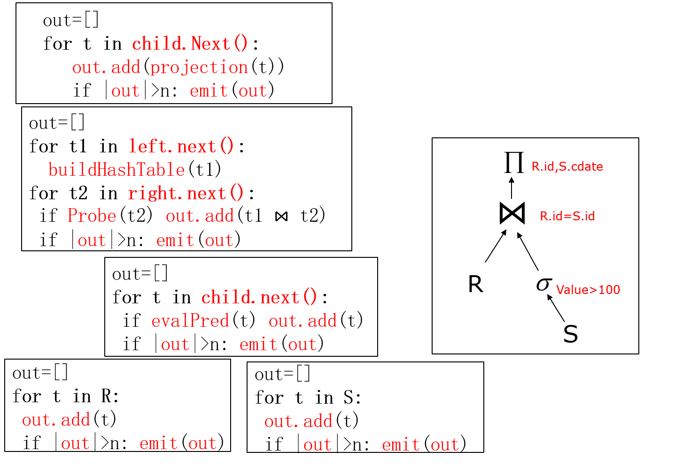

[TOC]

# 一、绪论

## 1.1 数据模型

### 1.1.1 数据模型概述

- 数据模型是严格定义的一组概念，精确的描述了系统的静态特性、动态特性和完整性约束
- 组成要素
  - 数据结构：描述系统的**静态特性**，即组成数据库的对象类型
  - 数据操作：描述系统的**动态特性**，即对数据库中对象的实例允许执行的操作的集合，包括操作及操作规则
  - 数据的约束条件：数据的约束条件是**完整性规则**的集合，规定数据库状态及状态变化所应满足的条件，以保证数据的正确、有效
- 类型
  - 概念模型
  - 层次模型
  - 网状模型
  - 关系模型

### 1.1.2 实体-联系模型（E-R模型）

- 基本概念
  - 世界是由一组称作**实体**的基本对象和这些对象之间的**联系**构成的
  - 实体(Entity)：客观存在并可相互区别的人、事物、事件和概念
  - 属性(Attribute)：实体具有的特性
  - 码(Key、实体标识符)：唯一标识实体的属性集
  - 域(Domain)：属性的取值范围
  - 实体型(Entity Type)：用实体名及其属性名集合来抽象刻画同类实体
  - 实体集(Entity Set)：同型实体的集合，如全体学生，全部的系
  - 联系(Relationship)：实体(型)内部的联系(组成实体的各属性间)；实体(型)之间的联系(不同的实体集之间)
- 图形表示
  - 矩形框 – 实体型
  - 菱形框 – 联系类型
  - 椭圆形框 – 实体型/联系类型的属性
  - 直线 – 实体型与联系之间用直线相连，线旁标注联系的种类(1:1, 1:N, M:N)
  - 实体集属性中**作为主码的一部分的属性用下划线**来标明
  - 在1:N的联系中，联系集的主码是n端的主码

### 1.1.3 由E-R图到数据库设计

- E-R图的设计要点
  - 确定实体：实体名、实体属性、实体码
  - 确定联系：存在性联系、功能性联系、事件联系
- E-R图向关系模型的转换
  - 实体→关系
  - 属性→关系的属性
  - 一对一联系→新的关系，属性为双方的码
  - 一对一联系→与某一端关系合并，合并后在该端加入另一端关系的码和联系本身的属性，其码不变
  - 多对多联系→新的关系，其属性为与该联系相连的各实体的码以及联系本身的属性，其码是与该联系相连的各实体的码的组合
  - 一对多联系→新的关系，其属性为与该联系相连的各实体的码以及联系本身的属性，其码是**n端实体的码**
  - 一对多联系→与n端关系合并，合并后在n端关系加入1端关系的码和联系本身的属性，**n端关系的码不变**
  - 三个或三个以上实体间的多元联系→新的关系，其属性为与该多元联系相连的各实体的码以及联系本身的属性，其码是与该联系相连的各实体的码的组合
  - 合并具有相同码的关系模式，并去除同义属性
- 从关系模型到数据库实施
  - 定义数据库结构：表结构、视图
  - 装载数据
  - 编制与调试应用程序
  - 数据库试运行
  - 数据库运行与维护

### 1.1.4 关系模型

- 关系模型使用二维表来表示实体及其联系：行、列

  - 用表格表示实体集，用列表示属性，表结构表示实体的型
  - 用表间的特定冗余信息表示实体间的联系(主键、外键)
  - 行、列无序
  - 列不可再分

- 关系模型中的概念

  

  - 关系：即通常说的表，用于表示实体以及实体间的联系
  - 元组：表中的一行即为一个元组
  - 属性：表中的一列即为一个属性
  - 主码(key)：图中的某个属性组，它可以唯一确定一个元组
  - 域(domain)：属性的取值范围
  - 分量：元组中的一个属性值
  - 关系模式：对关系的描述，一般表示为：关系名(属性1，属性2，…，属性n)

## 1.2 数据库系统

- 数据库系统：由应用程序、DBMS、操作系统、硬件、人员（数据库管理员DBA）组成
- 数据库管理系统DBMS
  - DB定义
  - 操纵语言及编译程序
  - DB运行控制程序
  - 实用程序

# 二、关系数据库

## 2.1 关系数据结构

- 域：一组值的集合，这组值具有相同的数据类型
- 笛卡尔积
  - 一组域$D_1,D_2,\cdots,D_n$的笛卡尔积为：$D_1\times D_2\times\cdots\times D_n = \{(d_1 , d_2 , \cdots, d_n) | d_i∈D_i , i=1,\cdots,n\}$
  - 笛卡尔积的每个元素$(d_1,d_2,\cdots,d_n)$称作一个$n$元组
  - 元组的每个值$d_i$称为一个分量
  - 若$D_i$的基数为$m_i$，则笛卡尔积的基数为$\prod\limits_{i=1}^{n}m_i$
- 关系
  - 笛卡尔积$D_1\times D_2\times\cdots\times D_n$的子集叫做在域$D_1,D_2,\cdots,D_n$上的关系，用$R(D_1 , D_2 ,\cdots, D_n )$表示
  - 关系是笛卡尔积中有意义的子集
- 候选码
  - 关系中的一个属性组，其值能唯一标识一个元组。
  - 若从该属性组中去掉任何一个属性，它就不具有这一性质
- 主属性：任何一个候选码中的属性称作主属性
- 主码：从一个关系的多个候选码中选定一个作为主码
- 外部码：关系R中的一个属性组，它不是R的码，但它与另一个关系S的码相对应，则称这个属性组为R的外部码
- 关系模式
  - 关系的描述称作关系模式，包括关系名、关系中的属性名、属性向域的映象、属性间的数据依赖关系等
  - 关系模式是一个5元组$R(U,D,Dom，F)$，其中R是关系名；U是关系的属性集合；D是U中属性所来自的域的集合；DOM是属性向域映射的集合；F是属性间的依赖关系集合
- 关系数据库
  - 在一个应用领域内，用关系表示实体及其联系，关系的集合构成一个关系数据库
  - 其型是关系模式的集合，即数据库描述，称作数据库的**内涵**(Intension)
  - 其值是某一时刻关系的集合，称作数据库的**外延**(Extension)

## 2.2 关系的完整性

- 实体完整性：若属性A是基本关系R的主属性，则A不能取空值
- 参照完整性：如果关系$R_2$的外部码$F_k$与关系$R_1$的主码$P_k$相对应，则$R_2$中的每一个元组的$F_k$值或者等于$R_1$中某个元组的$P_k$值，或者为空值
- 用户定义的完整性:用户针对具体的应用环境定义的完整性约束条件

## 2.3 关系代数

- 关系代数是一种抽象的查询语言，通过对关系的运算来表达查询操作

- 基本概念

  - 如果两个关系的属性数目相同，且各属性的域相同，则两个关系是相容的
  - 元组的连串：若$r=(r_1,r_2,\cdots,r_n)$，$s=(s_1,s_2,\cdots,s_n)$则定义二者的连串$\widehat{AB}=(r_1,r_2,\cdots,r_n,s_1,s_2,\cdots,s_n)$
  - 给定关系模式$R(A_1 , A_2 ,\cdots, A_n)$，设$R$是它的一个具体的关系，$t\in R$是关系的一个元组
    - $A=\{A_{i1},A_{i2},\cdots,A_{ik}\}\sube{A_a,A_2,\cdots,A_n}$是**属性列**，$\overline{A}$表示${A_1,A_2,\cdots,A_n}$去掉$A$后剩余的属性组
    - $t[A_i]$表示元组$t$中相应于属性$A_i$的一个**分量**
    - $t[A]=\{t[A_{i1}],t[A_{i2}],\cdots,t[A_{ik}]\}$表示元组$t$在属性列$A$上各分量的集合
    - 给定关系$R(X,Z)$，$X$和$Z$为属性组。当$t[X]=x$时，$x$在$R$中的**象集**为：$Z_X=\{t[Z]|t∈ R,t[X]=x\}$ ,它表示$R$中属性组$X$上值为$x$的诸元组在$Z$上分量的集合

- 集合运算符（进行集合运算的两个关系必须相容）：并$\cup$、交$\cap$、差$-$

- 关系运算符

  - 笛卡尔积$\times$

    - 设两个关系R，S，其度分别为n，m，则它们的广义笛卡尔积为$R\times S=\{\widehat{rs}|r\in R\land s\in S\}$

  - 选择$\sigma$

    - $\sigma_F(R)=\{t|t\in R\land F(t)=true\}$
    - 即$\sigma$运算的结果为满足条件F的元组集合

  - 投影$\Pi$

    - $\Pi_A(R)=\{t[A]|t\in R\}$，其中$A$为$R$的属性列
    - 投影结果中要去掉相同的行

  - 连接$\Join$

    - $R\underset{A\Theta B}\Join S=\{\widehat{rs}|r\in R\land s\in S\land r[A]\Theta S[B]\}$

    - $R\underset{A\Theta B}\Join S=\sigma_{R[A]\Theta S[B]}(R\times S)$

    - 即从两个关系的笛卡尔积中选取给定属性间满足一定条件的元组
    - 等值连接：从两个关系的广义笛卡儿积中选取满足某一等值条件的元组，两个关系**可以没有相同属性列**
    - 自然连接：**特殊的等值连接**，从两个关系的广义笛卡儿积中选取在**相同属性列**上取值相等的元组，并**去掉重复的列**

  - 除$÷$

    - 设有关系$R(X,Y)$和$S(Y,Z)$，则$R÷Z$可根据如下过程得到
    - 在关系$S$中对$Y$做投影，得到$\Pi_Y(Z)$
    - 关系$R$在属性列$X$上作取消重复值的投影，得到$\Pi_X(R)$
    - 判断$\Pi_X(R)$中$x_i$的象集$Y_i$是否包含$\Pi_Y(Z)$，如果包含，则最终结果中包含$x_i$
    - 即$R÷Z$表示【$R$在$X$上分量值$x$的象集$Y_x$包含$S$在$Y$上投影的集合】在$X$属性列上的投影

- 比较运算符：<、≤、＞、≥、≠、=

- 逻辑运算符：与$\land$、或$\lor$、非$\lnot$

# 三、SQL语言

## 3.1 数据库、表、索引、完整性约束

- 数据库、表、索引的创建、修改、删除

  ```sql
  #创建数据库
  CREATE DATABASE <数据库名>
  #删除数据库
  DROP DATABASE <数据库名>
  #指定数据库
  DATABASE <数据库名>
  USE <数据库名>
  #创建表
  CREATE TABLE [IF NOT EXISTS] <数据表名>
  (
      <列定义列表>
      <表约束列表>
  )
  #修改表
  ALTER TABLE <数据表名> <修改子句列表>
  #删除表
  DROP TABLE <表名>
  #创建索引
  CREATE [UNIQUE] [CLUSTER] INDEX <索引名> ON <表名> (<列名列表:<列名> [ASC|DESC]>)
  #删除索引
  DROP INDEX <索引名>
  ```

- 表的列定义

  ```sql
  <列名> <数据类型> [列级约束列表|NOT NULL|AUTO_INCREMENT|DEFAULT <默认值>]
  ```

- 表的约束

  ```sql
  #主码约束
  	#单属性主码：列级约束方式
  	<列名> <数据类型> PRIMARY KEY
  	#单属性主码：表级约束方式
  	[CONSTRANIT [约束名]] PRIMARY KEY (<列名>)
  	#多属性主码：表级约束方式
  	[CONSTRANIT [约束名]] PRIMARY KEY (<列名列表>)
  #唯一性约束
  	#列级约束方式
  	<列名> <数据类型> UNIQUE
  	#表级约束方式
  	[CONSTRANIT [约束名]] UNIQUE (<列名列表>)
  #外码约束
  	#列级约束方式
  	<列名> <数据类型> REFERENCES <表名>(<列名>)
  	#表级约束方式
  	[CONSTRANIT [约束名]] FOREIGN KEY (<列名列表>) REFERENCES <表名>(<列名列表>)
  #检查约束
  	#列级约束方式
  	<列名> <数据类型> CHECK (<检查条件>)
  	#表级约束方式
  	[CONSTRANIT [约束名]] CHECK (<检查条件>)
  ```

- 表的修改子句

  ```sql
  #添加约束
  ADD <表级约束子句>
  #删除约束
  DROP {CHECK|CONSTRAINT|FOREIGN KEY} <约束名>
  #删除主码
  DROP PRIMARY KEY
  ▲注:等同于语句DROP INDEX "PRIMARY" on <表名>
  #删除唯一性约束
  ▲注:等同于语句DROP INDEX <索引名> on <表名>
  ```

- 断言

  ```sql
  #创建断言，其中CHECK子句类似于WHERE子句
  CREATE ASSERTION <断言名> <CHECK子句>
  #删除断言
  DROP ASSERTION <断言名>
  ```

## 3.2 数据查询

- 查询子句的基本结构

  ```sql
  SELECT <列组合> FROM <数据表列表>
  	[WHERE <行条件子句>]
  	[GROUP BY <分组子句>]
  	[HAVING <组条件子句>]
  	[ORDER BY <排序子句>]
  ```

  - 根据WHERE子句的检索条件，从FROM子句指定的基本表或视图中选取满足条件的元组，再按照SELECT子句中指定的列，投影得到结果表
  - 如果有GROUP子句，则将查询结果按照<列名1>相同的值进行分组
  - 如果GROUP子句后有HAVING短语，则只输出满足HAVING条件的元组
  - 如果有ORDER子句，查询结果还要按照<列名2>的值进行排序

- SELECT子句

  - 目标列形式

    ```sql
    #全部列
    SELECT * from SC
    #列名
    SELECT Sno,Score from SC
    #算术表达式，可包含+、-、*、/、百分数
    SELECT Sno,Score*1.2 from SC
    #聚集函数：SUM、AVG
    SELECT SUM(Score) from SC
    ```

  - 重复元组的处理

    - 缺省或关键字ALL表示保留重复元组

      ```sql
      SELECT [ALL] <列组合> FROM <数据表列表>
      ```

    - 关键字DISTINCT表示去除重复元组

      ```sql
      SELECT DISTINCT <列组合> FROM <数据表列表>
      ```

  - 列的重命名

    ```sql
    #旧目标列可以是列名、表达式、聚集函数名
    SELECT <旧目标列> AS <新列名> FROM <数据表列表>
    ```

- FROM子句

  - 限定：同时指定一个或多个表（或视图）时，如果选择列表中存在同名列，这时应使用对象名限定这些列

    ```sql
    SELECT username,city.cityid FROM user,city WHERE user.cityid=city.cityid
    ```

  - 表的重命名

    ```sql
    SELECT A.cityid FROM user AS A
    ```

  - 子查询

    ```sql
    SELECT CS.name FROM (SELECT * FROM S WHERE dept="CS") AS CS WHERE CS.age>20
    ```

- WHERE子句

  - 比较运算符

  - 逻辑运算符：AND、OR、NOT

  - BETWEEN条件

    ```sql
    SELECT Sname FROM SC WHERE Score BETWEEN 80 AND 100
    ```

  -  模糊查询

    ```sql
    #%匹配零个以上字符、_匹配单个字符、\转义字符
    SELECT * FROM SC WHERE Sname LIKE '张%'
    SELECT * FROM SC WHERE Sname LIKE '张\_%'
    ```

- ORDER子句

  ```
  SELECT <列组合> FROM <数据表列表> ORDER BY <列名列表:<列名> [ASC|DESC]>
  ```

- GROUP与HAVING子句

  - GROUP BY：将表中的元组按指定列上值相等的原则分组，然后在每一分组上使用聚集函数，得到单一值
  - HAVING：对分组进行选择，可以针对聚集函数的结果值进行筛选，作用于分组计算的结果集

- 空值

  - 如果null参与算术运算，则该算术表达式的值为null
  - 如果null参与比较运算，则结果可视为false
  - 如果null参与聚集运算，则除count(*)之外其它聚集函数都忽略null

  ```sql
  SELECT Sname FROM SC WHERE Score IS NULL
  SELECT Sname FROM SC WHERE Score IS NOT NULL
  ```

- 连接查询

  - 等值连接：某两张表在某个属性上相等
  - 自然连接：在等值连接中去掉重复的属性列
  - 自身连接：一个表与其自己进行连接，同一个数据表取不同别名
  - 外连接：将悬浮元组包含在连接结果中的连接

- 嵌套查询

  - 子查询是嵌套在另一查询中的 Select-From-Where 表达式

  - 子查询中不能使用 Order By 子句，Order By子句只能对最终查询结果进行排序

  - 集合成员资格

    ```sql
    #判断表达式的值是否在子查询的结果中
    <表达式> [NOT] IN <子查询>
    ```

  - 集合之间的比较

    - 当用户能确切知道内层查询返回的是单值时，可以用>、<、＝、>＝、<＝、!＝或<>等比较运算符

    - ANY：表达式的值至少与子查询结果中的一个值相比满足

      ```sql
      SELECT Sname FROM Student WHERE Sage < ANY (SELECT Sage FROM  Student WHERE Sdept＝’IS’)
      ```

    - ALL：表达式的值与子查询结果中的所有的值相比都满足

      ```sql
      SELECT Sname FROM Student WHERE Sage < ALL (SELECT Sage FROM  Student WHERE Sdept＝’IS’)
      ```

  - 相关嵌套查询
    - Exists：测试该子查询的结果是否有元组，带有Exists的子查询不返回任何数据，只产生True/False

- 集合查询

  - 集合并：union
  - 集合交：intersect
  - 集合差：minus
  - 集合操作自动去除重复元组，如果要保留重复元组，必须用all关键词指明

## 3.3 数据的增删改

```sql
#插入单个元组
INSERT INTO <表名> [(<列列表>)] VALUES(<值列表>)
#插入子查询结果(要求子查询结果的模式和要插入的模式相同)
INSERT INTO <表名> [(<列列表>)] (<子查询结果集>)
#删除元组(没有WHERE语句时，删除所有元组)
DELETE FROM <表名> [WHERE <条件表达式>]
#更新元组
UPDATE <表名> SET <列修改列表:<列名>=表达式|子查询> [WHERE <条件表达式>]
#跨表更新
UPDATE <表名> SET <列修改列表:<列名>=表达式|子查询> [FROM <表列表>][WHERE <条件表达式>]
```

## 3.4 视图

- 视图是从一个或几个基本表（或视图）导出的一个虚表

- 数据库中只存放视图的定义而不存放视图的数据

- 当基表中的数据发生变化时从视图中查出的数据也随之改变

  ```sql
  #创建视图
  CREATE VIEW <视图名> AS <查询表达式> [WITH CHECK OPTION]
  #删除视图
  DROP VIEW <视图名>
  ```

- 视图的属性名缺省为子查询结果中的属性名，也可以显式指明

- 当对视图进行insert，update时，要检查是否满足with check option条件

- 视图更新

  - 对视图的更新，最终要转换为**对基表的更新**
  - SELECT子句中的目标列不能包含聚集函数
  - SELECT子句中不能使用UNIQUE或DISTINCT关键字
  - 不能包括GROUP BY子句
  - 不能包括经算术表达式计算出来的列
  - 对于行列子集视图可以更新（视图是从单个基本表使用选择、投影操作导出的，并且包含了基本表的主码）

## 3.5 触发器、存储过程、用户自定义函数

- 触发器

  - 触发器是与某个表绑定的命名存储对象，由一组SQL语句组成

  - 当该表发生某个操作时，触发器将会被触发执行，一般用于维护数据库**完整性规则**

    ```sql
    #创建触发器
    CREATE TRIGGER <触发器名>
    	{BEFORE|AFTER}
    	{<触发事件列表，以OR连接>}
    	ON <数据表名>
    	[FROM <引用数据表名>]
    	[FOR [EACH] {ROW|STATEMENT}]
    	[WHEN (<条件>)]
    	EXECUTE PROCEDURE <函数名>(<参数列表>)
    #删除触发器
    DROP TRIGGER <触发器名> ON <表名>
    ```

  - 行级触发器：数据每发生一次操作即执行一次触发器动作，如UPDATE多行的某个字段时

  - 语句级触发器（默认）：触发事件语句执行完后才执行一次触发器动作

  - 触发器的激活

    - 执行该表上的BEFORE触发器
    - 执行激活触发器的SQL语句
    - 执行该表上的AFTER触发器

- 游标

  - SQL操作都是面向集合的，即操作的对象以及运算的结果均为集合

  - 游标(CURSOR)相当于一个存储于内存的带有指针的表，每次可以存取指针指向的一行数据，并将指针向前推进一行

  - 使用游标可以遍历某个查询语句的结果集

  - 游标不可滚动，即只能依次遍历，不能反向遍历，不能跳跃遍历，不能随机访问，不能修改游标中的数据

    ```sql
    #定义变量
    DECLARE <变量名> <变量数据类型> [DEFAULT <默认值>]
    #定义游标，游标的数据集将为查询语句的结果
    CURSOR <游标名> FOR <查询语句>
    #打开定义过的游标，并初始化指针
    OPEN <游标名>
    #读取游标，将读取到的一行数据写入变量列表中
    #读取未打开的游标会出错
    FETCH [[NEXT] FROM] <游标名> INTO <变量列表>
    #关闭游标，关闭未打开的游标会出错
    CLOSE <游标名>
    ```

- 存储过程

  - 存储过程是一个SQL语句组合

  - 在创建时进行预编译，首次被调用时进行解析，以后再被调用，则可直接执行

    ```sql
    #创建存储过程
    CREATE PROCEDURE <存储过程名称>
    ([@<参数名称> <参数数据类型> [VARYING][=<默认值>][OUT|OUTPUT]])
    AS
    	[定义变量列表]
    BEGIN
    	<SQL语句组合>
    END
    #执行存储过程
    [EXECUTE|EXEC] <存储过程名称> <参数列表>
    #删除存储过程
    DROP PROCEDURE <存储过程名称>
    ```

  - 数据传递方式

    - 输入参数
    - 输出参数使用OUTPUT标识
    - RETURN语句返回单个int型数据，如操作过程中受影响的行数，错误码
    - RETURN不能返回NULL，若试图返回NULL，将生成警告信息并返回0

- 用户自定义函数

  - 自定义函数可以像数据库内部函数一样在SQL语句中使用，如WHERE子句、SELECT子句、表达式中

    ```sql
    CREATE FUNCTION <函数名>
    ([参数列表:<参数名称> <参数数据类型>])
    RETURNS <返回数据类型>
    BEGIN
    	<函数体>
    	RETURN <返回值:常量/表达式/语句查询结果>
    END
    ```


## 3.6 安全性控制

```sql
#创建用户
CREATE USER <用户名> with PASSWORD <密码>
#创建角色，角色是权限的集合
CREATE ROLE [IF NOT EXISTS] <角色列表>
#删除角色，拥有该角色的用户失去该角色定义的权限集合
DROP ROLE [IF EXISTS] <角色列表>
#授权，其中WITH GRANT OPTION表示获得权限的用户可以把权限授予他人
GRANT <角色名> TO <用户列表> [WITH GRANT OPTION]
GRANT <权限列表> [ON <对象类型> <对象名>] TO <用户列表> [WITH GRANT OPTION]
#收回，若用户已将权限授予其它用户，则也一并收回
REVOKE <权限列表> [ON <对象类型> <对象名>] FROM <用户列表|PUBLIC>
#权限列表
ALL PRIVILIGES
{SELECT|UPDATE} [(<字段列表>)]
{INSERT|DELETE|ALTER}
```

## 3.7 并发控制

### 3.7.1 并发控制概述

- 并发控制的必要性
  - 事务串行执行：每个时刻只有一个事务运行，其他事务必须等到这个事务结束以后方能运行，不能充分利用系统资源，发挥数据库共享资源的特点
  - 交叉并发方式：单处理机系统中，并行事务的并行操作轮流交叉运行
  - 同时并发方式：多处理机系统中，可实现多个事务真正的并行运行
- 并发控制带来的数据不一致性
  - 丢失修改
    - 两个事务T1和T2读入同一数据并修改，T2的提交结果破坏了T1提交的结果，导致T1的修改被丢失
  - 不可重复读
    - 事务T1读取某一数据后，事务T2对其做了修改，当事务T1再次读该数据时，得到与前一次不同的值
    - 事务T1按一定条件从数据库中读取了某些数据记录后，事务T2删除了其中部分记录，当T1再次按相同条件读取数据时，发现某些记录消失了
    - 事务T1按一定条件从数据库中读取某些数据记录后，事务T2插入了一些记录，当T1再次按相同条件读取数据时，发现多了一些记录。
  - 读脏数据
    - 事务T1修改某一数据，并将其写回磁盘，事务T2读取同一数据后，T1由于某种原因被撤销，这时T1已修改过的数据恢复原值，T2读到的数据就与数据库中的数据不一致，此时T2读到的数据就为“脏”数据

### 3.7.2 封锁

- 封锁概述

  - 事务T在对某个数据对象操作之前，先向系统发出请求，对其加锁

  - 排它锁（Exclusive Locks，简记为X锁、写锁）

    - 若事务T对数据对象A加上X锁，则只允许T读取和修改A，其它任何事务都不能再对A加任何类型的锁，直到T释放A上的锁
    - 保证其他事务在T释放A上的锁之前**不能再读取和修改**A

  - 共享锁（Share Locks，简记为S锁、读锁）

    - 若事务T对数据对象A加上S锁，则其它事务只能再对A加S锁，而不能加X锁，直到T释放A上的S锁
    - **保证其他事务可以读A，但在T释放A上的S锁之前不能对A做任何修改**

  - 锁的相容性矩阵（Y表示相容，N表示不相容）

    |      |  X   |  S   |  -   |
    | :--: | :--: | :--: | :--: |
    |  X   |  N   |  N   |  Y   |
    |  S   |  N   |  Y   |  Y   |
    |  -   |  Y   |  Y   |  Y   |

- 封锁解决数据不一致性

  - 解决丢失修改问题：修改前先对待修改数据对象加X锁
  - 解决不可重复读问题：读前先对待读数据对象加S锁
  - 解决读脏数据问题：T1修改前先对待修改数据对象加X锁，T2读前先对待读数据对象加S锁

- 活锁

  - T2、T3、…、Tn依次等待事务T1释放锁，而系统依次批准了T3、…、Tn的请求，T2将有可能永远等待，即活锁
  - 采用**先来先服务**的策略避免活锁：当多个事务请求封锁同一数据对象时，按请求封锁的先后次序对这些事务排队，该数据对象上的锁一旦释放，首先批准申请队列中第一个事务获得锁

- 死锁

  - 事务T1封锁了数据R1，而T2封锁了数据R2；T1又请求封锁R2，因T2已封锁了R2，于是T1等待T2释放R2上的锁；接着T2又申请封锁R1，因T1已封锁了R1，T2也只能等待T1释放R1上的锁，这样T1在等待T2，而T2又在等待T1，T1和T2两个事务永远不能结束，形成死锁
  - 预防死锁
    - 一次封锁法：每个事务必须一次将所有要使用的数据全部加锁，否则就不能继续执行
    - 顺序封锁法：预先对数据对象规定一个封锁顺序，所有事务都按这个顺序实行封锁
    - 时间戳优先级法：较老时间戳具有更高优先级，当一事务重启时，它的新优先级仍为原先的时间戳
  - 死锁的检测与解除
    - 超时法检测：如果一个事务的等待时间超过了规定的时限，就认为发生了死锁；阈值过短则可能误判，过长则死锁不能及时发现
    - 事务等待图法检测
      - 事务等待图是一个有向图G=(T,U)，其中T为结点的集合，每个结点表示正运行的事务，U为边的集合，每条边表示事务等待的情况，若T1等待T2，则T1与T2之间有一条从T1指向T2的有向边
      - 并发控制子系统周期性地（比如每隔数秒）生成事务等待图，检测事务。**如果发现图中存在回路，则表示系统中出现了死锁**

- 封锁协议

  

  - 1级封锁协议
    - 事务T在修改数据R之前必须先对其加X锁，直到事务结束才释放
    - 1级封锁协议可防止丢失修改
    - 在1级封锁协议中，如果是读数据，不需要加锁的，所以它不能保证可重复读和不读“脏”数据
  - 2级封锁协议
    - 1级封锁协议+事务T在读取数据R前必须先加S锁，读完后即可释放S锁
    - 在2级封锁协议中，由于读完数据后即可释放S锁，所以它不能保证可重复读
  - 3级封锁协议
    - 1级封锁协议+事务T在读取数据R之前必须先对其加S锁，直到事务结束才释放
    - 3级封锁协议可防止丢失修改、读脏数据和不可重复读

### 3.7.3 可串行性

- 可串行化(Serializable)调度：多个事务的并发执行是正确的，当且仅当其结果与按某一次序串行地执行这些事务时的结果相同
- 冲突可串行化调度
  - 冲突可串行化是可串行化调度的**充分条件**
  - 冲突操作指**不同事务对同一数据的读写操作和写写操作**，冲突操作中两个操作的次序发生改变将导致结果改变
  - 某个调度在冲突操作的次序不改变的前提下，通过交换两个事务不冲突操作的次序，转变为可串行的调度，则该调度是冲突可串行化的


### 3.7.4 两段锁协议

- 当一个事务满足以下条件时，是满足两段锁协议的
  - 在对任何数据进行读写操作前，首先申请并获得对该数据的封锁
  - 在释放一个封锁后，事务不再申请和获得任何其他封锁
  - 事务被划分为两个阶段
    - 扩展阶段：获得封锁且不释放任何锁
    - 收缩阶段：释放封锁且不申请任何锁
- 若并发执行的所有事务均满足两段锁协议，则这些事务的任何调度策略都是可串行化的，这是可串行化的**充分条件**
- 遵循两段锁协议的事务不要求事务必须一次将所有要使用的数据全部加锁，因此**可能发生死锁**

## 3.8 数据库恢复技术

### 3.8.1 事务

- 事务概念

  - 事务(Transaction)：用户定义的具有交易特性的一个数据库操作序列
  - 特性
    - 原子性：事务是数据库的逻辑工作单位，事务中各操作要么都做，要么都不做
    - 一致性：数据库状态与外部状态一致
    - 隔离性：一个事务的执行不能被其他事务干扰
    - 持续性：一个事务一旦提交，它对数据库中数据的改变就应该是永久性的

- 定义事务

  - 显式定义

    ```sql
    #提交事务
    BEGIN TRANSACTION
    	SQL
    	...
    COMMIT
    #回滚事务
    BEGIN TRANSACTION
    	SQL
    	...
    ROLLBACK
    ```

  - 隐式定义：DBMS按缺省规定自动划分事务

### 3.8.2 数据库恢复

- 故障种类
  - 事务故障：某个事务在运行过程中由于种种原因未运行至预期的终点便结束
  - 系统故障：操作系统或DBMS代码错误等
  - 介质故障：磁盘损坏等原因
- 恢复的实现：建立冗余数据
  - 数据转储
    - 静态转储：在系统中无运行事务时进行转储，转储期间不允许对数据库进行任何存取修改活动
    - 动态转储：转储与事务并发执行，但获得一致性副本较麻烦，因此需要将动态转储期间各事务对数据库的修改活动登记下来，建立日志文件
    - 海量转储：定期或不定期将数据库全部数据转储，其转储量大，易造成重复转储
    - 增量转储：每次转储上次转储后更新过的数据，其备份量小，但恢复过程较复杂
  - 登录日志文件
    - 用来记录事务对数据库的更新操作的文件
    - 以记录为单位的日志文件内容
      - 各个事务的开始标记(BEGIN TRANSACTION)
      - 各个事务的结束标记(COMMIT或ROLLBACK)
      - 各个事务的所有更新操作
      - 与事务有关的内部更新操作
      - 每条日志记录的内容
        - 事务标识
        - 操作类型（插入、删除或修改）
        - 操作对象（记录ID）
        - 更新前数据的旧值（对插入操作而言，此项为空值）
        - 更新后数据的新值（对删除操作而言, 此项为空值）
    - 以数据块为单位的日志文件
      - 事务标识号
      - 该事务执行更新前的数据块
      - 该事务执行更新后的数据块
    - 每个日志记录在日志中都有一个唯一的码，叫做日志序号（简称LSN）
- 恢复策略
  - 事务故障的恢复：由恢复子系统利用**日志文件**撤消此事务已对数据库进行的修改
    - 反向扫描文件日志，查找该事务的更新操作，并对该事务的更新操作执行逆操作
    - 如此处理下去，直至读到此事务的开始标记，事务故障恢复即完成
  - 系统故障的恢复
    - 正向扫描日志文件，得到Undo队列和Redo队列
    - **Undo故障发生时未完成的事务**：一些未完成事务对数据库的更新已写入数据库，反向扫描日志文件，对每个UNDO事务的更新操作执行逆操作
    - **Redo已完成的事务**：一些已提交事务对数据库的更新还留在缓冲区没来得及写入数据库，正向扫描日志文件，对每个REDO事务重新执行登记的操作
    - 通俗方式
      - 在系统发生故障之前已经提交的事务需要重做
      - 在系统发生故障之前开始但没有提交的需要撤销
      - 在系统发生故障之前已经回滚的事务不做操作，相当于没有进行
      - 系统恢复后，回滚和撤销的事务相当于没有执行，只需要考虑重做的事务
  - 介质故障的恢复
    - 重装数据库，使数据库恢复到一致性状态
      - 对于静态转储的数据库副本，装入后数据库即处于一致性状态
      - 对于动态转储的数据库副本，还须同时装入转储时刻的日志文件副本，利用与恢复系统故障相同的方法恢复
    - 装入转储结束时刻的日志副本，重做已完成的事务
      - 首先扫描日志文件，找出故障发生时已提交的事务的标识，将其记入重做队列
      - 然后正向扫描日志文件，对重做队列中的所有事务操作进行重做。即将日志记录中“更新后的值”写入数据库

# 四、关系数据理论

## 4.1 规范化理论

- 关系的规范化：按照一定的规范设计的关系模式，将结构复杂的关系分解成结构简单的关系，从而把不好的关系数据库模式转变成为好的关系数据库模式
- 简化的关系模式：$R(U,F)$，其中$U$为组成该关系的属性名集合，$F$为属性间数据的依赖关系集合

## 4.2 函数依赖（FD）

- 设$R(U)$是属性集$U$上的关系模式，$X $, $Y\sube U$， $r$是$R(U) $上的任意一个关系，如果有对$\forall t,s\in r$，若$t[X] = s[X]$，则$t[Y] = s[Y]$，那么称**X函数决定Y**，或**Y函数依赖于X**，记作$X\rightarrow Y$，并称$X$为决定因素

- 函数依赖不是指关系模式R的某个或某些关系实例满足的约束条件，而是指**R的所有关系实例均要满足的约束条件**

- 若$X\rightarrow Y$且$Y\rightarrow X$，则$X\leftrightarrow Y$

- 若$Y$不函数依赖于$X$，则$X\nrightarrow Y$

- 平凡函数依赖：如果$X\rightarrow Y$且$Y\subset X$，则称为平凡函数依赖

- 非平凡函数依赖：如果$X\rightarrow Y$且$Y\nsubseteq X$，则称为非平凡函数依赖

- 若不特别声明，我们讨论的都是非平凡的函数依赖

- **部分函数依赖**：如果$X\rightarrow Y$，且对于任意$X$的真子集$X^{'}$，有$X^{'}\nrightarrow Y$，则称$Y$对$X$完全函数依赖，记作$X{\stackrel{f}\rightarrow}Y$，否则称$Y$对$X$部分函数依赖，记作$X{\stackrel{p}\rightarrow}Y$

  > 只有当决定因素是组合属性时，讨论部分函数依赖才有意义
  >
  > 当决定因素是单属性时，只能是完全函数依赖
  >
  > 例如，在关系模式$S(SNO,SN,AGE,DEPT)$，决定因素为单属性$SNO$，有$SNO   (SN,AGE,DEPT)$，不存在部分函数依赖

- 传递函数依赖：如果$X\rightarrow Y$，$Y\rightarrow Z$，$Y\nrightarrow X$，$Y\nsubseteq X$，则称$Z$对$X$传递函数依赖

- 候选码：设$K$为$R(U,F)$的属性或属性组合，若$K\stackrel{f}\rightarrow U$，则称$K$为$R$的候选码

- 主属性：任何一个候选码中的属性称作主属性

- 主码：从一个关系的多个候选码中选定一个作为主码

- 超码：某个属性组合，其存在一个子集是候选码

## 4.3 范式

- $1NF$
  - 关系中每一分量在语义上不可再分
  - 即不能以集合、数组、序列、结构体等作为属性值
- $2NF$
  - 若$R\in 1NF$，且每个非主属性完全依赖于码，则称$R\in 2NF$
  - 该范式**消除了非主属性对码的部分依赖**
  - 采用投影分解法将一个$1NF$的关系分解为多个$2NF$的关系
  - 将一个$1NF$关系分解为多个$2NF$的关系，并不能完全消除关系模式中的各种异常情况和数据冗余
- $3NF$
  - 关系模式$R(U,F)$中，若不存在这样的码$X$、属性组$Y$及非主属性$Z$（$Z\nsubseteq Y$），使得$X\rightarrow Y$，$Y\nrightarrow X$，$Y\rightarrow Z$成立，称$R\in 3NF$
  - 每一个非主属性既不部分函数依赖于候选码也不传递函数依赖于候选码
  - 该范式**消除了非主属性对码的传递依赖**
- $BCNF$
  - 设$R\in 1NF$，若对于$R$的每个函数依赖$X\rightarrow Y$，若$Y$不属于$X$，则$X$必包含候选码，那么$R\in BCNF$
  - 该范式**消除了主属性对码的传递依赖或部分依赖**
  - 如果$R\in 3NF$，且$R$只有一个候选码，则$R\in BCNF$

## 4.4 函数依赖的公理系统

- 逻辑蕴涵：已知关系模式$R$，$U$是属性集全体，$F$是其函数依赖，$X$，$Y$是其属性子集，对于任何一个关系$r$，若函数依赖$X\rightarrow Y$都成立，则称$F$逻辑蕴涵$X\rightarrow Y$
- 依赖闭包：在关系模式$R$中，为$F$所逻辑蕴涵的函数依赖的全体叫做$F$的闭包，记作$F^{+}$
- **$X$关于$F$的闭包$X_{F^+}$：$X_{F^+}=\{A|X\rightarrow A可由F根据Armstrong公理系统导出\}$**
- $Armstrong$公理系统
  - 自反律：若$Y\subseteq X\subseteq U$，则$X\rightarrow Y$为$F$所蕴含
  - 增广律：若$X\rightarrow Y$为$F$所蕴含，且$Z\subseteq U$，则$XZ\rightarrow YZ$为$F$所蕴含
  - 传递律：若$X\rightarrow Y$和$Y\rightarrow Z$为$F$所蕴含，则$X\rightarrow Z$为$F$所蕴含
  - **合并规则**：由$X\rightarrow Y$，$X\rightarrow Z$，则$X\rightarrow YZ$
  - **伪传递规则**：由$X\rightarrow Y$，$WY\rightarrow Z$，则$XW\rightarrow Z$
  - **分解规则**：由$X\rightarrow Y$，$Z\subseteq Y$，则$X\rightarrow Z$
  - $X\rightarrow A_1A_2\cdots A_k$成立的充要条件是$X\rightarrow A_i$成立
- $X\rightarrow Y$能由$F$根据$Armstrong$导出的充要条件是$Y\subseteq X_{F^+}$
  - 判定$X\rightarrow Y$能否由$F$根据$Armstrong$导出转化为先求$X_{F^+}$，然后判断$Y$是否为其子集
  - 如果$X_{F^+}=U$，则$X$是$R$的候选码
- **$X_{F^+}$的计算**
  - 寻找$F$中决定因素为$X$或$X$子集的函数依赖，得到这些函数依赖的右部，与$X$合并得到新的$X$
  - 继续以上步骤，直至合并前后的属性集相同或合并后的属性集为$U$
- **候选码的计算**
  - 基本定义
    - 左部属性：只出现在$F$左边的属性
    - 右部属性：只出现在$F$右边的属性
    - 双部属性：出现在$F$两边的属性
    - 外部属性：不出现在$F$的属性
  - 基本规则
    - 左部属性一定出现在任何候选码中/一定是主属性
    - 右部属性一定不出现在任何候选码中/一定是非主属性
    - 外部属性一定出现在任何候选码中/一定是主属性
  - 求解过程
    - 求**已经确定的主属性集**关于函数依赖的闭包
    - 如果该闭包为属性全集$U$，则**已经确定的主属性集**为唯一候选码
    - 如果该闭包不为属性全集$U$，则依次取左部属性和双部属性中的一个组成临时候选码，求其闭包，如果该闭包为属性全集$U$，则该临时候选码为候选码
    - 如果第三步中仍未得到候选码，则依次取左部属性和双部属性中的**2~n**个组成临时候选码，求其闭包，如果该闭包为属性全集$U$，则该临时候选码为候选码
- 函数依赖的等价/覆盖：如果$G^+=F^+$，则$F$覆盖$G$
- 最小覆盖/极小函数依赖集：满足如下条件的函数依赖集
  - $F$中任一函数依赖的右部仅含有一个属性
  - $F$中不存在这样的函数依赖$X\rightarrow A$，使得$F$与$F-\{X\rightarrow A\}$等价，即$F$中的函数依赖不能被其他函数依赖导出
  - $F$中不存在这样的函数依赖$X\rightarrow A$，$X$有真子集$Z$使得$F$与$F-\{X\rightarrow A\}\cup\{Z\rightarrow A\}$等价，即$F$中各函数依赖左部均为最小属性集，均不存在冗余属性
- **最小覆盖的计算**
  - 将$F$中所有函数依赖的右边化为单一属性
    - 使用合并规则
    - 逐一检查$F$中各函数依赖$F_i:X\rightarrow Y$，若$Y=A_1A_2\cdots A_k,k\geq2$，则使用$\{X\rightarrow A_j|j=1,2,\cdots,k\}$代替$X\rightarrow Y$
  - 去掉$F$中所有冗余的函数依赖
    - 逐一检查$F$中各函数依赖$F_i:X\rightarrow Y$，若$Y\in X_{\{F-F_i\}^+}$，则去掉该函数依赖
  - 去掉$F$中所有函数依赖的左边的冗余属性
    - 逐一检查$F$中各函数依赖$F_i:X\rightarrow Y$，若$X=B_1B_2\cdots B_m$，考察$B_i$，若$Y\in(X-B_i)_{F^+}$，则以$X-B_i$代替$X$


## 4.5 模式分解

- 模式分解：将关系模式$R<U,V>$分解为$\rho=\{R_1<U_1,F_1>,\cdots,R_n<U_n,F_n>\}$，且$U=U_1\cup\cdots\cup U_n$，没有$U_i\subseteq U_j,1\leq i,j\leq n$，$F_i$是$F$在$U_i$上的投影
- 正确的模式分解
  - 具有无损连接性：设$\rho=\{R_1<U_1,F_1>,\cdots,R_n<U_n,F_n>\}$是$R<U,V>$的一个分解，若对$R$上的任何一个关系$r$均有$r=r在\rho中个关系模式上投影的自然连接$，则称$\rho$具有无损连接性，简称$\rho$为无损分解
  - 具有保持函数依赖性：设$\rho=\{R_1<U_1,F_1>,\cdots,R_n<U_n,F_n>\}$是$R<U,V>$的一个分解，若$F$所逻辑蕴涵的函数依赖一定为分解后所有的关系模式中的函数依赖$F_i$所逻辑蕴涵，即$F^+=(F_1\cup F_2\cup\cdots\cup F_n)^+$，则称$\rho$具有保持函数依赖性
  - 如果一个分解具有无损连接性，则它能够保证不丢失信息
  - 如果一个分解保持了函数依赖，则它可以减轻或解决各种异常情况

#  五、查询优化

## 6.1 查询处理


- 查询处理流程

  - 操作算子以树的形式进行组织
  - 数据流从叶子结点流向根节点
  - 根节点的输出是查询的结构

- 迭代模型

  

  - 每个算子执行$Next$函数，调用得到一个下层提交的元组或一个空值标记$NULL\,\,\, Maker$

- 物化模型

  

  - 每个算子一次性获取所有输出，传递元组列表给父节点

- 向量模型

  

  - 基本框架同迭代模型，但是每次提交一批元组（Batch）


## 6.2 代数优化

### 6.2.1 代数优化的基本准则

- 选择运算尽可能先做
- 在执行连接操作前对关系适当进行预处理
- 投影运算和选择运算同时做
- 某些选择运算与在其前面执行的笛卡尔积合并为连接运算

### 6.2.2 关系代数等价变换规则

- 连接、笛卡尔积交换律：$E_1\times E_2=E_2\times E_1$、$E_1\Join E_2=E_2\Join E_1$
- 连接、笛卡尔积结合律：$(E_1\times E_2)\times E_3=E_1\times(E_2\times E_3)$、$(E_1\Join E_2)\Join E_3=E_1\Join(E_2\Join E_3)$
- 投影的串接定律：$\prod_{A_1,A_2,\cdots,A_n}(\prod_{B_1,B_2,\cdots,B_m}(E))=\prod_{A_1,A_2,\cdots,A_n}(E)$，其中$\{A_1,A_2,\cdots,A_n\}$是$\{B_1,B_2,\cdots,B_m\}$的子集
- 连接的串接定律：$\sigma_{F_1}(\sigma_{F_2}(E))=\sigma_{F_1\land F_2}(E)$
- 选择与投影的交换律
  - 如果选择条件$F$只涉及$A_1,\cdots,A_n$，则$\sigma_F(\prod_{A_1,A_2,\cdots,A_n}(E))=\prod_{A_1,A_2,\cdots,A_n}(\sigma_F(E))$
  - 如果选择条件$F$含有不属于$A_1,\cdots,A_n$的属性$B_1,\cdots,B_n$，则$\sigma_F(\prod_{A_1,A_2,\cdots,A_n}(E))=\prod_{A_1,A_2,\cdots,A_n}(\sigma_F(\prod_{A_1,A_2,\cdots,A_n,B_1,B_2,\cdots,B_m}(E)))$
- 选择、笛卡尔积交换律
  - 如果选择条件$F$只涉及$E_1$，则$\sigma_F(E_1\times E_2)=\sigma_F(E_1)\times E_2$
  - 设$F=F_1\land F_2$，如果选择条件$F_1$只涉及$E_1$且选择条件$F_2$只涉及$E_2$，则$\sigma_F(E_1\times E_2)=\sigma_{F_1}(E_1)\times \sigma_{F_2}(E_2)$
  - 设$F=F_1\land F_2$，如果选择条件$F_1$只涉及$E_1$且选择条件$F_2$涉及$E_1$和$E_2$两者的属性，则$\sigma_F(E_1\times E_2)=\sigma_{F_1}(E_1)\times \sigma_{F_2}(E_2)$
- 选择对自然连接的分配律：$\sigma(E_1\times E_2)=\sigma(E_1)\times\sigma(E_2)$
- 投影与笛卡尔积的交换：假设$A_1,A_2,\cdots,A_n$是，，$\prod_{A_1,A_2,\cdots,A_n,B_1,B_2,\cdots,B_m}(E_1\times E_2)=\prod_{A_1,A_2,\cdots,A_n}(E_1)\times \prod_{B_1,B_2,\cdots,B_m}(E_2)$

### 6.2.3 代数优化的步骤

- 根据SQL语句画出语法树
- 将语法树转换为关系代数语法树
- 通过代数优化得到优化后的关系代数语法树
