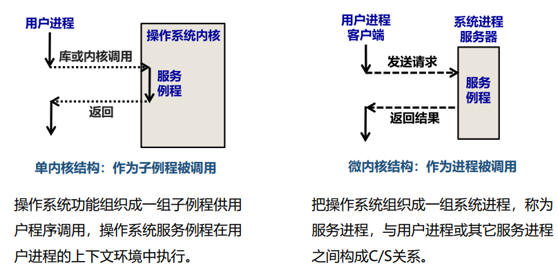
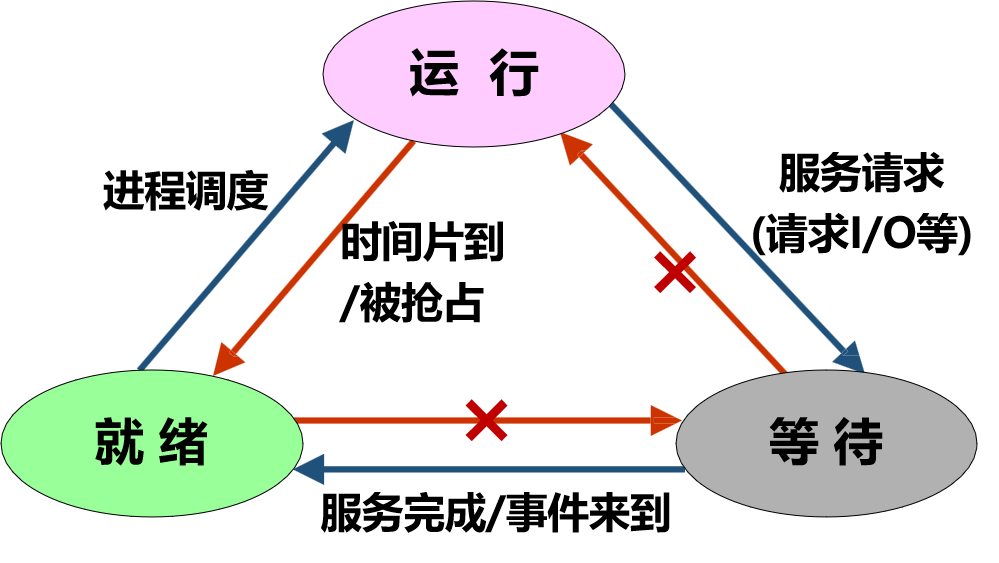
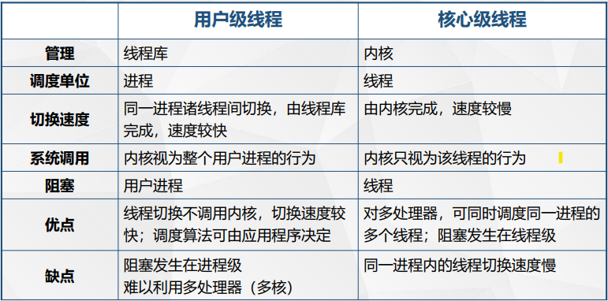
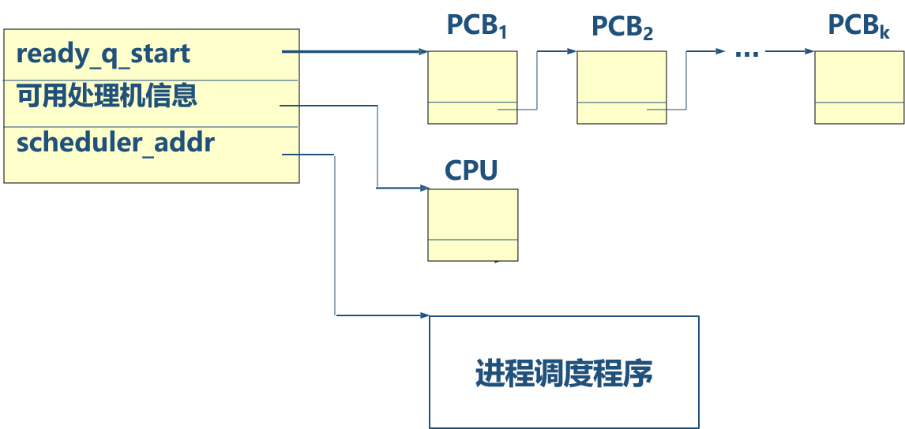
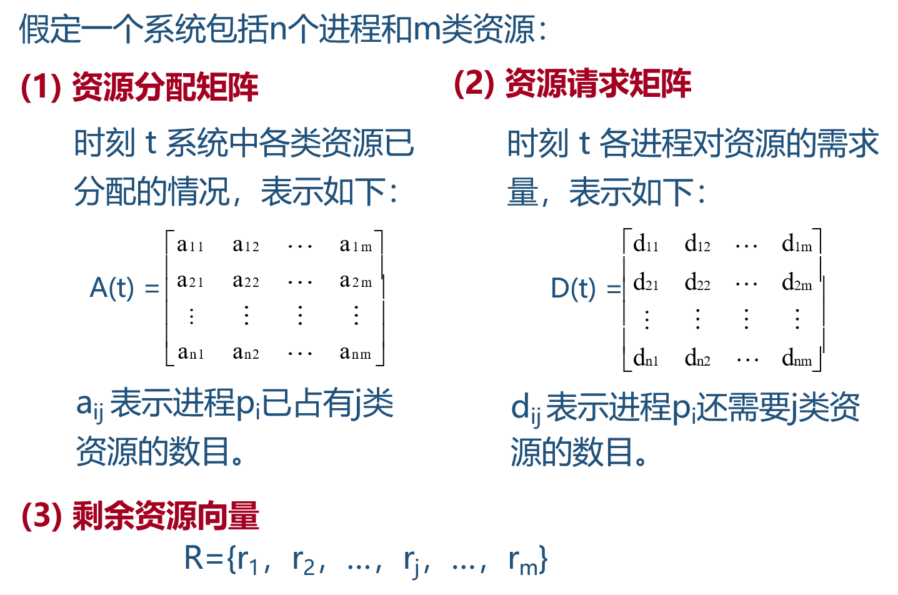

[TOC]

# 一、绪论

## 1.1 操作系统与计算机体系结构的关系

- 操作系统的地位
  - 不解决具体问题，不负责生成解决应用问题的程序
  - 所有硬件之上，所有软件之下，是各种软件的基础运行平台


- 计算机系统的体系结构

  - 应用软件

  - 编译器，数据库，网络等组件

  - 操作系统

  - 硬件


- 操作系统与各层之间的关系

  - 操作系统对各层的管理和控制
    - 管理控制硬件：控制CPU的工作、访问存储器、设备驱动、中断处理
    - 管理控制应用软件：提供方便简单得用户接口

  - 各层对OS的制约和影响
    - 下层硬件环境的制约：提供操作系统的运行环境、限制了操作系统的功能实现
    - 上层用户和软件的要求：操作系统需要满足不同的应用需求

- 操作系统的功能

  - 进程管理
    - 进程控制：创建，暂停，唤醒，撤销；
    - 进程调度：调度策略，优先级；
    - 进程通信：进程间通信
  - 内存管理
    - 内存分配
    - 内存共享
    - 内存保护
    - 虚拟内存
  - 设备管理
    - 设备的分配和调度
    - 设备无关性
    - 设备传输控制
    - 设备驱动
  - 文件管理
    - 存储空间管理
    - 文件的操作
    - 目录的操作
    - 文件和目录的存取权限管理

## 1.2 操作系统的形成与发展(&#9733;)

### 1.2.1 手工操作阶段

- 人工操作
- 作业**独占**计算机
- 作业**串行**执行

### 1.2.2 批处理阶段

#### 联机批处理

- 作业的I/O操作由CPU来处理：慢速I/O设备严重浪费CPU处理时间

#### 脱机批处理

- 作业的I/O操作由廉价的卫星机处理
- 主处理器只与高速存储设备交互
- DMA的原型

#### 单道批处理技术

- 批量：将多个程序打包形成**作业队列**
- 自动：常驻监督程序（可视为操作系统）依次**自动**处理队列中的每个作业
- 单道：作业只能按照顺序依次被执行，是**串行**的
- 利用效率低：当需要执行I/O操作时，CPU空闲，而不能被其他作业使用；当需要CPU工作时，外设空闲，而不能被其他作业使用

#### 多道批处理技术

- 多道：内存中同时存放**多道**相互独立的程序，以**脱机**方式工作
- 提高CPU利用效率：当某道程序因某种原因（如进行I/O操作）不能继续运行下去时，操作系统便将另一道程序投入运行

- 宏观上并行：多个程序同时占用多个资源同时执行

- 微观上串行：在某个时间点，最多一个程序占用CPU；多个程序交替占用CPU

- 无法交互：平均周转时间长，无交互能力

- 辅助技术：中断、通道（DMA、达成脱机方式）

### 1.2.3 分时系统阶段

- 以**联机**方式使用计算机

####  分时技术

- 把处理机时间划分成很短的时间片（如几百毫秒）轮流地分配给各个应用程序使用
- 如果某个程序在分配的时间片用完之前计算还未完成，该程序就暂停执行，等待下一次获得时间片后再继续计算

#### 实时技术

- 系统能及时响应外部事件的请求，在规定的时间（deadline）范围内完成对该事件的处理，并控制实时任务协调一致运行
  - 强调可预测而非迅速
  - 硬实时：若实时约束不被满足，则会导致灾难性后果
  - 软实时：若实时约束不被满足，则会导致服务质量的降级

## 1.3 操作系统的定义与特征

- 定义

  - 大型**软件系统**

  - 负责计算机系统软、硬件资源的分配

  - 控制和协调并发活动

  - 提供用户接口，使用户获得良好的工作环境


- 特征

  - 并发
    - 并行是指两个或者多个事件在**同一时刻**发生，而并发是指两个或多个事件在**同一时间间隔**发生
    - 并行是在**不同实体**上的多个事件，并发是在同一实体上的多个事件
  
  
    - 共享：系统中的资源可供多个并发执行的进程共同使用
  
  
  
    - 虚拟：把一个物理上的实体变为若干个逻辑上的对应物
  
  
  
    - 不确定：为多个作业的执行顺序和每个作业的执行时间是不确定的
  


# 二、操作系统的结构和硬件支持

## 2.1 操作系统的物质基础(&#9733;)

### 2.1.1 CPU特权级

- 设立特权级的目的：保护操作系统

- CPU的两种状态
  - 管态（核态、特权态）
    - 操作系统的**管理程序**执行时机器所处的状态
    - 可使用全部指令（**包括一组特权指令**）
    - 可使用全部系统资源（**包括整个存储区域**）
  - 用户态
    - **用户程序**执行时机器所处的状态
    - **禁止使用特权指令**，不能直接取用资源与改变机器状态
    - **只允许访问自己的存储区域**
- CPU特权指令
  - I/O指令
  - 停机halt指令
  - 从核态转回用户态
  - 改变状态寄存器（MSR）的指令
- CPU特权级

### 2.1.2  中断技术

####  相关概念

- 中断的本质是受保护的状态转换——**确保CPU安全地由用户态转到核态**，转换的过程中不允许存在让用户程序干预的可能
- CPU收到外部中断信号后，停止当前工作，转去处理该外部事件 ，处理完毕后回到原来的中断处继续运行

- 相关概念
  - 中断源：引起中断的事件
  - 断点：发生中断时正在运行的程序被暂时停止，程序的暂停点称为断点。
  - 中断是硬件和软件协同的处理的，由硬件发现中断并进入中断，进入中断后，然后让软件来执行对中断事件的处理。

#### 中断分类

|          |               IRQ               |           Exception            |              Syscall               |
| :------: | :-----------------------------: | :----------------------------: | :--------------------------------: |
| 产生原因 | CPU以外的外部设备产生的异步事件 | 当前程序的执行所导致的同步事件 | 当前执行的程序需调用操作系统的功能 |
| 处理时机 |         指令执行的间隙          |    发生异常的指令执行过程中    |              访管指令              |
| 返回地址 |           下一条指令            |         发生异常的指令         |             下一条指令             |
|   举例   |   敲击键盘、磁盘数据传输完成    |       除零、非法内存访问       |             ecall指令              |

####  中断响应

- 中断响应的过程
  - 识别中断源
  - 保护断点和现场：保存断点地址、程序状态字PSW
  - 装入中断服务程序的入口地址
  - 进入中断服务程序
  - 恢复现场和断点
  - 中断返回

- 中断响应的实质
  - 交换CPU的态
  - 交换指令执行地址

### 2.1.3 时钟

## 2.2 操作系统的组织结构

- 操作系统的组件

  - 核心组件：中断管理、进程管理、内存管理
  - 外围组件：文件管理、设备管理

- 操作系统的内核结构

  |      |         单内核         |                   微内核                   |                伴生内核                |
  | :--: | :--------------------: | :----------------------------------------: | :------------------------------------: |
  | 特点 | 所有组件均运行在内核态 | 核心组件运行在内核态，外围组件运行在用户态 | 同一台机器运行多个OS，包括主OS和伴生OS |
  | 优点 |  结构简单，执行效率高  |                内核小，稳定                |             伴生OS结构简单             |
  | 缺点 |   内核庞大，难以维护   |            采用IPC通讯，效率低             |            完整系统结构复杂            |
  | 例子 |      UNIX、Linux       |                  Windows                   |            PKE、Docker容器             |

- IPC通讯：内核把用户请求服务的消息传给服务进程；服务进程接受并执行用户服务请求；内核用消息把结果返回给用户

  

## 2.3 程序的链接(&#9733;)


## 2.4 用户接口(&#9733;)

- 批处理操作系统：作业控制语言

- 分时操作系统、个人计算机操作系统：作业控制语言、键盘命令、图形用户界面

- 操作系统如何提供服务（**系统调用**）：

  - 操作系统提供实现各种功能的例行子程序，每个功能对应一个功能号；
  - CPU提供**访管指令**：svc n，其中svc表示访管指令的记忆符，n为功能号；
  - 应用程序通过访管指令调用操作系统例程；
  - 处理机执行到访管指令时发生中断，该中断称为访管中断。

- 系统调用与一般库函数的区别

  - 系统调用代码驻留在内存中，属于操作系统，其执行回引起CPU状态由用户态转到核态，如getchar()函数
  - 一般库函数由开发软件提供，不会引起CPU状态的变化，如max()函数

- 系统调用的实现

  -  每个系统调用对应一个系统调用号；
  - 每个系统调用对应一个执行程序段；
  - 每个系统调用要求一定数量的输入参数和返回值

  | UNIX/Linux  |          Win32          |        Usage        |
  | :---------: | :---------------------: | :-----------------: |
  |    fork     |      CreatProcess       |      创建进程       |
  |   waitpid   |   WaitForSingleObject   |    等待进程终止     |
  | open/close  |  CreatFile/CloseHandle  | 创建或打开/关闭文件 |
  | read/write  |   ReadFile/WriteFile    |      读/写文件      |
  |    lseek    |     SetFilePointer      |    移动文件指针     |
  | mkdir/rmdir | Creat/Remove  Directory |    建立/删除目录    |
  |    stat     |   GetFileAttributesEx   |    获得文件属性     |

- Linux的内核陷入指令为int 80h中断指令

# 三、进程管理

## 3.1 进程引入

- 顺序程序（单道系统）

  - 程序的一次执行过程称为一次计算，它由许多简单的操作组成

  - 一个计算的若干操作必须按照严格的先后次序顺序地执行，这个计算过程就是程序的顺序执行过程

  - 特点

    - 顺序性：处理机的操作严格**按照程序所规定的顺序依次执行**

    - 封闭性：程序一旦开始执行，就**不会受到外界因素的影响**
    - 可再现性：程序执行的结果与它的执行速度无关 (即与时间无关)，而只与初始条件有关；初始条件相同，程序执行的结果一定相同


- 并发程序

  - 若干个程序段同时在系统中运行，这些程序段的执行**在时间上重叠**
  - 一个程序段的执行尚未结束，另一个程序段的执行已经开始，称这几个程序段是**并发执行**的

  - 并发语句记号

    ```c
    cobegin
    	S1,S2,S3,...,Sn
    coend
    ```

  - 特点

    - 失去封闭性和可再现性：两个并发程序若干操作的先后顺序
      - 程序并发执行时的结果与各并发程序的相对速度有关
      - 即给定相同的初始条件，若不加以控制，也可能得到不同的结果，此为与时间有关的错误

    - 一个程序可以对应多个计算

    - 多个计算之间会有并发执行的相互制约
      - 直接制约：共享变量
      - 间接制约：资源共享

## 3.2 进程概念

### 3.2.1 进程定义

- 指一个具有一定独立功能的程序关于某个数据集合的一次运行活动，即程序的一次执行
- 进程与程序的区别

  - 程序是静态的（存储在内存/外存中的代码），进程是动态的（程序在处理机运行的过程，是运行中的程序）；

  - 进程是一个独立运行的活动单位，是竞争系统资源的基本单位；

  - 一个程序可以对应多个进程，一个进程至少包含一个程序

### 3.2.2 进程状态(&#9733;)

- 三种基本状态
  - 运行态：该进程已获得运行所必需的资源，它的程序**正在处理机上执行**；
  - 等待态：进程正等**待着某一事件的发生而暂时停止执行**。这时，即使给它CPU控制权，它也**无法执行**；
  - 就绪态：进程已获得除CPU之外的运行所必需的资源，**一旦得到CPU控制权，立即可以运行**

  

- 进程的变迁原因
  - 就绪->执行：进程调度即可就绪状态转为运行状态
  - 等待->就绪：处于等待状态的进程中相关服务完成或者相关资源获得完成
  - 运行->等待：进程提出某种服务请求，比如说I/O
  - 运行->就绪：**在分时系统中，时间片到**，才会发生这种变迁

- 进程基本状态的拓展
  - 拓展1：程序执行完了，进程还可以被回收；
  - 拓展2：添加挂起操作，添加静止状态，静止表示当前进程不在主存里面，在虚存里面；
  - Unix进程，运行态分成用户态运行和核心态运行

### 3.2.3 进程描述

- 进程的组成
  - 进程内部的程序和数据：描述进程本身所应完成的功能
  - 进程控制块PCB：描述进程与其他进程、系统资源的关系，以及进程所处的状态
- 进程控制块的内容
  - 进程标志符：进程符号名或ID
  - 进程当前状态
  - 进程队列的指针next：处于同一状态的下一个进程的PCB地址
  - 进程优先级
  - CPU现场保护区
  - 通信信息、家族联系、占有资源清单
- Linux中的PCB结构称为task_struct，所有进程均以task_struct链表的形式存储在内存中
- PCB队列的组织
  - 就绪队列：所有处于就绪状态的队列
  - 等待队列：有多个等待队列，每个队列表示所有因为**同个某种原因**而等待的进程
  - 运行指针：当前是什么进程正在运行

## 3.3 进程控制原语(&#9733;)

### 3.3.1 进程创建

- 进程创建原语：create(name，priority)
  - 其中name为标识符，priority是优先级
  - 创建一个具有指定标识符的进程，建立进程的PCB结构

- 实现方法
  - 查找PCB池，是否出现同名现象
  - 向系统申请一个空闲PCB，没有空闲PCB则出错退出
  - 将入口信息填入PCB
  - PCB入就绪队列
  - 返回进程PID
- 进程创建：Linux中的fork()
  - 创建一个子进程，它从父进程继承整个进程的地址空间，包括：进程上下文、进程堆栈、内存信息、打开的文件描述符、信号控制设置、进程优先级、进程组号、当前工作目录、根目录、资源限制、控制终端等。
  - 创建过程
    - 为新进程分配一个新的PCB结构；
    - 为子进程赋一个唯一的进程标识号 (PID)；
    - 为子进程复制一个父进程上下文的逻辑副本——父子进程将执行完全相同的代码；
    - 增加与该进程相关联的文件表和索引节点表的引用数——父进程打开的文
      件子进程可以继续使用；
    - 对父进程返回子进程的进程号，对子进程返回零

- 进程更换：Linux中的exec()
  - 更换进程执行代码，**更换正文段，数据段**
  - 格式：exec(文件名，参数表，环境变量表)
  - 例如：execlp(“max”,15,18,10,0)；execvp(“max”,argp)

### 3.3.2 进程撤销

- 进程撤销原语：kill()，exit()
  - 撤消当前运行的进程并转进程调度程序

- 实现方法
  - 由运行指针获得当前进程pid
  - 释放本进程占用的资源给父进程
  - 从总链队列中删除该进程
  - 释放PCB结构
  - 转进程调度
- 进程撤销：Linux中的exit()
  - 撤销一个进程，它停止当前进程的运行，清除其使用的内存空间， 销毁其在内核中的各种数据结构；
  - 进程状态变为zombie僵尸态：**仍保留其PCB结构，等待父进程回收**
  - 若其父进程正在等待该进程的终止，则父进程可立即得到其返回的整数status
  - 僵尸进程：若子进程调用exit()，而父进程并没有调用wait()或waitpid()获取子进程的状态信息，那么子进程的PCB仍然保存在系统中，此时该子进程称为僵尸进程；
  - 孤儿进程：当一个父进程由于正常完成工作而退出或由于其他情况被终止，它的一个或多个子进程却还在运行，这些子进程将成为孤儿进程；
  - 孤儿进程将被1号进程接管，且1号进程定期清除僵尸进程

### 3.3.3 进程等待

- 进程等待原语：susp(chan)
  - 其中chan为进程等待的原因
  - 中止调用susp的进程的执行，并将其加入到等待chan的等待队列中，转进程调度
- 实现方法
  - 保护当前进程的CPU现场到其PCB结构中
  - 设置该进程为**等待态**
  - 将该进程的PCB结构插入到chan对应的等待队列中
  - 转进程调度
- 进程等待：Linux中的wait()
  - 父进程通过调用wait(int* status)函数使其暂停执行，直到它的一个子进程结束为止；
  - 其返回值是终止运行的子进程的PID；
  - 参数status所指向的变量存放子进程的退出码，即从子进程的main函数返回的值或子进程中exit()函数的参数


- 进程等待：Linux中的waitpid()
  - 父进程通过调用wait(pid_t pid, int * status, int options)函数使其暂停执行，直到特定子进程结束为止

### 3.3.4 进程唤醒

- wakeup(chan)
  - 其中chan为被唤醒进程等待的原因
  - 当进程等待的事件发生时，由发现者进程唤醒等待该事件的进程
- 实现方法
  - 找到chan对应的等待队列
  - 将该队列的首个进程移出等待队列
  - 设置该进程为**就绪态**
  - 将该进程插入到就绪队列
  - 进程调度

## 3.4 进程的相互制约关系

- 临界资源：一次只允许一个进程使用的资源
  - 硬件：输入机，打印机，磁带机
  - 软件：公共变量，队列
  
  > 当两个进程公用一个变量时，它们必须顺序地使用，一个进程对公用变量操作完成后，另一个进程才能访问修改该变量

- 临界区：对于公共变量或公共存储区进行访问和修改的程序段
- 临界区访问规则
  - 空闲则入：没有进程在临界区时，任何进程都可以进入临界区；
  - 忙则等待：有进程在临界区时，其他进程均不能进入临界区；
  - 有限等待：等待进入临界区的进程不能无限等待；
  - 让权等待：不能进入临界区的进程应释放CPU

- 进程互斥

  - 当某一进程正在访问某一存储区时，不允许其他进程访问或者修改该存储区的内容，这种制约关系称为进程互斥

  - **同一临界资源**的临界区才需要互斥进入


- 进程同步

  - **并发**进程在一些关键点上可能需要**互相等待与互通消息**， 这种制约关系称为进程同步

  - 在病人看病过程中，<u>看病活动</u>需要等待<u>化验活动</u>作出的化验结果，而<u>化验活动</u>需要等待来自<u>看病活动</u>的化验请求

-  同步反映的是合作关系；互斥反映的是竞争关系

## 3.5 进程同步机构(&#9733;)

### 3.5.1 锁

- 用一个变量w代表某种资源的状态：w=1表示资源被占用，否则表示资源没有被占用
- 上锁原语：lock(w)
  - 执行到lock的时候判断w是多少
  - 如果w=1，就被阻塞，进程无法往下继续运行，直到什么时候w=0
  - 如果w=0，不会被阻塞，进程可以继续执行，并且会把w赋值为1
- 开锁原语：unlock(w)
  - 执行到unlock的时候，把w赋值为0即可

### 3.5.2 信号灯

- 信号灯是一个确定的二元组(s,q)，其中s是一个具有非负初值的整型变量，q是一个初始状态为空的队列。
  - 变量值s≥0时，表示绿灯，进程执行；
  - 变量值s＜0 时，表示红灯，进程停止执行；
  - 创建信号灯时应说明信号灯的意义和s的初值，且初值绝不能为负值

- P操作
  - 把信号灯变量s的值**减一**
  - 操作后，如果s为负，调用P操作的进程阻塞，并插入到信号灯变量s对应的等待队列中，否则继续运行
- V操作
  - 把信号灯变量s的值**加一**
  - 操作后，如果s非正，则从信号灯变量s对应的等待队列中取出一个进程放入就绪队列，否则继续运行

### 3.5.3 进程互斥的实现

- 对于每一个锁，进入临界区之前上锁，离开临界区的时候解锁

- 每个临界区都有有一个临界信号灯管理，进入临界区就P(s)，离开临界区就V(s)

- 基本原则
  - 信号灯的初值为非负整数

  - 除初始化外，只能使用P、V原语对信号灯进行操作

  - P、V操作一定成对出现

    > 遗漏P操作则不能保证互斥访问，遗漏V操作则不能在使用临界资源之后将其释放（给其他等待的进程）

### 3.5.4 进程同步问题

- 进程流图
  - 表示进程之间执行的先后次序，某些进程的完成代表某些进程可以开始执行的顺序
  - 可以用多个信号灯表示，在每个进程前面加上若干个P操作，在每个进程后面加上若干个V操作
  - 其中V操作用于通知其他进程本进程已经执行完毕（相当于消息发送者）
  - P操作用于接受上一层V操作发送来的消息
  - 假如说有一个关系p1->p2，p1执行完了才能执行p2，那么就有一个信号灯，初值为0，在p2的开始加上P操作，p1的末尾加上V操作，有多少对这样的关系就有多少个信号灯
- 共享缓冲区
  - 问题概述：一个读进程，一个写进程，一个缓冲区
  - 转化成进程流图：只有读完了，才能写，只能写完了，才能读
  - 信号灯
    - sb代表缓冲区的空位置数，初值为1
    - sa代表缓冲区的数据数，初值为0
  - 写进程
    - p（sb）
    - 数据放入buf
    - v（sa）
  - 读进程
    - p（sa）
    - 取数据
    - v（sb）
- 生产者消费者
  - 问题概述
    - **若干个生产者**和若干个消费者共享一个**可同时容纳多个产品的缓冲区**
    - 生产者不断生产产品放入缓冲区，消费者不断从缓冲区取出产品并消耗
    - 任何时刻最多只能有一个生产者或消费者访问缓冲区
    - 禁止生产者向满缓冲区放入产品
    - 禁止消费者从空缓冲区取出产品
  - 缓冲区有界
    - 同步问题分析
      - **互斥**访问缓冲区
      - 由于缓冲区无界，生产者可以一直生产产品
      - 消费者需要根据**满缓冲区的数量**决定是否消费
    - 信号灯
      - 同步信号灯nfull：表示满缓冲区的数量，初值为0
      - 互斥信号灯mutex：表示缓冲区是否被占用，初值为1
  - 缓冲区无界
    - 同步问题分析
      - **互斥**访问缓冲区
      - 生产者需要根据**空缓冲区的数量**决定是否生产
      - 消费者需要根据**满缓冲区的数量**决定是否消费
    - 信号灯
      - 同步信号灯nfull：表示满缓冲区的数量，初值为0
      - 同步信号灯nempty：表示空缓冲区的数量，初值为n
      - 互斥信号灯mutex：表示缓冲区是否被占用，初值为1

## 3.6 线程

- 进程模型

  - 进程是资源占用的基本单位：进程拥有主存、设备、文件等系统资源的使用权

  - 进程是调度执行的基本单位：操作系统以进程为单位进行处理机的调度
  - 不足：进程创建、切换、通信开销大

- 多线程模型

  - 在进程内增加一类实体——**线程作为调度的基本单位**
  - **同一进程内的线程共享相同的地址空间**
  - 对于共享的数据，线程使用的同步机制与进程一样
  - 不足：一个线程崩溃，会导致其所属进程内的所有线程崩溃
  
- 多核处理器

  - 设$f$为程序中能够并行的部分的运行时间在整个程序运行时间中的占比
  - $加速比=\frac{在单处理器上执行程序的时间}{在N个处理器上执行程序的时间 }=\frac{1}{(1-f)+\frac{f}{N}}$

- 两种线程模型

  

- Linux中的线程

  - 线程创建：pthread_create(pthread_t *thread,pthread_attr_t *attr,void *(*start_routine)(void *),void *arg)
    - 其中thread为指向创建的线程标识符的指针；attr设置线程属性；start_routine为线程运行函数地址；arg为运行函数的参数
  - 线程等待： pthread_join(pthread_t thread,void **thread_return)
    - 其中thread为被等待的线程标识符；thread_return为一个用户定义的指针，用来存储被等待线程的返回值
    - 调用该函数的线程将一直等待到被等待的线程结束为止，当函数返回时，被等待线程的资源被收回

# 四、资源管理

## 4.1 资源管理概述

- 资源管理的目标
  - 高利用率：保证资源的**高利用率**
  - 避免饥饿：在“合理”时间内使所有顾客有获得所需资源的机会
  - 互斥使用：对不可共享的资源实施**互斥**使用
  - 避免死锁：防止由资源分配不当而引起的**死锁**

- 资源管理的功能
  - 描述**资源数据结构**：包含资源的物理名、逻辑名、类型、地址、分配状态等
  - 确定**资源分配原则**：决定资源应分给谁，何时分配，分配多少等问题
  - **实施资源分配**：执行资源分配、资源收回工作
  - 存取控制和安全保护：对资源的存取进行控制并对资源实施安全保护措施

- 资源分配的类型

  - 静态分配（基于作业调度）：**在进程运行前**，操作系统即分配该进程所需的全部资源

  - 动态分配（基于进程调度）：**在进程运行中**，边运行边向操作系统提出资源申请，操作系统根据申请分配资源

## 4.2 资源分配机构

- 资源描述器：描述各类资源的**最小分配单位**的数据结构
  - 包含资源名，类型，大小，地址，分配标志，描述器连接信息，存取权限等
  
- 资源信息块：描述某类资源的请求者、可用资源和资源分配程序等必要信息的数据结构
  
  |         内容         |      指向      |
  | :------------------: | :------------: |
  |    等待队列头指针    |   请求者队列   |
  | 可利用资源队列头指针 | 可利用资源队列 |
  | 资源分配程序入口地址 |  资源分配程序  |
  
- 中央处理机资源信息块

  

## 4.3 资源分配策略(&#9733;)

- 先请求先服务
  - 队列结构：**按请求的先后次序排序**，每一个新产生的请求均排在队尾；
  - 当资源可用时，取队首元素，并满足其需要
- 优先调度
  - 队列结构：**按优先级的高低排序**，对每个进程指定优先级，每一个新产生的请求，按其优先级的高低插到相应的位置；
  - 当资源可用时，取队首元素，并满足其需要

## 4.4 死锁(&#9733;)

### 4.4.1 死锁的定义

- 定义
  - 在两个或多个并发进程中，如果**每个**进程持有某种资源而又都等待着别的进程释放它或它们正占有着的资源，否则就不能向前推进。此时，称这一组进程产生了死锁。

  - **进程在占有某个资源而请求某种资源，当该进程占有的资源是别人请求的资源时，就可能产生死锁**


- 进程-资源分配图

  - 两类顶点
    - 所有的进程P
    - 所有的资源R
  
  
    - 两类有向边
      - 资源请求边：如果进程$P_i$请求资源$R_j$，则存在一条由$P_i$指向$R_j$的有向边
      - 资源分配边：如果资源$R_j$分配给进程$P_i$，则存在一条由$R_j$指向$P_i$的有向边
  

### 4.4.2 产生死锁的必要条件

- 互斥条件：涉及的资源是非共享的，为**临界资源**

- 不剥夺条件（非抢占）：进程所获得的资源在未使用完毕之前，不能被其他进程强行夺走

- 部分分配：进程每次只申请他所需要的资源的一部分，在等待新一批资源的时候，进程**继续占用**分配到的资源

- 环路条件：**存在一种进程的循环链**，链中的每一个进程已获得的资源同时被链中下一个进程所请求

### 4.4.3 解决死锁

- 死锁预防
  - 静态预防死锁：在作业调度的时候就给选中的作业**分配它所需要的全部资源**（破坏部分分配）
  - 有序资源分配法：系统中所有资源都给定一个唯一的编号，所有分配请求必须以上升的次序进行。当遵守上升次序的规则时，若资源可用，则予以分配（破坏环路条件）

- 死锁避免（银行家算法）
  - 要求进程声明需要资源的最大数目，在分配资源时判断是否会出现死锁，只有在不会出现死锁时才分配资源

  - 数据结构

    

  - 算法过程

    - 寻找一个没有标记的进程$p_i$，该进程需满足资源请求矩阵$D$的第$i$行向量小于或等于剩余资源向量$R$（这意味着能够满足该进程的资源请求）；
    - 如果存在这样的进程，则将资源分配矩阵$A$的第$i$行向量加到$R$中（这意味着该进程执行后 ，将把已占有资源释放给剩余资源池），标记该进程，并转到第1步；如果找不到这样的进程，则转到第3步；
    - 如果所有进程均被标记，则系统处于安全状态（即所有进程均能被执行）；否则系统处于不安全状态

- 死锁的检测和解除
  - 对资源的分配不加任何限制，也不采取死锁避免措施，而是系统定时地运行一个“死锁检测”程序，检测到死锁后采取措施解除
  - 根据进程-资源分配图检测死锁
    - 如果进程-资源分配图中无环路，则此时系统没有发生死锁；
    - 如果进程-资源分配图中有环路，且每个资源类中**仅有一个资源**，则系统中发生了死锁，此时，环路是系统发生死锁的**充要条件**，环路中的进程便为死锁进程；
    - 如果进程-资源分配图中有环路，且涉及的资源类中**有多个资源**，则环路的存在只是产生死锁的**必要条件**而不是充分条件
  - 解除死锁
    - 立即结束所有进程的执行，并重启操作系统
    - 撤销陷于死锁的所有进程
    - 逐个撤销陷于死锁的进程，回收其资源，直至死锁解除
    - 剥夺陷于死锁的进程占用的资源，但并不撤销它， 直至死锁解除
    - 根据系统保存的检查点，让所有进程回退，直到足以解除死锁


- 死锁定理：P个进程共享m个同类资源，如果所有进程对资源的最大需要数目之和小于P+m，该系统不会发生死锁

# 五、处理机调度

## 5.1 作业调度

### 5.1.1 作业调度概述

- 对存放在辅存设备上的大量作业，以一定的策略进行挑选，分配主存等必要的资源，建立作业对应的进程，使其投入运行
  - 作业存储在辅存设备上
  - 在辅存中挑选一个作业，将其载入到主存
  - 作业被载入到主存后，建立其对应的进程结构，使之投入运行
  - 运行完毕，回到第二步

- 作业控制块JCB：存放作业控制和管理信息
  
- 作业调度的因素
  - 注意系统资源均衡使用
  - 保证提交的作业在截止时间内完成
  - 设法缩短作业平均周转时间

### 5.1.2 作业调度算法的性能衡量

- 周转时间：作业**提交**给计算机系统到该作业的结果**返回**给用户所需要的时间
- 平均周转时间：$t=\frac{1}{n}\sum_\limits{i=1}^{n}t_i$
- 带权周转时间：一个作业的周转时间与其运行时间的比值$w_i=\frac{t_i}{t_{ri}}$
- 平均带权周转时间：$w=\frac{1}{n}\sum_\limits{i=1}^{n}w_i$

### 5.1.3 作业调度算法(&#9733;)

- 先来先服务：优先考虑**等待时间最长**的作业

  | 作业 | 提交时间$T_{si}$ | 运行时长$T_{ri}$ | 开始时间 | 结束时间$T_{ci}$ | 周转时长$T_i$ | 带权周转时间$w_i$ |
  | :--: | :--------------: | :--------------: | :------: | :--------------: | :-----------: | :---------------: |
  |  1   |       8.00       |       2.00       |   8.00   |      10.00       |     2.00      |         1         |
  |  2   |       8.50       |       0.50       |  10.00   |      10.50       |     2.00      |         4         |
  |  3   |       9.00       |       0.10       |  10.50   |      10.60       |     1.60      |        16         |
  |  4   |       9.50       |       0.20       |  10.60   |      10.80       |     1.30      |        6.5        |

  平均周转时间$t=1.725$，平均带权周转时间$w=6.875$

- 短作业优先调度：优先考虑**运行时间最短**的作业

  | 作业 | 提交时间$T_{si}$ | 运行时长$T_{ri}$ | 开始时间 | 结束时间$T_{ci}$ | 周转时长$T_i$ | 带权周转时间$w_i$ |
  | :--: | :--------------: | :--------------: | :------: | :--------------: | :-----------: | :---------------: |
  |  1   |       8.00       |       2.00       |   8.00   |      10.00       |     2.00      |         1         |
  |  2   |       8.50       |       0.50       |  10.30   |      10.80       |     2.30      |        4.6        |
  |  3   |       9.00       |       0.10       |  10.00   |      10.10       |     1.10      |        11         |
  |  4   |       9.50       |       0.20       |  10.10   |      10.30       |     0.80      |         4         |

  平均周转时间$t=1.55$，平均带权周转时间$w=5.15$

- 响应比高者优先调度：**响应比=响应时间/运行时间**，其中响应时间表示运行时间与已等待时间之和
  
  | 作业 | 提交时间$T_{si}$ | 运行时长$T_{ri}$ | 开始时间 | 结束时间$T_{ci}$ | 周转时长$T_i$ | 带权周转时间$w_i$ |
  | :--: | :--------------: | :--------------: | :------: | :--------------: | :-----------: | :---------------: |
  |  1   |       8.00       |       2.00       |   8.00   |      10.00       |     2.00      |         1         |
  |  2   |       8.50       |       0.50       |  10.10   |      10.60       |     2.10      |        4.2        |
  |  3   |       9.00       |       0.10       |  10.00   |      10.10       |     1.10      |        11         |
  |  4   |       9.50       |       0.20       |  10.60   |      10.80       |     1.30      |        6.5        |
  
  平均周转时间$t=1.625$，平均带权周转时间$w=5.675$

## 5.2 进程调度

### 5.2.1 进程调度概述

- 基本功能

  - 在众多处于就绪状态的进程中，按一定的原则选择一个进程运行

  - 调度：组织和维护就绪进程队列

  - 分派：处理机空闲的时候，从就绪队列首部选取一个PCB投入运行

- 调度时机

  - 当一个进程从运行态切换成等待态时
  - 当一个进程从运行态切换成就绪态时
  - 当一个进程从等待态切换成就绪态时
  - 当一个进程终止时

- 调度方式

  - 非抢占方式：高优先级的进程**无法**打断正在运行的进程

  - 抢占方式：高优先级的进程**可以打断**正在运行的进程

### 5.2.2 进程调度算法(&#9733;)

- **优先数调度算法**：优先级最高的先被调度
  - 静态优先数：在进程创建时，根据其需使用的资源、进程类型以及程序运行时间的估计确定
  - 动态优先数：在进程运行时，动态改变优先数
    - 进程使用CPU超过一定数值时，降低优先数
    - 进程进行I/O操作后，增加优先数
    - 进程等待时间超过一定数值时，增加优先数

- **循环轮转调度算法**
  - 简单循环轮转调度
    - 每个进程被调度后，占用一个时间片，时间片用完后转为就绪态并进入就绪队列队尾
  - 可变时间片轮转调度
    - 时间片动态选取：过长则轮转时间过长，过短则进程切换开销增加
    - 调整时间片需要消耗系统时间，调整周期过大则等效固定时间片，过小则调整开销增加
  - 多重时间片轮转调度
    - 将就绪进程分为两级或多级，系统相应建立两个或多个就绪进程队列
    - 较高优先级的队列分配较短的时间片，较低优先级的队列分配较长的时间片
    - 优先从高级就绪进程队列中选取进程，只有在其为空时，才从较低级的就绪进程队列中选取进程

# 六、主存管理

## 6.1 主存管理概述

- 主存共享方式

  - 大小不同的区域：分区存储管理、段式存储管理
    
  - 大小相等的区域：页式存储管理
    
  - 段页式存储管理


- 逻辑组织

  - 一维地址结构
    - 一个程序是一个连续、线性的地址结构
    - 确定线性地址空间中的指令地址或操作数地址**只需要一个信息**

  - 二维地址结构
    - 一个程序由若干个分段组成，每个分段是一个连续的地址区
    - 确定线性地址空间中的指令地址或操作数地址**需要两个信息**，一是该信息**所在的分段**，另一个是该信息在**段内的偏移量**


## 6.2 主存管理功能

- 基本概念

  - 物理地址（绝对地址、实地址）：计算机主存单元的真实地址

  - 主存空间：物理地址的集合所对应的空间

  - 逻辑地址（相对地址、虚地址）：用户的程序地址 （指令地址或操作数地址）

  - 程序地址空间：用户程序所有的逻辑地址集合对应的空间


- 主存管理功能

  - 地址映射：将逻辑地址变换成主存中的物理地址
    | 编译时地址映射 |         静态地址映射         |            动态地址映射            |
    | :------------: | :--------------------------: | :--------------------------------: |
    |                | 在程序装入时确定地址映射关系 |    在程序运行时确定地址映射关系    |
    |                |   需软件（重定位装入程序）   | 需硬件地址变换机构（重定位寄存器） |
    |                |          耗费时间长          |             映射速度快             |

  - 主存分配

    - 构造主存资源信息块（包括等待队列、空闲区队列、主存分配程序）
    - 制定分配策略
    - 实施主存分配和回收
  
  - 存储保护
    - 主存按照区的模式分配给各用户程序使用，每个用户程序必须在给定的存储区域内活动
    - 上下界保护：设置上界寄存器和下界寄存器，程序访问内存只能使用在上界寄存器和下界寄存器之间的**物理地址**，否则发生越界中断
    - 基地址、限长保护：基址寄存器表示程序在内存中存储空间从何开始，限长寄存器限制程序访问的**逻辑地址**，其为逻辑地址的最大值
  
  - 主存扩充
    - 程序的全部代码和数据存放在辅存中；
    - 将程序当前执行所涉及的那部分程序代码放入主存中；
    - 程序执行时，当所需信息不在主存，由操作系统和硬件相配合来完成主存从辅存中调入信息，程序继续执行

## 6.3  分区存储管理(&#9733;)

### 6.3.1 静态分区

- 把内存预先划分成多个分区，分区大小可以相同或不同，一旦确定则整个系统运行阶段中都保持不变
- 一个分区装入一个作业

### 6.3.2 动态分区

- 在**运行程序**的过程中：建立分区，依照用户请求的大小分配分区

- 分区分配数据结构

  - 主存资源信息块M_RIB
    - 等待队列头指针
    - 空闲区队列头指针
    - 主存分配程序入口地址

  - 分区描述器PD
    - flag：为0表示空闲，为1表示占用
    - size：分区大小
    - next：如果是空闲区，则为下一个空闲区的首地址；如果是已分配区，该项为0

- 分区分配

  - 寻找空闲块：依申请者所要求的主存区的大小，分区分配程序在自由主存队列中找一个满足用户需要的空闲块
  - 若找到了所需的空闲区
    - 空闲区与要求的大小相等，将该空闲区分配并从队列中摘除
    - 空闲区大于所要求的的大小，将空闲区分为两部分：一部分成为已分配区，建立已分配区的描述器，剩下部分仍为空闲区
    - 返回所分配区域的首址
  - 否则，通知申请者无法满足要求

- 分区回收

  - 检查被回收分区在主存中的连接情况

  - 如果上/下邻接空闲区，则合并，成为一个新的空闲区

  - 若回收分区不与任何空闲区相邻接，则建立一个新的空闲区，加入到空闲队列


### 6.3.3 选择空闲区的放置策略

- 首次适应算法
  - 将程序放置到**第一个足够装入它的地址最低的**空闲区
  - 空闲区队列：按空闲区地址由低到高排序
- 最佳适应算法
  - 将程序放置到主存中**与它所需大小最接近的**空闲区中
  - 空闲区队列：按空闲区大小由小到大排序
- 最坏适应算法
  - 将程序放置到主存中**与它所需大小差距最大的**空闲区中
  - 空闲区队列：按空闲区大小由大到小排序

### 6.3.4 分区管理的缺点

- 程序必须**整体装入**
- 需要分配**连续的内存空间**
- 碎片问题：在已分配的区域里面存在着一些没有被充分利用的空闲区

## 6.4 页式存储管理(&#9733;)

### 6.4.1 基本概念

- 页面（虚页）：逻辑地址空间被等分成大小相等的片，称为页面
- 主存块（实页）：物理地址空间又被分成大小相等的片，称为主存块
- 页表：为了实现地址映射，系统建立的记录页面与主存块之间对应关系的地址变换的机构称为页面映像表
  - 页表缓冲TLB：CPU中用于存放热页表项的高速缓存，地址变换速度快，但成本较高
  - 主存区域中的页表：地址变换速度比硬件慢，成本较低


### 6.4.2 页式地址变换

- 地址变换过程
  - CPU给出逻辑地址
  - 分页机构将逻辑地址分成两部分——高地址页号为P，低地址页内偏移为W
  - 已知页表基址寄存器指示的首地址PTBR，则PTBR+P就是该虚页对应的页表项地址，获得物理块块号B
  - 将物理块块号B和页内偏移量W合并，即得到物理块地址
- 快表TLB（联想存储器）
  - 先在快表中查找有没有相关页表项记录，快表是一个独立的硬件，独立于内存之外
  - 如果快表中没有，只能查找存储在内存中的页表，然后把查出来的页表项记录在快表里面
- 多级页表
  - 间接引用
  - 页表项中可能存储的不是物理块号，而是下一级页表的首地址

### 6.4.3 请调页面的机制

- 两种页式系统

  - 简单页式系统：装入一个程序的**全部页面**才能投入运行

  - 请求页式系统：装入一个程序的**部分页面**即可投入运行


- 扩充页表项

  

  - 中断位：表示此页是不是在主存里面，如果是0表示在主存，如果为1表示不在主存
  - 辅存地址：表示该页在辅存中的地址

- 缺页中断
  - 当需要访问的逻辑地址所在虚页不在主存时，需要操作系统将该页面调入主存后再进行访问
  - 缺页中断的处理
    - 如果没有空闲的主存块，则需要淘汰某个虚页，该虚页对应的主存块重新分配（如果该虚页发生修改，则需要将修改写入外存）
    - 从外存中调入所需的页并调整页表
    - 重新启动被中断的指令
  - 抖动
    - 简单地说，导致系统效率急剧下降的主存和辅存之间的频繁的页面置换现象.

### 6.4.4  淘汰策略

- 在发生缺页中断且没有空闲的主存块时，选择淘汰哪一页的规则称为**淘汰策略**

- 扩充页表项

  

  - 引用位：该页最近是否被访问，1表示已被访问
  - 脏位：该页是否被修改，1表示已被修改

- 最佳算法（OPT算法）
  - 当需要淘汰页面时，所淘汰的页面应是以后不会使用的，或是在最长的时间以后才会使用的页面
  - 建立在已知未来页面访问顺序的前提下，理想化的算法

- 先进先出淘汰算法（FIFO算法）
  - 总是淘汰在主存中**停留时间最长（最早进入主存）**的页面
  - 实现方法
    - 建立一个页面进入主存的页号表
    - 建立一个替换指针，指向最早进入主存的页面
    - 当需要置换一页时，选择替换指向的那一页，然后调整替换指针的内容
  - 实现方法2
    - 在存储分块表中记录页面进入主存的先后次序

- 最久未使用算法（LRU算法）
  - 实现方法：采用页号栈
    - 最新被访问的页面入栈，最久未访问的页面在栈底
    - 要淘汰某个元素了，栈底元素出栈，新的页号入栈

- 时钟算法（CLOCK算法、LRU近似淘汰算法）

  - 为每一个存储块（存储分块表）或页面（页表）设立一个引用位，当访问某页时，就将该页引用位置1
  - 当内存中无对应数据
    - 如果访问位为0即置换并将访问位置1
    - 如果访问位为1，则不置换，将该访问位置0，然后指针下移，重复第一步
  - 当内存中有对应数据
    - 将该数据访问位置1，指针不移动


## 6.5 段式与段页式存储管理

- 段式系统

  - 段：程序中自然划分的一组逻辑意义完整的信息集合，如代码段、数据段

  - 段式地址变换
    - 将段地址划分为程序地址(s,w)，其中s为段号，w为段内偏移
    - 用段号s检索段表，得到该段的起始地址B
    - 如果w＜0或w≥L则发生主存越界中断；否则(B+w)即为物理地址

- 段页式系统

  - 在一个分段内划分页面，就形成了段页式存储管理

  - 段页式地址变换
    - 将段页式地址划分为程序地址(s,p,w)，其中s为段号，p为段内页号，w为页内偏移
    - 根据段号s找到该段的页表基址PTEP
    - 根据段内页号p查找页表，得到物理页号，与页内偏移合并得到物理地址

## 6.6 Linux存储管理(&#9733;)

- 地址映射机构MMU

  - CPU把虚拟地址送给MMU
  - MMU进行地址映射
  - MMU把物理地址送给存储器

- 多级页表

  - 二级页表

    - 对于32位虚拟地址空间，假设页面大小为$4K$，页表项大小为$4$字节

    - 则一个进程最大拥有$4G$字节内存，即一个进程拥有$\frac{4G}{4k}=2^{20}$个页面

    - 其页表项个数为$2^{20}$个，因此该进程的页表占用了$\frac{2^{20}*4}{	4K}=2^{10}$个页面

    - 即32位的虚拟地址应划分$$(C_{10},P_{10},W_{12})$$，其中C表示页表号，P表示页号，W表示页内偏移

      

    - 在进行地址映射时，使用页表号在页目录中查询页表地址，然后使用页号在页表中查询物理页号，物理页号与页内偏移组合后得到物理地址

# 七、设备管理

## 7.1 设备管理概述

- 设备分类
  - 块设备：以**块**为单位传输信息的设备，通常为存储设备，如磁盘、磁带、光驱
  - 字符设备：以**字符**为单位将信息从计算机外部输入到计算机内或从计算机内输出到外部，如键盘、显示器、打印机
  - 网络设备：负责**计算机之间**的信息传输，如以太网、无线、蓝牙


- 设备管理的目标

  - 提高设备利用率

  - 方便用户使用：提供使用**方便**且**独立于设备**的接口


- 设备管理的功能

  - 状态追踪：动态记录设备状态

  - 设备分配和回收
    - 静态分配：程序进入系统的时候就进行分配，退出系统的时候回收全部资源
    - 动态分配：进程提出设备申请时进行分配，使用完毕立即收回

  - 设备控制：实施设备驱动和中断处理的工作


- 设备独立性

  - 用户在程序中使用的设备与实际使用的设备无关——在用户程序中，只使用逻辑设备名

  - 逻辑设备名：用户自己指定的设备名，可以更改
  - 物理设备名：系统提供的设备的标准名称，是永久的，可以更改的

  - 实现方式
    - 在高级语言中用软通道实现
    - 在批处理系统中，用联接说明语句来定义
    - 在交互系统中，用指派命令来定义


- 设备控制块：记录设备的硬件特性，连接和使用情况的一组数据
  - 设备名——设备的物理名称
  - 设备属性
  - 命令转换表——包含设备特定的I/O例程地址，表示设备能执行何种I/O操作，若不具备相应功能则填-1

## 7.2 I/O控制

### 7.2.1 I/O控制方式

- 循环测试I/O方式
- I/O中断方式
- DMA方式
- 通道方式

### 7.2.2 I/O子系统

- 在应用程序提供I/O应用接口
- 每个通用设备类型都通过一组标准函数（以及接口）来访问.

- 设备驱动程序

  - 能直接控制设备运转的程序，它根据各类设备的特点和性能来编写

  - 每一类设备有一个相应的设备驱动程序，能控制同类中多台物理设备同时工作

  - 设备I/O完成或出错时产生中断，由该类设备的中断处理程序处理

- 设备处理进程

  - 为每一类设备设置一个设备处理进程

  - 没有I/O请求时，该进程睡眠
  - 当有I/O请求来到时，该进程被唤醒，进行设备驱动工作


- I/O接口程序

  - 首先把逻辑设备转化为物理设备

  - 合法性检查，这个设备能否执行这个操作

  - 形成I/O请求块，发送给设备处理进程


- 处理顺序

  - 用户进程请求IO

  - 首先进入I/O过程

  - 由I/O过程进入I/O处理进程

  - I/O处理进程启动I/O设备进行I/O操作，进入等待状态

  - I/O设备执行完I/O操作后进入中断唤醒I/O处理进程

  - I/O处理进程则唤醒调用该I/O的用户进程

## 7.3 缓冲技术(&#9733;)

### 7.3.1 缓冲技术概述

- 两种不同速度的设备之间传输信息的平滑传输过程
- 缓冲的类别
  - 硬件缓冲：使用缓冲器——用来暂时存放数据的一种存储装置
  - 软件缓冲：在I/O操作期间用来临时存放I/O数据的一块存储区域


- 缓冲的目的
  - 处理数据流的生产者与消费者速度差异
  - 协调传输数据大小不一致的设备

### 7.3.2 缓冲类型

- 单缓冲

  - 读设备得数据
    - 首先获得一个空的缓冲区
    - 设备把物理记录送到缓冲区中
    - 用户请求数据时，系统将依据逻辑记录特性从缓冲区提取数据并发送到用户进程存储区
    - 如果用户请求数据且缓冲区中没有数据时，进程被迫等待

  - 写数据到设备
    - 首先获得一个空的缓冲区
    - 用户将一个逻辑记录从进程存储区送到缓冲区中
    - 当缓冲区写满时，系统将缓冲区内容作为物理记录写到设备上
    - 当进程输出信息且缓冲区已满时 ，进程被迫等待


- 双缓冲

  - 两个缓冲区

  - 数据输入
    - 输入设备首先填满buf1
    - 进程从buf1提取数据的时候，输入设备填满buf2；当缓冲区一个空，一个满的时候就可以交换
    - 即进程提取一个缓冲区，设备往另外一个缓冲区输入数据

  - 数据输出
    - 进程首先填满buf1
    - 设备从buf1提取数据时，进程往buf2输出数据；当缓冲区一个空，一个满的时候就交换


- 环形缓冲
  - 缓冲区构成一个环形链表，有读指针和写指针
  - 读写元素分别从读指针和写指针写数据
  
- 缓冲池
  - 将系统内所有的缓冲区统一管理起来，形成能用于输入/输出的缓冲池
  - 缓冲池通常由若干大小相同的缓冲区组成，是系统的公用资源，任何进程都可以申请使用缓冲池中的各个缓冲区

### 7.3.3 UNIX缓冲区管理

- 缓冲管理数据结构
  - 缓存数组：含有磁盘上的数据的存储器数组
  - 缓存首部：描述缓冲区特性的数据结构
    - 设备号，使用该缓冲区的设备号
    - 块号，由设备号指出的设备上相对于第0块的块号
    - 状态信息flag
    - 指向数据区域的指针
    - 设备缓冲区队列前后向指针
    - 空闲缓冲区队列前后向指针
  - 队列结构
    - 设备缓冲区队列（b链）：与某类设备有关的所有缓冲区
    - 空闲缓冲区队列（av链）：可供重新分配使用的空闲缓冲区组成的队列
- 缓冲管理算法
  - 当某个缓冲区被分配用于读/写某设备时：置B_ BUSY=1，位于b链上，不在av链上；
  - 当读/写操作结束时：释放缓冲区，置B_BUSY=0，仍留在b链上，并送入av链尾；
  - 若进程需要的信息在缓冲区中时：在该设备的b链上找到，置B_BUSY=1；从av链上摘除，使用完后，送入av链队尾；
  - 对空闲缓冲区队列的处理：当需要一个空闲缓冲区时，总是取av链的首元素；一个使用过的缓冲区释放时，送入av链队尾——实现了精确的LRU算法；
  - 对延迟写的处理：当一个具有延迟写标记的缓冲区移到av链头，要用于分配时，立即进行写操作。从av链上摘除，使用完后又送入av头部

## 7.4 设备分配

### 7.4.1 分配算法(&#9733;)

- 先来先服务

- 优先级高者优先

- 特定设备分配算法——磁盘调度算法

  - 磁盘访问时间

    - 寻道时间$T_s$
      - 把磁臂（磁头）移动到指定磁道上所经历的时间
      - 启动磁臂的时间s与磁头移动n条磁道所花费的时间之和，即$T_s=s+m\times n$
      - 其中，m是与磁盘驱动器速度有关的常数；对一般磁盘，m=0.2；对高速磁盘，m ≤ 0.1，磁臂的启动时间约为2ms

    - 旋转延迟时间$T_{\tau}$
      - 指定扇区移动到磁头下面所经历的时间
      - 对于硬盘，旋转速度约为5400r/min，每转需时11.1ms， 平均旋转延迟时间为5.55 ms
      - 对于软盘，旋转速度为300r/min或600r/min，平均旋转延迟时间为50~100ms

    - 传输时间$T_t$
      - 把数据从磁盘读出或向磁盘写入数据所经历的时间
      - $T_t$的大小与每次所读/写的字节数b和旋转速度有关，即$T_t=\frac{b}{rN}$
      - 其中，r为磁盘每秒钟的转数，N为一条磁道上的字节数

    - 访问时间$T_a=T_s+T_{\tau}+T_t$

  - 先来先服务FCFS

    - 按进程请求访问磁盘的先后次序进行调度

    - 假设有如下请求序列： 98, 183, 37, 122, 14, 124, 65, 67，磁头当前的位置在53

    - 寻道序列如下

      | 下磁道 | 移道数 |
      | :----: | :----: |
      |   98   |   45   |
      |  183   |   85   |
      |   37   |  146   |
      |  122   |   85   |
      |   14   |  108   |
      |  124   |  110   |
      |   65   |   59   |
      |   67   |   2    |
      | 总道数 |  640   |
      |  平均  |   80   |

  - 最短寻道时间优先SSTF

    - 选择从当前磁头位置所需寻道时间最短的请求

    - 寻道序列如下

      | 下磁道 | 移道数 |
      | :----: | :----: |
      |   65   |   12   |
      |   67   |   2    |
      |   37   |   30   |
      |   14   |   23   |
      |   98   |   84   |
      |  122   |   24   |
      |  124   |   2    |
      |  183   |   59   |
      | 总道数 |  236   |
      |  平均  |  29.5  |

  - 扫描算法（SCAN、电梯算法）

    - 磁头从磁盘的一端开始向另一端移动，沿途响应访问请求，直到到达了磁盘的另一端，此时磁头反向移动并继续响应服务请求

    - 寻道序列如下

      | 下磁道 | 移道数 |
      | :----: | :----: |
      |   65   |   12   |
      |   67   |   2    |
      |   98   |   31   |
      |  122   |   24   |
      |  124   |   2    |
      |  183   |   59   |
      |   37   |  146   |
      |   14   |   23   |
      | 总道数 |  299   |
      |  平均  |  37.4  |

  - 循环扫描算法（CSCAN）

    - 规定磁头从磁盘的一端开始向另一端单向移动，沿途响应访问请求

    - 寻道序列如下

      | 下磁道 | 移道数 |
      | :----: | :----: |
      |   65   |   12   |
      |   67   |   2    |
      |   98   |   31   |
      |  122   |   24   |
      |  124   |   2    |
      |  183   |   59   |
      |   14   |  169   |
      |   37   |   23   |
      | 总道数 |  322   |
      |  平均  |  40.3  |


### 7.4.2 分配策略

- 独享分配：分配独享设备——在一个作业整个运行期间占用的设备
- 共享分配：分配多个作业、进程共同使用的共享设备
- 虚拟分配
  - 所谓虚拟技术，是在一类物理设备上模拟另一类物理设备的技术，是将独占设备转化为共享设备的技术。
  - 通常把用来代替独占型设备的那部分外存空间 （包括有关的控制表格）称为虚拟设备。
  - 进程先把元素写入位于磁盘中的虚拟设备
  - 然后虚拟设备分配管理器再把磁盘中的虚拟设备数据写入物理设备
- SPOOLING（一种实例虚拟设备分配策略）
  - 预输入
    - 应用程序需要数据之前，OS已经把所需要的数据放入输入井中存放，应用程序可以直接从输入井获取数据
  - 缓输出
    - 应用程序执行的时候，将输出数据写入输出井中，当应用程序执行完毕后，OS将输出井的数据输出
  - 利用通道和中断技术，在主机控制之下，由通道完成输入输出工作。系统提供一个软件系统 （包括预输入程序、缓输出程序、井管理程序、预输入表、缓输出表）。它提供输入收存和输出发送的功能，使外部设备可以并行操作。这一软件系统称为SPOOLING系统。
  - 基础
    - 辅存空间
    - 通道和中断
    - 数据结构
    - 软件
      - 预输入，缓输出，井管理程序

# 八、文件系统

## 8.1 文件系统概述

- 文件的概念

  - 在逻辑上上具有完整意义的信息集合，以文件名作为标识

  - 文件是具有符号名的信息项（数据项、记录）的集合


- 文件的属性

  - 文件名：每个文件有一个给定的名字，包括文件符号名和内部标识符
    - 用户使用文件符号名来标记文件
    - 系统使用内部标志符来标记文件

  - 文件拓展名：标记文件的使用特征

  - 文件属性：包含文件类别、保护级等信息，如文件大小、文件所有者、文件创建时间、最后修改时间


- 文件系统

  - 文件系统是操作系统中负责管理和存取文件信息的软件机构

  - 组成
    - 管理文件所需的数据结构，如目录表、文件控制块、存储分配表
    - 管理程序

  - 功能
    - 用户视角：“按名存取”的功能
    - 系统视角：辅存空间管理、构造文件结构、文件共享、存取文件的方法、文件保护、一组文件操作命令


- 文件组织两种结构

  - 逻辑结构（用户角度）

  - 物理结构（系统角度）：在物理存储器上的表现形式

  - 逻辑记录：文件中按信息在逻辑上的独立含义来划分的信息单位，对文件进行存取操作的基本单位
  - 物理记录：在存储介质上，由连续信息组成的一个区域称为磁盘块，也可以叫物理记录


## 8.2 文件的逻辑结构与存取方法

- 文件的逻辑结构

  - 流式文件
    - 流式文件是相关的有序字符的集合，是**无结构**的，仅仅是一堆字节组成的字符的集合
    - 存取方式：按信息的个数或以特殊字符为界进行存取

  - 记录式文件
    - 记录式文件是一种**有结构**的文件，在逻辑上被看成一组连续顺序的记录的集合


- 文件存取方法

  - 顺序存取
    - 后一次存取总是在前一次存取的基础上进行的
    - 只有取完第一个才能取第二个
    - 不必给出具体的存取位置


  - 随机存取
    - 用户以任意次序请求某个记录，可以随便取第n个元素
    - 需指出起始存取位置（例如记录号）

## 8.3 文件的物理结构(&#9733;)

- 连续文件

  - 一个文件分配在磁盘连续区域的物理块

  - 文件在文件目录里记录的信息：文件符号名，文件的第一个磁盘块块号，文件占据的磁盘块数


- 串联文件

  - 文件结构由按顺序串联的若干个物理块组成，每个物理块的最后一个字作为**链接字**用来指示后续物理块的物理地址
  - 文件在文件目录里记录的信息：文件符号名，文件的第一个磁盘块块号（剩下的磁盘块号通过每个磁盘块的链接字指示）
  - 文件分配表FAT
    - 把串联文件中的链接字集中在一个结构中，既保持了串联文件的优点，也克服了其随机存取速度慢的缺点
    - 即以链接方式存储文件的系统中记录磁盘分配和跟踪空白磁盘块（簇）的数据结构
    - 该表在文件系统格式化后产生，共包含N个表项，每个表项对应一个簇，编号从0开始直至N-1（N为磁盘中簇的总数）
    - 每个表项中的内容为存放文件数据的下一个簇的簇号。
    - 文件的首地址（第一个簇号）存放在目录中，从目录中找到文件的首地址后，就能找到文件在磁盘上的所有存放地址
    - 在FAT表中，全0表示空闲簇，全1表示文件结尾簇，其余均表示文件的下一簇
    


- 索引文件

  - 系统为每个文件建立逻辑块号与物理块号的对照表，这张表称为该文件的索引表
  - 索引文件由数据块和索引表构成

  - 组织类型
    - 直接索引：索引表就是存储数据的物理块块号
    - 一级间接索引
      - 文件目录项中的表项——一级间接索引表块的块号
      - 一级间接索引表块的表项——文件逻辑记录所在的磁盘块号
    - 二级间接索引
      - 文件目录项中的表项——二级间接索引表块的块号
      - 二级间接索引表块的表项——一级间接索引表块的块号
      - 一级间接索引表块的表项——文件逻辑记录所在的磁盘块号

## 8.4 文件目录(&#9733;)

- 文件控制块FCB

  - 文件系统为每个文件建立的唯一的数据管理结构
  - 文件标识和控制信息：文件名、用户名、文件权限 、文件类型
  - 文件逻辑结构信息
  - 文件物理结构信息
  - 文件使用信息
  - 文件管理信息

- 文件目录

  - 文件目录是记录文件控制块FCB信息的数据结构

  - 文件目录项：记录一个文件的信息，存在两种两种目录项

    - 普通文件的FCB

    - 子目录的目录文件的FCB

      > 文件目录在系统里面是以**目录文件**的形式存在的，是一个具体的文件
      >
      > 目录文件至少包含两个目录项
      >
      > - 当前目录项
      > - 父目录项

- 一级文件目录

  - 已建立的所有文件的文件名、存放地址和有关的说明信息都放在一张表中
  - 不允许文件重名
  - 在多用户环境中，易出现重名问题

- 二级文件目录

  - 将文件目录分成**主目录和用户文件目录**两级
  - 每个用户建立一个用户文件目录，登记该用户建立的所有文件的相关信息
  - 主目录登记系统中各个用户文件目录的相关信息

- 树形文件目录

  - 目录文件就包含了这个目录下面所有数据文件和目录文件对应的文件目录项
  - 数据文件一定在树叶上
  - 树形结构中每一层就是一个目录


- 文件路径名：多级目录中，文件的路径名是由根目录到该文件的通路上所有目录文件符号名和该文件的符号名组成的字符串，相互之间用分隔符分隔

## 8.5 文件存储空间管理

- 空闲文件目录
  - 将所有空闲块记录在一个表中，即空闲块表
  - 表项内容：起始块号，空闲块个数
- 空闲块链：把所有空闲块链成一个链
- 位示图
  - 用一串二进制位反映磁盘空间中分配使用情况
  - 每个物理块对应一位，已分配物理块为1，否则为0
  - 申请物理块时，可以在位示图中查找为0的位，返回对应物理块号
  - 归还时，将对应位置为0

## 8.6 文件的共享与安全(&#9733;)

- 文件共享：某一个或者某一部分的文件让多个用户共同使用

- 文件安全：文件本身不得被未经文件所有者授权的任何用户存取
- 保护方法：对用户的权限进行验证，是指用户在存取文件之前，需要检查用户的存取权限是否符合规定

- 文件查找

  - 当前目录
    - 当前目录是当前用户正在使用的文件所在的目录
    - 当指定当前目录后，用户对文件的所有访问都是相对于”当前目录“进行的

  - 链接技术
    - 一个目录中的一个表目直接指向另一个目录表目对应的物理位置


  - UNIX/Linux的链接

    - 硬链接
      - 不同的目录项引用同一个文件，$I$结点相同
      - 在索引文件中增加链接计数，用于记录共享数量
      - 硬链接与源文件等价，两个文件的物理结构项一样
      - 不能链接目录文件
      - 删除源文件后，硬链接文件可照常使用
      - 硬链接只限于本文件系统
      - 硬链接可以加快文件查找速度

    - 软链接/符号链接
      - 创建一个LINK类型的新文件，文件中仅包含被链接文件的路径名
      - 删除源文件后，软链接文件的操作会失败
      - 软链接可以链接到处于不同文件系统的文件及目录
      - 软链接不可以加快文件查找速度


## 8.7 文件操作与文件备份

- 文件的操作

  - 文件的打开
    - 首先获得文件路径名
    - 按照名字查找文件目录结构获得目录项找到FCB（注意，只用找到FCB就可以，对应的数据块不需要）
    - 存入活跃文件目录表
    - 建立文件读写状态信息表，将访问指针指向文件首

  - 文件关闭
    - 检查参数，获得fd；
    - 在打开文件表和文件读写状态信息表中把对应文件占用的空间释放
    - 如果“活跃文件目录表”中文件控制块不再使用，则释放该文件控制块所占的内存空间

  - 文件创建
    - 检查参数合法性
    - 建立一个文件控制块，并在目录表中建目录项。
    - 将参数填入文件控制块
    - 分配文件所存放的外存空间（也可在写数据时分配），将文件物理存储信息填入文件控制块中

  - 文件删除
    - 检查参数，得到文件名（路径名）
    - 按名查找文件目录结构得到目录项，找到文件的文件控制块
    - 按文件控制块中的定位信息（如索引表）释放文件所占外存空间
    - 从文件目录结构中删除文件控制块及目录项


- 文件相关的表

  - 进程控制块里面有有打开文件表，记录这个进程打开了什么文件

  - 对于进程的打开的许多文件有一个读写状态信息表，记录进程读或者写一个文件写到文件的哪里了

  - 活跃文件目录表，就是记录所有打开过的文件的FCB，读写状态信息表中就指向活跃文件目录表


- 文件备份

  - 周期性转储：过一个周期就把存储器所有内容存一遍

  - 增量性转储：以文件为单位，定期转储上次转储后改过的新文件

## 8.8 UNIX文件系统(&#9733;)

### 8.8.1 文件系统概述

- 文件特点

  - 树型文件目录结构
  - 可安装拆卸的文件系统
  - 文件是无结构的字符流式文件
  - 将外部设备与文件一样对待

- 索引表

  - 索引文件结构
    - 文件索引节点
      - 把文件目录项中除了名字以外的信息全部存放到一个磁盘的数据块上，这种数据块称为磁盘索引节点，简称$I$节点
      - 包含文件所有者、文件类型、文件存取许可权、文件链接数目、文件长度、地址索引表
      - 每个$I$节点的大小为$128$字节
      - 一个$UNIX$文件系统中能够创建的文件数量，既受到索引节点区中$I$节点数量的约束，又受到数据区中数据块数量的约束

  - 地址索引表
    - UNIX第七版：使用地址索引表$i\_addr[8]$描述物理结构
      - - $i\_addr[0]-i\_addr[7]$为直接索引表
        - 最大为$8\times磁盘块大小$
      - 大型文件
        - $i\_addr[0]-i\_addr[6]$为一级间接索引表
        - 最大为$7\times256\times磁盘块大小$
      - 巨型文件
        - $i\_addr[0]-i\_addr[6]$为一级间接索引表
        - $i\_addr[7]$为二级间接索引表
        - 最大为$(7\times256+256\times256)\times磁盘块大小$
    - UNIX V：使用地址索引表$i\_addr[13]$描述物理结构
      - 前10个用于直接索引
      - 第11个用于一级间接索引
      - 第12个用于二级间接索引
      - 第13个用于三级间接索引
      - 最大为$(10+256+256^2+256^3)\times 磁盘块大小$

- 文件目录结构

  - 每个目录项包含16个字节，第1、2字节为相应文件的辅存$I$节点号，后14个字节为文件名

- 树型目录结构

  - 每个文件系统都有一个根目录文件，它的辅存i节点是相应文件存储设备上辅存索引区中的第一个。

  - 文件目录项存储的是索引节点的节点号，要获得文件，要先打开索引节点，在索引节点中根据节点地址寻找文件本身的数据.（或者是目录或者是数据）

- 打开文件的结构

  - 活动i节点表
    - 当执行打开文件操作时，将文件辅存$I$节点的有关信息拷贝到主存，形成活动$I$节点表，他由若干个活动$I$节点组成

  - 系统打开文件表
    - 一个文件可以被不同进程以相同或不同路径名打开，因此通过构造系统打开文件表记录所有进程打开过什么文件
      - 读写标志：表示文件的打开模式，读或者写
      - 引用计数：多少个进程用该读写标志打开该文件
      - 指向该文件对应的主存索引节点

  - 用户文件描述符表
    - **每个进程里面的结构**，用来记录这个进程用何种方式打开过何种文件，会指向系统打开文件表中的一个表项
  - 子进程共享父进程的**“系统打开文件表项”** ，该表项的文件打开计数f_count加1，子进程直接使用父进程open()操作返回的文件描述符fd即可访问该文件
  - 父进程的close()操作不影响子进程对该文件的使用
  - 父子进程独立运行后，各自open的文件就不再共享

### 8.8.2 文件存储空间的管理

- 引导块：大小为一个磁盘块，包含引导程序

- 管理块：记录文件系统各种数据

  - 直接管理的空闲块数s_nfree
  - 空闲块号栈s_free[]
  - 直接管理的空闲$I$节点数s_ninode
  - 空闲$I$节点号栈s_inode[]

- 空闲磁盘块的管理——成组链接法
  - 将空闲表和空闲链两种方法相结合
  - 系统初启时，文件存储区是空闲的；将空闲块从尾倒向前，每100块分为一组 (最后一组为99块)，每一组的最后一块作为索引表，用来登记下一组100块的物理块号和块数；最前面一组（可能不足100块）的物理块号和块数存放在管理块的s_free[100]和s_nfree中

  - 分配算法
    - s_nfree-1
    - 如果s_nfree为0了，就把s_free[0]也就是下一个管理块载入到内存中
  - 回收算法
    - s_nfree+1
    - 如果达到了100，就把当前管理块释放到磁盘中，然后初始化，s_free[0]为原来释放到的那个磁盘块块号
