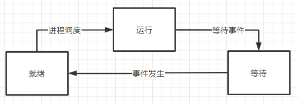

## 第一题

- 先来先服务调度算法

依次执行4、1、2、3作业

| 作业 | 进入系统时间 | 执行时间 | 开始时间 | 完成时间 | 周转时间 | 带权周转时间 |
| :--: | :----------: | :------: | :------: | :------: | :------: | :----------: |
|  1   |    10.00     |   2.00   |  10.00   |  12.00   |   2.00   |      1       |
|  2   |    10.10     |   1.00   |  12.00   |  13.00   |   2.90   |     2.9      |
|  3   |    10.25     |   0.25   |  13.00   |  13.25   |   3.00   |      12      |
|  4   |     9.50     |   0.20   |   9.50   |   9.70   |   0.20   |      1       |

平均周转时间：2.025小时

平均带权周转时间：4.225小时

- 最短作业优先调度算法

依次执行4、3、2、1作业

| 作业 | 进入系统时间 | 执行时间 | 开始时间 | 完成时间 | 周转时间 | 带权周转时间 |
| :--: | :----------: | :------: | :------: | :------: | :------: | :----------: |
|  1   |    10.00     |   2.00   |  10.00   |  12.00   |   2.00   |      1       |
|  2   |    10.10     |   1.00   |  12.25   |  13.25   |   3.15   |     3.15     |
|  3   |    10.25     |   0.25   |  12.00   |  12.25   |   2.00   |      8       |
|  4   |     9.50     |   0.20   |   9.50   |   9.70   |   0.20   |      1       |

平均周转时间：1.8375小时

平均带权周转时间：3.2875小时

- 可见，最短作业优先调度算法性能好些

## 第二题

- 进程状态变迁图

- 调度次序如下：

  | 程序  | 占用时间 |
  | :---: | :------: |
  | 程序A |   30ms   |
  | 程序B |   30ms   |
  | 程序A |   10ms   |
  | 程序C |   20ms   |
  | 程序B |   10ms   |
  | 程序C |   20ms   |

  