## 计算机系统结构

### 一、计算机系统结构基本概念

#### 1.1 多级层次结构

- 应用语言虚拟机
- 高级语言虚拟机
- 汇编语言虚拟机
- 操作系统虚拟机
- 机器语言
- 微程序机器级

#### 1.2 计算机系统结构定义

- 程序员所看到的计算机属性，即概念性结构与功能特性
- 计算机系统中软硬件界面的确定，界面之上是软件功能， 界面之下是硬件和固件功能

#### 1.3 计算机系统结构分类

- 佛林Flynn分类：按照指令流和数据流的多倍性

  - 多倍性：在系统性能瓶颈部件上同时处于同一执行阶段的指令或数据的最大可能个数

- 单指令流单数据流（SISD---Single Instruction Stream Single Data  Stream）

  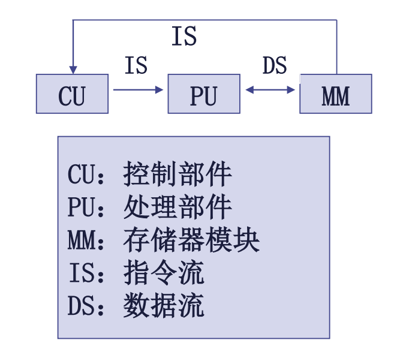

  - 传统顺序处理机：包括单功能部件处理机，多功能部件处理机，标量流水线处理机

- 单指令流多数据流（SIMD---Single Instruction Stream Multiple Data  Stream）

  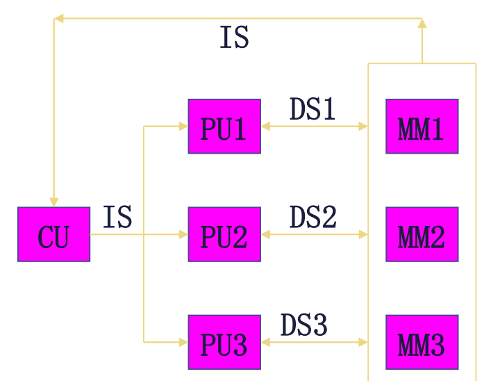

  - 包括并行处理机，阵列处理机，向量处理机，超标量处理机， 超流水线处理机
  - 即多个PU按一定的方式互连，在同一个CU控制下， 并行的对多个数据进行处理

- 多指令流单数据流（MISD---Multiple Instruction Stream Single Data  Stream）

  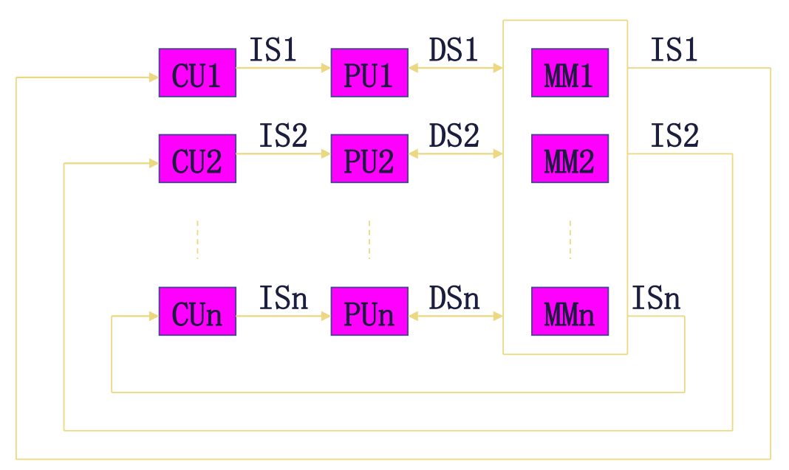

  - 多处理机系统

- 多指令流多数据流（MIMD---Multiple Instruction Stream Multiple  Data Stream）

  - 几条指令对同一个数据进行不同处理，实际上不存在

#### 1.4 定量分析技术

- 基本原则
  - **大概率事件优先**：对于大概率事件（最常见的事件），赋予它优先的处理权和资源使用权，以获得全局的最优结果
  - **Amdahl定律**：加快某部件执行速度所获得的系统性能加速比，受限于该部件在系统中所占的重要性
  - **程序局部性原理**：程序在执行时所访问地址的分布不是随机的，而是相对地簇聚；这种簇聚包括<u>指令</u>和<u>数据</u>两部分
- Amdahl定律
  - 系统中某一部件由于采用某种更快的执行方式后整个系统性能的提高与这种执行方式的使用频率或占总执行时间的比例有关
  - 加速比
    - 系统加速比=$\frac{系统性能_{改进后}}{系统性能_{改进前}}$=$\frac{执行时间_{改进前}}{执行时间_{改进后}}$
    - 可改进比例Fe：可进部分在原系统计算时间中所占的比例
    - 部件加速比Se：可改进部分改进以后的性能提高
    - $执行时间_{改进后}$=不可改进部分执行时间+可改进部分改进后执行时间=$(1-可改进比例)\times执行时间_{改进前}+\frac{可改进比例\times总执行时间_{改进前}}{部件加速比}$=$[(1-可改进比例)+\frac{可改进比例}{部件加速比}]\times执行时间_{改进前}$
    - 系统加速比=$\frac{1}{(1-可改进比例)+\frac{可改进比例}{部件加速比}}$
    - $T_n=T_o\times(1-Fe+\frac{Fe}{Se})$
    - $S_n=\frac{T_o}{T_n}=\frac{1}{1-Fe+\frac{Fe}{Se}}$，当$Se\rightarrow\infty$时，$S_n=\frac{1}{1-Fe}$，可见改进极限受$Fe$的约束
  - 性能递减规则
    - 如果仅仅对计算机中的一部分做性能改进，则改进越多，系统获得的效果越小
    - 如果只针对整个任务的一部分进行优化，那么所获得的加速比不大于$\frac{1}{1-Fe}$
    - 一个“好”的计算机系统：具有高性价比的计算机系统是一个**带宽平衡**的系统，**而不是看它使用的某些部件的性能**
- CPU的性能
  - 时钟频率：与实现技术和工艺有关，单位为MHZ
  - 时钟周期时间CT：一个时钟周期的长度
  - 总时钟周期数：程序运行花费的时钟周期数
  - 指令数IC：程序所处理的指令数
  - 指令时钟数CPI：每条指令平均花费的时钟周期数，$CPI=\frac{总时钟周期数}{IC}$
  - CPU时间：CPU时间=总时钟周期数/时钟频率=总时钟周期数×CT
  - CPU时间=$\frac{\sum\limits_{i=1}^n(CPI_i\times IC_i)}{时钟频率}$
  - CPI=$\frac{\sum\limits_{i=1}^n(CPI_i\times IC_i)}{IC}$
  - $S_n=\frac{T_o}{T_n}=\frac{IC_1\times CPI_1\times CT_1}{IC_2\times CPI_2\times CT_2}$，对于相同程序，$S_n=\frac{CPI_1\times CT_1}{CPI_2\times CT_2}$
- 计算机性能评测
  - 响应时间：完成一个任务的全部时间，包括磁盘访问时间、存储器访问时间、I/O访问时间
  - 吞吐率：单位时间内完成任务数，Bytes/S
  - 两个指标都认为**以最短时间完成指定任务的计算机就是最快的**，但前者针对单任务，后者针对多任务
  - 指令执行速度：MIPS、KIPS、GIPS、TIPS
    - $MIPS=\frac{指令条数}{执行时间\times10^6}=\frac{指令条数}{\frac{CPU时钟周期数\times10^6}{f}}=\frac{f}{CPI\times10^6}$
    - 程序执行时间$Te=\frac{指令条数}{MIPS\times10^6}$
    - $MFLOPS=\frac{浮点操作次数}{执行时间\times10^6}$
- 测试程序
  - 实际应用程序
  - 修正的（或者脚本化）应用程序
  - 核心测试程序
  - 小测试程序
  - 合成测试程序

- 测试程序组件
  - 选择一组各个方面有代表性的测试程序，组成通用测试程序集合
  - 避免独立测试程序存在的**片面性**，尽可能**全面**地测试计算机系统的性能

#### 1.3 计算机体系结构的发展

- 冯诺依曼结构
  - 以运算器为中心
  - 指令和数据同等对待
  - 存储器是线性一维结构
  - 指令顺序执行，由操作码和地址码构成
- 冯诺依曼结构的改进
  - I/O方式的改进：程序控制、DMA、I/O处理机（通道）
  - 并行处理技术
  - 存储器组织结构改进：寄存器组、Cache、相联存储器
  - 指令系统发展：CISC、RISC
- 并行性
  - 计算机系统在同一时刻或者同一时间间隔内进行多种运算或操作
  - 只要在时间上相互重叠，就存在并行性
  - 从处理顺序的角度进行等级划分
    - 字串位串
    - 字串位并
    - 字并位串
    - 全并行
  - 从执行程序的角度进行等级划分
    - 指令内部并行：单个指令中各微操作间的并行
    - 指令级并行
    - 线程级并行
    - 任务级并行
    - 作业级并行
  - 提高并行性
    - 时间重叠：轮流重叠使用硬件的各个部分
    - 资源重复：提供重估的硬件资源
    - 资源共享：采用软件方法实现顺序轮流使用

### 二、流水线

#### 2.1 基本概念

- 流水线技术
  - 把一个重复的过程分解为**若干个子过程**，每个子过程由**专门的功能部件**来实现
  - 把多个处理过程在时间上**错开**，依次通过各功能段，这样，每个子过程就可以与其它的子过程**并行**进行
  - 段：流水线中的每个子过程及其功能部件
  - 深度：流水线的段数
  - 浮点加法流水线：分解为求阶差、对阶、尾数相加、规格化
  - 时空图：横坐标代表时间，纵坐标代表流水线的各个段
  - 流水线中各段的时间应尽可能相等，否则将引起流水线堵塞、断流
    - 时间最长的段将成为流水线的瓶颈
  - 流水寄存器：流水线每一个段的后面都要有一个缓冲寄存器（锁存器）
    - 在相邻的两段之间传送数据，以提供后面要用到的信息，并把各段的处理工作相互隔离
  - 通过时间：第一个任务从进入流水线到流出结果所需的时间
  - 排空时间：最后一个任务从进入流水线到流出结果所需的时间
- 分类
  - 按等级划分
    - 部件级流水线（运算操作流水线）
    - 处理机级流水线（指令流水线）
    - 系统级流水线（宏流水线）
  - 按功能划分
    - 单功能流水线
    - 多功能流水线
      - 静态流水线
      - 动态流水线
  - 按是否有回路划分
    - 线性流水线
    - 非线性流水线：确定什么时候向流水线引进新的任务，才能使该任务不会与先前进入流水线的任务发生冲突——争用流水段
  - 按任务顺序划分
    - 顺序流水线
    - 乱序流水线

#### 2.2 性能指标

- 吞吐率：单位时间内完成的任务数量，$TP=\frac{n}{T_k}$
  - OPS、IOPS、TPS、QPS
  - 各段时间均相等的k段流水线
    - 完成$n$个任务需要的时间为$T_k=k\Delta t+(n-1)\Delta t=(n+k-1)\Delta t$
    - 实际吞吐率$TP=\frac{n}{(n+k-1)\Delta t}$
    - 最大吞吐率$TP_{max}=\frac{1}{\Delta t}$
    - $TP=\frac{n}{n+k-1}TP_{max}$，当$n\gg k$时，流水线性能最佳
  - 各段时间不完全相等的流水线
    - 流水线中**时间最长**的段称为流水线的**瓶颈段**
    - 实际吞吐率$TP=\frac{n}{\sum\limits_{i=1}^k\Delta t_i+(n-1)\max(\Delta t_1,\Delta t_2,\cdots,\Delta t_k)}$
    - 最大吞吐率$TP=\frac{1}{\max(\Delta t_1,\Delta t_2,\cdots,\Delta t_k)}$
    - 解决方法
      - 细分瓶颈段
      - 重复设置瓶颈段硬件
- 加速比：使用流水线前后的时间之比$S=\frac{T_s}{T_k}$
  - 各段时间均相等的k段流水线
    - 实际加速比：$S=\frac{nk}{k+n-1}$
    - 最大加速比：$S_{max}=k$
  - 各段时间不相等的k段流水线
    - 实际加速比：$S=\frac{n\sum\limits_{i=1}^k\Delta t_i}{\sum\limits_{i=1}^k\Delta t_i+(n-1)\max(\Delta t_1,\Delta t_2,\cdots,\Delta t_k)}$
- 流水线效率：流水线设备的利用率
  - 各段时间均相等的k段流水线
    - 各段效率：$e_i=\frac{n\Delta t}{T_k}=\frac{n}{k+n-1}$
    - 实际效率：$E=\frac{ke}{k}=\frac{n}{k+n-1}$
    - 最高效率：$E_{max}=1$
    - $E=TP\cdot\Delta t$
    - $E=\frac{S}{S_{max}}$
    - $E=\frac{n个任务实际占用的时空区}{k个段总的时空区}$
  - 各段时间不相等的k段流水线
    - 实际效率：$E=\frac{n\sum\limits_{i=1}^k\Delta t_i}{k[\sum\limits_{i=1}^k\Delta t_i+(n-1)\max(\Delta t_1,\Delta t_2,\cdots,\Delta t_k)]}$
- 流水线并不能减少（而且一般是增加）单条指令的执行时间，但却能提高**吞吐率**
- 增加流水线的深度（段数）可以提高流水线的性能，但流水线的深度受限于流水线的额外开销

#### 3.3 非线性流水线

- 应按什么样的时间间隔向流水线输入新任务，才能既不发 生功能段使用冲突，又能使流水线有较高的吞吐率和效率

- 启动距离：向一条非线性流水线的输入端连续输入两个任务之间的时间间隔

- 禁用启动距离：会引起非线性流水线功能段使用冲突的启动距离

- 启动距离和禁用启动距离一般都用**时钟周期数**来表示

- 预约表

  - 横向：时钟周期
  - 纵向：功能段
  - 如果在第n个时钟周期使用第k段，则在第k行和第n列的交叉处的格子里有一个√

- 禁止表

  - 由禁用启动距离构成的集合

- 解决步骤

  - **根据预约表写出禁止表**：对于预约表的每一行的任何一对√，用它们所在的列号相减（大减小），列出各种可能的差值，然后删除相同的，剩下的就是禁止表的元素

  - **根据禁止表写出初始冲突向量C0**：该向量是一个N位的二进制位串，满足以下条件
    $$
    c_i = \begin{cases}
       1 &\text i\in F  \\
       0 &\text i \notin F
    \end{cases}\\
    c_i=1表示不允许间隔i个时钟周期后送入后续任务
    $$

  - **根据初始冲突向量画出状态转换图**

    - 计算新的冲突向量：设$C_k$为当前冲突向量，$j$表示允许的时间间隔，则新的冲突向量为$SHR^{(j)}(C_k)\vee C_0$
    - 画出用冲突向量表示的流水线状态转移图：其中有向弧表示状态转移方向
      ，弧上的数字表示引入后续任务所用的时钟周期数

  - **根据状态转换图写出最优调度方案**

    - 根据流水线状态图，由初始状态出发，任何一个闭合回路即为一种调度方案
    - 列出所有可能的调度方案，计算出每种方案的平均时间间隔，从中找出其最小者即为最优调度方案

### 三、指令级并行

#### 3.1 指令级并行的概念

- 分类
  - 基于软件的静态开发方法
  - 基于硬件的动态开发方法
- 程序执行的实际CPI = 理想CPI + 数据冲突/结构冲突/控制冲突带来的额外开销
- 基本程序块：除了入口和出口外，没有其他的分支指令和转入点

#### 3.2 相关与指令级并行

- 消除冲突的方法
  - 保持相关，但避免发生冲突
  - 进行代码变换，消除相关
- 改变程序顺序
  - 不能更改数据流
  - 保持异常行为

#### 3.3 指令的动态调度

- 静态调度：依靠编译器对代码进行静态调度——**把相关的指令拉开距离**（修改<u>程序顺序</u>）以减少相关和冲突
- 动态调度：在程序执行过程中，依靠硬件进行调度
  - 在传统方案中，指令按序流出和执行，如果某条指令停顿，则后续指令也停止前进
  - 可以将指令流出的工作分为两步
    - 检测结构冲突，没有结构冲突就立即流出指令
    - 等待数据冲突消失，流出后的指令一旦操作数就绪即开始执行
  - 将译码阶段分为两部分
    - 流出IS：检测结构冲突
    - 读操作数RO：等待数据冲突消失后读操作数
  - 调整指令执行顺序后，可能会发生WAR和WAW冲突

#### 3.4 动态分支预测

- 在程序运行时，根据分支指令过去的表现来预测其将来的行为

- 分支预测的有效性取决于

  - 预测的**准确性**
  - 预测正确和不正确两种情况下的**分支开销**

- 动态分支预测技术的目的

  - 提高预测分支成功率
  - 尽快找到分支目标地址

- 需要解决的问题

  - 记录分支的历史信息

    - 采用分支历史表BHT（Branch Histoty Table）

      - 一位预测位，记录分支指令最近一次的历史

      - 在ID段判断分支计算目标地址，BHT也是在ID段进行预测，无法带来好处

      - 两位预测位

        - 状态转换图

          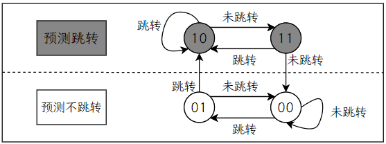

        - 两位分支预测的性能与n位分支预测的性能相近

    - 采用**分支目标缓冲器**BTB

      - 将分支成功的<u>分支指令地址</u>和它的<u>分支目标地址</u>都放到一个缓冲区中保存起来，缓冲区以分支指令的地址作为标识

        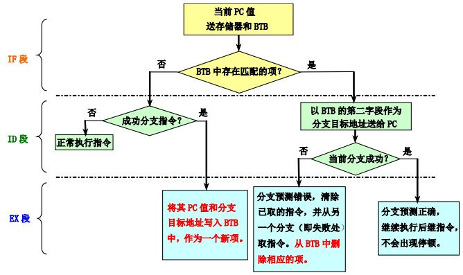

      - 也可以增设一个两位的分支历史预测字段
      
      - 也可以将分支目标地址替换为分支目标地址处的多条指令，形成**分支目标<u>指令</u>缓冲器**

  - 预测分支方向
  
  - 预测错误时恢复现场并从另一条分支路径取指令

#### 3.5 多指令流出技术

- 可以使CPI小于1，即在每个时钟周期流出多条指令
- 多流出处理机
  - 超标量
    - 每个时钟周期流出的指令条数不固定，但上限为n，称为**n-流出处理机**
    - 可以由编译器静态调度，也可以使用Tomasulo算法动态调度
  - 超长指令字VLIW
    - 每个时钟周期流出的指令条数固定 ，构成一条长指令
    - 由编译器静态调度
- 基于静态调度的多流出技术
  - 流出时检测冲突，由**硬件**检测<u>流出的指令间</u>以及<u>流出的指令与正在执行的指令之间</u>是否有冲突，如果有，则只流出发生冲突指令之前的指令
  - 设一个4-流出的超标量处理机，其一次可能流出的指令称为**流出包**
  - 将冲突检测过程也分为**流水线实现**，如先检测流出包内冲突，初步判定可以流出的指令，再检测筛选出的指令与正在执行的指令之间的冲突

- 超长指令字技术
  - 在编译阶段通过指令调度尽可能减少数据冲突，把能够并行执行的多条指令组装成长指令字
  - 指令字被分割为多个字段，每个字段被称为操作槽，直接独立地控制一个功能部件
  - 在指令流出时不需要进行复杂的冲突检测，而是依靠编译器处理
  - 缺点
    - 代码长度增加
    - 锁步机制
    - 代码不兼容

- 处理器的限制
  - 程序固有的指令级并行性
  - 硬件实现的困难
  - 超标量和超长指令字固有的技术限制

- 超流水线处理机
  - 将每个流水段进一步细分，这样在一个时钟周期内能够分时流出多条指令
  - 对于一台每个时钟周期能流出n条指令的超流水线计算机来说，这n条指令不是同时流出的，而是每隔**1/n个时钟周期**流出一条指令

- 并行的类型
  - 指令级并行
  - 线程级并行 
  - 数据级并行

### 四、存储系统

#### 4.1 Cache基本知识

- 层次结构存储器
  - 假设第i个存储器Mi的访问时间为Ti，容量为Si，平均每位价格为Ci
    - 访问时间：T1<T2<…<Tn
    - 容量：S1<S2<…<Sn
    - 平均每位价格：C1>C2>…>Cn
  - 从CPU来看，速度接近于M1，而容量和每位价格都接近于Mn
- 两级存储
  - 存储容量为第二级存储器的容量，即$S=S_2$
  - 每位价格$C=\frac{C_1S_1+C_2S_2}{S_1+S_2}$，当$S_1\ll S_2$时，$C=C_2$
  - 命中率$H=\frac{N_1}{N_1+N_2}$
  - 不命中率$F=1-H$
  - 不命中开销$T_M=T_2+T_B$，从向$M_2$发出访问请求到把数据块调入$M_2$所需的时间，其中$T_B$为把数据块从$M_2$调入$M_1$的时间
  - 平均访问时间$T_A=HT_1+(1-H)(T_1+T_M)=T_1+(1-H)T_M=T_1+FT_M$
- 三级存储系统
  - Cache-主存-辅存
  - 弥补主存的速度不足和容量的不足

#### 4.2 Cache基本知识

- 映射机制
  - 全相联：需要查找
  - 直接相联：主存的第$i$块，被映射到有M块的Cache的第$j$块，满足$j=i\mod{M}$
  - 组相联：主存中的每一块可以被放置到Cache中唯一的一个组中的任何一个位置
    - $n$路组相联：每组中有$n$个块，$n$称为相联度
    - 相联度越高，Cache空间的利用率就越高，块冲突概率就越低，不命中率也就越低，同时查找时间越长
- 查找算法：使用多路比较器
- 替换算法
  - 随机法
  - 先进先出法FIFP
  - 最近最少使用算法LRU——堆栈法实现
    - 用堆栈记录组相联Cache的同一组中各块被访问的先后次序
    - 栈底为该组中最早被访问过的块，栈顶为刚访问过的块
    - 当需要替换时，从栈底得到应该被替换的块地址
    - 当访问命中时，通过块地址在堆栈中相联查找到对应元素并移至栈顶
    - 当访问不命中时，压入本次访问的块地址，如果没有空闲位置，则需要挪出栈底元素
    - 每一组均需要设置一个项数与相联度相同的堆栈
    - 速度较低且成本较高
  - 对于容量很大的Cache，LRU和随机法的命中率差别不大
- 写策略
  - 写操作占访存操作的7%，占访问数据Cache操作的25%
  - 写直达/写穿WT
    - 不仅写入Cache还写入下一级存储器
    - 进行写操作时CPU必须等待直到操作结束，称为CPU写停顿
    - 采用按写分配
  - 写回法WB
    - 只写入Cache，仅当相应块被替换时才写回主存
    - 需要设置**标志位**
    - 采用不按写分配
  - 写操作调块方法
    - 按写分配
      - 写不命中时，先将所写单元所在的块调入Cache然后再写入
    - 不按写分配
      - 写不命中时，直接写入下一级存储器
- 性能分析
  - 不命中率
  - 平均访存时间=命中时间+不命中率×不命中开销
  - 存储器停顿时钟周期数＝“读”的次数×读不命中率×读不命中开销＋“写”的次数×写不命中率×写不命中开销
  - 存储器停顿时钟周期数＝访存次数×不命中率×不命中开销
  - CPU时间＝（CPU执行周期数+存储器停顿周期数）×时钟周期时间
  - CPU时间=IC×（CPI+每条指令的平均访存次数×不命中率×不命中开销）×时钟周期时间

#### 4.3 降低不命中率

- 不命中类型
  - 强制性不命中
    - 冷启动不命中，首次访问不命中
    - 不受Cache容量影响
    - 增加块大小，预取
  - 容量不命中
    - 某个块被替换后又被访问
    - 容量越大则越少
    - 增加容量
  - 冲突不命中
    - 碰撞不命中
    - 相联度越高则越少
    - 提高相联度，理想情况下即为全相联
  - 许多降低不命中率的方法会增加命中时间或不命中开销
- 降低不命中率的方法
  - 增加块大小：Cache容量一定时，增加块大小，减少强制性不命中，但块数目减少，增加冲突不命中
  - 增加Cache容量：增加成本，可能增加命中时间
  - 提高相联度：增加命中时间
  - 伪相联Cache（列相联）
  - 硬件预取
    - 指令和数据都可以预取
    - 预取内容既可放入Cache，也可放在外缓冲器，例如：指令流缓冲器
    - 指令预取通常由Cache之外的硬件完成
    - 预取应利用存储器的空闲带宽，不能影响对正常不命中的处理，否则可能会降低性能
  - 编译器控制的预取
  - 编译器优化
    - 程序代码和数据重组
      - 重新排序程序中的过程，减少冲突不命中
      - 基本块对齐，减少顺序代码执行时的Cache不命中
    - 如果编译器发现某个分支指令很可能会成功转移
      - 将转移目标处的基本块和紧跟着该分支指令后的基本块进行对调
      - 把该分支指令换为操作语义相反的分支指令
  - 牺牲Cache
    - 在Cache和它从下一级存储器调数据的通路之间设置一个全相联的小Cache，用于存放**被替换出去的块**(称为牺牲者)，以备重用

#### 4.4 减少不命中开销

- 两级Cache

  - 第一级Cache(L1)小而快，第二级Cache(L2)容量大

  - 平均访存时间 ＝ 命中时间L1＋不命中率L1×不命中开销L1

  - 不命中开销L1 ＝ 命中时间L2＋不命中率L2×不命中开销L2

  - 平均访存时间 ＝ 命中时间L1＋不命中率L1×（命中时间L2＋不命中率L2×不命中开销L2）

  - 局部不命中率＝该级Cache的不命中次数/到达该级Cache的访问次数

  - 全局不命中率＝该级Cache的不命中次数/CPU发出的访存的总次数

  - 全局不命中率L2＝不命中率L1×不命中率L2

    > 评价第二级Cache时，应使用全局不命中率这个指标。它指出了在CPU发出的访存中，究竟有多大比例是穿过各级Cache，最终到达存储器的

  - 每条指令的平均访存停顿时间＝ 每条指令的平均不命中次数L1×命中时间L2＋每条指令的平均不命中次数L2×不命中开销L2

  - 第二级Cache容量较大，可以尽量消除容量不命中，因此可采用较高的相联度或伪相联方法减少冲突不命中

  - 为减少平均访存时间，可以让容量较小的第一级Cache采用较小的块，而让容量较大的第二级Cache采用较大的块

- 读不命中优先于写

- 写缓冲合并

  - 把这次的写入地址与写缓冲器中已有的所有地址进行比较，看是否有匹配的项
  - 如果有地址匹配而对应的位置又是空闲的，就把这次要写入的数据与该项合并

- 请求字处理

- 非阻塞Cache

#### 4.5 减少命中时间

- 容量小、结构简单的Cache
- 虚拟Cache
  - 直接用**虚拟地址**进行访问的Cache
  - 标识存储器中存放的是虚拟地址，进行地址检测用的也是虚拟地址
  - 在命中时不需要地址转换，省去了地址转换的时间。
  - 即使不命中，地址转换和访问Cache也是并行进行的，其速度比物理Cache快很多
  - 需要在地址标识中增加**PID字段(进程标识符)**
- 流水化访问Cache

#### 4.6 虚拟存储器

- 页式虚拟存储器
- 段式虚拟存储器
- 页表缓冲器TLB
  - 表项由标识和数据两部分组成
- AMD Opteron
  - TLB包含40个项，使用全相联映射
  - 采用多级分层页表结构来映射地址空间，以便使页表大小合适
  - 页表项采用64位，前12位保留，最后12位为保护和使用信息
  - 页表项主要包含存在位、读写权限位、用户/管理位、脏位、访问位、页面大小、非执行位、页级Cache使能、页级写直达
  - 使用4个TLB以减少地址转换时间
    - 两个用于访问指令，两个用于访问数据
    - 通过采用两个更大的第二级TLB来减少TLB不命中

### 五、输入输出系统

#### 5.1 I/O系统的性能

- I/O系统包括I/O设备和I/O设备与处理机的连接
- 系统的响应时间：包括I/O系统的响应时间和CPU处理时间

#### 5.2 I/O系统的可靠性、可用性和可信性

- 可靠性：系统从某个初始参考点开始一直连续提供服务的能力
  - 使用平均无故障时间MTTF衡量
  - 中断服务的时间用平均修复时间MTTR衡量
  - 系统失效率为MTTF的倒数
- 可用性：系统正常工作的时间在连续两次正常服务间隔时间中所占的比率
  - 可用性=$\frac{MTTF}{MTTF+MTTR}$
  - 平均失效间隔时间$MTBF=MTTF+MTTR$
- 可靠性模型
  - 串联系统
    - 系统由n个部件串联而成，其中任何一个部件失效就引起系统的失效
    - 串联系统寿命等于其中最先失效部件的寿命
    - $R_s=\prod\limits_{i=1}^{n}R_i$
  - 并联系统
    - 系统由n个部件并联而成，当这n个部件都失效时才引起系统失效
    - 并联系统寿命等于其中最后失效部件的寿命
    - $R_s=1-\prod\limits_{i=1}^{n}(1-R_i)$
  - 混合系统
    - 在各单元相同情况下，用n代表串联倍数，m代表并联倍数
    - 串并联系统：先串联、后并联，可靠度$R(t)=1-[1-R_i^n(t)]^m$
    - 并串联系统：先并联、后串联，可靠度$R(t)=[1-(1-R_i(t))^m]^n$
    - RAID0+1是串并联系统，RAID1+0是并串联系统
  - 增强系统可靠性
    - 提高通道、数据冗余度
    - 提高各部件可靠性
      - 有效构建方法
      - 纠错方法
    - 采用双控制器

#### 5.3 RAID

- 磁盘阵列DA

  - 使用多个磁盘组合代替一个大容量的磁盘
  - 多个磁盘并行工作
  - 以条带为单位把数据均匀地分布到多个磁盘上，可以使多个数据读/写请求并行地被处理

- 并行性

  - 多个独立的请求可以由多个盘来并行地处理：减少了I/O请求的排队等待时间
  - 如果一个请求访问多个块，就可以由多个盘合作来并行处理：提高了单个请求的数据传输率
  - 阵列中磁盘数量的增加会导致磁盘阵列可靠性的下降
    - 如果使用了N个磁盘构成磁盘阵列，那么整个阵列的可靠性将降低为单个磁盘的1/N
    - 在磁盘阵列中设置冗余信息盘：当单个磁盘失效时，丢失的信息可以通过冗余盘中的信息重新构建

- RAID0

  - 非冗余磁盘阵列，无冗余信息

- RAID1

  - 镜像磁盘，对所有的磁盘数据提供一份冗余的备份
  - 能实现快速的读取操作，可靠性很高，数据的恢复很简单
  - 实现成本最高

- RAID2

  - 存储器式的磁盘阵列（汉明纠错码）

  - 含4个数据盘的RAID2

    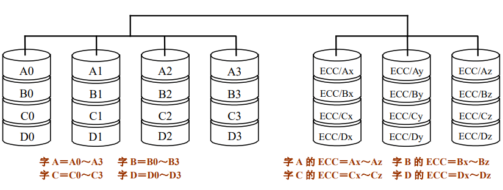

- RAID3

  - 位交叉奇偶校验磁盘阵列

    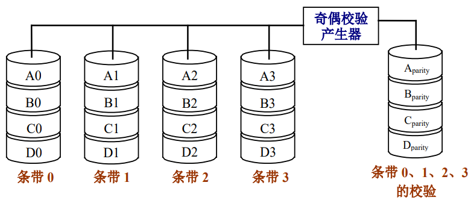

  - 写数据时：为每行数据形成奇偶校验位并写入校验盘

  - 读出数据时：如果控制器发现某个磁盘出故障，就可以根据故障盘以外的所有其他盘中的正确信息恢复故障盘中的数据。（通过异或运算实现）

  - 只需要一个校验盘，校验空间开销比较小

- RAID4

  - 块交叉奇偶校验磁盘阵列

  - 采用比较大的条带，以块为单位进行交叉存放和计算奇偶校验

    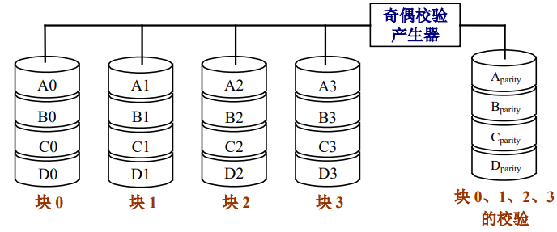

  - 写入操作

    - 有4个数据盘和一个冗余盘
    - 写数据需要2次磁盘读和2次磁盘写操作

- RAID5

  - 块交叉分布奇偶校验磁盘阵列

  - 数据以块交叉的方式存于各盘，无冗余盘，奇偶校验信息均匀分布在所有磁盘上

    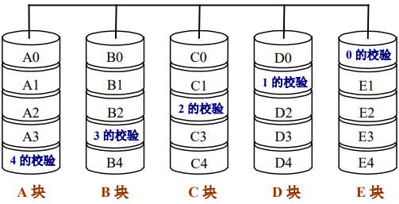

- RAID6

  - P+Q双校验磁盘阵列

  - 校验空间开销是RAID5的两倍

  - 容忍两个磁盘出错

    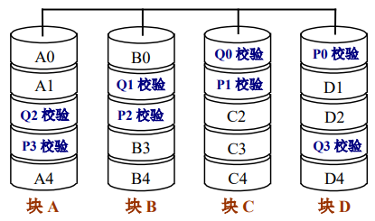

- RAID1+0：先进行镜像（RAID1），再进行条带存放（RAID0）

- RAID0+1：先进行条带存放（RAID0），再进行镜像（RAID1）

### 六、互连网络ICN

#### 6.1 互连网络概念

- 基本概念

  - 使用互连网络连接处理器、内存、I/O设备，使其能够进行高效的数据交换，实现并行工作
    - CPU内多核之间
    - **CPU处理器之间**
    - **CPU和内存之间**
    - 内存和内存之间
    - 计算机节点之间
    - 网络与网络之间——网际网，如互联网

  - 互连网络是SIMD计算机和MIMD计算机的重要组成部分
  - 目标：在最少传输延迟（成本、能耗）约束内，传输尽可能多的数据，避免成为系统瓶颈

- 要素

  - 网络元件（结点）：处理器、存储器等设备
  - 互连结构：静态连接拓扑
  - 控制方式：动态传输机制（寻径算法）

- 基本操作

  - 置换N-N：N个节点间同时传输数据
  - 广播1-N：一个节点向N个节点传输数据
  - 选播1-N‘：一个节点向特定节点传输数据

- 特性参数

  |    名称     |                           含义                            |               功能               |
  | :---------: | :-------------------------------------------------------: | :------------------------------: |
  |  网络规模N  |                      网络中节点个数                       |                                  |
  |   节点度d   |                    与结点相连接的边数                     |                                  |
  |  节点距离   |                                                           |                                  |
  |  网络直径D  |                 任意两节点间距离的最大值                  |                                  |
  |  等分宽度b  | 把N个节点的网络分成节点数相同的两部分时沿切口边数的最小值 |                                  |
  |  通道宽度w  |                         用位表示                          |                                  |
  | 线等分宽度B |                           B=b×w                           |           网络最大流量           |
  |   对称性    |           从任何结点看到的拓扑结构都相同的网络            |                                  |
  |  通信时延   |            软件开销+通道时延+选路时延+竞争时延            | 从源结点到目的结点发送消息的时间 |
  |  网络时延   |                     通道时延+选路时延                     |          由网络硬件决定          |
  |  端口带宽   |       单位时间内从该端口传送到其他端口的最大信息量        |                                  |
  |  聚集带宽   |                    网络规模×端口带宽/2                    |                                  |

#### 6.2 互连函数（置换函数、排列函数）

- 描述输入端和输出端的连接关系

  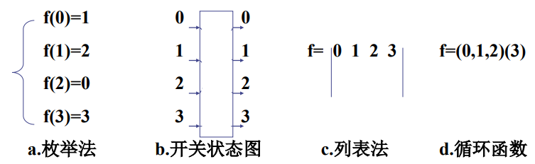

- 恒等函数：$I(x_{n-1}\cdots x_1x_0)=x_{n-1}\cdots x_1x_0$
- 交换函数
  - $E(x_{n-1}\cdots x_{k+1}x_kx_{k-1}\cdots x_1x_0)=x_{n-1}\cdots x_{k+1}\overline{x_k}x_{k-1}\cdots x_1x_0$
  - 共有n＝$\log_2N$种互连函数
- 立方体互连函数
  - 交换函数中N=8时得到n=3个互连函数
  - $Cube_0(x_2x_1x_0)=x_2x_1\overline{x_0}$
  - $Cube_1(x_2x_1x_0)=x_2\overline{x_1}x_0$
  - $Cube_2(x_2x_1x_0)=\overline{x_2}x_1x_0$
- 逆函数：如果$f(x)\times g(x)=I(x)$，则二者互为逆函数
- 均匀洗牌函数（混洗函数、shuffle函数）
  - $\sigma(x_{n-1}x_{n-2}\cdots x_1x_0)=x_{n-2}x_{n-3}\cdots x_1x_0x_{n-1}$
  - 第k个子函数
    - 把输入端的二进制编号中的低k位循环左移一位
    - $\sigma_{(k)}(x_{n-1}x_{n-2}\cdots x_1x_0)=x_{n-1}x_{n-2}\cdots x_k\,\,\,x_{k-2}\cdots x_1x_0x_{k-1}$
  - 第k个超函数
    - 把输入端的二进制编号中的高k位循环左移一位
    - $\sigma^{(k)}(x_{n-1}x_{n-2}\cdots x_1x_0)=x_{n-2}\cdots x_{n-k}x_{n-1}\,\,\,x_{n-k-1}\cdots x_1x_0$
- 逆均匀洗牌函数
  - 将输入端的二进制编号**循环右移一位**而得到所连接的输出端编号
  - 与均匀洗牌函数互为逆函数
- 碟式函数
  - 最高位与最低位互换位置
  - $\beta(x_{n-1}x_{n-2}\cdots x_1x_0)=x_0x_{n-2}x_{n-3}\cdots x_1x_{n-1}$
  - 第k个子函数
    - 把输入端的二进制编号中的低k位中最高位与最低位互换位置
    - $\beta_{(k)}(x_{n-1}x_{n-2}\cdots x_1x_0)=x_{n-1}x_{n-2}\cdots x_k\,\,\,x_0x_{k-2}\cdots x_1x_{k-1}$
  - 第k个超函数
    - 把输入端的二进制编号中的高k位中最高位与最低位互换位置
    - $\beta^{(k)}(x_{n-1}x_{n-2}\cdots x_1x_0)=x_{n-k}x_{n-2}\cdots x_{n-k+1}x_{n-1}\,\,\,x_{n-k-1}\cdots x_1x_0$
- 反位序函数
  - 将输入端二进制编号的位序颠倒
  - $\rho(x_{n-1}x_{n-2}\cdots x_1x_0)=x_0x_1\cdots x_{n-2}x_{n-1}$
  - 第k个子函数
    - 把输入端的二进制编号中的低k位颠倒
    - $\rho_{(k)}(x_{n-1}x_{n-2}\cdots x_1x_0)=x_{n-1}x_{n-2}\cdots x_k\,\,\,x_0x_1\cdots x_{k-2}x_{k-1}$
  - 第k个超函数
    - 把输入端的二进制编号中的高k位颠倒
    - $\rho^{(k)}(x_{n-k}x_{n-1}x_{n-2}\cdots x_1x_0)=x_{n-k}x_{n-k+1}\cdots x_{n-2}x_{n-1}\,\,\,x_{n-k-1}\cdots x_1x_0$
- 移数函数
  - $\alpha(x)=(x±k)\mod  N$，且$1≤x≤N-1，1≤k≤N-1$
- PM2I函数（加减$2^i$函数）
  - 特殊的移数函数
  - $PM2_{+i}(x)=x+2^i\mod N$
  - $PM2_{-i}(x)=x-2^i\mod N$
  - 其中$0≤x≤N－1,0≤i≤n－1,n＝\log_2N$
  - PM2I互连网络共有2n个互连函数

#### 6.3 低维静态互连网络

- 各结点之间有**固定**的连接通路、且在运行中**不能改变**的网络

- 线性阵列
  - 一种一维的线性网络，其中N个结点用N-1个链路连成一行
  - 端结点度：1
  - 其余节点度：2
  - 直径：N-1
  - 等分宽度b：1
- 环
  - 用一条附加链路将线性阵列的两个端点连接起来而构成
  - 可以单向工作，也可以双向工作
  - 对称网络
  - 节点度：2
  - 单向环直径：N
  - 双向环直径：N/2
  - 等分宽度b：2
- 带弦环
  - 增加的链路愈多，结点度愈高，网络直径就愈小
- 全连接网络
  - 特殊的带弦环
  - 直径：1
- 循环移数网络
  - 通过在环上每个结点到所有与其距离为2的整数幂的结点之间都增加一条附加链而构成
  - 结点度：2n－1
  - 直径：n/2
  - 网络规模N：$2^n$
- 树形网络（k层完全平衡二叉树）
  - 最大结点度：3
  - 直径：2（k-1）
  - 等分宽度b：1
- 胖形树
- 星形网络
  - 最大节点度：N-1
  - 直径：2
  - 等分宽度b：$\lfloor\frac{N}{2}\rfloor$
  - 可靠性较差，中心结点出故障，整个系统就会瘫痪
- 网格形
  - 大小为N=n×n的2维网络形网格
  - 内部节点的度：4
  - 边结点的度：3
  - 角结点的度：2
  - 网络直径：2（n-1）
  - 等分宽度：n
  - 一个由N=$n^k$个结点构成的k维网格形网络（每维n个结点）的内部结点度d=2k，网络直径D=k(n-1) 
- Illiac网格
  - 把2维网格形网络的每一列的两个端结点连接起来，再把每一行的尾结点与下一行的头结点连接起来，并把最后一行的尾结点与第一行的头结点连接起来
  - 所有结点的度d=4
  - 网络直径D=n-1
  - Illiac网络的直径只有纯网格形网络直径的一半
  - 等分宽度：2n
- 环网形
  - 把2维网格形网络的每一行的两个端结点连接起来，把每一列的两个端结点也连接起来
  - 结点度：4
  - 网络直径：$2\times\lfloor\frac{n}{2}\rfloor$
  - 等分宽度b=2n

#### 6.4 单级ICN

- 单级立方体网（Cube网）

  - $Cube_i(X_{n-1}\cdots X_{k+1}X_kX_{k-1}\cdots X_0)=X_{n-1}\cdots  X_{i+1}\overline{X_i}X_{i-1}\cdots x_0$
  - 最坏情况下的传输需对输入结点编号的全部n位取反，所以网络直径是n
  - 成本$N\log_2N$
  - 寻径算法：二者间路径由地址逻辑差$y_i⊕x_i$决定。$y_i⊕x_i=1$代表$Cube_i$
    维需要走一步，各维先后顺序可任意安排，1的个数即是总步数

- 单级混洗-交换网

  - 由shuffle和$Cube_0$定义
    $$
    shuffle(j) = \begin{cases}
       j循环左移一位 &\text j<N-1\in F  \\
       N-1 &\text j=N-1 \notin F
    \end{cases}
    $$

  - 最远的两个出入端口是全0和全1，其连接需要经过n次交换和n-1次混洗操作，故网络直径是2n-1

  - 成本为2N

  - 寻径算法：二者间路径由地址逻辑差$y_i⊕x_i$决定。$y_i⊕x_i=1$代表$x_i$须先经$n-i$步shuffle到最低位，$1$步$Cube_0$求反，再经$i$步shuffle回到原位变成$y_i$。如有多位1，可以合并shuffle

- 单级PM2I网

#### 6.5 动态互联网络

- 总线网络

  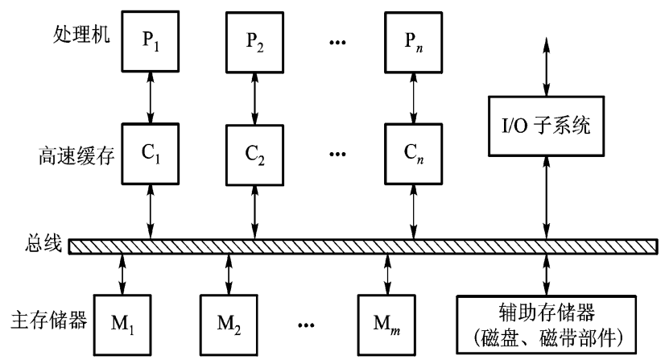

  - 由一组导线和插座构成，经常被用来实现计算机系统中处理机模块、存储模块和外围设备等之间的互连
  - 每次总线只能用于**一个**源（主部件）到一个或多个目的（从部件）之间的数据传送
  - 需要考虑争用问题，如时分总线
  - 解决带宽较窄问题
    - 多总线方式（功能不同）
    - 多层次总线（速度不同）

- 交叉开关网络（单级开关网络）

  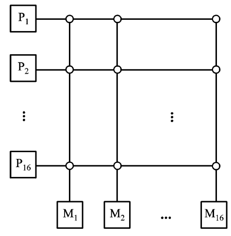

  - 交叉点开关能在**对偶**（源、目的）之间形成动态连接，同时实现多个对偶之间的**无阻塞连接**
  - 一个n×n的交叉开关网络，可以无阻塞地实现n!种置换，但同时需要$n^2$套交叉点开关和大量连线，成本较高

- 多级互连网络MIN（Multistage Interconnection Network）

  - 在交叉开关网络的基础上，将大规模的交叉开关分解为较小开关

  - 在N个节点的网络中，多级ICN由n级构成($n=\log_2N$)

  - 在相邻各级开关之间有固定的级间**互连函数**连接，一般决定了MIN的名称，如多级立方体网，**多级混洗交换网**，多级PM2I网

  - 最常用开关为二元交换开关

    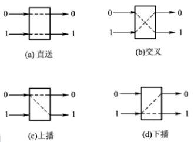

    - 基本状态有直连、交换 、上播、下播
    - 进行数据置换时只能使用直连、交换

  - 不同的MIN的区别在于其开关模块、控制方式和级间互联函数不同

    - 控制方式
      - 级控制：**每一列**开关使用一个控制信号
      - 单元控制：**每一个**开关使用独立控制信号
      - 部分级控制：第i列开关用i个信号控制

- 多级混洗-交换网络（Omega网络）

  - 共有$n=\log_2N$级
  - 每级$\frac{N}{2}$个开关，每个开关采用单元控制方式，共需要$\frac{N\log_2N}{2}$个开关
  - 级间互连采用均匀洗牌函数，依次为$n-1$、$n-2$、$\cdots$、$0$级
  - 每一级混洗函数均进行一次shuffle操作
  - 寻径算法：实现节点间通讯
  - 源-目的地址异或法
    - 将任一个输入地址与它要到达的输出地址作异或运算，其结果的$bit_i$位控制数据到达的第$i$级开关，“0”表示“直连”，“1”表示“交换”
    - 或者根据输出地址判断：1表示从下输出，0表示从上输出
  - Omega网络是一个阻塞网络
    - 需要解决不同传输对同一个开关的不同要求冲突
    - 阻塞的充分条件
      - 必要1：两个消息在某一级到达同一个开关
        - 比较它们在各级的行号，是否在第$i$级恰好仅第$i$位不同
      - 必要2：两个消息在到达的同一个开关上操作相反
        - 逐位比较双方的控制函数

### 七、多处理机

- CPI=基本CPI+远程访问率×远程访问开销
