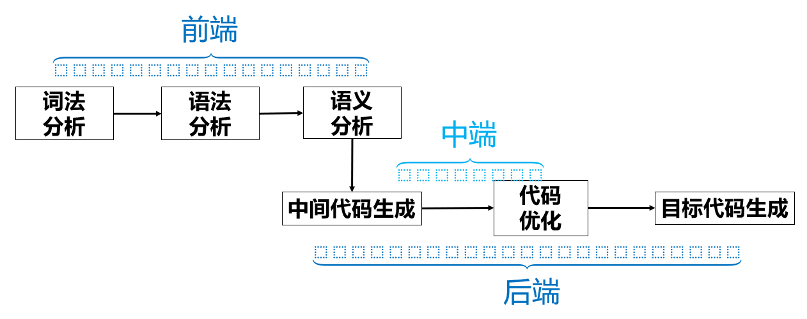
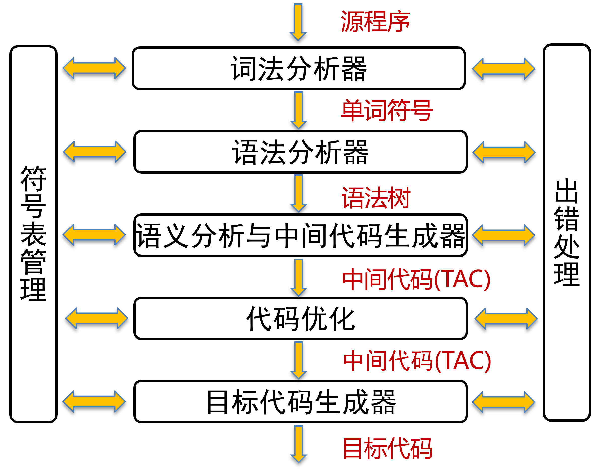
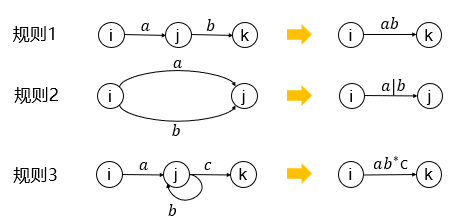
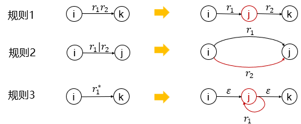
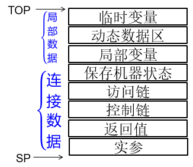

[TOC]

## 细节

- 引论
  - 前后端分离的意义
  - 编译每个阶段做了什么、编译程序的结构
- 文法与语言
  - 如何设计上下文无关文法
  - 文法类型
  - 规范推导、规范归约、规范句型、右句型
- 词法分析
  - 正规文法就是右线性3型文法
  - DFA、NFA都是一个初始状态、多个结束状态
  - NFA到DFA的子集法转换、DFA如何最小化
  - 正规文法、正规式、有穷自动机之间的转换
  - 由正规文法转换到NFA时先删除无用产生式
- LL(1)
  - FOLLOW集的求解
  - 如何提取公因子、如何消除左递归
  - 如何构造分析表
  - **<u>产生式推导时压栈的方向</u>**
- LR(1)
  - 如何构造识别活前缀的NFA（**<u>拓广文法、什么是使用LR(0)项目构造NFA、哪个是acc状态</u>**）
  - 分析表怎么画、有几个栈、发生移进或归约时怎么做、遇到空规则归约怎么办
  - 什么是LR(0)、SLR(1)、LR(1)、LALR(1)文法
  - 合并LR(1)同心项目集，若仍无冲突⟹LALR(1)
  - 如何构造展望符（注意是$\beta\alpha$，注意合并，注意继承）
- 语义计算
  - 什么是综合属性、继承属性，分别在哪里计算，在语法树中表现为什么
  - 如何构造产生式的语义规则
  - 如何进行中间代码生成
- 代码优化
  - 如何求必经结点集、回边、自然循环、基本归纳变量、同族的归纳变量
  - <u>**删除基本归纳变量时注意初始化归纳变量**</u>
  - <u>**进行数据流分析时注意使用最新的值**</u>
  - 什么是UD链、DU链

## 一、引论

- 名词释义

  - 编译程序
    - 一个语言的翻译程序（将源程序翻译成目标程序的程序）
    - 先翻译后执行，一次翻译，多次执行
  - 解释程序
    - 翻译程序的一种
    - 边翻译边执行，翻译一句执行一句，一次翻译，一次执行
    - 每次执行都离不开解释程序

- 编译过程

  

  - 前端
    - 与源语言有关，与目标机器无关
  - 后端
    - 与目标机器有关，与源语言无关
  - 词法分析
    - 扫描源程序，将源程序识别出一个一个单词（token）
    - 分析结果是二元组：（token的类型，token的值）
    - 相关错误：单词不符合标准或无法识别，如非法标识符，非法数字（整数、浮点数）
  - 语法分析（Parsing、语法检查、归约、推导）
    - 将token串，转换成体现语法规则的树状数据结构，叫做抽象语法树（AST，Abstract Syntax Tree）
    - 相关错误：else没有匹配的if
  - 语义分析（Syntax Analysis）
    - 根据上下文，分析每个单词的意义，并收集必要的信息如类型、目标地址
    - 相关错误：函数名、数组名混用，int和float混用，变量重复声明函数调用的参数不对应，float类型当下标，数组下标越界，函数未定义，变量未声明
  - 中间代码生成
    - 根据语法分析推导出三地址码TAC
  - 代码优化
    - 优化中间代码，使得占用空间更少、运行速度更快
  - 目标代码生成
    - 生成依赖于特定机器的汇编代码
  - 符号表管理
    - 记录源程序中使用的各种符号名称
    - 收集符号的属性信息，类型、作用域、分配存储信息
    - 登录：扫描到说明语句就将标识符登记在符号表中
    - 查找：在执行语句查找标识符的属性，判断语义是否正确
  - 错误处理
    - 报告出错信息，排错
    - 恢复编译工作

- 编译程序的结构

  

## 二、文法与语言

- 名词释义

  - 字母表
    - 字母表$∑$是非空有穷集合，其元素称为符号
  - 符号串
    - 由字母表$∑$中的符号组成的有穷序列，称为 (字母表$∑$上的)符号串
    - 不含任何符号的有穷序列称为空串,记为$ε$
    - 符号串长度记为$|\alpha|$，且$|ε|=0$
    - 运算：连接、或、方幂、正闭包、星闭包
  - 符号串集合
    - 如果集合$A$的元素都是字母表$∑$上的符号串，则称集合$A$为$∑$上的符号串集合，简称**串集**
    - 运算：乘积、和、方幂、正闭包、星闭包
    - 若$ A $为任一字母表，则$ A^* $是该字母表上的所有符号串（含空串）的集合

- 文法

  - 文法$G$定义为四元组$G=(V_N,V_T,P,S)$
  - $V_N$为非空有穷的非终结符集合
  - $V_T$为有穷的终结符集合
  - $V=V_N\cup V_T$称为文法的字母表，且$V_N\cap V_T=\Phi$
  - $P$是非空有穷的规则集合（产生式集合）
  - $S\in V_N$，称为文法的起始符

  - 直接推导与直接归约
    - 由$P$中的规则直接进行的串推导称为直接推导或一步推导
    - 由$P$中的规则直接进行的串归约称为直接归约或一步归约
  - 多步推导与多步规约
    - 由串$\alpha$经过$n$步推导出$\beta$，记作$\alpha\xRightarrow{+}\beta$称之为多步推导，相应地有多步归约
  - 直接推导与多步推导可以记为$\alpha\xRightarrow{*}\beta$
  - 句型：如果$G[S]$满足$S\xRightarrow{*}\beta$，则$\beta$为$G[S]$的句型
  - 句子：如果$\beta\in V_T^*$，则$\beta$为$G[S]$的句子；句子也是句型
  - 语言：文法$G$的句子集合，记为$L(G)$
  - 文法等价：如果$L(G_1)=L(G_2)$，则$G_1$与$G_2$等价

- 文法类型（乔姆斯分类法）

  - 0型文法（短语文法、图灵机）：规则左部至少含有一个非终结符
  - 1型文法（上下文有关文法、线性有限自动机）：规则左部至少含有一个非终结符；规则左部长度不大于右部长度（空规则除外）
  - 2型文法（上下文无关文法）：规则左部均为1个非终结符
  - 3型文法（正则文法、正规文法、有限自动机）
    - 右线性文法：$A\rightarrow\varepsilon|a|aB$
    - 左线性文法：$A\rightarrow\varepsilon|a|Ba$

- 语法树

  - 最左推导：任何一步$a\Rightarrow b$都是对$a$中的最左非终结符进行替换
  - 最右推导（规范推导）：任何一步$a\Rightarrow b$都是对$a$中的最右非终结符进行替换
  - 由规范推导所得的句型，称为规范句型（右句型）
  - 规范推导的逆过程，叫做规范归约
  - 语法树满足下列条件
    - 文法的开始符$S$为树的根节点
    - 对任意产生式$A→α,α∈(V_N∪V_T)^∗$，$α$的各符号严格依生产式的次序依次为$A$的子节点
    - 非叶子结点一定是非终结符
    - 全部叶子结点组成的符号串从左往右读就是文法的句子
  - 如果文法G的某个句子存至少两棵不同的语法树，则称文法G是**二义性**的

- 句型分析

  - 符号串$α$是否符合语言$L$的语法问题，被等价地转化成“推导或归约问题“
  - 推导法还是归约法？自顶向下还是自底向上？
  - 自顶向下分析：最左推导，穷举规则
  - 自底向上分析：移进归约
  - 短语：语法树中每个内部节点对应一个子语法树，每个子语法树的所有叶节点构成短语
  - 直接短语：若内部节点的子节点均为叶节点，则该内部节点对应的短语为直接短语
  - 句柄：最左的直接短语

## 三、词法分析

- 词法分析器（扫描器、Scanner）

  - 输入：源程序
  - 输出：（token的类型，token的值）
  - 类型：关键字、标识符、字面量（常量）、运算符、界符

- 正规文法：即右线性3型文法

- 正规式（正则表达式）

  - $𝜀$和$𝜙$都是正规式，其正规集分别是${ε}$和$𝜙$
  - $∀𝑎∈∑$，则$ 𝑎$是$∑$上的正规式，其正规集为$ {a}$
  - 如果$r$和$s$都是$∑$上的正规式，则（算符优先级由高到低 ：*，·，|）
    - $(r)$是正规式，它表示的正规集为$L(r)$
    - $r|s$是正规式，它表示的正规集为$L(r)∪L(s)$
    - $r·s$是正规式，它表示的正规集为$L(r)·L(s)$
    - $r^*  $是正规式，它表示的正规集为$L(r^*)＝L(r)^*$
  - 若两个正规式所表示的正规集相同，则称这两个正规式等价
  - 如果正规式$r$和文法$G$，有$L(r)＝L(G)$则称正规式$r$和文法$G$是等价的

- 正规式转换为正规文法

  |       |    正规式产生式     |                          文法产生式                          |
  | :---: | :-----------------: | :----------------------------------------------------------: |
  | 规则1 |  $A\rightarrow xy$  |               $A\rightarrow xB,B\rightarrow y$               |
  | 规则2 | $A\rightarrow x^*y$ | $A\rightarrow xB,A\rightarrow y,B\rightarrow xB,B\rightarrow y$ |
  | 规则3 | $A\rightarrow x|y$  |               $A\rightarrow x,A\rightarrow y$                |

- 正规文法转换为正规式

  |       |            文法产生式            |    正规式产生式     |
  | :---: | :------------------------------: | :-----------------: |
  | 规则1 | $A\rightarrow xB,B\rightarrow y$ |  $A\rightarrow xy$  |
  | 规则2 |       $A\rightarrow xA|y$        | $A\rightarrow x^*y$ |
  | 规则3 | $A\rightarrow x,A\rightarrow y$  | $A\rightarrow x|y$  |

- 有穷自动机

  - 不确定的有穷自动机(Nondeterministic Finite Automata/NFA)：输入符号包括$ε$，一个符号可以标记在离开同一个状态的多条边上

  - 确定的有穷自动机(Deterministic Finite Automata/DFA)：输入符号不含$ε$，每个状态以及每个符号，最多只有一条边

  - DFA

    - 由$M=(K,\Sigma,f,S,Z)$表述

    - $f$指状态转移函数集合，为$K\times\Sigma\rightarrow K$的单值部分映射

      > $f(k_i,a)=k_j$表示：当当前状态为$k_i$，输入字符为$a$时，将状态转换到下一状态$k_j$，$k_j$称为$k_i$的一个后继状态

    - 以箭头指向的状态为起始状态（只有一个），双圈状态为结束状态（可有多个）

  - NFA

    - $f$指状态转移函数集合，为$K\times(\Sigma\cup\{\epsilon\})\rightarrow P(K)$的单值部分映射，其中$P(K)$表示$K$的幂集
    - 如果$α\in\Sigma^*$，$f^{'}(S,α)∩Z≠Φ$，则称符号串$α$是$NFA\,\,\,\, M$所接受的

  - NFA到DFA的转换——子集法

    - 若对于$NFA\,\,\,\, M$有$I\subset K,α\in\Sigma^*$，则$Move(I,a)=\displaystyle\cup_{q\in I}f(q,a)$
    - 定义$\epsilon-Closure(I)\cup=Move(\epsilon-Closure(I),\epsilon)$
    - 以$\epsilon-Closure(\{s_0\})$为初始状态$S_0$，计算$\epsilon-Closure(Move(\{s_0\},z))$，如果该状态不在状态集中则添加之
    - 循环为每个新状态进行以上操作，即可得到$DFA$的状态集与转换函数
    - 在包含初始状态的前面标记$\rightarrow$，在包含结束状态的前面标记$*$

  - DFA的最小化

    - 删除不可达，没有通路到达的状态
    - 合并等价状态——分割法
      - 状态被分成不同子集，不同的子集不等价，同一子集等价
      - 首先将结束状态放置在同一集合中，其他状态在同一集合中
      - 判断状态集中与众不同的状态，单独拿出

- 有穷自动机转换到正规式

  - 每个NFA一定有一个等价的正规式，反之也成立

  - 新增X和Y分别作为开始状态和接收状态，X经$\epsilon$指向M的所有开始状态，将M的所有结束状态经$\epsilon$指向Y

  - 反复应用以下规则，直到只剩下X和Y为止，这时$X\rightarrow  Y$上的式子即为正规式

    

- 正规式转换到有穷自动机

  - 新增X和Y分别作为开始状态和接收状态，$X\rightarrow  Y$上的式子为正规式

    

  - 直到每条弧上只有单个符号

- 正规文法转换到有穷自动机
  - NFA的字母表即为G的终结符
  - M的每个状态即为G的非终结符
  - M的开始状态S即为G的开始符号S
  - 增加状态Z，作为M的结束状态
  - M的状态转移函数$f$
    - 如果$A→ a∈P$ ，则$ f (A, a) = Z$
    - 如果$A→ ε ∈P $，则$ f (A, ε) = Z$
    - 如果$A→aB∈P$，则$ f (A, a) = B$

- 有穷自动机转换到正规文法
  - 先将NFA确定化为DFA
  - 如果$f (A, a) = B$，则$A→aB$
  - 对结束状态$Z$，增加$Z\rightarrow\epsilon$
  - 如果$f(B,a)=C$，$C$为结束状态，且非始态，又无出边，则$B→a$

## 四、LL(1)语法分析

- LL(1)的判定

  - FIRST集
    - 参数为串$\alpha$（可以包括终结符和非终结符）
    - 如果串$\alpha$能够推导得到$\epsilon$，则$\epsilon \in FIRST(\alpha)$
  - FOLLOW集
    - 参数为非终结符
    - $\#∈FOLLOW(S)$
    - 若$S\xRightarrow{*}\cdots A$，则$\#∈FOLLOW(A)$
    - 若$S\xRightarrow{*}\alpha A\beta$，$\beta\xRightarrow{*}\epsilon$，则$\#∈FOLLOW(A)$
    - 若$A\xRightarrow{*}\cdots B$或者$A\xRightarrow{*}\cdots B\beta$，$\beta\xRightarrow{*}\epsilon$，则$FOLLOW(A)\subseteq FOLLOW(B)$，$FOLLOW(B)\cup= FOLLOW(A)$

  - SELECT集

    - 参数为产生式$A\rightarrow\alpha$
      $$
      SELECT(A\rightarrow\alpha)=\begin{cases}
         FIRST(\alpha) &\text{} a\not\xRightarrow{*}\epsilon \\
         (FISRT(\alpha)-\epsilon)\cup FOLLOW(A) &\text{} a\xRightarrow{*}\epsilon
      \end{cases}
      $$

    - SELECT集是终结符号集$V_T$的子集

  - 若对于任意左部相同的产生式，其不同产生式满足SELECT集两两不相交，则是LL(1)文法，其中右部不能同时推出$\epsilon$

- LL(1)的构造

  - 提取左公因子
    - 对形如$A→αβ_1|αβ_2|\cdots|αβ_n$进行等价变换为（引入新非终结符$A^{'}$）
      - $A→αA^{'}$
      - $A{'}→ β_1| β_2|\cdots| β_n$
  - 消除左递归
  
    - 直接递归
  
      - 形如$A→αAβ$的规则称为文法$G$的直接递归规则
      - 特别地，如果$α＝ε$时，则称为文法$G$的直接左递归规则
      - 如果$β＝ε$时，则称为文法$G$的直接右递归规则
    - 间接递归
    
      - 如果存在推导$A\rightarrow \alpha\xRightarrow{*}\lambda A\mu$，则规则$A→α$称为文法$G$的间接递归规则
      - 特别地，如果$λ＝ε$时，则称为文法$G$的间接左递归规则
      - 如果$μ＝ε$时，则称为文法$G$的间接右递归规则
    - 消除直接左递归
  
      - 对形如$A→Aα_1| Aα_2|\cdots| Aα_m|β_1| β_2| \cdots| β_n$等价变换为
  
        - $A^{'}→α_1A^{'} | α_2A^{'} |\cdots | α_mA^{'}$
        - $A→ β_1A^{'} | β_2A^{'} | \cdots | β_nA^{'}$
        - $A^{'}→ε$
  
    - 消除间接左递归
      - 对非终结符进行排序，将前面的非终结符的产生式代入后面的终结符的产生式
  
- LL(1)的分析——递归下降子程序

  - 将每个非终结符(比如A)编写成一个递归子程序(parseA)，完成选择规则、推导和匹配的功能
  - 若非终结符A有多个产生式，则根据产生式的SELECT集选择相应的规则推导，对规则A→Y1Y2…Yn,依次调用右部非终结符的子程序或匹配终结符，Yi为非终结符则调用Yi对应的子程序,若Yi为终结符，则与当前token匹配。匹配成功则调用词法分析程序取下一个token，匹配失败或当前token不属于任何SELECT集时，报告语法错误
  - 按照递归子程序法构造的语法分析程序是由一个总控子程序和一组非终结符对应的递归子程序组成的

- LL(1)的分析——表预测分析

  - 分析表的横轴是终结符，纵轴是非终结符，表项根据SELECT集填写
  - 分析栈S：初始状态为#S，由于是最左推导，每次根据产生式推导时从右至左入栈
  - 输入栈I：初始状态为w#

## 五、LR语法分析

- LR(0)
  - 构造识别活前缀的DFA
    - 添加$S^{'}\rightarrow S$
    - 每个规则$A\rightarrow\alpha$构造一个等价的$NFAMA\rightarrow \alpha$
    - 合并所有$NFAMA\rightarrow \alpha$，得到$NFA\,\,\,\,M$
    - 确定化$NFA$得到$DFA$
  - 化简
    - 将$NFA$中的状态替换为产生式的不同形式
    - 将同一个子集的状态写在一起，作为新的状态，得到移进项目、待约项目、归约项目、接受项目
    - 根据$DFA$构造分析表
- SLR(1)
  - 在构建分析表遇到归约项目$A\rightarrow \alpha\cdot$时，只有当非终结符在$FOLLOW(A)$中才填入$r_i$
- LR(1)
  - 为每个状态添加展望符
- LALR(1)
  - 合并同心集

## 六、语义计算

## 七、运行时存储组织

- 概述

  - 编译程序将源程序的<u>算法描述</u>部分和数据说明部分，分别翻译成<u>机器目标代码</u>和<u>数据存储单元</u>，最终获得目标程序
  - 浮动地址代码：源程序的对象地址分配往往是<u>相对于运行存储空间的偏移量</u>，对象访问采用“基地址＋偏移量”寻址方式进行，使得可以选择内存的任意可用区域作为目标程序运行时的存储区
  - 数据对象的表示
  - 表达式计算
  - 存储分配策略
    - 静态存储分配：对于所有数据对象，其分配的存储地址都是相对于静态数据区的偏移量
    - 栈式存储分配：在编译过程中，对于所有数据对象，其分配的存储地址都是相对于数据对象所在的<u>子程序</u>数据区的偏移量
    - 堆式存储分配：允许运行期间自由申请与释放存储空间，**当过程/函数结束后，数据对象仍然可以长期存在**

- 活动记录

  - 栈帧（frame）/过程活动记录（AR）：用以存放过程的一次执行所需要信息的一段连续的存储区称为过程活动记录

    

  - 访问链指向其它过程活动记录的指针单元，用于访问分配在其它过程活动记录的非局部变量

  - 控制链指向调用本过程的过程活动记录的指针单元

  - 当调用子程序时，在数据空间栈顶，给子程序分配所需的子程序过程活动记录

  - 当子程序返回时，从数据空间栈顶，收回分配给子程序所占用过程活动记录

  - 在允许递归调用时，一个子程序可能在数据空间中同时拥有多个过程活动记录

- 嵌套层次表

  - 嵌套层次表display是一个以静态层次数i为下标的、指针类型的一维数组display，且display[i]用于指向静态层次数为i的过程活动记录之基地址
  - 在静态存储区维护一个全局Display表
  - 每个子程序的活动记录AR均拥有自己的嵌套层次表display
    - 重复调用某个子程序时，display表对应静态层数的值更新为最新调用的过程活动记录的基地址
    - 子程序中访问外层变量的绝对地址是：绝对地址＝display[i] +偏移量
    - 保存整个Display表：假定被调用者子程序的静态层次数为i，建立其display的具体做法是：复制调用者子程序的display [0]～display[i－1] ，display[i]指向自己(被调用者)的活动记录的基地址
    - 保存一个display表项：假定被调用者子程序的静态层次数为i，该表项存储D[i]先前的值，如果先前没有定义，则为_
  - 静态链

- 过程调用

  - 子程序之间的数据交换是通过<u>变量作用域</u>或<u>参数传递</u>的方法进行的
  - 传值(call-by-value)：将实参表达式的数据值，复制到对应的形参单元；形参属于子程序的局部变量，在子程序中，对其访问采用<u>直接寻址</u>方式
  - 传址(call-by-reference)：将指针型实参表达式的<u>地址</u>值，复制到对应的形参单元。形参属于子程序的局部变量，在子程序中，对其访问采用<u>间接寻址</u>方式

## 八、代码优化

- 常用优化技术

  - 常量折叠、常量传播、稀疏有条件的常量传播
  - 代数化简、强度削弱
  - 复写传播、值编号、公共子表达式删除、部分冗余消除
  - 向量计算
  - 循环不变代码外提、归纳变量强度削弱、归纳变量删除、边界检查消除、循环展开、循环重组
  - 尾递归删除

- 控制流优化

  - 不可达代码消除、死代码删除、拉直、反分支
  - 基本块
    - 确定入口：程序的第1条语句；跳转语句的跳转目标语句；条件跳转语句的下一条语句；
    - 每个入口对应一个基本块：从入口语句直到下一个入口语句之前
    - 凡不属于任何一个基本块的语句都是**不可达**语句，将其全部删除
  - 流图
    - 流图的结点是一些基本块
    - 从基本块B到基本块C之间有一条边当且仅当基本块C的第一个指令可能紧跟在B的最后一条指令之后执行——有一个从B的结尾跳转到C的开头的条件或无条件跳转语句
  - 必经结点集D(n)
    - 初始化：D(1)={1}，D(2)=D(3)=…=D(n)={1,2,3,4,5,6,…,n}
    - 计算：D(i)={i}∪(∩D(p)|p∈Pred(n))
    - 重复计算直到D(n)不再变化
  - 回边：n→m，且m DOM n，则称n→m是**回边**
  - 自然循环：给定一个回边n→d，该回边的自然循环为：d，以及所有可以不经过d而到达n的结点——循环加入前驱节点
  - 优化方法
    - 如何识别删除公共子表达式
    - 如何识别无用代码
    - 如何自动识别循环不变计算
    - 如何进行归纳变量的强度削弱和删除

- 数据流分析

  - 到达定值分析
    - 存在一条从定值d到程序点p的路径，且在此路径上d没有被“杀死”，则称定值d到达程序点p
    - 计算各入口的定值，根据入口处定值推算出口处的定值
    - 初始：out[ENTRY] = Ø，每个基本块out[B] = Ø
    - 计算：某个out值发生变化，即每个初始块重新计算in和out
      - $in[B] = ∪_{P∈pred(B)} out[P]$
      - $out[B] = gen_B ∪(int[B] - kill_B)$
    - 重复计算，直到out值不再变化
  - UD链：点u引用A, 能到达点u的A的所有定值点的全体称为A在点u的引用-定值链

  - 活跃变量分析
    - 如果存在某个点引用了某个变量（要求在重新定值/杀死之前被引用），则称该变量是活跃的
    - 计算各基本块出口的活跃变量，根据出口处活跃变量推算入口的活跃变量
    - $in[B]=use_B\cup(out[B]-def_B)$
      - $use_B$：B中引用前未定值的变量的集合(已知量)
      - $def_B$：B中定值前未引用的变量集合(已知量)
    - 初始：in[EXIT] = Ø
    - 计算：某个in值发生变化，即每个初始块重新计算in和out
      - $out[B] = U_{S\in succ(B)}in[S]$
      - $in[B]=use_B\cup(out[B]-def_B)$
    - 重复计算，直到in值不再变化
  - DU链：设变量x有一个定值d，该定值所有能够到达的引用u的集合称为x在d处的定值-引用链
