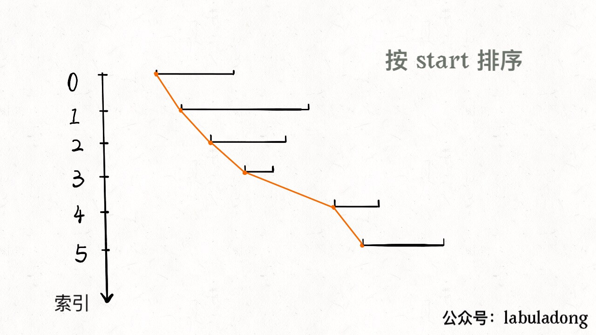
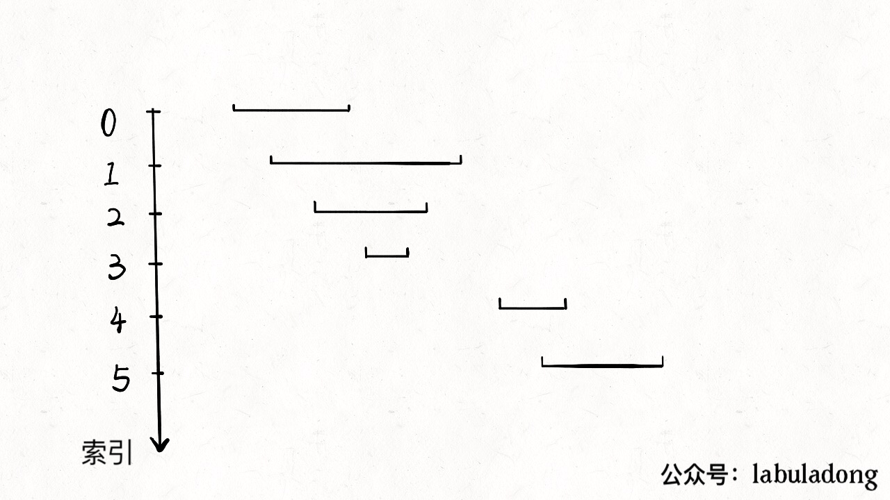

# 区间调度问题之区间合并

上篇文章用贪心算法解决了区间调度问题：给你很多区间，让你求其中的最大不重叠子集。

其实对于区间相关的问题，还有很多其他类型，本文就来讲讲区间合并问题（Merge Interval）。

LeetCode 第 56 题就是一道相关问题，题目很好理解：


我们解决区间问题的一般思路是先排序，然后观察规律。

### 一、思路

一个区间可以表示为 `[start, end]`，前文聊的区间调度问题，需要按 `end` 排序，以便满足贪心选择性质。而对于区间合并问题，其实按 `end` 和 `start` 排序都可以，不过为了清晰起见，我们选择按 `start` 排序。



**显然，对于几个相交区间合并后的结果区间 `x`，`x.start` 一定是这些相交区间中 `start` 最小的，`x.end` 一定是这些相交区间中 `end` 最大的。**


由于已经排了序，`x.start` 很好确定，求 `x.end` 也很容易，可以类比在数组中找最大值的过程：

```java
int max_ele = arr[0];
for (int i = 1; i < arr.length; i++) 
    max_ele = max(max_ele, arr[i]);
return max_ele;
```

### 二、代码

```python
# intervals 形如 [[1,3],[2,6]...]
def merge(intervals):
    if not intervals: return []
    # 按区间的 start 升序排列
    intervals.sort(key=lambda intv: intv[0])
    res = []
    res.append(intervals[0])
    
    for i in range(1, len(intervals)):
        curr = intervals[i]
        # res 中最后一个元素的引用
        last = res[-1]
        if curr[0] <= last[1]:
            # 找到最大的 end
            last[1] = max(last[1], curr[1])
        else:
            # 处理下一个待合并区间
            res.append(curr)
    return res
```

看下动画就一目了然了：



至此，区间合并问题就解决了。本文篇幅短小，因为区间合并只是区间问题的一个类型，后续还有一些区间问题。本想把所有问题类型都总结在一篇文章，但有读者反应，长文只会收藏不会看... 所以还是分成小短文吧，读者有什么看法可以在留言板留言交流。

本文终，希望对你有帮助。

坚持原创高质量文章，致力于把算法问题讲清楚，欢迎关注我的公众号 labuladong 获取最新文章：


[上一篇：FloodFill算法详解及应用](../算法思维系列/FloodFill算法详解及应用.md)

[下一篇：区间调度之区间交集问题](../算法思维系列/区间交集问题.md)

[目录](../README.md#目录)